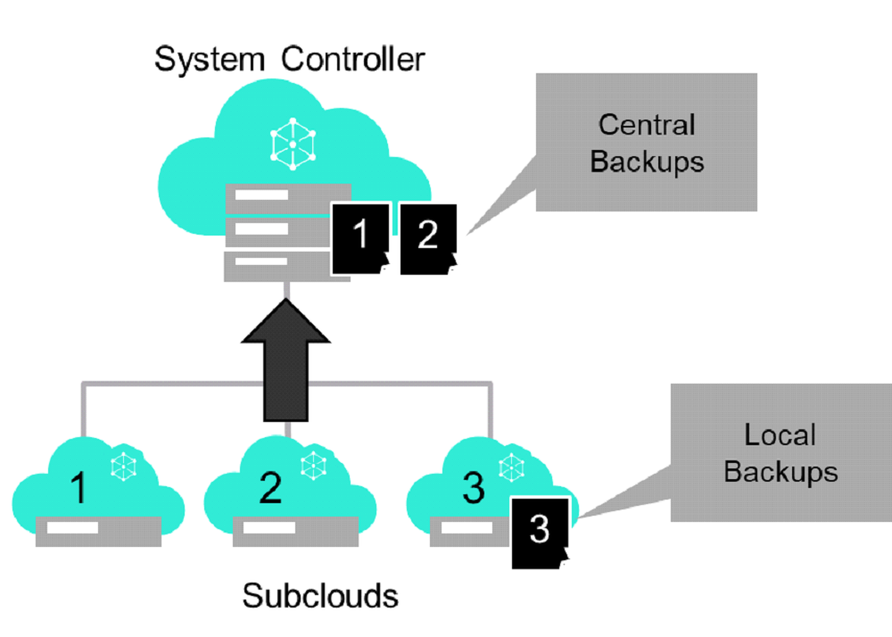

.. hgq1552923986183
.. _backing-up-starlingx-system-data:

============================
Back Up System Data Overview
============================

A system data backup of the |prod-long| system captures core system information
needed to restore a fully operational |prod-long| cluster. See :ref:`Run
Ansible Backup Playbook Locally on the Controller
<running-ansible-backup-playbook-locally-on-the-controller>` or :ref:`Run
Ansible Backup Playbook Remotely <running-ansible-backup-playbook-remotely>`
for information on how to backup up a standalone system or a System Controller.

In a |prod-dc| environment, see :ref:`Backup a Subcloud/Group of Subclouds
using DCManager CLI
<backup-a-subcloud-group-of-subclouds-using-dcmanager-cli-f12020a8fc42>` for
how to remotely backup a subcloud from the System Controller.

.. contents:: |minitoc|
   :local:
   :depth: 1

Contents of System Backup
-------------------------

.. _backing-up-starlingx-system-data-ul-s3t-bz4-kjb:

The following content is included in the backup:

- All platform configuration data required to fully restore the system to a
  working state following the platform restore procedure.

  - Platform and Kubernetes databases.

  - Platform configuration files.

  - Platform certificates and keys.

- Home directory for the sysadmin user and all |LDAP| user accounts.

- End-user container images in ``registry.local``; that is, any images other
  than |org| system and application images. |prod| system and application
  images are re-pulled from their original source, and (optional) external
  registries during the restore procedure.

- Distributed Cloud Vault (Central System Controller only).

The following content is excluded from the backup:

- Application |PVC| data on Ceph clusters.

- Modifications manually made to the file systems, such as configuration
  changes on the ``/etc`` directory. After a restore operation has been
  completed, these modifications must be reapplied.

- Local linux user accounts and groups, their home directories, and passwords
  will not be carried over during an upgrade. The configuration and management
  of additional users/groups is not recommended.

- The ``/root`` directory. Use the sysadmin account instead when root access is
  needed.

.. note::

    Ceph data may be retained when restoring to the same servers and cluster.

System Backup Size
------------------

Consider the following for backup size:

- The base size of a platform system backup sizes range from 10MB to 30MB,
  depending on the size of the system and deployment. |AIO-SX| systems are
  typically 20MB or less.

- Backup of user home directories can cause the backup archive to be very large
  and is limited to 2GB or less.

- Total backup size of the System Controller should be below 100MB when using
  centralized backup and restore of subclouds.

- Container images are large and will only be backed up locally to avoid large
  image archives being transferred for each subcloud. Container images
  that are not present on the system may be pulled as part of platform and
  application deployment, or restored separately to the local registry
  (``registry.local``).

System Backup Filesystem Usage
------------------------------

The following filesystems are used during the backup operations of the system
for both local and centralized backup.

**Staging Storage**

The host filesystem used to stage temporary files during backup operations. The
filesystem may also be used to temporarily store final backup images prior to
transfer, if the filesystem is sufficiently sized to store the backup archives.

Host filesystem name: backup

System path: ``/opt/backups``

Default size: 25GB

For more information on how to modify the host filesystem sizes see
:ref:`Resize Filesystems on a Host <resizing-filesystems-on-a-host>`.

**Local Storage**

The host filesystem used to store backup files in a protected partition which
does not get wiped during system reinstallation. The protected local backup
partition is typically used by |AIO-SX| systems where there is no redundant
filesystem storage and it is the default for local backups.

.. note::

    The filesystem is shared with system release pre-staging and needs to be
    sized for both pre-staging installation media and backup archives.

System Path: ``/opt/platform-backup/backups``

Default Size: 30GB

**Centralized Storage**

The |prod-dc| Vault filesystem is used to store backup archives when using
centralized backup and restore of subclouds. The filesystem size must be
increased to accommodate subcloud backup archive storage. A separate backup
archive is stored per subcloud and release, and therefore, must be sized to
accommodate all backups.

System path: ``/opt/dc-vault/backups/<subcloud-name>/<release-version>``

Default size: 15GB

.. note::

    The filesystem is shared for |prod-dc| subcloud deployment and management
    and must be sized to store subcloud deployment files (subcloud
    configuration, ISO images and subcloud staging files).

For more information on how to modify the controller filesystem sizes see
:ref:`Storage on Controller Hosts
<controller-hosts-storage-on-controller-hosts>`.

Distributed Cloud Centralized Backups
-------------------------------------

A subcloud's system data and optionally container images (from
``registry.local``) can be backed up using DCManager CLI command line
interface. The subcloud's system backup data can either be stored locally on
the subcloud or on the System Controller. The subcloud's container image
backup (from ``registry.local``) can only be stored locally on the subcloud to
avoid overloading the central storage and the network with large amount of data
transfer and redundant storage of images in a central location.

For more information on the CLI operation of the centralized backup
capability see :ref:`Backup a Subcloud/Group of Subclouds using DCManager CLI
<backup-a-subcloud-group-of-subclouds-using-dcmanager-cli-f12020a8fc42>`.

For more information on DCManager - Subcloud Backup API see `Subcloud
Backups
<https://docs.starlingx.io/api-ref/distcloud/api-ref-dcmanager-v1.html#subcloud-backups>`__.

Execution Time for System Backups
---------------------------------

- The time to execute system backups is approximately 3-4 minutes for an idle
  system.

- Centralized backups may require additional time for network transfer for
  larger backups.

- Subcloud backups may be initiated and monitored from the DCManager |CLI| or
  API, including parallel backups.

- A minor alarm (210.001) "System Backup in progress" is raised while backing
  up an individual system.

- Systems with at least 4 platform cores will have much faster execution times.

Recommended Backup and Retention Policies
-----------------------------------------

- Use of the centralized backup mechanism of the System Controllers to perform
  and store the backups of subclouds. Standalone systems and System Controllers
  backups can be performed locally or remotely, and the archive must be stored
  off the system.

- All backups are done during off-peak hours (i.e. maintenance window).

  - Weekly backups should be performed under normal steady state conditions to
    ensure the system can be restored to a fully operational state.

  - Nightly backups are the exception and should only be performed in periods
    of significant reconfiguration to the system such as during large/mass
    rollout (addition of subclouds), upgrade cycle of multiple sites, or
    disaster recovery rehoming of subclouds.

- Backups should be performed prior to performing maintenance operations or
  applying configuration changes to the platform or hosted applications.

- The retention period of backups should be approximately one month.

  - Since Kubernetes is an intent-based system, the most recent backup is the
    most important.

.. seealso::
   :ref:`Run Ansible Backup Playbook Locally on the Controller
   <running-ansible-backup-playbook-locally-on-the-controller>`

   :ref:`Run Ansible Backup Playbook Remotely
   <running-ansible-backup-playbook-remotely>`
