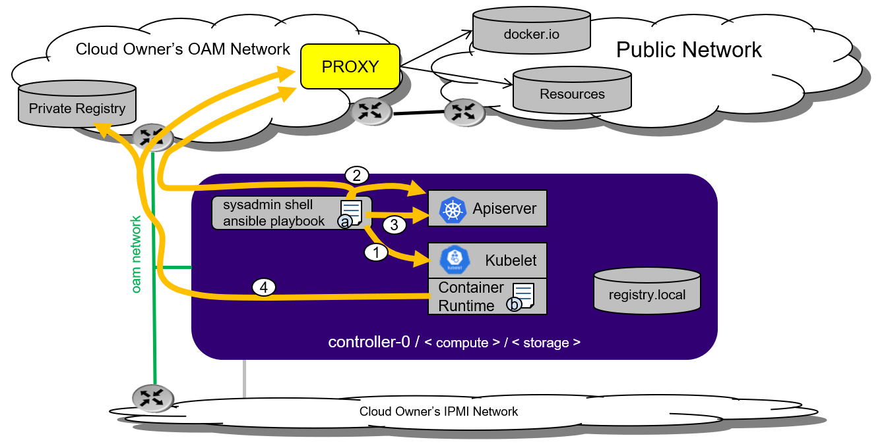

==========================
Docker Proxy Configuration
==========================

StarlingX uses publicly available container runtime registries. If you are
behind a corporate firewall or proxy, you need to set proxy settings.

For example, if the StarlingX OAM interface or network is behind an http/https
proxy, relative to the Docker registries used by StarlingX or applications
running on StarlingX, then Docker within StarlingX must be configured to use
these http/https proxies.

.. contents::
   :local:
   :depth: 1

--------------
Proxy overview
--------------

The figure below shows how proxies are used in StarlingX.

   *Figure 1: StarlingX proxy usage*

The items labeled *a* and *b* in the figure indicate two configuration files:

*   Configuration file *a* lists sysadmin shell proxy environment variables.
    This file is not required for StarlingX bootstrap or any StarlingX
    operations. You **must** manually add this file if you are accessing the
    public network via a proxy. You **must** add the following StarlingX
    specific IP addresses to the no_proxy list:

    *   registry.local
    *   {controller OAM gateway IP/floating IP/host IP}
    *   {controller management floating IP/host IP}
    *   {controller cluster gateway IP}
    *   10.96.0.1 {apiserver cluster IP for Kubernetes}
    *   10.96.0.10 {coredns cluster IP for Kubernetes}
    *   `*.cluster.local`

*   Configuration file *b* lists container runtime proxy variables
    (docker_proxy). Configure these variables in the ``localhost.yml`` file
    before Ansible bootstrap. This file is **required** if you are accessing
    the public network via a proxy. StarlingX specific IP addresses will be
    automatically added to the no_proxy list.

The numbered items in the figure indicate the process flow:

#.  In the ``localhost.yml`` file, fill in the Docker proxy section for
    configuration file *b*.

#.  The bootstrap process is responsible for pulling Docker images from either:

    *   the public registry using the proxy setting in (1) or

    *   the private registry within the company/organization network.

    The bootstrap process will push to the registry.local afterwards.

#.  After the Kubernetes API server is running, the bootstrap process will
    communicate with it for further StarlingX configuration. You **must** ensure
    the cluster network gateway is set for no_proxy in configuration file *a*.

#.  After StarlingX provisioning is complete, any operations that pull Docker
    images will use configuration file *b*. All other operations, including
    kubectl and system operations, will use the sysadmin shell and
    configuration file *a*.

----------------------
Set proxy at bootstrap
----------------------

To set the Docker proxy at bootstrap time, refer to
:doc:`Ansible Bootstrap Configurations <../deploy_install_guides/r3_release/ansible_bootstrap_configs>`.

------------------
Set HTTP proxy URL
------------------

To specify the HTTP proxy URL, use the commands:

::

    system service-parameter-modify platform docker http_proxy http://my.proxy.com:1080
    system service-parameter-apply platform

-------------------
Set HTTPS proxy URL
-------------------

To specify the HTTPS proxy URL, use the commands:

::

    system service-parameter-modify platform docker https_proxy https://my.proxy.com:1443
    system service-parameter-apply platform

-------------------------
Set no_proxy address list
-------------------------

A no_proxy address list can be provided for registries not on the other side
of the proxies. This list will be added to the default no_proxy list derived
from localhost, loopback, management, and OAM floating addresses at runtime.

Due to a Docker restriction, each address in the no_proxy list must not be in
subnet format and it cannot contain a wildcard. For example:

To specify a no_proxy list, use the commands:

::

    system service-parameter-modify platform docker no_proxy: 1.2.3.4, 5.6.7.8
    system service-parameter-apply platform
