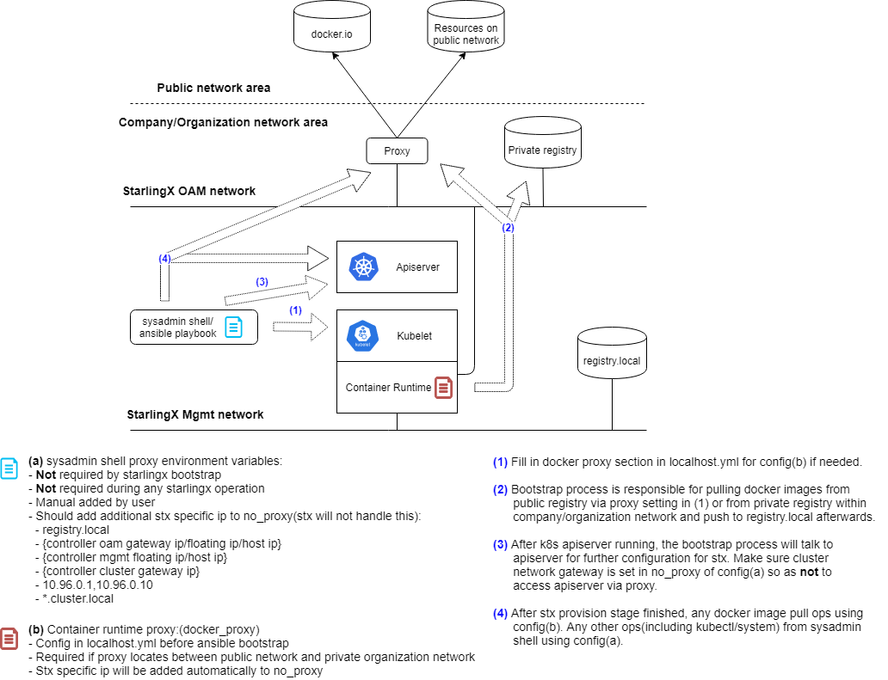

==========================
Docker Proxy Configuration
==========================

StarlingX uses publicly available container runtime registries. If you are
behind a corporate firewall or proxy, you need to set proxy settings.

For example, if the StarlingX OAM interface or network is behind an http/https
proxy, relative to the Docker registries used by StarlingX or applications
running on StarlingX, then Docker within StarlingX must be configured to use
these http/https proxies.

.. contents::
   :local:
   :depth: 1

--------------
Proxy overview
--------------

The figure below shows how proxies are used in StarlingX.

   *Figure 1: StarlingX proxy usage*

----------------------
Set proxy at bootstrap
----------------------

To set the Docker proxy at bootstrap time, refer to
:doc:`Ansible Bootstrap Configurations <../deploy_install_guides/r3_release/ansible_bootstrap_configs>`.

------------------
Set HTTP proxy URL
------------------

To specify the HTTP proxy URL, use the commands:

::

    system service-parameter-modify platform docker http_proxy http://my.proxy.com:1080
    system service-parameter-apply platform

-------------------
Set HTTPS proxy URL
-------------------

To specify the HTTPS proxy URL, use the commands:

::

    system service-parameter-modify platform docker https_proxy https://my.proxy.com:1443
    system service-parameter-apply platform

-------------------------
Set no-proxy address list
-------------------------

A no-proxy address list can be provided for registries not on the other side
of the proxies. This list will be added to the default no-proxy list derived
from localhost, loopback, management, and OAM floating addresses at runtime.

Due to a Docker restriction, each address in the no-proxy list must not be in
subnet format and it cannot contain a wildcard. For example:

To specify a no-proxy list, use the commands:

::

    system service-parameter-modify platform docker no_proxy: 1.2.3.4, 5.6.7.8
    system service-parameter-apply platform
