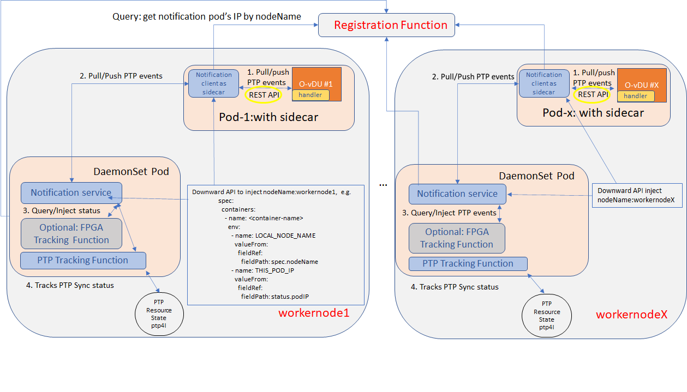

.. yxg1614092306444
.. _integrate-the-application-with-notification-client-sidecar:

==========================================================
Integrate the Application with Notification Client Sidecar
==========================================================

This section describes the **ptp-notification-demo**, and provides instructions
for enabling communication between the Sidecar and the application via a REST
API.

.. rubric:: |context|

The integration between the application is done with the use of a Sidecar. The
Sidecar runs as a container along with the application in the same pod. The
application and the Sidecar communicate via a REST API. See the figure below.

.. note::
    In this demo, we provide a referenced API application.

.. rubric:: |prereq|

The following prerequisites are required before the integration:

.. _integrate-the-application-with-notification-client-sidecar-ul-iyd-mxf-t4b:

-   The cloud is configured with a node that supports the Subordinate mode \(Slave mode\).

-   The cloud is labeled with **ptp-registration=true**, and **ptp-notification=true**.

-   The **ptp-notification-armada-app** application is installed successfully.

-   The application supports the |PTP| Notifications API.

For instructions on creating, testing and terminating a
**ptp-notification-demo**, see, :ref:`Create, Test, and Terminate |PTP|
Notification Demo <create-test-and-terminate-a-ptp-notification-demo>`.

