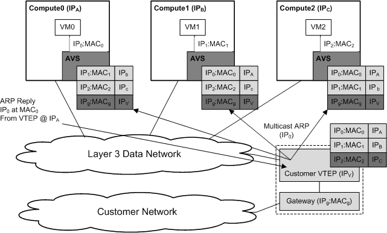

.. rcy1511538457696
.. _dynamic-vxlan:

=============
Dynamic VXLAN
=============

|prod-os| supports dynamic mode \(learning\) VXLAN implementation that has
each vSwitch instance registered on the network for a particular IP
multicast group, MAC addresses, and VTEP endpoints that are populated based on
neutron configuration data.

The IP multicast group, \(for example, 239.1.1.1\), is input when a new
neutron data network is provisioned. The selection of the IP multicast group
constraints flooding to only those nodes that have registered for the specified
group. The IP multicast network can work in both a single subnet \(that is,
local Layer2 environment\) or can span Layer3 segments in the customer network
for more complex routing requirements but requires IP multicast enabled routers.

In the dynamic VXLAN mode, when a VM instance sends a packet to some destination
node the vSwitch VXLAN implementation examines the destination MAC address to
determine how to treat the packet. If the destination is known, a unicast packet
is sent to the worker node hosting that VM instance. If the destination is
unknown or the packet is a broadcast/multicast packet then a multicast packet
is sent to all worker nodes. Once the destination VM instance receives the
packet and responds to the initial source worker node, it learns that the VM
is hosted from that worker node, and any future packets destined to that VM
instance are unicasted to that worker node.

   `Multicast Endpoint Distribution`

For broadcast and multicast packets originating from the VM instances the
vSwitch implements head-end replication to clone and send a copy of the
packet to each known worker node. This operation is expensive and will
negatively impact performance if the network is experiencing high volume of
broadcast or multicast packets.

.. _dynamic-vxlan-section-N10054-N1001F-N10001:

-------------------------------------------------
Workflow to Configure Dynamic VXLAN Data Networks
-------------------------------------------------

Use the following workflow to create dynamic VXLAN data networks and add
segmentation ranges using CLI.

.. _dynamic-vxlan-ol-bpj-dlb-1cb:

#.  Create a VXLAN data network, see :ref:`Adding Data Networks
    <adding-data-networks-using-the-cli>`.

#.  Add segmentation ranges to dynamic VXLAN \(Multicast VXLAN\) data networks,
    see :ref:`Adding Segmentation Ranges Using the CLI
    <adding-segmentation-ranges-using-the-cli>`.

#.  Configure the endpoint IP addresses of the worker nodes using the web
    administration interface or the CLI:

    -   To configure static IP addresses for individual data interfaces, see:

        :ref:`Adding a Static IP Address to a Data Interface
        <adding-a-static-ip-address-to-a-data-interface>`

    -   To assign IP addresses from predefined address pools, see:

        :ref:`Using IP Address Pools for Data Interfaces
        <using-ip-address-pools-for-data-interfaces>`

#.  Establish routes between the hosts, see :ref:`Adding and Maintaining Routes
    for a VXLAN Network <adding-and-maintaining-routes-for-a-vxlan-network>`.

For more information on the differences between the dynamic and static VXLAN
modes, see :ref:`Differences Between Dynamic and Static VXLAN Modes
<differences-between-dynamic-and-static-vxlan-modes>`.