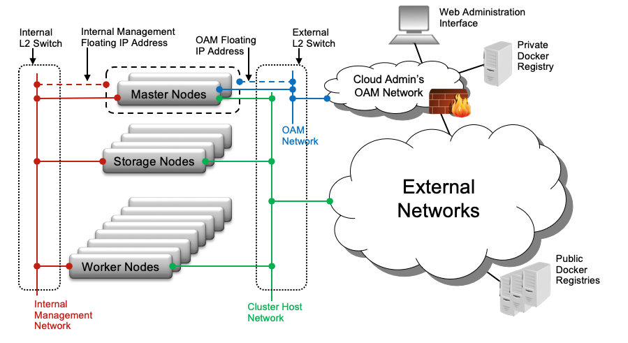

.. hck1565197982784
.. _common-components:

=================
Common Components
=================

A number of components are common to most |prod| deployment configurations.

.. xreflink .. note::
    Ceph is not configured by default. For more information, see the
    |stor-doc|: :ref:`Configuring the Internal Ceph Storage Backend
    <configuring-the-internal-ceph-storage-backend>`.

**Controller Node / Function**
    Controller nodes or functions run the cloud control functions for managing
    cloud resources; that is, they run all Kubernetes control functions, such
    as for managing images, pods, services, etc.

    For standard with controller storage deployment configurations, the
    controller nodes/functions run a small-scale Ceph cluster using one or more
    disks \(|SATA|, |SAS|, |SSD| and/or |NVMe|\) as the ceph |OSDs|. This
    cluster provides the storage backend for Kubernetes' |PVCs|.

    In most configurations, the controller nodes/functions are part of a two
    node HA controller node cluster for running control functions in either
    Active/Active or Active/Standby mode.

**Worker Node / Function**
    Worker nodes or functions run the hosted containerized applications.

**Storage Node / Function**
    For Standard with Dedicated Storage deployment configurations, the storage
    nodes run a large scale Ceph cluster using disks \(|SATA|, |SAS|, |SSD| and
    /or |NVMe|\) across 2-9 storage nodes as Ceph |OSDs|. This provides the
    storage backend for Kubernetes' |PVCs|.

    In most configurations the storage nodes/functions are part of a HA
    multi-node Ceph storage cluster supporting a replication factor of 2 or 3,
    journal caching and class tiering.

**All-In-One (AIO) Controller Node**
    A single physical node which provides a controller function, worker
    function and storage function.

**L2 Switches and L2 Networks**
    A single physical switch may support multiple L2 networks.

**Operations, Administration and Management (OAM) Network \(Controller Nodes Only\)**
    The network on which all external StarlingX platform APIs are exposed,
    including platform REST APIs \(Keystone, StarlingX, Kubernetes\), the
    Horizon Web interface, |SSH| and |SNMP|.

    This is typically a 1GE network.

**Management Network \(All Nodes\)**
    A private network \(i.e. not connected externally\) used for internal
    StarlingX monitoring and control, and container access to storage cluster.

    This is typically a 10GE network.

**Cluster Host Network \(All Nodes\)**
    The cluster host network is used for Kubernetes management and control, as
    well as private container networking. The |CNI| service, Calico, provides
    private tunneled networking between hosted containers on the cluster host
    network.

    The cluster host network is internal by default and shares the same
    interface as the management network. However, it can be configured on a
    dedicated interface/network during initial configuration if required.

    The cluster host network can be used as the network for external
    connectivity or it can be deployed as an internal network.

    **External Network Connectivity with EXTERNAL cluster host network**
        The |CNI| service, Calico,
        provides private tunneled networking between hosted containers on the
        external cluster host network.

        Containers' network endpoints can be exposed externally with 'NodePort'
        Kubernetes services, exposing selected application containers' network
        ports on *all* interfaces \(e.g. external cluster host interfaces\) of
        both controller nodes and *all* worker nodes. This would typically be
        done either directly to the application containers service or through
        an ingress controller service. HA would be achieved through either an
        external HA load balancer across two or more worker nodes or simply
        using multiple records \(two or more destination worker node IPs\) for
        the application's external DNS Entry.

        Containers' network endpoints can also be exposed through |BGP| within
        the Calico |CNI| service. The Calico |BGP| configuration can be
        modified to advertise selected application container services or the
        ingress controller service to a |BGP| peer, specifying the available
        next hop worker nodes' cluster host IP addresses.

    **External Network Connectivity with INTERNAL cluster host network**
        If the cluster host network is INTERNAL, then either the OAM port or
        additionally configured ports on both controller and worker nodes will
        be used for connectivity to external networks.

        As with the INTERNAL cluster host network, containers' network
        endpoints can be exposed externally with NodePort Kubernetes services,
        exposing selected application containers' network ports on *all*
        interfaces of both controller nodes and *all* worker nodes. In this
        scenario they are exposed on either the OAM interface or the
        additionally configured interfaces for external connectivity on all
        nodes. This is typically done either directly to the application
        containers service or through an ingress controller service. HA can be
        achieved through either an external HA load balancer across two or more
        worker nodes or simply using multiple records \(two or more destination
        worker node IP addresses\) for the application's external DNS Entry.

        The use of Container Networking Calico |BGP| to advertise containers'
        network endpoints is not available in this scenario.

**Additional External Network\(s\) or Data Networks \(Worker & AIO Nodes Only\)**
    Networks on which ingress controllers and/or hosted application containers
    expose their Kubernetes service, for example, through a NodePort service.
    Node interfaces to these networks are configured as platform class
    interfaces on nodes.

    This can also refer to data networks attached to node interfaces configured
    as 'pci-sriov' class interfaces; i.e. as part of the capability to support
    hosted application containers to have interfaces directly connected to the
    host's interface via pci-passthru or |SRIOV|.

**IPMI Network \(All Nodes\)**
    An optional network on which |IPMI| interfaces of all nodes are connected.

    The |IPMI| network must be L3/IP reachable from the controller's |OAM|
    interfaces.

**PxeBoot Network \(All Nodes\)**
    An *optional* network over which nodes net boot from controllers.

    By default, controllers network boot other nodes over the management
    network. This network is required for a variety of special case situations
    where the management network cannot be used to boot the other nodes:

    -   The management network must be IPv6. IPv4 pxeboot network must be
        configured since IPv6 does not support pxeboot.

    -   The management network must be vlan tagged. Most servers' BIOS do not
        support pxebooting over a tagged network, so an untagged pxeboot
        network must be configured.

**Node Interfaces**
    In general, node network interfaces can optionally be:

    -   Untagged single port

    -   Untagged two port |LAG|, optionally split
        between redundant L2 switches.

    -   VLAN on either single port or two port |LAG|
