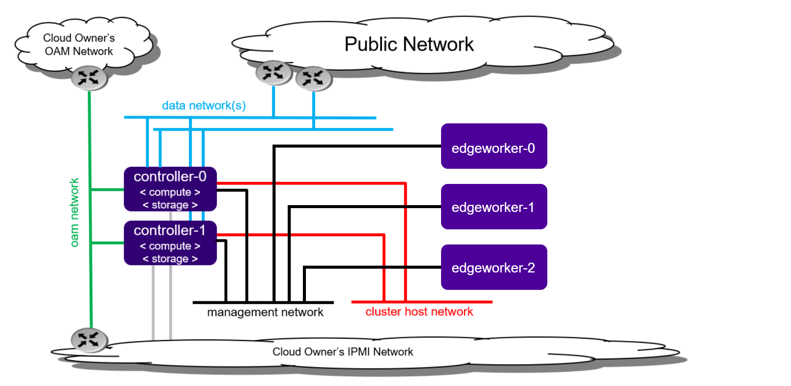

.. _deploy-edgeworker-nodes:

=======================
Deploy Edgeworker Nodes
=======================

.. contents::
   :local:
   :depth: 1

------------
Introduction
------------

Edgeworker is a new node personality introduced in |prod| R5.0 [[1]_].
Edgeworkers are typically small systems running dedicated workloads that can
now be managed by |prod|. To use the edgeworker personality, nodes must have
the Ubuntu operating system installed [[2]_].

The edgeworker personality is targeted for nodes that meet one or more of the
following criteria:

- A node that is running a customized OS, or
- A node that is running a Type1 hypervisor, or
- A node that does not meet |prod| worker’s minimum requirements.

These nodes can be added to a running |prod| cluster in minutes. During the
provisioning stage, Kubernetes components will be provisioned on the edgeworker
nodes.

The |prod| controller manages edgeworker nodes using the same mechanisms as
typical worker nodes, including the following:

- Container orchestration by Kubernetes
- Distributed storage cluster management by Rook-ceph

.. rubric:: Notes

.. [1] Edgeworker is an experimental feature in |prod| R5.0.
.. [2] The operating system (OS) of an edgeworker node is not installed by the |prod| controller, instead, a node with installed OS is required prior to the node provisioning step. Only Ubuntu is supported in |prod| R5.0.

---------------------
Hardware Requirements
---------------------

The minimum requirements for an edgeworker host (bare metal or virtual machine)
are:

+-------------------------+--------------------------------+
| Minimum Requirement     | Edgeworker Node                |
+=========================+================================+
| Minimum processor class | Intel® Core™ Processor Family  |
+-------------------------+--------------------------------+
| Minimum memory          | 16GB                           |
+-------------------------+--------------------------------+
| Primary disk            | 256GB SSD or NVMe              |
+-------------------------+--------------------------------+
| Minimum network ports   | - Mgmt/Cluster: 1 x 1000BASE   |
|                         | - Data: 0 or more x 10GE       |
+-------------------------+--------------------------------+

------------------------
Prepare Edgeworker Nodes
------------------------

Before you provision edgeworker nodes, you must prepare the following setup:

- Deploy |prod| |AIO| Duplex or Standard setup.
- Connect the Edgeworker node to power and power it on.
- Connect the Edgeworker node to the network and connect it to a management
  network switch.
- Set the primary disk as the first boot device in the BIOS setting of the
  edgeworker node.
- Install Ubuntu 18.04 (or above) on the edgeworker node.
- Install Openssh-server and Python.

The figure below shows how edgeworker nodes are connected to an existing |prod|
cluster.

--------------------------
Provision Edgeworker Nodes
--------------------------

When a node’s network interface is connected to the management network switch,
the node is detected and will appear in the list of hosts managed by system
inventory (with personality set to None).

.. code-block:: bash

    [sysadmin@controller-0 ~(keystone_admin)]$ system host-list
    +----+--------------+-------------+----------------+-------------+--------------+
    | id | hostname     | personality | administrative | operational | availability |
    +----+--------------+-------------+----------------+-------------+--------------+
    | 1  | controller-0 | controller  | unlocked       | enabled     | available    |
    | 2  | controller-1 | controller  | unlocked       | enabled     | available    |
    | 3  | None         | None        | locked         | disabled    | offline      |
    +----+--------------+-------------+----------------+-------------+--------------+

#.  Update the node’s hostname and personality using ``system host-update``:

    .. code-block:: bash

        [sysadmin@controller-0 ~(keystone_admin)]$ system host-update 3 hostname=edgeworker-0 personality=edgeworker
        +-----------------------+--------------------------------------+
        | Property              | Value                                |
        +-----------------------+--------------------------------------+
        | action                | none                                 |
        | administrative        | locked                               |
        | availability          | offline                              |
        | bm_ip                 | None                                 |
        | bm_type               | None                                 |
        | bm_username           | None                                 |
        | boot_device           | /dev/sda                             |
        | capabilities          | {}                                   |
        | clock_synchronization | ntp                                  |
        | config_applied        | None                                 |
        | config_status         | None                                 |
        | config_target         | None                                 |
        | console               | ttyS0,115200                         |
        | created_at            | 2021-02-05T02:12:42.136121+00:00     |
        | device_image_update   | None                                 |
        | hostname              | edgeworker-0                         |
        | id                    | 3                                    |
        | install_output        | text                                 |
        | install_state         | None                                 |
        | install_state_info    | None                                 |
        | inv_state             | None                                 |
        | invprovision          | None                                 |
        | location              | {}                                   |
        | mgmt_ip               | 192.188.204.21                       |
        | mgmt_mac              | 52:54:00:76:e6:cb                    |
        | operational           | disabled                             |
        | personality           | edgeworker                           |
        | reboot_needed         | False                                |
        | reserved              | False                                |
        | rootfs_device         | /dev/sda                             |
        | serialid              | None                                 |
        | software_load         | 20.12                                |
        | task                  | None                                 |
        | tboot                 | false                                |
        | ttys_dcd              | None                                 |
        | updated_at            | None                                 |
        | uptime                | 0                                    |
        | uuid                  | a2c8f3ec-1dc4-4a0a-b471-6e5c01abc187 |
        | vim_progress_status   | None                                 |
        +-----------------------+--------------------------------------+

    Alternatively, if the node is not shown in the host list automatically, you
    can also add the host using ``system host-add``:

    .. code-block:: bash

        [sysadmin@controller-0 ~(keystone_admin)]$ system host-add -n edgeworker-0 -p edgeworker -m <mgmt_mac>

#.  Check the prerequisites of the edgeworker node:

    .. note::

        We suggest using the same username and password for all the edgeworker nodes.

    .. code-block:: bash

        EWUSER=<edgeworker username>
        EWPASSWD=<edgeworker password>
        SYSADMINPASSWD=<sysadmin password>
        EWNODE=(edgeworker-0)
        PYTHONBIN=()
        for NODE in ${EWNODE[@]}; do
          EDGEWORKER=$(system host-show ${NODE} | awk '/mgmt_ip/{print$4}');
          PYTHONBIN+=($(sshpass -p ${EWPASSWD} ssh -o "StrictHostKeyChecking no" ${EWUSER}@${EDGEWORKER} which python));
        done
        ERR=0
        for i in ${PYTHONBIN[@]}; do
          if [ -z "$i" ]; then
            ERR=1
            break
          fi
        done
        if [ $ERR == 1 ]; then
          echo "Error, python should be intalled on edgeworker nodes."
        else
          echo "Pre-requisites check passed."
        fi

    If the following error occurs, refresh the |DHCP| client for the
    management interface on the edgeworker nodes to assign the right IP address.

    .. code-block:: none

        ssh: connect to host XX.XX.XX.XX port 22: No route to host

#.  Create an edgeworker inventory file with the variables from the previous
    step.

    .. code-block:: none

        tee ./edgeworker_inventory.yml << EOF
        all:
          hosts:
            localhost:
              ansible_connection: local
          children:
            edgeworker:
              hosts:
        EOF
        for i in ${!EWNODE[@]}; do
          echo "        ${EWNODE[$i]}:"
          echo "          ansible_ssh_user: ${EWUSER}"
          echo "          ansible_ssh_pass: ${EWPASSWD}"
          echo "          ansible_become_pass: ${EWPASSWD}"
          echo "          ansible_python_interpreter: ${PYTHONBIN[$i]}"
        done | tee -a edgeworker_inventory.yml
        tee -a ./edgeworker_inventory.yml << EOF
          vars:
            ansible_ssh_user: sysadmin
            ansible_ssh_pass: ${SYSADMINPASSWD}
            ansible_become_pass: ${SYSADMINPASSWD}
        EOF

#.  Provision the edgeworker node using Ansible playbook. You can provision
    edgeworker nodes one at a time or multiple nodes at once. Run the playbook
    with the inventory file you created.

    .. code-block:: bash

        ansible-playbook -i ./edgeworker_inventory.yml /usr/share/ansible/stx-ansible/playbooks/provision_edgeworker.yml

    Provisioning output is similar to the following:

    .. code-block:: bash

        TASK [provision-edgeworker/prepare-edgeworker/kubernetes : set_fact] *********************************************************************************************************
        ok: [edgeworker-0]

        TASK [provision-edgeworker/prepare-edgeworker/kubernetes : Pull k8s gcr images from controller registry to edgeworker-0] *****************************************************
        changed: [edgeworker-0]

        RUNNING HANDLER [provision-edgeworker/prepare-edgeworker/kubernetes : Restart kubelet] ***************************************************************************************
        changed: [edgeworker-0]

        PLAY [localhost] *************************************************************************************************************************************************************

        TASK [provision-edgeworker/prepare-controller/cleanup : Cleanup temporary files] *********************************************************************************************
        changed: [localhost]

        TASK [provision-edgeworker/prepare-controller/cleanup : Remove the provision flag] *******************************************************************************************
        changed: [localhost]

        PLAY RECAP *******************************************************************************************************************************************************************
        edgeworker-0               : ok=54   changed=10   unreachable=0    failed=0
        localhost                  : ok=31   changed=19   unreachable=0    failed=0

    After provisioning, the edgeworker node will show ``Ready`` status in the
    Kubernetes cluster.

    .. code-block:: bash

        [sysadmin@controller-0 ~(keystone_admin)]$ kubectl get node
        NAME           STATUS   ROLES    AGE   VERSION
        controller-0   Ready    master   42h   v1.18.1
        controller-1   Ready    master   42h   v1.18.1
        edgeworker-0   Ready    <none>   21m   v1.18.1

.. note::

    In |prod| R5.0, the edgeworker nodes will be shown as
    locked/disabled/offline when you use the ``system host-list`` command.
