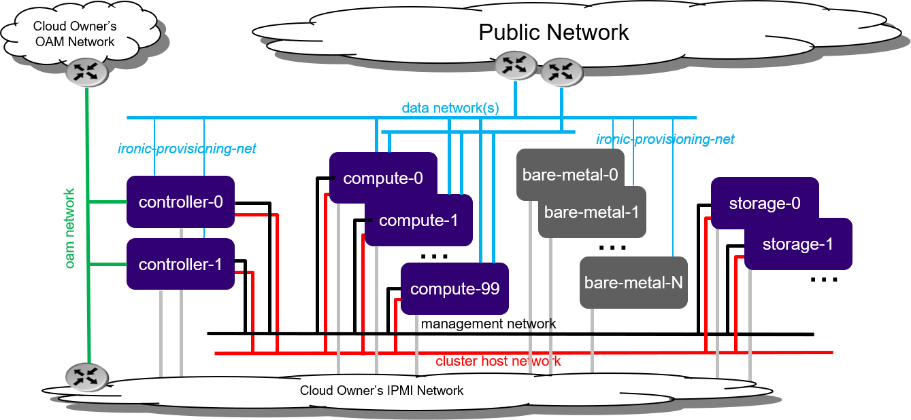

====================================
Bare metal Standard with Ironic R2.0
====================================

.. contents::
   :local:
   :depth: 1

------------
Introduction
------------

Ironic is an OpenStack project that provisions bare metal machines. For
information about the Ironic project, see
`Ironic Documentation <https://docs.openstack.org/ironic>`__.

End user applications can be deployed on bare metal servers (instead of
virtual machines) by configuring OpenStack Ironic and deploying a pool of 1 or
more bare metal servers.

   *Figure 1: Standard with Ironic deployment configuration*

Bare metal servers must be connected to:

* IPMI for OpenStack Ironic control
* ironic-provisioning-net tenant network via their untagged physical interface,
  which supports PXE booting

As part of configuring OpenStack Ironic in StarlingX:

* An ironic-provisioning-net tenant network must be identified as the boot
  network for bare metal nodes.
* An additional untagged physical interface must be configured on controller
  nodes and connected to the ironic-provisioning-net tenant network. The
  OpenStack Ironic tftpboot server will PXE boot the bare metal servers over
  this interface.

.. note::

   Bare metal servers are NOT:

   * Running any OpenStack / StarlingX software; they are running end user
     applications (for example, Glance Images).
   * To be connected to the internal management network.

--------------------
Installation options
--------------------

StarlingX currently supports only a bare metal installation of Ironic with a
standard configuration, either:

* :ref:`Bare metal Standard with Controller Storage R2.0 <bm_standard_controller_r2>`

* :ref:`Bare metal Standard with Dedicated Storage R2.0 <bm_standard_dedicated_r2>`

This guide assumes that you have a standard deployment installed and configured
with 2x controllers and at least 1x compute node, with the StarlingX OpenStack
application (stx-openstack) applied.

The installation & deployment procedure starts from this point.

--------------------
Hardware preparation
--------------------

*********************
Hardware requirements
*********************

* One or more bare metal hosts as Ironic nodes as well as tenant instance node.

* BMC support on bare metal host and controller node connectivity to the BMC IP
  address of bare metal hosts.

For controller nodes:

* Additional NIC port on both controller nodes for connecting to the
  ironic-provisioning-net.

For compute nodes:

* If using a flat data network for the Ironic provisioning network, an additional
  NIC port on one of the compute nodes is required.

* Alternatively, use a VLAN data network for the Ironic provisioning network and
  simply add the new data network to an existing interface on the compute node.

* Additional switch ports / configuration for new ports on controller, compute,
  and Ironic nodes, for connectivity to the Ironic provisioning network.

***********************************
BMC configuration of Ironic node(s)
***********************************

Enable BMC and allocate a static IP, username, and password in the BIOS settings.
For example, set:

IP address
  10.10.10.126

username
  root

password
  test123

------------------------------------------
Pre-configuration to enable Ironic service
------------------------------------------

All the commands in this major section are for the StarlingX platform.

First acquire administrative privileges:

::

   source /etc/platform/openrc

********************************
Download Ironic deployment image
********************************

The Ironic service requires a deployment image (kernel and ramdisk) which is
used to clean Ironic nodes and install the end-user's image. The cleaning done
by the deployment image wipes the disks and tests connectivity to the Ironic
conductor on the controller nodes via the Ironic Python Agent (IPA).

The Ironic deployment Stein image (**Ironic-kernel** and **Ironic-ramdisk**)
can be found here:

* `Ironic-kernel coreos_production_pxe-stable-stein.vmlinuz
  <https://tarballs.openstack.org/ironic-python-agent/coreos/files/coreos_production_pxe-stable-stein.vmlinuz>`__
* `Ironic-ramdisk coreos_production_pxe_image-oem-stable-stein.cpio.gz
  <https://tarballs.openstack.org/ironic-python-agent/coreos/files/coreos_production_pxe_image-oem-stable-stein.cpio.gz>`__

********************************************
Configuration on deployed standard StarlingX
********************************************

^^^^^^^
Network
^^^^^^^

#. Add an address pool for the Ironic network. This example uses `ironic-pool`:

   ::

      system addrpool-add --ranges 10.10.20.1-10.10.20.100 ironic-pool 10.10.20.0 24

#. Add the Ironic platform network. This example uses `ironic-net`:

   ::

      system addrpool-list | grep ironic-pool | awk '{print$2}' | xargs system network-add ironic-net ironic false

#. Add the Ironic tenant network. This example uses `ironic-data`:

   .. note::

      The tenant network is not the same as the platform network described in
      the previous step. You can specify any name for the tenant network other
      than ‘ironic’. If the name 'ironic' is used, a user override must be
      generated to indicate the tenant network name.

      Refer to section `Generate user Helm overrides`_ for details.

   ::

      system datanetwork-add ironic-data flat

#. Configure the new interfaces (for Ironic) on controller nodes and assign
   them to the platform network. Host must be locked. This example uses the
   platform network `ironic-net` that was named in a previous step.

   These new interfaces to the controllers are used to connect to the Ironic
   provisioning network:

   **controller-0**

   ::

      system interface-network-assign controller-0 enp2s0 ironic-net
      system host-if-modify -n ironic -c platform \
      --ipv4-mode static --ipv4-pool ironic-pool controller-0 enp2s0

      # Apply the OpenStack Ironic node labels
      system host-label-assign controller-0 openstack-ironic=enabled

      # Unlock the node to apply changes
      system host-unlock controller-0

   **controller-1**

   ::

      system interface-network-assign controller-1 enp2s0 ironic-net
      system host-if-modify -n ironic -c platform \
      --ipv4-mode static --ipv4-pool ironic-pool controller-0 enp2s0

      # Apply the OpenStack Ironic node labels
      system host-label-assign controller-1 openstack-ironic=enabled

      # Unlock the node to apply changes
      system host-unlock controller-1

#. Configure the new interface (for Ironic) on one of the compute nodes and
   assign it to the Ironic data network. This example uses the data network
   `ironic-data` that was named in a previous step.

   ::

      system interface-datanetwork-assign compute-0 eno1 ironic-data
      system host-if-modify -n ironicdata -c data compute-0 eno1

^^^^^^^^^^^^^^^^^^^^^^^^^^^^
Generate user Helm overrides
^^^^^^^^^^^^^^^^^^^^^^^^^^^^

Ironic Helm Charts are included in the stx-openstack application. By default,
the Ironic is disabled.

To enable Ironic, update the following Ironic Helm Chart attributes:

::

   system helm-override-update stx-openstack ironic openstack \
   --set network.pxe.neutron_subnet_alloc_start=10.10.20.10 \
   --set network.pxe.neutron_subnet_gateway=10.10.20.1 \
   --set network.pxe.neutron_provider_network=ironic-data

:command:`network.pxe.neutron_subnet_alloc_start` sets the DHCP start IP to
Neutron for Ironic node provision, and reserves several IPs for the platform.

If the data network name for Ironic is changed, modify
:command:`network.pxe.neutron_provider_network` to the command above:

::

   --set network.pxe.neutron_provider_network=ironic-data

^^^^^^^^^^^^^^^^^^^
Apply stx-openstack
^^^^^^^^^^^^^^^^^^^

Re-apply the stx-openstack application to apply the changes to Ironic:

::

   system application-apply stx-openstack

--------------
Start the node
--------------

Start an Ironic node.

All the commands in this major section are for the OpenStack application with
administrative privileges.

From a new shell as a root user, without sourcing ``/etc/platform/openrc``:

::

   mkdir -p /etc/openstack

   tee /etc/openstack/clouds.yaml << EOF
   clouds:
     openstack_helm:
       region_name: RegionOne
       identity_api_version: 3
       endpoint_type: internalURL
       auth:
         username: 'admin'
         password: 'Li69nux*'
         project_name: 'admin'
         project_domain_name: 'default'
         user_domain_name: 'default'
         auth_url: 'http://keystone.openstack.svc.cluster.local/v3'
   EOF

   export OS_CLOUD=openstack_helm

********************
Create Glance images
********************

#. Create the **ironic-kernel** image:

   ::

      openstack image create \
      --file ~/coreos_production_pxe-stable-stein.vmlinuz \
      --disk-format aki \
      --container-format aki \
      --public \
      ironic-kernel

#. Create the **ironic-ramdisk** image:

   ::

      openstack image create \
      --file ~/coreos_production_pxe_image-oem-stable-stein.cpio.gz \
      --disk-format ari \
      --container-format ari \
      --public \
      ironic-ramdisk

#. Create the end user application image (for example, CentOS):

   ::

      openstack image create \
      --file ~/CentOS-7-x86_64-GenericCloud-root.qcow2 \
      --public --disk-format \
      qcow2 --container-format bare centos

*********************
Create an Ironic node
*********************

#. Create a node:

   ::

      openstack baremetal node create --driver ipmi --name ironic-test0

#. Add IPMI information:

   ::

      openstack baremetal node set \
      --driver-info ipmi_address=10.10.10.126 \
      --driver-info ipmi_username=root \
      --driver-info ipmi_password=test123 \
      --driver-info ipmi_terminal_port=623 ironic-test0

#. Set `ironic-kernel` and `ironic-ramdisk` images driver information,
   on this bare metal node:

   ::

      openstack baremetal node set \
      --driver-info deploy_kernel=$(openstack image list | grep ironic-kernel | awk '{print$2}') \
      --driver-info deploy_ramdisk=$(openstack image list | grep ironic-ramdisk | awk '{print$2}') \
      ironic-test0

#. Set resource properties on this bare metal node based on actual Ironic node
   capacities:

   ::

      openstack baremetal node set \
      --property cpus=4 \
      --property cpu_arch=x86_64\
      --property capabilities="boot_option:local" \
      --property memory_mb=65536 \
      --property local_gb=400 \
      --resource-class bm ironic-test0

#. Add pxe_template location:

   ::

      openstack baremetal node set --driver-info \
      pxe_template='/var/lib/openstack/lib64/python2.7/site-packages/ironic/drivers/modules/ipxe_config.template'\
      ironic-test0

#. Create a port to identify the specific port used by the Ironic node.
   Substitute **a4:bf:01:2b:3b:c8** with the MAC address for the Ironic node
   port which connects to the Ironic network:

   ::

      openstack baremetal port create \
      --node $(openstack baremetal node list | grep ironic-test0 | awk '{print$2}') \
      --pxe-enabled true a4:bf:01:2b:3b:c8

#. Change node state to `manage`:

   ::

      openstack baremetal node manage ironic-test0

#. Make node available for deployment:

   ::

      openstack baremetal node provide ironic-test0

#. Wait for ironic-test0 provision-state: available:

   ::

      openstack baremetal node show ironic-test0

------------------
Deploy an instance
------------------

Deploy an instance on Ironic node.

All the commands in this major section are for the OpenStack application,
but this time with *tenant* specific privileges.

From a new shell as a root user, without sourcing ``/etc/platform/openrc``:

::

   mkdir -p /etc/openstack

   tee /etc/openstack/clouds.yaml << EOF
   clouds:
     openstack_helm:
       region_name: RegionOne
       identity_api_version: 3
       endpoint_type: internalURL
       auth:
         username: 'joeuser'
         password: 'mypasswrd'
         project_name: 'intel'
         project_domain_name: 'default'
         user_domain_name: 'default'
         auth_url: 'http://keystone.openstack.svc.cluster.local/v3'
   EOF

   export OS_CLOUD=openstack_helm

*************
Create flavor
*************

Set resource CUSTOM_BM corresponding to **--resource-class bm**:

::

   openstack flavor create --ram 4096 --vcpus 4 --disk 400 \
   --property resources:CUSTOM_BM=1 \
   --property resources:VCPU=0 \
   --property resources:MEMORY_MB=0 \
   --property resources:DISK_GB=0 \
   --property capabilities:boot_option='local' \
   bm-flavor

See `Adding scheduling information
<https://docs.openstack.org/ironic/latest/install/enrollment.html#adding-scheduling-information>`__
and `Configure Nova flavors
<https://docs.openstack.org/ironic/latest/install/configure-nova-flavors.html>`__
for more information.

**************
Enable service
**************

#. List the compute services:

   ::

      openstack compute service list

#. Set compute service properties:

   ::

      openstack compute service set --enable controller-0 nova-compute

***************
Create instance
***************

.. note::

   The :command:`keypair create` command is optional. It is not required to
   enable a bare metal instance.

::

   openstack keypair create --public-key ~/.ssh/id_rsa.pub mykey

Create 2 new servers, one bare metal and one virtual:

::

   openstack server create --image centos --flavor bm-flavor \
   --network baremetal --key-name mykey bm

   openstack server create --image centos --flavor m1.small \
   --network baremetal --key-name mykey vm
