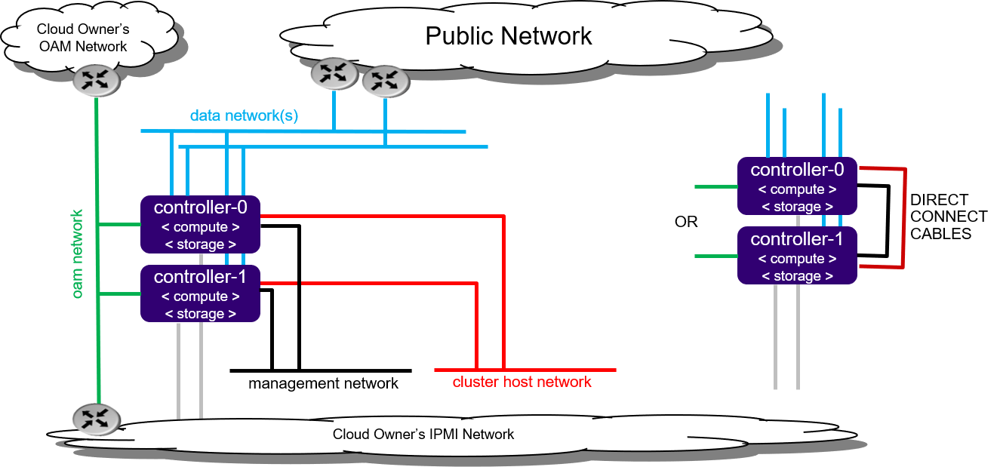

==============================
Virtual All-in-one Duplex R2.0
==============================

.. contents::
   :local:
   :depth: 1

-----------
Description
-----------

.. incl-aio-duplex-intro-start:

The All-in-one Duplex (AIO-DX) deployment option provides all three cloud
functions (controller, compute, and storage) on two servers.

An AIO-DX configuration provides the following benefits:

* Only a small amount of cloud processing and storage power is required
* Application consolidation using multiple virtual machines on a single pair of
  physical servers
* High availability (HA) services run on the controller function across two
  physical servers in either active/active or active/standby mode
* A storage backend solution using a two-node CEPH deployment across two servers
* Virtual machines scheduled on both compute functions
* Protection against overall server hardware fault, where
  * All controller HA services go active on the remaining healthy server
  * All virtual machines are recovered on the remaining healthy server

   *Figure 1: All-in-one Duplex deployment configuration*

.. incl-aio-duplex-intro-end:

.. include:: virtual_aio_simplex.rst
   :start-after: incl-ipv6-note-start:
   :end-before: incl-ipv6-note-end:

--------------------------
Physical host requirements
--------------------------

.. include:: virtual_aio_simplex.rst
   :start-after: incl-virt-physical-host-req-start:
   :end-before: incl-virt-physical-host-req-end:

-----------------------------------------------------
Preparing the virtual environment and virtual servers
-----------------------------------------------------

Prepare the virtual environment and virtual servers with the following steps:

#. Set up virtual platform networks for virtual deployment:

   ::

    bash setup_network.sh

#. Create the XML definitions for the virtual servers required by this
   configuration option. This creates the XML virtual server definition for:

   * duplex-controller-0
   * duplex-controller-1

   .. note::

      The following command will start/virtually power on:

      * the 'duplex-controller-0' virtual server
      * the X-based graphical virt-manager application

      If there is no X-server present, then errors are returned.

   ::

    bash setup_configuration.sh -c duplex -i ./bootimage.iso

--------------------
StarlingX Kubernetes
--------------------

*****************************************
Install the StarlingX Kubernetes platform
*****************************************

^^^^^^^^^^^^^^^^^^^^^^^^^^^^^^^^
Install software on controller-0
^^^^^^^^^^^^^^^^^^^^^^^^^^^^^^^^

In the last step of "Prepare the virtual environment and virtual servers" the
controller-0 virtual server 'duplex-controller-0' was started by the
:command:`setup_configuration.sh` command.

Attach to the console of virtual controller-0 and select the appropriate
installer menu options to start the non-interactive install of
StarlingX software on controller-0.

.. note::

   When entering the console, it is very easy to miss the first installer menu
   selection. Use ESC to navigate to previous menus, to ensure you are at the
   first installer menu.

::

  virsh console duplex-controller-0

Make the following menu selections in the installer:

#. First menu: Select 'All-in-one Controller Configuration'
#. Second menu: Select 'Graphical Console'
#. Third menu: Select 'Standard Security Profile'

Wait for the non-interactive install of software to complete and for the server
to reboot. This can take 5-10 minutes, depending on the performance of the host
machine.

^^^^^^^^^^^^^^^^^^^^^^^^^^^^^^^^
Bootstrap system on controller-0
^^^^^^^^^^^^^^^^^^^^^^^^^^^^^^^^

#. Log in using the username / password of "sysadmin" / "sysadmin".
   When logging in for the first time, you will be forced to change the password.

   ::

     Login: sysadmin
     Password:
     Changing password for sysadmin.
     (current) UNIX Password: sysadmin
     New Password:
     (repeat) New Password:

#. External connectivity is required to run the Ansible bootstrap playbook.

   ::

     export CONTROLLER0_OAM_CIDR=10.10.10.3/24
     export DEFAULT_OAM_GATEWAY=10.10.10.1
     sudo ip address add $CONTROLLER0_OAM_CIDR dev enp7s1
     sudo ip link set up dev enp7s1
     sudo ip route add default via $DEFAULT_OAM_GATEWAY dev enp7s1

#. Specify user configuration overrides for the Ansible bootstrap playbook.

   Ansible is used to bootstrap StarlingX on controller-0:

   * The default Ansible inventory file, ``/etc/ansible/hosts``, contains a single
     host: localhost.
   * The Ansible bootstrap playbook is at:
     ``/usr/share/ansible/stx-ansible/playbooks/bootstrap/bootstrap.yml``
   * The default configuration values for the bootstrap playbook are in
     ``/usr/share/ansible/stx-ansible/playbooks/bootstrap/host_vars/default.yml``
   * By default Ansible looks for and imports user configuration override files
     for hosts in the sysadmin home directory ($HOME), for example: ``$HOME/<hostname>.yml``

   Specify the user configuration override file for the ansible bootstrap
   playbook, by either:

   * Copying the default.yml file listed above to ``$HOME/localhost.yml`` and edit
     the configurable values as desired, based on the commented instructions in
     the file.

   or

   * Creating the minimal user configuration override file as shown in the
     example below:

     ::

        cd ~
        cat <<EOF > localhost.yml
        system_mode: duplex

        dns_servers:
          - 8.8.8.8
          - 8.8.4.4

        external_oam_subnet: 10.10.10.0/24
        external_oam_gateway_address: 10.10.10.1
        external_oam_floating_address: 10.10.10.2
        external_oam_node_0_address: 10.10.10.3
        external_oam_node_1_address: 10.10.10.4

        admin_username: admin
        admin_password: <sysadmin-password>
        ansible_become_pass: <sysadmin-password>
        EOF

   If you are using IPv6, provide IPv6 configuration overrides. Note that all
   addressing, except pxeboot_subnet, should be updated to IPv6 addressing.
   Example IPv6 override values are shown below:

   ::

      dns_servers:
      ‐ 2001:4860:4860::8888
      ‐ 2001:4860:4860::8844
      pxeboot_subnet: 169.254.202.0/24
      management_subnet: 2001:db8:2::/64
      cluster_host_subnet: 2001:db8:3::/64
      cluster_pod_subnet: 2001:db8:4::/64
      cluster_service_subnet: 2001:db8:4::/112
      external_oam_subnet: 2001:db8:1::/64
      external_oam_gateway_address: 2001:db8::1
      external_oam_floating_address: 2001:db8::2
      external_oam_node_0_address: 2001:db8::3
      external_oam_node_1_address: 2001:db8::4
      management_multicast_subnet: ff08::1:1:0/124

#. Run the Ansible bootstrap playbook:

   ::

    ansible-playbook /usr/share/ansible/stx-ansible/playbooks/bootstrap/bootstrap.yml

   Wait for Ansible bootstrap playbook to complete.
   This can take 5-10 minutes, depending on the performance of the host machine.

^^^^^^^^^^^^^^^^^^^^^^
Configure controller-0
^^^^^^^^^^^^^^^^^^^^^^

#. Acquire admin credentials:

   ::

    source /etc/platform/openrc

#. Configure the OAM and MGMT interfaces of controller-0 and specify the
   attached networks:

   ::

      OAM_IF=enp7s1
      MGMT_IF=enp7s2
      system host-if-modify controller-0 lo -c none
      IFNET_UUIDS=$(system interface-network-list controller-0 | awk '{if ($6=="lo") print $4;}')
      for UUID in $IFNET_UUIDS; do
          system interface-network-remove ${UUID}
      done
      system host-if-modify controller-0 $OAM_IF -c platform
      system interface-network-assign controller-0 $OAM_IF oam
      system host-if-modify controller-0 $MGMT_IF -c platform
      system interface-network-assign controller-0 $MGMT_IF mgmt
      system interface-network-assign controller-0 $MGMT_IF cluster-host

#. Configure NTP Servers for network time synchronization:

   .. note::

      In a virtual environment, this can sometimes cause Ceph clock skew alarms.
      Also, the virtual instances clock is synchronized with the host clock,
      so it is not absolutely required to configure NTP in this step.

   ::

      system ntp-modify ntpservers=0.pool.ntp.org,1.pool.ntp.org

#. Configure data interfaces for controller-0.

   .. note::

      This step is **required** for OpenStack and optional for Kubernetes.
      For example, do this step if you are using SRIOV network attachments in
      application containers.

   For Kubernetes SRIOV network attachments:

   * Configure the SRIOV device plugin:
     ::

       system host-label-assign controller-0 sriovdp=enabled

   * If planning on running DPDK in containers on this host, configure the number
     of 1G Huge pages required on both NUMA nodes:

     ::

        system host-memory-modify controller-0 0 -1G 100
        system host-memory-modify controller-0 1 -1G 100

   For both Kubernetes and OpenStack:

   ::

      DATA0IF=eth1000
      DATA1IF=eth1001
      export COMPUTE=controller-0
      PHYSNET0='physnet0'
      PHYSNET1='physnet1'
      SPL=/tmp/tmp-system-port-list
      SPIL=/tmp/tmp-system-host-if-list
      system host-port-list ${COMPUTE} --nowrap > ${SPL}
      system host-if-list -a ${COMPUTE} --nowrap > ${SPIL}
      DATA0PCIADDR=$(cat $SPL | grep $DATA0IF |awk '{print $8}')
      DATA1PCIADDR=$(cat $SPL | grep $DATA1IF |awk '{print $8}')
      DATA0PORTUUID=$(cat $SPL | grep ${DATA0PCIADDR} | awk '{print $2}')
      DATA1PORTUUID=$(cat $SPL | grep ${DATA1PCIADDR} | awk '{print $2}')
      DATA0PORTNAME=$(cat $SPL | grep ${DATA0PCIADDR} | awk '{print $4}')
      DATA1PORTNAME=$(cat  $SPL | grep ${DATA1PCIADDR} | awk '{print $4}')
      DATA0IFUUID=$(cat $SPIL | awk -v DATA0PORTNAME=$DATA0PORTNAME '($12 ~ DATA0PORTNAME) {print $2}')
      DATA1IFUUID=$(cat $SPIL | awk -v DATA1PORTNAME=$DATA1PORTNAME '($12 ~ DATA1PORTNAME) {print $2}')

      system datanetwork-add ${PHYSNET0} vlan
      system datanetwork-add ${PHYSNET1} vlan

      system host-if-modify -m 1500 -n data0 -c data ${COMPUTE} ${DATA0IFUUID}
      system host-if-modify -m 1500 -n data1 -c data ${COMPUTE} ${DATA1IFUUID}
      system interface-datanetwork-assign ${COMPUTE} ${DATA0IFUUID} ${PHYSNET0}
      system interface-datanetwork-assign ${COMPUTE} ${DATA1IFUUID} ${PHYSNET1}

#. Add an OSD on controller-0 for ceph:

   ::

      system host-disk-list controller-0
      system host-disk-list controller-0 | awk '/\/dev\/sdb/{print $2}' | xargs -i system host-stor-add controller-0 {}
      system host-stor-list controller-0

~~~~~~~~~~~~~~~~~~~~~~~~~~~~~~~~~~~~~
OpenStack-specific host configuration
~~~~~~~~~~~~~~~~~~~~~~~~~~~~~~~~~~~~~

.. warning::

   The following configuration is required only if the StarlingX OpenStack
   application (stx-openstack) will be installed.

#. **For OpenStack only:** Assign OpenStack host labels to controller-0 in
   support of installing the stx-openstack manifest/helm-charts later.

   ::

      system host-label-assign controller-0 openstack-control-plane=enabled
      system host-label-assign controller-0 openstack-compute-node=enabled
      system host-label-assign controller-0 openvswitch=enabled
      system host-label-assign controller-0 sriov=enabled

#. **For OpenStack only:** A vSwitch is required.

   The default vSwitch is containerized OVS that is packaged with the
   stx-openstack manifest/helm-charts. StarlingX provides the option to use
   OVS-DPDK on the host, however, in the virtual environment OVS-DPDK is NOT
   supported, only OVS is supported. Therefore, simply use the default OVS
   vSwitch here.

#. **For OpenStack Only:** Set up disk partition for nova-local volume group,
   which is needed for stx-openstack nova ephemeral disks.

   ::

      export COMPUTE=controller-0

      echo ">>> Getting root disk info"
      ROOT_DISK=$(system host-show ${COMPUTE} | grep rootfs | awk '{print $4}')
      ROOT_DISK_UUID=$(system host-disk-list ${COMPUTE} --nowrap | grep ${ROOT_DISK} | awk '{print $2}')
      echo "Root disk: $ROOT_DISK, UUID: $ROOT_DISK_UUID"

      echo ">>>> Configuring nova-local"
      NOVA_SIZE=34
      NOVA_PARTITION=$(system host-disk-partition-add -t lvm_phys_vol ${COMPUTE} ${ROOT_DISK_UUID} ${NOVA_SIZE})
      NOVA_PARTITION_UUID=$(echo ${NOVA_PARTITION} | grep -ow "| uuid | [a-z0-9\-]* |" | awk '{print $4}')
      system host-lvg-add ${COMPUTE} nova-local
      system host-pv-add ${COMPUTE} nova-local ${NOVA_PARTITION_UUID}
      sleep 2

      echo ">>> Wait for partition $NOVA_PARTITION_UUID to be ready."
      while true; do system host-disk-partition-list $COMPUTE --nowrap | grep $NOVA_PARTITION_UUID | grep Ready; if [ $? -eq 0 ]; then break; fi; sleep 1; done

^^^^^^^^^^^^^^^^^^^
Unlock controller-0
^^^^^^^^^^^^^^^^^^^

Unlock controller-0 to bring it into service:

::

  system host-unlock controller-0

Controller-0 will reboot in order to apply configuration changes and come into
service. This can take 5-10 minutes, depending on the performance of the host machine.

^^^^^^^^^^^^^^^^^^^^^^^^^^^^^^^^^^^^^
Install software on controller-1 node
^^^^^^^^^^^^^^^^^^^^^^^^^^^^^^^^^^^^^

#. Power on the controller-1 virtual server, 'duplex-controller-1', and force it
   to network boot by pressing F12 and selecting 'lan' as the alternative boot
   option:

   ::

      virsh start duplex-controller-1

#. Attach to the console of virtual controller-1:

   ::

      virsh console duplex-controller-1

   As controller-1 VM boots, a message appears on its console instructing you to
   configure the personality of the node.

#. On the console of controller-0, list hosts to see the newly discovered
   controller-1 host, that is, the host with hostname of None:

   ::

    system host-list
    +----+--------------+-------------+----------------+-------------+--------------+
    | id | hostname     | personality | administrative | operational | availability |
    +----+--------------+-------------+----------------+-------------+--------------+
    | 1  | controller-0 | controller  | unlocked       | enabled     | available    |
    | 2  | None         | None        | locked         | disabled    | offline      |
    +----+--------------+-------------+----------------+-------------+--------------+

#. Using the host id, set the personality of this host to 'controller':

   ::

      system host-update 2 personality=controller

#. Wait for the software installation on controller-1 to complete, controller-1 to
   reboot, and controller-1 to show as locked/disabled/online in 'system host-list'.
   This can take 5-10 minutes, depending on the performance of the host machine.

   ::

    system host-list
    +----+--------------+-------------+----------------+-------------+--------------+
    | id | hostname     | personality | administrative | operational | availability |
    +----+--------------+-------------+----------------+-------------+--------------+
    | 1  | controller-0 | controller  | unlocked       | enabled     | available    |
    | 2  | controller-1 | controller  | locked         | disabled    | online      |
    +----+--------------+-------------+----------------+-------------+--------------+

^^^^^^^^^^^^^^^^^^^^^^
Configure controller-1
^^^^^^^^^^^^^^^^^^^^^^

#. Configure the OAM and MGMT interfaces of controller-1 and specify the
   attached networks. Note that the MGMT interface is partially set up
   automatically by the network install procedure.

   ::

      OAM_IF= enp7s1
      system host-if-modify controller-1 $OAM_IF -c platform
      system interface-network-assign controller-1 $OAM_IF oam
      system interface-network-assign controller-1 mgmt0 cluster-host

#. Configure data interfaces for controller-1.

   .. note::

      This step is **required** for OpenStack and optional for Kubernetes. For
      example, do this step if using SRIOV network attachments in application
      containers.

   For Kubernetes SRIOV network attachments:

   * Configure SRIOV device plugin:

     ::

        system host-label-assign controller-1 sriovdp=enabled

   * If planning on running DPDK in containers on this hosts, configure the number
     of 1G Huge pages required on both NUMA nodes:

     ::

      system host-memory-modify controller-1 0 -1G 100
      system host-memory-modify controller-1 1 -1G 100

   For both Kubernetes and OpenStack:

   ::

      DATA0IF=eth1000
      DATA1IF=eth1001
      export COMPUTE=controller-1
      PHYSNET0='physnet0'
      PHYSNET1='physnet1'
      SPL=/tmp/tmp-system-port-list
      SPIL=/tmp/tmp-system-host-if-list
      system host-port-list ${COMPUTE} --nowrap > ${SPL}
      system host-if-list -a ${COMPUTE} --nowrap > ${SPIL}
      DATA0PCIADDR=$(cat $SPL | grep $DATA0IF |awk '{print $8}')
      DATA1PCIADDR=$(cat $SPL | grep $DATA1IF |awk '{print $8}')
      DATA0PORTUUID=$(cat $SPL | grep ${DATA0PCIADDR} | awk '{print $2}')
      DATA1PORTUUID=$(cat $SPL | grep ${DATA1PCIADDR} | awk '{print $2}')
      DATA0PORTNAME=$(cat $SPL | grep ${DATA0PCIADDR} | awk '{print $4}')
      DATA1PORTNAME=$(cat  $SPL | grep ${DATA1PCIADDR} | awk '{print $4}')
      DATA0IFUUID=$(cat $SPIL | awk -v DATA0PORTNAME=$DATA0PORTNAME '($12 ~ DATA0PORTNAME) {print $2}')
      DATA1IFUUID=$(cat $SPIL | awk -v DATA1PORTNAME=$DATA1PORTNAME '($12 ~ DATA1PORTNAME) {print $2}')

      system datanetwork-add ${PHYSNET0} vlan
      system datanetwork-add ${PHYSNET1} vlan

      system host-if-modify -m 1500 -n data0 -c data ${COMPUTE} ${DATA0IFUUID}
      system host-if-modify -m 1500 -n data1 -c data ${COMPUTE} ${DATA1IFUUID}
      system interface-datanetwork-assign ${COMPUTE} ${DATA0IFUUID} ${PHYSNET0}
      system interface-datanetwork-assign ${COMPUTE} ${DATA1IFUUID} ${PHYSNET1}

#. Add an OSD on controller-1 for ceph:

   ::

    echo ">>> Add OSDs to primary tier"
    system host-disk-list controller-1
    system host-disk-list controller-1 | awk '/\/dev\/sdb/{print $2}' | xargs -i system host-stor-add controller-1 {}
    system host-stor-list controller-1

~~~~~~~~~~~~~~~~~~~~~~~~~~~~~~~~~~~~~
OpenStack-specific host configuration
~~~~~~~~~~~~~~~~~~~~~~~~~~~~~~~~~~~~~

.. warning::

   The following configuration is required only if the StarlingX OpenStack
   application (stx-openstack) will be installed.

#. **For OpenStack only:** Assign OpenStack host labels to controller-1 in
   support of installing the stx-openstack manifest/helm-charts later:

   ::

    system host-label-assign controller-1 openstack-control-plane=enabled
    system host-label-assign controller-1 openstack-compute-node=enabled
    system host-label-assign controller-1 openvswitch=enabled
    system host-label-assign controller-1 sriov=enabled

#. **For OpenStack only:** Set up disk partition for nova-local volume group,
   which is needed for stx-openstack nova ephemeral disks:

   ::

      export COMPUTE=controller-1

      echo ">>> Getting root disk info"
      ROOT_DISK=$(system host-show ${COMPUTE} | grep rootfs | awk '{print $4}')
      ROOT_DISK_UUID=$(system host-disk-list ${COMPUTE} --nowrap | grep ${ROOT_DISK} | awk '{print $2}')
      echo "Root disk: $ROOT_DISK, UUID: $ROOT_DISK_UUID"

      echo ">>>> Configuring nova-local"
      NOVA_SIZE=34
      NOVA_PARTITION=$(system host-disk-partition-add -t lvm_phys_vol ${COMPUTE} ${ROOT_DISK_UUID} ${NOVA_SIZE})
      NOVA_PARTITION_UUID=$(echo ${NOVA_PARTITION} | grep -ow "| uuid | [a-z0-9\-]* |" | awk '{print $4}')
      system host-lvg-add ${COMPUTE} nova-local
      system host-pv-add ${COMPUTE} nova-local ${NOVA_PARTITION_UUID}

^^^^^^^^^^^^^^^^^^^
Unlock controller-1
^^^^^^^^^^^^^^^^^^^

Unlock controller-1 in order to bring it into service:

::

  system host-unlock controller-1

Controller-1 will reboot in order to apply configuration changes and come into
service. This can take 5-10 minutes, depending on the performance of the host machine.

When it completes, your Kubernetes cluster is up and running.

***************************
Access StarlingX Kubernetes
***************************

.. include:: virtual_aio_simplex.rst
   :start-after: incl-access-starlingx-kubernetes-start:
   :end-before: incl-access-starlingx-kubernetes-end:

-------------------
StarlingX OpenStack
-------------------

***************************
Install StarlingX OpenStack
***************************

.. include:: virtual_aio_simplex.rst
   :start-after: incl-install-starlingx-openstack-start:
   :end-before: incl-install-starlingx-openstack-end:

**************************
Access StarlingX OpenStack
**************************

.. include:: virtual_aio_simplex.rst
   :start-after: incl-access-starlingx-openstack-start:
   :end-before: incl-access-starlingx-openstack-end:

*****************************
Uninstall StarlingX OpenStack
*****************************

.. include:: virtual_aio_simplex.rst
   :start-after: incl-uninstall-starlingx-openstack-start:
   :end-before: incl-uninstall-starlingx-openstack-end:
