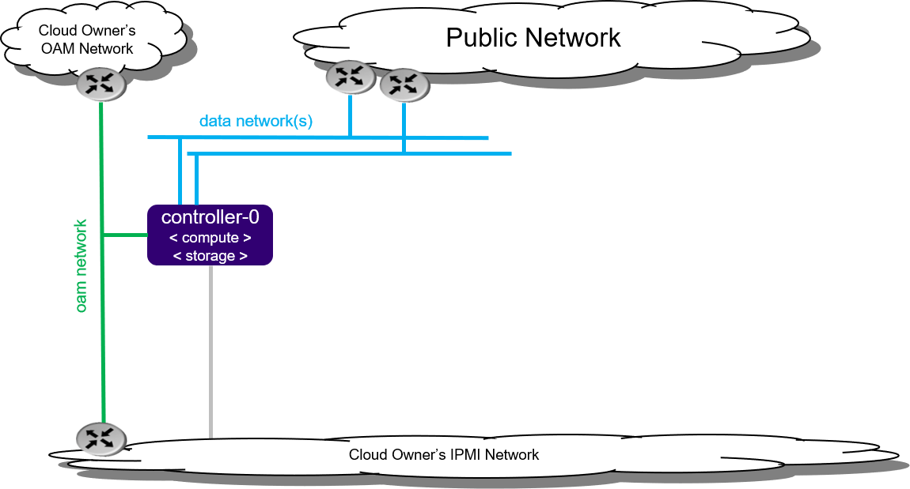

===============================
Virtual All-in-one Simplex R2.0
===============================

.. contents::
   :local:
   :depth: 1

-----------
Description
-----------

.. incl-aio-simplex-intro-start:

The All-in-one Simplex (AIO-SX) deployment option provides all three cloud
functions (controller, compute, and storage) on a single server.

An AIO-SX configuration provides the following benefits:

* Only a small amount of cloud processing and storage power is required
* Application consolidation using multiple virtual machines on a single pair of
  physical servers
* A storage backend solution using a single-node CEPH deployment

An AIO-SX deployment provides no protection against overall server hardware
fault, as protection is either not required or provided at a higher level.
Hardware component protection can be enable with, for example, a hardware RAID
or 2x Port LAG in the deployment.

   *Figure 1: All-in-one Simplex deployment configuration*

.. incl-aio-simplex-intro-end:

.. incl-ipv6-note-start:

.. note::

   By default, StarlingX uses IPv4. To use StarlingX with IPv6:

   * The entire infrastructure and cluster configuration must be IPv6, with the
     exception of the PXE boot network.

   * Not all external servers are reachable via IPv6 addresses (e.g. Docker
     registries). Depending on your infrastructure, it may be necessary to deploy
     a NAT64/DNS64 gateway to translate the IPv4 addresses to IPv6.

.. incl-ipv6-note-end:

--------------------------
Physical host requirements
--------------------------

.. incl-virt-physical-host-req-start:

This section describes:

* system requirements for the workstation hosting the virtual machine(s) where StarlingX will be deployed

* host setup

*********************
Hardware requirements
*********************

The host system should have at least:

* **Processor:** x86_64 only supported architecture with BIOS enabled hardware
  virtualization extensions

* **Cores:** 8

* **Memory:** 32GB RAM

* **Hard Disk:** 500GB HDD

* **Network:** One network adapter with active Internet connection

*********************
Software requirements
*********************

The host system should have at least:

* A workstation computer with Ubuntu 16.04 LTS 64-bit

All other required packages will be installed by scripts in the StarlingX tools repository.

**********
Host setup
**********

Set up the host with the following steps:

#. Update OS:

   ::

    apt-get update

#. Clone the StarlingX tools repository:

   ::

    apt-get install -y git
    cd $HOME
    git clone https://opendev.org/starlingx/tools

#. Install required packages:

   ::

    cd $HOME/tools/deployment/libvirt/
    bash install_packages.sh
    apt install -y apparmor-profiles
    apt-get install -y ufw
    ufw disable
    ufw status

#. Get the StarlingX ISO. This can be from a private StarlingX build or from the public Cengn
   StarlingX build off 'master' branch, as shown below:

   ::

    wget http://mirror.starlingx.cengn.ca/mirror/starlingx/release/2.0.0/centos/outputs/iso/bootimage.iso

.. incl-virt-physical-host-req-end:

-----------------------------------------------------
Preparing the virtual environment and virtual servers
-----------------------------------------------------

Prepare the virtual environment and virtual servers with the following steps:

#. Set up virtual platform networks for virtual deployment:

   ::

    bash setup_network.sh

#. Create the XML definitions for the virtual servers required by this
   configuration option. This creates the XML virtual server definition for:

   * simplex-controller-0

   .. note::

      The following command will start/virtually power on:

      * the 'simplex-controller-0' virtual server 
      * the X-based graphical virt-manager application

      If there is no X-server present, then errors will occur.

   ::

    bash setup_configuration.sh -c simplex -i ./bootimage.iso

--------------------
StarlingX Kubernetes
--------------------

*****************************************
Install the StarlingX Kubernetes platform
*****************************************

^^^^^^^^^^^^^^^^^^^^^^^^^^^^^^^^
Install software on controller-0
^^^^^^^^^^^^^^^^^^^^^^^^^^^^^^^^

In the last step of "Prepare the virtual environment and virtual servers", the
controller-0 virtual server 'simplex-controller-0' was started by the
:command:`setup_configuration.sh` command.

Attach to the console of virtual controller-0 and select the appropriate
installer menu options to start the non-interactive install of
StarlingX software on controller-0.

.. note::

   When entering the console, it is very easy to miss the first installer menu
   selection. Use ESC to navigate to previous menus, to ensure you are at the
   first installer menu.

::

  virsh console simplex-controller-0

Make the following menu selections in the installer:

#. First menu: Select 'All-in-one Controller Configuration'
#. Second menu: Select 'Graphical Console'
#. Third menu: Select 'Standard Security Profile'

Wait for the non-interactive install of software to complete and for the server
to reboot. This can take 5-10 minutes, depending on the performance of the host
machine.

^^^^^^^^^^^^^^^^^^^^^^^^^^^^^^^^
Bootstrap system on controller-0
^^^^^^^^^^^^^^^^^^^^^^^^^^^^^^^^

#. Log in using the username / password of "sysadmin" / "sysadmin".
   When logging in for the first time, you will be forced to change the password.

   ::

    Login: sysadmin
    Password:
    Changing password for sysadmin.
    (current) UNIX Password: sysadmin
    New Password:
    (repeat) New Password:

#. External connectivity is required to run the Ansible bootstrap playbook.

   ::

    export CONTROLLER0_OAM_CIDR=10.10.10.3/24
    export DEFAULT_OAM_GATEWAY=10.10.10.1
    sudo ip address add $CONTROLLER0_OAM_CIDR dev enp7s1
    sudo ip link set up dev enp7s1
    sudo ip route add default via $DEFAULT_OAM_GATEWAY dev enp7s1

#. Specify user configuration overrides for the Ansible bootstrap playbook.

   Ansible is used to bootstrap StarlingX on controller-0:

   * The default Ansible inventory file, ``/etc/ansible/hosts``, contains a single
     host: localhost.
   * The Ansible bootstrap playbook is at:
     ``/usr/share/ansible/stx-ansible/playbooks/bootstrap/bootstrap.yml``
   * The default configuration values for the bootstrap playbook are in:
     ``/usr/share/ansible/stx-ansible/playbooks/bootstrap/host_vars/default.yml``
   * By default Ansible looks for and imports user configuration override files
     for hosts in the sysadmin home directory ($HOME), for example: ``$HOME/<hostname>.yml``

   Specify the user configuration override file for the Ansible bootstrap
   playbook, by either:

   * Copying the default.yml file listed above to ``$HOME/localhost.yml`` and edit
     the configurable values as desired, based on the commented instructions in
     the file.

   or

   * Creating the minimal user configuration override file as shown in the
     example below:

     ::

        cd ~
        cat <<EOF > localhost.yml
        system_mode: simplex

        dns_servers:
        - 8.8.8.8
        - 8.8.4.4

        external_oam_subnet: 10.10.10.0/24
        external_oam_gateway_address: 10.10.10.1
        external_oam_floating_address: 10.10.10.2

        admin_username: admin
        admin_password: <sysadmin-password>
        ansible_become_pass: <sysadmin-password>
        EOF

   If you are using IPv6, provide IPv6 configuration overrides. Note that all
   addressing, except pxeboot_subnet, should be updated to IPv6 addressing.
   Example IPv6 override values are shown below:

   ::

      dns_servers:
      ‐ 2001:4860:4860::8888
      ‐ 2001:4860:4860::8844
      pxeboot_subnet: 169.254.202.0/24
      management_subnet: 2001:db8:2::/64
      cluster_host_subnet: 2001:db8:3::/64
      cluster_pod_subnet: 2001:db8:4::/64
      cluster_service_subnet: 2001:db8:4::/112
      external_oam_subnet: 2001:db8:1::/64
      external_oam_gateway_address: 2001:db8::1
      external_oam_floating_address: 2001:db8::2
      management_multicast_subnet: ff08::1:1:0/124

#. Run the Ansible bootstrap playbook:

   ::

    ansible-playbook /usr/share/ansible/stx-ansible/playbooks/bootstrap/bootstrap.yml

   Wait for Ansible bootstrap playbook to complete.
   This can take 5-10 minutes, depending on the performance of the host machine.

^^^^^^^^^^^^^^^^^^^^^^
Configure controller-0
^^^^^^^^^^^^^^^^^^^^^^

#. Acquire admin credentials:

   ::

    source /etc/platform/openrc

#. Configure the OAM interface of controller-0:

   ::

    OAM_IF=enp7s1
    system host-if-modify controller-0 $OAM_IF -c platform
    system interface-network-assign controller-0 $OAM_IF oam

#. Configure NTP Servers for network time synchronization:

   .. note::

      In a virtual environment, this can sometimes cause Ceph clock skew alarms.
      Also, the virtual instances clock is synchronized with the host clock,
      so it is not absolutely required to configure NTP in this step.

   ::

    system ntp-modify ntpservers=0.pool.ntp.org,1.pool.ntp.org

#. Configure data interfaces for controller-0.

   .. note::

      This step is **required** for OpenStack and optional for Kubernetes. For
      example, do this step if using SRIOV network attachments in application
      containers.

   For Kubernetes SRIOV network attachments:

   * Configure the SRIOV device plugin:

     ::

        system host-label-assign controller-0 sriovdp=enabled

   * If planning on running DPDK in containers on this host, configure the number
     of 1G Huge pages required on both NUMA nodes:

     ::

        system host-memory-modify controller-0 0 -1G 100
        system host-memory-modify controller-0 1 -1G 100

   For both Kubernetes and OpenStack:

   ::

    DATA0IF=eth1000
    DATA1IF=eth1001
    export COMPUTE=controller-0
    PHYSNET0='physnet0'
    PHYSNET1='physnet1'
    SPL=/tmp/tmp-system-port-list
    SPIL=/tmp/tmp-system-host-if-list
    system host-port-list ${COMPUTE} --nowrap > ${SPL}
    system host-if-list -a ${COMPUTE} --nowrap > ${SPIL}
    DATA0PCIADDR=$(cat $SPL | grep $DATA0IF |awk '{print $8}')
    DATA1PCIADDR=$(cat $SPL | grep $DATA1IF |awk '{print $8}')
    DATA0PORTUUID=$(cat $SPL | grep ${DATA0PCIADDR} | awk '{print $2}')
    DATA1PORTUUID=$(cat $SPL | grep ${DATA1PCIADDR} | awk '{print $2}')
    DATA0PORTNAME=$(cat $SPL | grep ${DATA0PCIADDR} | awk '{print $4}')
    DATA1PORTNAME=$(cat  $SPL | grep ${DATA1PCIADDR} | awk '{print $4}')
    DATA0IFUUID=$(cat $SPIL | awk -v DATA0PORTNAME=$DATA0PORTNAME '($12 ~ DATA0PORTNAME) {print $2}')
    DATA1IFUUID=$(cat $SPIL | awk -v DATA1PORTNAME=$DATA1PORTNAME '($12 ~ DATA1PORTNAME) {print $2}')

    system datanetwork-add ${PHYSNET0} vlan
    system datanetwork-add ${PHYSNET1} vlan

    system host-if-modify -m 1500 -n data0 -c data ${COMPUTE} ${DATA0IFUUID}
    system host-if-modify -m 1500 -n data1 -c data ${COMPUTE} ${DATA1IFUUID}
    system interface-datanetwork-assign ${COMPUTE} ${DATA0IFUUID} ${PHYSNET0}
    system interface-datanetwork-assign ${COMPUTE} ${DATA1IFUUID} ${PHYSNET1}

#. Add an OSD on controller-0 for ceph:

   ::

    system host-disk-list controller-0
    system host-disk-list controller-0 | awk '/\/dev\/sdb/{print $2}' | xargs -i system host-stor-add controller-0 {}
    system host-stor-list controller-0

~~~~~~~~~~~~~~~~~~~~~~~~~~~~~~~~~~~~~
OpenStack-specific host configuration
~~~~~~~~~~~~~~~~~~~~~~~~~~~~~~~~~~~~~

.. warning::

   The following configuration is required only if the StarlingX OpenStack
   application (stx-openstack) will be installed.

#. **For OpenStack only:** Assign OpenStack host labels to controller-0 in
   support of installing the stx-openstack manifest/helm-charts later.

   ::

     system host-label-assign controller-0 openstack-control-plane=enabled
     system host-label-assign controller-0 openstack-compute-node=enabled
     system host-label-assign controller-0 openvswitch=enabled
     system host-label-assign controller-0 sriov=enabled

#. **For OpenStack only**: A vSwitch is required.

   The default vSwitch is containerized OVS that is packaged with the
   stx-openstack manifest/helm-charts. StarlingX provides the option to use
   OVS-DPDK on the host, however, in the virtual environment OVS-DPDK is NOT
   supported, only OVS is supported. Therefore, simply use the default OVS
   vSwitch here.

#. **For OpenStack Only:** Set up disk partition for nova-local volume group,
   which is needed for stx-openstack nova ephemeral disks.

   ::

     export COMPUTE=controller-0

     echo ">>> Getting root disk info"
     ROOT_DISK=$(system host-show ${COMPUTE} | grep rootfs | awk '{print $4}')
     ROOT_DISK_UUID=$(system host-disk-list ${COMPUTE} --nowrap | grep ${ROOT_DISK} | awk '{print $2}')
     echo "Root disk: $ROOT_DISK, UUID: $ROOT_DISK_UUID"

     echo ">>>> Configuring nova-local"
     NOVA_SIZE=34
     NOVA_PARTITION=$(system host-disk-partition-add -t lvm_phys_vol ${COMPUTE} ${ROOT_DISK_UUID} ${NOVA_SIZE})
     NOVA_PARTITION_UUID=$(echo ${NOVA_PARTITION} | grep -ow "| uuid | [a-z0-9\-]* |" | awk '{print $4}')
     system host-lvg-add ${COMPUTE} nova-local
     system host-pv-add ${COMPUTE} nova-local ${NOVA_PARTITION_UUID}
     sleep 2

     echo ">>> Wait for partition $NOVA_PARTITION_UUID to be ready."
     while true; do system host-disk-partition-list $COMPUTE --nowrap | grep $NOVA_PARTITION_UUID | grep Ready; if [ $? -eq 0 ]; then break; fi; sleep 1; done

^^^^^^^^^^^^^^^^^^^
Unlock controller-0
^^^^^^^^^^^^^^^^^^^

Unlock controller-0 to bring it into service:

::

  system host-unlock controller-0

Controller-0 will reboot to apply configuration changes and come into
service. This can take 5-10 minutes, depending on the performance of the host machine.

When it completes, your Kubernetes cluster is up and running.

***************************
Access StarlingX Kubernetes
***************************

.. incl-access-starlingx-kubernetes-start:

Use local/remote CLIs, GUIs, and/or REST APIs to access and manage StarlingX
Kubernetes and hosted containerized applications. Refer to details on accessing
the StarlingX Kubernetes cluster in the
:doc:`Access StarlingX Kubernetes guide <access_starlingx_kubernetes>`.

.. incl-access-starlingx-kubernetes-end:

-------------------
StarlingX OpenStack
-------------------

***************************
Install StarlingX OpenStack
***************************

.. incl-install-starlingx-openstack-start:

Other than the OpenStack-specific configurations required in the underlying
StarlingX/Kubernetes infrastructure (described in the installation steps for the
Starlingx Kubernetes platform above), the installation of containerized OpenStack
for StarlingX is independent of deployment configuration. Refer to the
:doc:`Install OpenStack guide <install_openstack>`
for installation instructions.

.. incl-install-starlingx-openstack-end:

**************************
Access StarlingX OpenStack
**************************

.. incl-access-starlingx-openstack-start:

Use local/remote CLIs, GUIs and/or REST APIs to access and manage StarlingX
OpenStack and hosted virtualized applications. Refer to details on accessing
StarlingX OpenStack in the
:doc:`Access StarlingX OpenStack guide <access_starlingx_openstack>`.

.. incl-access-starlingx-openstack-end:

*****************************
Uninstall StarlingX OpenStack
*****************************

.. incl-uninstall-starlingx-openstack-start:

Refer to the :doc:`Uninstall OpenStack guide <uninstall_delete_openstack>` for
instructions on how to uninstall and delete the OpenStack application.

.. incl-uninstall-starlingx-openstack-end: