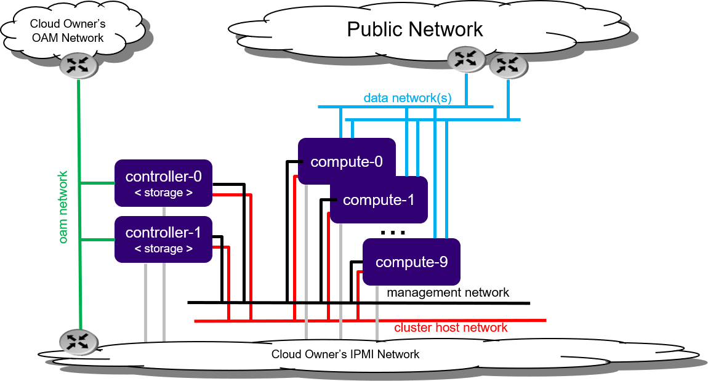

=============================================
Virtual Standard with Controller Storage R2.0
=============================================

.. contents::
   :local:
   :depth: 1

-----------
Description
-----------

.. incl-controller-storage-intro-start:

The Standard with Controller Storage deployment option provides two high
availability (HA) controller nodes and two - 10 compute nodes.

A Standard with Controller Storage configuration provides the following benefits:

* A pool of up to 10 compute nodes
* High availability (HA) services run across the controller nodes in either
  active/active or active/standby mode
* A storage backend solution using a two-node CEPH deployment across two
  controller servers
* Protection against overall controller and compute node failure, where

  * On overall controller node failure, all controller HA services go active on
    the remaining healthy controller node
  * On overall compute node failuer, virtual machines and containers are
    recovered on the remaining healthy compute nodes

   *Figure 1: Standard with Controller Storage deployment configuration*

.. incl-controller-storage-intro-end:

.. include:: virtual_aio_simplex.rst
   :start-after: incl-ipv6-note-start:
   :end-before: incl-ipv6-note-end:

--------------------------
Physical host requirements
--------------------------

.. include:: virtual_aio_simplex.rst
   :start-after: incl-virt-physical-host-req-start:
   :end-before: incl-virt-physical-host-req-end:

-----------------------------------------------------
Preparing the virtual environment and virtual servers
-----------------------------------------------------

#. Set up virtual platform networks for virtual deployment:

   ::

     bash setup_network.sh

#. Create the XML definitions for the virtual servers required by this
   configuration option.

   This creates the XML virtual server definition for:

   * controllerstorage-controller-0
   * controllerstorage-controller-1
   * controllerstorage-compute-0
   * controllerstorage-compute-1

   .. note::

      The following command will start/virtually power on:

      * the 'controllerstorage-controller-0' virtual server
      * the X-based graphical virt-manager application

      If there is no X-server present, then errors are returned.

   ::

      bash setup_configuration.sh -c controllerstorage -i ./bootimage.iso

--------------------
StarlingX Kubernetes
--------------------

*******************************
Installing StarlingX Kubernetes
*******************************

^^^^^^^^^^^^^^^^^^^^^^^^^^^^^^^^
Install software on controller-0
^^^^^^^^^^^^^^^^^^^^^^^^^^^^^^^^

In the last step of "Prepare the virtual environment and virtual servers" the
controller-0 virtual server 'controllerstorage-controller-0' was started by the
:command:`setup_configuration.sh` command.

Attach to the console of virtual controller-0 and select the appropriate
installer menu options to start the non-interactive install of
StarlingX software on controller-0.

.. note::

   When entering the console, it is very easy to miss the first installer menu
   selection. Use ESC to navigate to previous menus, to ensure you are at the
   first installer menu.

::

  virsh console controllerstorage-controller-0

Make the following menu selections in the installer:

#. First menu: Select 'Standard Configuration'
#. Second menu: Select 'Graphical Console'
#. Third menu: Select 'Standard Security Profile'

Wait for the non-interactive install of software to complete and for the server
to reboot. This can take 5-10 minutes depending on the performance of the host
machine.

^^^^^^^^^^^^^^^^^^^^^^^^^^^^^^^^
Bootstrap system on controller-0
^^^^^^^^^^^^^^^^^^^^^^^^^^^^^^^^

#. Log in using the username / password of "sysadmin" / "sysadmin".
   When logging in for the first time, you will be forced to change the password.

   ::

      Login: sysadmin
      Password:
      Changing password for sysadmin.
      (current) UNIX Password: sysadmin
      New Password:
      (repeat) New Password:

#. External connectivity is required to run the Ansible bootstrap playbook:

   ::

      export CONTROLLER0_OAM_CIDR=10.10.10.3/24
      export DEFAULT_OAM_GATEWAY=10.10.10.1
      sudo ip address add $CONTROLLER0_OAM_CIDR dev enp7s1
      sudo ip link set up dev enp7s1
      sudo ip route add default via $DEFAULT_OAM_GATEWAY dev enp7s1

#. Specify user configuration overrides for the Ansible bootstrap playbook.

   Ansible is used to bootstrap StarlingX on controller-0:

   * The default Ansible inventory file, ``/etc/ansible/hosts``, contains a single
     host: localhost.
   * The Ansible bootstrap playbook is at:
     ``/usr/share/ansible/stx-ansible/playbooks/bootstrap/bootstrap.yml``
   * The default configuration values for the bootstrap playbook are in:
     ``/usr/share/ansible/stx-ansible/playbooks/bootstrap/host_vars/default.yml``
   * By default Ansible looks for and imports user configuration override files
     for hosts in the sysadmin home directory ($HOME), for example: ``$HOME/<hostname>.yml``

   Specify the user configuration override file for the ansible bootstrap
   playbook, by either:

   * Copying the default.yml file listed above to ``$HOME/localhost.yml`` and edit
     the configurable values as desired, based on the commented instructions in
     the file.

   or

   * Creating the minimal user configuration override file as shown in the
     example below:

     ::

        cd ~
        cat <<EOF > localhost.yml
        system_mode: standard

        dns_servers:
          - 8.8.8.8
          - 8.8.4.4

        external_oam_subnet: 10.10.10.0/24
        external_oam_gateway_address: 10.10.10.1
        external_oam_floating_address: 10.10.10.2
        external_oam_node_0_address: 10.10.10.3
        external_oam_node_1_address: 10.10.10.4

        admin_username: admin
        admin_password: <sysadmin-password>
        ansible_become_pass: <sysadmin-password>
        EOF

   If you are using IPv6, provide IPv6 configuration overrides. Note that all
   addressing, except pxeboot_subnet, should be updated to IPv6 addressing.
   Example IPv6 override values are shown below:

   ::

      dns_servers:
      ‐ 2001:4860:4860::8888
      ‐ 2001:4860:4860::8844
      pxeboot_subnet: 169.254.202.0/24
      management_subnet: 2001:db8:2::/64
      cluster_host_subnet: 2001:db8:3::/64
      cluster_pod_subnet: 2001:db8:4::/64
      cluster_service_subnet: 2001:db8:4::/112
      external_oam_subnet: 2001:db8:1::/64
      external_oam_gateway_address: 2001:db8::1
      external_oam_floating_address: 2001:db8::2
      external_oam_node_0_address: 2001:db8::3
      external_oam_node_1_address: 2001:db8::4
      management_multicast_subnet: ff08::1:1:0/124

#. Run the Ansible bootstrap playbook:

   ::

      ansible-playbook /usr/share/ansible/stx-ansible/playbooks/bootstrap/bootstrap.yml

   Wait for Ansible bootstrap playbook to complete.
   This can take 5-10 minutes, depending on the performance of the host machine.

^^^^^^^^^^^^^^^^^^^^^^
Configure controller-0
^^^^^^^^^^^^^^^^^^^^^^

#. Acquire admin credentials:

   ::

      source /etc/platform/openrc

#. Configure the OAM and MGMT interfaces of controller-0 and specify the
   attached networks:

   ::

      OAM_IF=enp7s1
      MGMT_IF=enp7s2
      system host-if-modify controller-0 lo -c none
      IFNET_UUIDS=$(system interface-network-list controller-0 | awk '{if ($6=="lo") print $4;}')
      for UUID in $IFNET_UUIDS; do
          system interface-network-remove ${UUID}
      done
      system host-if-modify controller-0 $OAM_IF -c platform
      system interface-network-assign controller-0 $OAM_IF oam
      system host-if-modify controller-0 $MGMT_IF -c platform
      system interface-network-assign controller-0 $MGMT_IF mgmt
      system interface-network-assign controller-0 $MGMT_IF cluster-host

#. Configure NTP Servers for network time synchronization:

   .. note::

      In a virtual environment, this can sometimes cause Ceph clock skew alarms.
      Also, the virtual instances clock is synchronized with the host clock,
      so it is not absolutely required to configure NTP here.

   ::

      system ntp-modify ntpservers=0.pool.ntp.org,1.pool.ntp.org

~~~~~~~~~~~~~~~~~~~~~~~~~~~~~~~~~~~~~
OpenStack-specific host configuration
~~~~~~~~~~~~~~~~~~~~~~~~~~~~~~~~~~~~~

.. warning::

   The following configuration is required only if the StarlingX OpenStack
   application (stx-openstack) will be installed.

#. **For OpenStack only:** Assign OpenStack host labels to controller-0 in
   support of installing the stx-openstack manifest/helm-charts later.

   ::

    system host-label-assign controller-0 openstack-control-plane=enabled

#. **For OpenStack only:** A vSwitch is required.

   The default vSwitch is containerized OVS that is packaged with the
   stx-openstack manifest/helm-charts. StarlingX provides the option to use
   OVS-DPDK on the host, however, in the virtual environment OVS-DPDK is NOT
   supported, only OVS is supported. Therefore, simply use the default OVS
   vSwitch here.

^^^^^^^^^^^^^^^^^^^
Unlock controller-0
^^^^^^^^^^^^^^^^^^^

Unlock controller-0 in order to bring it into service:

  ::

    system host-unlock controller-0

Controller-0 will reboot in order to apply configuration changes and come into
service. This can take 5-10 minutes, depending on the performance of the host machine.

^^^^^^^^^^^^^^^^^^^^^^^^^^^^^^^^^^^^^^^^^^^^^^^^^^
Install software on controller-1 and compute nodes
^^^^^^^^^^^^^^^^^^^^^^^^^^^^^^^^^^^^^^^^^^^^^^^^^^

#. Power on the controller-1 virtual server, 'controllerstorage-controller-1',
   and force it to network boot by pressing F12 and selecting 'lan' as the
   alternative boot option:

   ::

      virsh start controllerstorage-controller-1

#. Attach to the console of virtual controller-1:

   ::

      virsh console controllerstorage-controller-1

   As controller-1 VM boots, a message appears on its console instructing you to
   configure the personality of the node.

#. On console of controller-0, list hosts to see newly discovered
   controller-1 host, that is, host with hostname of None:

   ::

      system host-list
      +----+--------------+-------------+----------------+-------------+--------------+
      | id | hostname     | personality | administrative | operational | availability |
      +----+--------------+-------------+----------------+-------------+--------------+
      | 1  | controller-0 | controller  | unlocked       | enabled     | available    |
      | 2  | None         | None        | locked         | disabled    | offline      |
      +----+--------------+-------------+----------------+-------------+--------------+

#. Using the host id, set the personality of this host to 'controller':

   ::

      system host-update 2 personality=controller

   This initiates the install of software on controller-1.
   This can take 5-10 minutes, depending on the performance of the host machine.

#. While waiting on this, repeat the same procedure for
   'controllerstorage-compute-0' and 'controllerstorage-compute-1', except for
   setting the personality to 'worker' and assigning a unique hostname, for example:

   ::

      system host-update 3 personality=worker hostname=compute-0
      system host-update 4 personality=worker hostname=compute-1

#. Wait for the software installation on controller-1, compute-0, and compute-1 to
   complete, for all virtual servers to reboot, and for all to show as
   locked/disabled/online in 'system host-list'.

   ::

      system host-list
      +----+--------------+-------------+----------------+-------------+--------------+
      | id | hostname     | personality | administrative | operational | availability |
      +----+--------------+-------------+----------------+-------------+--------------+
      | 1  | controller-0 | controller  | unlocked       | enabled     | available    |
      | 2  | controller-1 | controller  | locked         | disabled    | online       |
      | 3  | compute-0    | compute     | locked         | disabled    | online       |
      | 4  | compute-1    | compute     | locked         | disabled    | online       |
      +----+--------------+-------------+----------------+-------------+--------------+

^^^^^^^^^^^^^^^^^^^^^^
Configure controller-1
^^^^^^^^^^^^^^^^^^^^^^

Configure the OAM and MGMT interfaces of controller-0 and specify the attached
networks. Note that the MGMT interface is partially set up automatically by the network
install procedure.

::

  OAM_IF=enp7s1
  system host-if-modify controller-1 $OAM_IF -c platform
  system interface-network-assign controller-1 $OAM_IF oam
  system interface-network-assign controller-1 mgmt0 cluster-host

~~~~~~~~~~~~~~~~~~~~~~~~~~~~~~~~~~~~~
OpenStack-specific host configuration
~~~~~~~~~~~~~~~~~~~~~~~~~~~~~~~~~~~~~

.. warning::

   The following configuration is required only if the StarlingX OpenStack
   application (stx-openstack) will be installed.

**For OpenStack only:** Assign OpenStack host labels to controller-1 in support
of installing the stx-openstack manifest/helm-charts later:

::

  system host-label-assign controller-1 openstack-control-plane=enabled

^^^^^^^^^^^^^^^^^^^
Unlock controller-1
^^^^^^^^^^^^^^^^^^^

Unlock controller-1 in order to bring it into service:

::

  system host-unlock controller-1

Controller-1 will reboot in order to apply configuration changes and come into
service. This can take 5-10 minutes, depending on the performance of the host machine.

^^^^^^^^^^^^^^^^^^^^^^^
Configure compute nodes
^^^^^^^^^^^^^^^^^^^^^^^

#. Add the third Ceph monitor to compute-0:

   (The first two Ceph monitors are automatically assigned to controller-0 and
   controller-1.)

   ::

      system ceph-mon-add compute-0

#. Wait for the compute node monitor to complete configuration:

   ::

      system ceph-mon-list
      +--------------------------------------+-------+--------------+------------+------+
      | uuid                                 | ceph_ | hostname     | state      | task |
      |                                      | mon_g |              |            |      |
      |                                      | ib    |              |            |      |
      +--------------------------------------+-------+--------------+------------+------+
      | 64176b6c-e284-4485-bb2a-115dee215279 | 20    | controller-1 | configured | None |
      | a9ca151b-7f2c-4551-8167-035d49e2df8c | 20    | controller-0 | configured | None |
      | f76bc385-190c-4d9a-aa0f-107346a9907b | 20    | compute-0    | configured | None |
      +--------------------------------------+-------+--------------+------------+------+

#. Assign the cluster-host network to the MGMT interface for the compute nodes.

   Note that the MGMT interfaces are partially set up automatically by the
   network install procedure.

   ::

      for COMPUTE in compute-0 compute-1; do
         system interface-network-assign $COMPUTE mgmt0 cluster-host
      done

#. Configure data interfaces for compute nodes.

   .. note::

      This step is **required** for OpenStack and optional for Kubernetes. For
      example, do this step if using SRIOV network attachments in application
      containers.

   For Kubernetes SRIOV network attachments:

   * Configure the SRIOV device plugin:

     ::

        for COMPUTE in compute-0 compute-1; do
          system host-label-assign ${COMPUTE} sriovdp=enabled
        done

   * If planning on running DPDK in containers on this host, configure the number
     of 1G Huge pages required on both NUMA nodes:

     ::

        for COMPUTE in compute-0 compute-1; do
           system host-memory-modify ${COMPUTE} 0 -1G 100
           system host-memory-modify ${COMPUTE} 1 -1G 100
        done

   For both Kubernetes and OpenStack:

   ::

      DATA0IF=eth1000
      DATA1IF=eth1001
      PHYSNET0='physnet0'
      PHYSNET1='physnet1'
      SPL=/tmp/tmp-system-port-list
      SPIL=/tmp/tmp-system-host-if-list

      # configure the datanetworks in sysinv, prior to referencing it
      # in the ``system host-if-modify`` command'.
      system datanetwork-add ${PHYSNET0} vlan
      system datanetwork-add ${PHYSNET1} vlan

      for COMPUTE in compute-0 compute-1; do
        echo "Configuring interface for: $COMPUTE"
        set -ex
        system host-port-list ${COMPUTE} --nowrap > ${SPL}
        system host-if-list -a ${COMPUTE} --nowrap > ${SPIL}
        DATA0PCIADDR=$(cat $SPL | grep $DATA0IF |awk '{print $8}')
        DATA1PCIADDR=$(cat $SPL | grep $DATA1IF |awk '{print $8}')
        DATA0PORTUUID=$(cat $SPL | grep ${DATA0PCIADDR} | awk '{print $2}')
        DATA1PORTUUID=$(cat $SPL | grep ${DATA1PCIADDR} | awk '{print $2}')
        DATA0PORTNAME=$(cat $SPL | grep ${DATA0PCIADDR} | awk '{print $4}')
        DATA1PORTNAME=$(cat $SPL | grep ${DATA1PCIADDR} | awk '{print $4}')
        DATA0IFUUID=$(cat $SPIL | awk -v DATA0PORTNAME=$DATA0PORTNAME '($12 ~ DATA0PORTNAME) {print $2}')
        DATA1IFUUID=$(cat $SPIL | awk -v DATA1PORTNAME=$DATA1PORTNAME '($12 ~ DATA1PORTNAME) {print $2}')
        system host-if-modify -m 1500 -n data0 -c data ${COMPUTE} ${DATA0IFUUID}
        system host-if-modify -m 1500 -n data1 -c data ${COMPUTE} ${DATA1IFUUID}
        system interface-datanetwork-assign ${COMPUTE} ${DATA0IFUUID} ${PHYSNET0}
        system interface-datanetwork-assign ${COMPUTE} ${DATA1IFUUID} ${PHYSNET1}
        set +ex
      done

~~~~~~~~~~~~~~~~~~~~~~~~~~~~~~~~~~~~~
OpenStack-specific host configuration
~~~~~~~~~~~~~~~~~~~~~~~~~~~~~~~~~~~~~

.. warning::

   The following configuration is required only if the StarlingX OpenStack
   application (stx-openstack) will be installed.

#. **For OpenStack only:** Assign OpenStack host labels to the compute nodes in
   support of installing the stx-openstack manifest/helm-charts later:

   ::

      for NODE in compute-0 compute-1; do
        system host-label-assign $NODE  openstack-compute-node=enabled
        system host-label-assign $NODE  openvswitch=enabled
        system host-label-assign $NODE  sriov=enabled
      done

#. **For OpenStack only:** Set up disk partition for nova-local volume group,
   which is needed for stx-openstack nova ephemeral disks:

   ::

      for COMPUTE in compute-0 compute-1; do
        echo "Configuring Nova local for: $COMPUTE"
        ROOT_DISK=$(system host-show ${COMPUTE} | grep rootfs | awk '{print $4}')
        ROOT_DISK_UUID=$(system host-disk-list ${COMPUTE} --nowrap | grep ${ROOT_DISK} | awk '{print $2}')
        PARTITION_SIZE=10
        NOVA_PARTITION=$(system host-disk-partition-add -t lvm_phys_vol ${COMPUTE} ${ROOT_DISK_UUID} ${PARTITION_SIZE})
        NOVA_PARTITION_UUID=$(echo ${NOVA_PARTITION} | grep -ow "| uuid | [a-z0-9\-]* |" | awk '{print $4}')
        system host-lvg-add ${COMPUTE} nova-local
        system host-pv-add ${COMPUTE} nova-local ${NOVA_PARTITION_UUID}
      done

      for COMPUTE in compute-0 compute-1; do
        echo ">>> Wait for partition $NOVA_PARTITION_UUID to be ready."
        while true; do system host-disk-partition-list $COMPUTE --nowrap | grep $NOVA_PARTITION_UUID | grep Ready; if [ $? -eq 0 ]; then break; fi; sleep 1; done
      done

^^^^^^^^^^^^^^^^^^^^
Unlock compute nodes
^^^^^^^^^^^^^^^^^^^^

Unlock compute nodes to bring them into service:

::

  for COMPUTE in compute-0 compute-1; do
     system host-unlock $COMPUTE
  done

The compute nodes will reboot in order to apply configuration changes and come into
service. This can take 5-10 minutes, depending on the performance of the host machine.

^^^^^^^^^^^^^^^^^^^^^^^^^^^^
Add Ceph OSDs to controllers
^^^^^^^^^^^^^^^^^^^^^^^^^^^^

#. Add OSDs to controller-0:

   ::

      HOST=controller-0
      DISKS=$(system host-disk-list ${HOST})
      TIERS=$(system storage-tier-list ceph_cluster)
      OSDs="/dev/sdb"
      for OSD in $OSDs; do
         system host-stor-add ${HOST} $(echo "$DISKS" | grep "$OSD" | awk '{print $2}') --tier-uuid $(echo "$TIERS" | grep storage | awk '{print $2}')
         while true; do system host-stor-list ${HOST} | grep ${OSD} | grep configuring; if [ $? -ne 0 ]; then break; fi; sleep 1; done
      done

      system host-stor-list $HOST

#. Add OSDs to controller-1:

   ::

      HOST=controller-1
      DISKS=$(system host-disk-list ${HOST})
      TIERS=$(system storage-tier-list ceph_cluster)
      OSDs="/dev/sdb"
      for OSD in $OSDs; do
          system host-stor-add ${HOST} $(echo "$DISKS" | grep "$OSD" | awk '{print $2}') --tier-uuid $(echo "$TIERS" | grep storage | awk '{print $2}')
          while true; do system host-stor-list ${HOST} | grep ${OSD} | grep configuring; if [ $? -ne 0 ]; then break; fi; sleep 1; done
      done

      system host-stor-list $HOST

Your Kubernetes cluster is now up and running.

***************************
Access StarlingX Kubernetes
***************************

.. include:: virtual_aio_simplex.rst
   :start-after: incl-access-starlingx-kubernetes-start:
   :end-before: incl-access-starlingx-kubernetes-end:

-------------------
StarlingX OpenStack
-------------------

***************************
Install StarlingX OpenStack
***************************

.. include:: virtual_aio_simplex.rst
   :start-after: incl-install-starlingx-openstack-start:
   :end-before: incl-install-starlingx-openstack-end:

**************************
Access StarlingX OpenStack
**************************

.. include:: virtual_aio_simplex.rst
   :start-after: incl-access-starlingx-openstack-start:
   :end-before: incl-access-starlingx-openstack-end:

*****************************
Uninstall StarlingX OpenStack
*****************************

.. include:: virtual_aio_simplex.rst
   :start-after: incl-uninstall-starlingx-openstack-start:
   :end-before: incl-uninstall-starlingx-openstack-end: