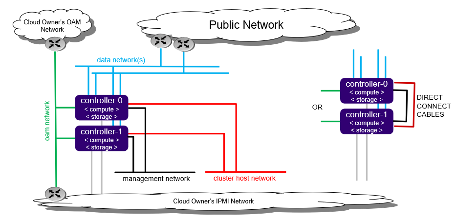
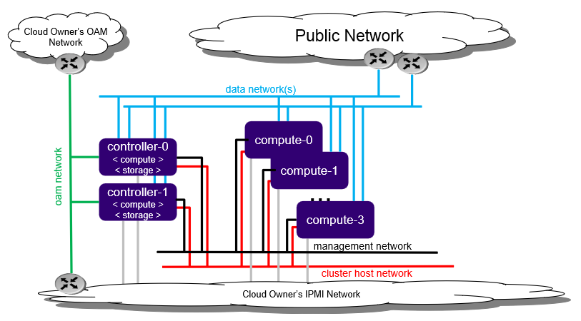

======================
All-in-one duplex R2.0
======================

.. contents::
   :local:
   :depth: 1

------------
Introduction
------------

The All-in-one duplex (AIO-DX) configuration option comes in standard
and extended options.

**************************
All-in-one duplex standard
**************************

The All-in-one duplex (AIO-DX) standard configuration option
provides all three cloud functions (controller, compute, and storage)
on two physical servers.
With these cloud functions, multiple application types can be deployed and
consolidated onto a protected pair of physical servers.

   *All-in-one duplex standard configuration*

Following are some benefits of the AIO-DX configuration:

- Consolidate legacy applications that must run standalone on a server by using
  multiple virtual machines on a single physical server.

- Consolidate legacy applications that run on different operating systems or
  different distributions of operating systems by using multiple virtual
  machines on a single pair of physical servers.

- Provide the storage backend solution using a two-node CEPH deployment across two servers.

- HA Services run on the controller function across the two physical servers in either
  Active/Active or Active/Standby mode.

- Virtual Machines are scheduled on both Compute Functions.

- During an overall server hardware fault, the following occurs:

  - All Controller HA Services go Active on the remaining healthy server.

  - All Virtual Machines are recovered on the remaining healthy server.

- Only a small amount of cloud processing and storage power is required
  with an All-in-one duplex configuration and protection against
  overall server hardware faults is required.

**************************
All-in-one duplex extended
**************************

The All-in-one duplex extended configuration option extends the capacity of the
All-in-one duplex standard configuration option by adding up to four compute
nodes to the deployment.
The extended configuration option provides a capacity growth path for
someone starting with an All-in-one duplex standard configuration option.

With this option, virtual machines can be scheduled on either of the
all-in-one controller nodes, the compute nodes, or both.

   *All-In-One Duplex Extended deployment configuration*

This configuration is limited to four compute nodes as the controller function
on the all-in-one controllers has only a portion of the processing power of the
overall server.

--------------------
Installation Options
--------------------

You can install StarlingX in the following:

-  **Bare metal**: Real deployments of StarlingX are only supported on
   physical servers.

-  **Virtual environment**: It should only be used for evaluation or
   development purposes.

Furthermore, StarlingX installed in virtual environments has a single option:

- :doc:`Libvirt/QEMU </installation_guide/latest/installation_libvirt_qemu>`

------------
Requirements
------------

**********
Bare metal
**********

Required Servers:

-  Combined server (controller + compute): 2

^^^^^^^^^^^^^^^^^^^^^
Hardware requirements
^^^^^^^^^^^^^^^^^^^^^

The recommended minimum requirements for the physical servers where
the All-in-one duplex will be deployed are:

-  Minimum processor:

   -  Typical hardware form factor:

      - Dual-CPU Intel Xeon E5 26xx family (SandyBridge) 8 cores/socket

   -  Low cost / low power hardware form factor

      - Single-CPU Intel Xeon D-15xx family, 8 cores

-  Memory: 64 GB

-  BIOS:

   -  Hyper-Threading technology: Enabled

   -  Virtualization technology: Enabled

   -  VT for directed I/O: Enabled

   -  CPU power and performance policy: Performance

   -  CPU C state control: Disabled

   -  Plug & play BMC detection: Disabled

-  Primary disk:

   -  500 GB SDD or NVMe

-  Additional disks:

   -  Zero or more 500 GB disks (min. 10K RPM)

-  Network ports

   .. note:: All-in-one duplex configuration requires one or more data ports.
             This configuration does not require a management port.

   -  Management: 10GE

   -  OAM: 10GE

   -  Data: n x 10GE

^^^^^^^^^^^^^^^^^^^^^^^^
NVMe drive as boot drive
^^^^^^^^^^^^^^^^^^^^^^^^

To use a Non-Volatile Memory Express (NVMe) drive as the boot drive for any of
your nodes, you must configure your host and adjust kernel parameters during
installation:

- Configure the host to be in UEFI mode.

- Edit the kernel boot parameter.
  After you are presented with the StarlingX ISO boot options and after
  you have selected the preferred installation option
  (e.g. Standard Configuration / All-in-One Controller Configuration), press the
  TAB key to edit the kernel boot parameters.
  Modify the **boot_device** and **rootfs_device** from the default **sda** so
  that it is the correct device name for the NVMe drive (e.g. "nvme0n1").

  ::

     vmlinuz rootwait console=tty0 inst.text inst.stage2=hd:LABEL=oe_iso_boot
     inst.ks=hd:LABEL=oe_iso_boot:/smallsystem_ks.cfg boot_device=nvme0n1
     rootfs_device=nvme0n1 biosdevname=0 usbcore.autosuspend=-1 inst.gpt
     security_profile=standard user_namespace.enable=1 initrd=initrd.img

*******************
Virtual environment
*******************

The recommended minimum requirements for the workstation, hosting the
virtual machine(s) where StarlingX will be deployed, include the following:

^^^^^^^^^^^^^^^^^^^^^
Hardware requirements
^^^^^^^^^^^^^^^^^^^^^

A workstation computer with:

-  Processor: x86_64 only supported architecture with BIOS enabled
   hardware virtualization extensions

-  Cores: 8 (4 with careful monitoring of cpu load)

-  Memory: At least 32 GB RAM

-  Hard Disk: 500 GB HDD

-  Network: Two network adapters with active Internet connection

^^^^^^^^^^^^^^^^^^^^^
Software requirements
^^^^^^^^^^^^^^^^^^^^^

A workstation computer with:

-  Operating System: Newly installed Ubuntu 16.04 LTS 64-bit

-  If applicable, configured proxy settings

-  Git

-  KVM/VirtManager

-  Libvirt library

-  QEMU full-system emulation binaries

-  tools project

-  StarlingX ISO image

--------------------------
Setting up the workstation
--------------------------

This section describes how to set up the workstation computer that
hosts the virtual machine(s) where StarlingX will be deployed.

******************************
Updating your operating system
******************************

Before building an image, ensure your Linux distribution is current.
You must first update the local database list of available packages:

::

   $ sudo apt-get update

************************
Installing tools project
************************

Clone the tools project.
Typically, you clone this project while in your home directory:

::

   $ cd $HOME
   $ git clone https://git.starlingx.io/tools

****************************************
Installing requirements and dependencies
****************************************

Navigate to the tools installation libvirt directory:

::

   $ cd $HOME/tools/deployment/libvirt/

Install the required packages:

::

   $ bash install_packages.sh

******************
Disabling firewall
******************

Unload the firewall and disable it during boot:

::

   $ sudo ufw disable
   Firewall stopped and disabled on system startup
   $ sudo ufw status
   Status: inactive

**************************
Prepare the virtual server
**************************

Run the libvirt QEMU setup scripts to set up
virtualized OAM and management networks:

::

   $ bash setup_network.sh

Building XML for definition of virtual servers:

::

   $ bash setup_configuration.sh -c duplex -i <starlingx-iso-image>

The default XML server definitions that are created by the previous script
are:

- duplex-controller-0
- duplex-controller-1

*************************
Power up a virtual server
*************************

To power up the virtual server, use the following command form:

::

    $ sudo virsh start <server-xml-name>

Following is an example where <server-xml-name> is "duplex-controller-0":

::

    $ sudo virsh start duplex-controller-0

*******************************
Access a virtual server console
*******************************

The XML for virtual servers in the tools repo, deployment/libvirt,
provides both graphical and text consoles.
Access the graphical console in virt-manager by right-clicking on the
domain (i.e. the server) and selecting "Open".

Access the textual console with the command "virsh console $DOMAIN",
where DOMAIN is the name of the server shown in virsh.

When booting the controller-0 for the first time, both the serial and
graphical consoles present the initial configuration menu for the
cluster.
you can select the serial or graphical console for controller-0.
However, for the remaining nodes regardless of the option you selected,
you can only use serial.

Open the graphic console on all servers before powering them on to
observe the boot device selection and PXI boot progress.
Run "virsh console $DOMAIN" command promptly after the boot process
completes in order to see the initial boot sequence, which follows
the boot device selection.
Once the boot process completes, you only have a few seconds to
run the command.

-------------------------------------------
Getting or building the StarlingX ISO image
-------------------------------------------

The following sub-sections describe how to get or build the
StarlingX ISO image.

*********************
Building the Software
*********************

Follow the standard build process in the `StarlingX Developer
Guide <https://docs.starlingx.io/developer_guide/index.html>`__.

Alternatively, you can use a pre-built ISO, which includes all
required packages provided by the `StarlingX CENGN
mirror <http://mirror.starlingx.cengn.ca/mirror/starlingx/>`__.

**********
Bare metal
**********

For bare metal, you must have a bootable USB flash drive
that contains the StarlingX ISO image.

*******************
Virtual environment
*******************

For the virtual environment, copy the StarlingX ISO Image
to the tools deployment libvirt project directory:

::

   $ cp <starlingx-iso-image> $HOME/tools/deployment/libvirt/

-----------------------
Setting up Controller-0
-----------------------

Installing controller-0 involves initializing a host with software
and then applying a bootstrap configuration from the command line.
The configured bootstrapped host becomes controller-0.

Following is the general procedure:

1. Have a USB device that contains a bootable StarlingX ISO.

2. Be sure that USB device is plugged into a bootable USB slot on the server that
   will be the Controller-0.

3. Power on the server.

4. Configure the controller by running the Ansible bootstrap playbook.

*************************
Initializing controller-0
*************************

This section describes how to initialize StarlingX in host controller-0.

.. note:: Except where noted, you must execute all the commands from a console on
          the host.

Follow this procedure to initialize the controller:

1. Be sure your USB device that has the StarlingX ISO is plugged into
   a bootable USB port on the host your are configuring as controller-0.

2. Power on the host.

3. Wait for the console to show the StarlingX ISO booting options:

   - **All-in-one Controller Configuration:**

     For this option, select "All-in-one Controller Configuration" for the
     the type of installation from the installer welcome screen.

   - **Graphical Console:**

     Select "Graphical Console" as the console to use during
     installation.

   - **Standard Security Boot Profile:**

     Select "Standard Security Boot Profile" as the Security Profile.

4. Monitor the initialization. When it completes, a reboot is initiated
   on the controller-0 host and briefly displays a GNU GRUB screen after
   which the reboot automatically continues into the StarlingX image.

5. Log into controller-0 as user "wrsroot" and use "wrsroot" as the password.
   The first time you log in as "wrsroot", you are required to change your
   password:

   ::

      Changing password for wrsroot.
      (current) UNIX Password: wrsroot

6. Enter a new password for the "wrsroot" account and confirm the change.
   Once you change the password, controller-0 is initialized with StarlingX
   and is ready for configuration.

************************
Configuring controller-0
************************

This section describes how to configure controller-0 for local
bootstrap in VirtualBox by running the Ansible bootstrap playbook.

.. note::  - For ease of use in development and controlled test environments,
             you can provide passwords by specifying from the command line
             an override file that is an unencrypted text file.

           - The wrsroot password is used for SSH authentication.

           - In production environments, you should store sensitive
             information in the Ansible vault secret file and use
             SSH keys rather than passwords for authentication.

^^^^^^^^^^^^^^^^^^^^^^^^^^^^^^^^^^^^^^^^^^^^^
Location of the controller bootstrap playbook
^^^^^^^^^^^^^^^^^^^^^^^^^^^^^^^^^^^^^^^^^^^^^

All StarlingX playbooks are located under the directory
/usr/share/ansible/stx-ansible/playbooks.
Consequently, the controller bootstrap playbook is located
at: /usr/share/ansible/stx-ansible/playbooks/bootstrap/.

^^^^^^^^^^^^^^^^^^^^^^^^^^^^^^^^^^^
Default bootstrap playbook settings
^^^^^^^^^^^^^^^^^^^^^^^^^^^^^^^^^^^

The default inventory file, which resides in Ansible configuration directory
(i.e. /etc/ansible/hosts), contains one single host - the localhost.
You can override this file using a custom hosts file and the "-i option".
Doing so makes the file available for remote play through the Ansible
playbook.

The /usr/share/ansible/stx-ansible/playbooks/bootstrap/host_vars/default.yml
file specifies the default configuration parameters.
You can overwrite these parameters in two ways:

- Using either the --extra-vars or -e options at the command line.

- Using an override file.

Using the override file is the preferred option when multiple
parameters exist that need to be overwritten.

By default Ansible looks for and imports user override files
in the sysadmin home directory ($HOME).
If you want to place these files in a different location, you
must specify the location by using the -e option
(e.g. -e "override_files_dir=<custom-override-dir>").

The override file must conform to the following naming convention:
::

   <inventory_hostname>.yml

An example filename is localhost.yml.

^^^^^^^^^^^^^^
Password types
^^^^^^^^^^^^^^

For local bootstrap, two types of passwords exist:

- **ansible_become_pass**: a Sudo password to run tasks that require
  escalated privileges.
  Most bootstrap tasks must be run as root.
  Since the playbook is run by wrsroot user, this is the wrsroot password.

- **admin_password**: A password used in when system commands, such as
  a Horizon login, are executed.

Additionally, if an automatic SSH login that uses an SSH key has not been
set up between the Ansible control node and the target controller,
another password is required:

- **ansible_ssh_pass**: The password used to log into the target host(s).

For all the passwords mentioned in this section, the defaults are
set to "St8rlingX*".

^^^^^^^^^^^^^^^^^^^^
Running the playbook
^^^^^^^^^^^^^^^^^^^^

To run the playbook, you need to first set up external connectivity.
This section describes how to set up external connectivity and
then provides two examples showing how to bootstrap controller-0 by
running the playbook.

~~~~~~~~~~~~~~~~~~~~~~~~~~~~~~~~
Setting up external connectivity
~~~~~~~~~~~~~~~~~~~~~~~~~~~~~~~~

Use these commands to set up external connectivity:

::

   sudo su
   export CONTROLLER0_OAM_CIDR=10.10.10.3/24
   export DEFAULT_OAM_GATEWAY=10.10.10.1
   ifconfig enp0s3 $CONTROLLER0_OAM_CIDR
   ip route add default via $DEFAULT_OAM_GATEWAY dev enp0s3

~~~~~~~~~~~~~~~~~~~~~~
Bootstrap controller-0
~~~~~~~~~~~~~~~~~~~~~~

Following is an example that runs the local playbook using all the defaults,
including passwords being "St8rlingX*":

::

   ansible-playbook /usr/share/ansible/stx-ansible/playbooks/bootstrap/bootstrap.yml

This next example runs the local playbook using an override file that provides
custom parameters that include admin and sysadmin passwords.
The override file is named "localhost.yml" and is located under
/home/sysadmin.
The override file has the following content:

::

   system_mode: duplex
   management_subnet: 192.168.204.0/24
   dns_servers:
    - 8.8.4.4
   external_oam_floating_ip: <custom-external-oam-floating-ip>
   admin_password: App70le*
   ansible_become_pass: App70le*

Run the bootstrap playbook:

::

   ansible-playbook /usr/share/ansible/stx-ansible/playbooks/bootstrap/bootstrap.yml

This final example bootstraps controller-0 by running
the local playbook and using a custom sysadmin and admin password
specified in the command line:

::

   ansible-playbook /usr/share/ansible/stx-ansible/playbooks/bootstrap/bootstrap.yml -e "ansible_become_pass=<custom-sysadmin-password> admin_password=<custom-admin-password>"

.. note:: Ansible does not currently support specifying playbook
          search paths.
          Consequently, you must specify the full path to the bootstrap
          playbook in the command line unless you are already in the
          bootstrap playbook directory.
          In the near future, a command alias called "bootstrap-controller"
          will be provided for ease of use.

*************************
Provisioning the platform
*************************

The following subsections describe how to provision the
server being used as controller-0.
Provisioning makes many services available.

^^^^^^^^^^^^^^^^^^^^^^^^^^^^^^^^^^^^^^^^^^^^^^^^^^^^^^^^^^^^^^^^^^^^^^^^^^^^^^^^^^^^^^^^^^^^^^^^^
Configure OAM, Management, and Cluster Interface for controller-0 (Ansible bootstrap method only)
^^^^^^^^^^^^^^^^^^^^^^^^^^^^^^^^^^^^^^^^^^^^^^^^^^^^^^^^^^^^^^^^^^^^^^^^^^^^^^^^^^^^^^^^^^^^^^^^^

Use the following commands to configure OAM, Management, and Cluster Interface
for controller-0:

::

   source /etc/platform/openrc
   OAM_IF=enp0s3
   MGMT_IF=enp0s8
   system host-if-modify controller-0 lo -c none
   system host-if-modify controller-0 $OAM_IF --networks oam -c platform
   system host-if-modify controller-0 $MGMT_IF -c platform --networks mgmt
   system host-if-modify controller-0 $MGMT_IF -c platform --networks cluster-host

^^^^^^^^^^^^^^^^^^
Set the NTP server
^^^^^^^^^^^^^^^^^^

Use the following command to configure the IP Addresses
of the remote Network Time Protocol (NTP) servers.
These servers are used for network time synchronization:

::

   source /etc/platform/openrc
   system ntp-modify ntpservers=0.pool.ntp.org,1.pool.ntp.org

^^^^^^^^^^^^^^^^^^^^^^^^^^^^^^^^^^^^^
Configure the vSwitch type (optional)
^^^^^^^^^^^^^^^^^^^^^^^^^^^^^^^^^^^^^

This section describes how to configure the Virtual Switch, which
allows network entities to connect to virtual machines over a
virtual network.

.. note:: As of March 29th 2019, Open vSwitch (OVS) running in a container
          is deployed by default.

To deploy OVS-DPDK (OVS with the Data Plane Development Kit, which
is supported only on baremetal hardware, run the following command:

::

   system modify --vswitch_type ovs-dpdk
   # To set the vswitch type back to the default (i.e. OVS running in a container), run:
   # system modify --vswitch_type none

.. note:: - For virtual environments, only OVS running in a container is
            supported.

          - You cannot modify the vSwitch type after controller-0 is
            unlocked.

^^^^^^^^^^^^^^^^^^^^^^^^^
Configure data interfaces
^^^^^^^^^^^^^^^^^^^^^^^^^

Part of provisioning controller-0 is to configure the
data interfaces.  Use the following to configure data interfaces:

::

   DATA0IF=eth1000
   DATA1IF=eth1001
   export COMPUTE=controller-0
   PHYSNET0='physnet0'
   PHYSNET1='physnet1'
   SPL=/tmp/tmp-system-port-list
   SPIL=/tmp/tmp-system-host-if-list
   system host-port-list ${COMPUTE} --nowrap > ${SPL}
   system host-if-list -a ${COMPUTE} --nowrap > ${SPIL}
   DATA0PCIADDR=$(cat $SPL | grep $DATA0IF |awk '{print $8}')
   DATA1PCIADDR=$(cat $SPL | grep $DATA1IF |awk '{print $8}')
   DATA0PORTUUID=$(cat $SPL | grep ${DATA0PCIADDR} | awk '{print $2}')
   DATA1PORTUUID=$(cat $SPL | grep ${DATA1PCIADDR} | awk '{print $2}')
   DATA0PORTNAME=$(cat $SPL | grep ${DATA0PCIADDR} | awk '{print $4}')
   DATA1PORTNAME=$(cat  $SPL | grep ${DATA1PCIADDR} | awk '{print $4}')
   DATA0IFUUID=$(cat $SPIL | awk -v DATA0PORTNAME=$DATA0PORTNAME '($12 ~ DATA0PORTNAME) {print $2}')
   DATA1IFUUID=$(cat $SPIL | awk -v DATA1PORTNAME=$DATA1PORTNAME '($12 ~ DATA1PORTNAME) {print $2}')

   # configure the datanetworks in StarlingX, prior to referencing it in the 'system host-if-modify command'
   system datanetwork-add ${PHYSNET0} vlan
   system datanetwork-add ${PHYSNET1} vlan

   # the host-if-modify '-p' flag is deprecated in favor of  the '-d' flag for assignment of datanetworks.
   system host-if-modify -m 1500 -n data0 -d ${PHYSNET0} -c data ${COMPUTE} ${DATA0IFUUID}
   system host-if-modify -m 1500 -n data1 -d ${PHYSNET1} -c data ${COMPUTE} ${DATA1IFUUID}

^^^^^^^^^^^^^^^^^^^^^^^^^^^^^^^^^^^^^^^^^^^^^^^^^^^^^^^
Prepare the host for running the containerized services
^^^^^^^^^^^^^^^^^^^^^^^^^^^^^^^^^^^^^^^^^^^^^^^^^^^^^^^

To prepare the host for running the containerized services,
apply all the node labels for each controller and their compute
functions:

::

   system host-label-assign controller-0 openstack-control-plane=enabled
   system host-label-assign controller-0 openstack-compute-node=enabled
   system host-label-assign controller-0 openvswitch=enabled
   system host-label-assign controller-0 sriov=enabled

^^^^^^^^^^^^^^^^^^^^^^^^^^^^^^^^^^
Set up partitions for controller-0
^^^^^^^^^^^^^^^^^^^^^^^^^^^^^^^^^^

You need to create partitions on the root disk and then
wait for them to become ready.

-  34 GB for nova-local (mandatory).

-  6 GB for the cgts-vg (optional). This extends the existing cgts
   volume group. There should be sufficient space by default)

Following is an example:

::

   export COMPUTE=controller-0

   echo ">>> Getting root disk info"
   ROOT_DISK=$(system host-show ${COMPUTE} | grep rootfs | awk '{print $4}')
   ROOT_DISK_UUID=$(system host-disk-list ${COMPUTE} --nowrap | grep ${ROOT_DISK} | awk '{print $2}')
   echo "Root disk: $ROOT_DISK, UUID: $ROOT_DISK_UUID"

   echo ">>>> Configuring nova-local"
   NOVA_SIZE=34
   NOVA_PARTITION=$(system host-disk-partition-add -t lvm_phys_vol ${COMPUTE} ${ROOT_DISK_UUID} ${NOVA_SIZE})
   NOVA_PARTITION_UUID=$(echo ${NOVA_PARTITION} | grep -ow "| uuid | [a-z0-9\-]* |" | awk '{print $4}')
   system host-lvg-add ${COMPUTE} nova-local
   system host-pv-add ${COMPUTE} nova-local ${NOVA_PARTITION_UUID}
   sleep 2

   echo ">>> Wait for partition $NOVA_PARTITION_UUID to be ready."
   while true; do system host-disk-partition-list $COMPUTE --nowrap | grep $NOVA_PARTITION_UUID | grep Ready; if [ $? -eq 0 ]; then break; fi; sleep 1; done

   echo ">>>> Extending cgts-vg"
   PARTITION_SIZE=6
   CGTS_PARTITION=$(system host-disk-partition-add -t lvm_phys_vol ${COMPUTE} ${ROOT_DISK_UUID} ${PARTITION_SIZE})
   CGTS_PARTITION_UUID=$(echo ${CGTS_PARTITION} | grep -ow "| uuid | [a-z0-9\-]* |" | awk '{print $4}')

   echo ">>> Wait for partition $CGTS_PARTITION_UUID to be ready"
   while true; do system host-disk-partition-list $COMPUTE --nowrap | grep $CGTS_PARTITION_UUID | grep Ready; if [ $? -eq 0 ]; then break; fi; sleep 1; done

   system host-pv-add ${COMPUTE} cgts-vg ${CGTS_PARTITION_UUID}
   sleep 2

   echo ">>> Waiting for cgts-vg to be ready"
   while true; do system host-pv-list ${COMPUTE} | grep cgts-vg | grep adding; if [ $? -ne 0 ]; then break; fi; sleep 1; done

   system host-pv-list ${COMPUTE}

^^^^^^^^^^^^^^^^^^^^^^^^^^^^^^^
Configure Ceph for Controller-0
^^^^^^^^^^^^^^^^^^^^^^^^^^^^^^^

Use the following to configure Ceph for Controller-0:

::

   echo ">>> Enable primary Ceph backend"
   system storage-backend-add ceph --confirmed

   echo ">>> Wait for primary ceph backend to be configured"
   echo ">>> This step really takes a long time"
   while [ $(system storage-backend-list | awk '/ceph-store/{print $8}') != 'configured' ]; do echo 'Waiting for ceph..'; sleep 5; done

   echo ">>> Ceph health"
   ceph -s

   echo ">>> Add OSDs to primary tier"

   system host-disk-list controller-0
   system host-disk-list controller-0 | awk '/\/dev\/sdb/{print $2}' | xargs -i system host-stor-add controller-0 {}
   system host-stor-list controller-0

   echo ">>> ceph osd tree"
   ceph osd tree

^^^^^^^^^^^^^^^^^^^^^
Unlock the controller
^^^^^^^^^^^^^^^^^^^^^

You must unlock controller-0 so that you can use it to install
controller-1. Use the system host-unlock command:

::

   system host-unlock controller-0

^^^^^^^^^^^^^^^^^^^^^^^^^^^^^^^
Test for Ceph cluster operation
^^^^^^^^^^^^^^^^^^^^^^^^^^^^^^^

Now, test that the ceph cluster is operational:

::

   ceph -s
       cluster 6cb8fd30-622a-4a15-a039-b9e945628133
        health HEALTH_OK
        monmap e1: 1 mons at {controller-0=127.168.204.3:6789/0}
               election epoch 4, quorum 0 controller-0
        osdmap e32: 1 osds: 1 up, 1 in
               flags sortbitwise,require_jewel_osds
         pgmap v35: 1728 pgs, 6 pools, 0 bytes data, 0 objects
               39180 kB used, 50112 MB / 50150 MB avail
                   1728 active+clean

^^^^^^^^^^^^^^^^^^^^^^^^^^^^^^
Boot the second AIO controller
^^^^^^^^^^^^^^^^^^^^^^^^^^^^^^

To boot the second VM (i.e. the VM without an ISO media mounted),
press the F12 key immediately.
Select the "lan" for the alternative boot option to force a
network boot.

As the VM boots, a message appears on the controller-1 console
instructing you to configure the personality of the node.
Do so from a controller-0 shell using the following commands:

::

   source /etc/platform/openrc
   system host-list

The results indicate that ID 2 is the un-provisioned controller:

::

   +----+--------------+-------------+----------------+-------------+--------------+
   | id | hostname     | personality | administrative | operational | availability |
   +----+--------------+-------------+----------------+-------------+--------------+
   | 1  | controller-0 | controller  | unlocked       | enabled     | available    |
   | 2  | None         | None        | locked         | disabled    | offline      |
   +----+--------------+-------------+----------------+-------------+--------------+

::

   system host-update 2 personality=controller

The packages install and the controller reboots.

--------------------------------------
Provisioning the second AIO controller
--------------------------------------

The following sub-sections show how to provision controller-1.

******************************************
Configure Data Interfaces for Controller-1
******************************************

Configure the data interfaces as follows:

::

   source /etc/platform/openrc
   export COMPUTE='controller-1'
   PHYSNET0='physnet0'
   PHYSNET1='physnet1'
   OAM_IF=enp0s3
   DATA0IF=eth1000
   DATA1IF=eth1001
   NOWRAP="--nowrap"

   echo ">>> Configuring OAM Network"
   system host-if-modify -n oam0 -c platform --networks oam ${COMPUTE} $(system host-if-list -a $COMPUTE  $NOWRAP | awk -v OAM_IF=$OAM_IF '{if ($4 == OAM_IF) { print $2;}}')

   echo ">>> Configuring Cluster Host Interface"
   system host-if-modify $COMPUTE mgmt0 --networks cluster-host

   echo ">>> Configuring Data Networks"
   SPL=/tmp/tmp-system-port-list
   SPIL=/tmp/tmp-system-host-if-list
   system host-port-list ${COMPUTE} $NOWRAP > ${SPL}
   system host-if-list -a ${COMPUTE} $NOWRAP > ${SPIL}
   DATA0PCIADDR=$(cat $SPL | grep $DATA0IF |awk '{print $8}')
   DATA1PCIADDR=$(cat $SPL | grep $DATA1IF |awk '{print $8}')
   DATA0PORTUUID=$(cat $SPL | grep ${DATA0PCIADDR} | awk '{print $2}')
   DATA1PORTUUID=$(cat $SPL | grep ${DATA1PCIADDR} | awk '{print $2}')
   DATA0PORTNAME=$(cat $SPL | grep ${DATA0PCIADDR} | awk '{print $4}')
   DATA1PORTNAME=$(cat  $SPL | grep ${DATA1PCIADDR} | awk '{print $4}')
   DATA0IFUUID=$(cat $SPIL | awk -v DATA0PORTNAME=$DATA0PORTNAME '($12 ~ DATA0PORTNAME) {print $2}')
   DATA1IFUUID=$(cat $SPIL | awk -v DATA1PORTNAME=$DATA1PORTNAME '($12 ~ DATA1PORTNAME) {print $2}')
   system host-if-modify -m 1500 -n data0 -p ${PHYSNET0} -c data ${COMPUTE} ${DATA0IFUUID}
   system host-if-modify -m 1500 -n data1 -p ${PHYSNET1} -c data ${COMPUTE} ${DATA1IFUUID}

***********************************************************
Prepare controller-1 for running the containerized services
***********************************************************

Use the following to prepare controller-1 for running the
containerized services:

::

   source /etc/platform/openrc

   system host-label-assign controller-1 openstack-control-plane=enabled
   system host-label-assign controller-1 openstack-compute-node=enabled
   system host-label-assign controller-1 openvswitch=enabled
   system host-label-assign controller-1 sriov=enabled

*********************************
Setup Partitions for Controller-1
*********************************

You need to create partitions on the root disk and then
wait for them to become ready.

-  34 GB for nova-local (mandatory).

-  6 GB for the cgts-vg (optional). This extends the existing cgts
   volume group. There should be sufficient space by default)

::

   source /etc/platform/openrc
   export COMPUTE=controller-1

   echo ">>> Getting root disk info"
   ROOT_DISK=$(system host-show ${COMPUTE} | grep rootfs | awk '{print $4}')
   ROOT_DISK_UUID=$(system host-disk-list ${COMPUTE} --nowrap | grep ${ROOT_DISK} | awk '{print $2}')
   echo "Root disk: $ROOT_DISK, UUID: $ROOT_DISK_UUID"

   echo ">>>> Configuring nova-local"
   NOVA_SIZE=34
   NOVA_PARTITION=$(system host-disk-partition-add -t lvm_phys_vol ${COMPUTE} ${ROOT_DISK_UUID} ${NOVA_SIZE})
   NOVA_PARTITION_UUID=$(echo ${NOVA_PARTITION} | grep -ow "| uuid | [a-z0-9\-]* |" | awk '{print $4}')
   system host-lvg-add ${COMPUTE} nova-local
   system host-pv-add ${COMPUTE} nova-local ${NOVA_PARTITION_UUID}

   echo ">>>> Extending cgts-vg"
   PARTITION_SIZE=6
   CGTS_PARTITION=$(system host-disk-partition-add -t lvm_phys_vol ${COMPUTE} ${ROOT_DISK_UUID} ${PARTITION_SIZE})
   CGTS_PARTITION_UUID=$(echo ${CGTS_PARTITION} | grep -ow "| uuid | [a-z0-9\-]* |" | awk '{print $4}')
   system host-pv-add ${COMPUTE} cgts-vg ${CGTS_PARTITION_UUID}

*******************************
Configure Ceph for Controller-1
*******************************

Use the following to configure Ceph for Controller-1:

::

   source /etc/platform/openrc

   echo ">>> Get disk & tier info"
   HOST="controller-1"
   DISKS=$(system host-disk-list ${HOST})
   TIERS=$(system storage-tier-list ceph_cluster)
   echo "Disks:"
   echo "$DISKS"
   echo "Tiers:"
   echo "$TIERS"

   echo ">>> Add OSDs to primary tier"
   system host-stor-add ${HOST} $(echo "$DISKS" | grep /dev/sdb | awk '{print $2}') --tier-uuid $(echo "$TIERS" | grep storage | awk '{print $2}')

   echo ">>> system host-stor-list ${HOST}"
   system host-stor-list ${HOST}
   echo ">>> ceph osd tree"
   ceph osd tree

*******************
Unlock controller-1
*******************

You must unlock controller-1 using the following commands:

::

   source /etc/platform/openrc
   system host-unlock controller-1

Wait for controller-1 to reboot before proceeding.

-------------------------------------------------------------------------
Using the system CLI to bring up and take down the containerized services
-------------------------------------------------------------------------

This section describes how to bring up and take down the containerized services.

**********************************************
Generate the stx-openstack application tarball
**********************************************

Each build on the CENGN mirror generates the `stx-openstack application
tarballs <http://mirror.starlingx.cengn.ca/mirror/starlingx/master/centos/latest_green_build/outputs/helm-charts/>`__.

Alternatively, in a development environment, you can run the following command
to construct the application tarballs:

::

   $MY_REPO_ROOT_DIR/cgcs-root/build-tools/build-helm-charts.sh

You can find the resulting tarballs under
$MY_WORKSPACE/std/build-helm/stx.

If the build-helm-charts.sh command is unable to find the charts, run
"build-pkgs" to build the chart rpms and then re-run the build-helm-charts.sh
command.

********************************
Stage application for deployment
********************************

Transfer the helm-charts-manifest.tgz application tarball onto your
active controller.

Once the tarball is on the controller, use the system CLI to upload
the application tarball:

::

   system application-upload stx-openstack helm-charts-manifest.tgz
   system application-list

*****************
Bring Up Services
*****************

Use the system CLI to apply the application:

::

   system application-apply stx-openstack

You can monitor the progress by watching the system application-list:

::

   watch -n 5 system application-list

Alternatively, you can monitor progress by tailing the Armada execution log:

::

   sudo docker exec armada_service tail -f stx-openstack-apply.log

----------------------------
Verify the cluster endpoints
----------------------------

You can verify the cluster endpoints using the following
command from a new shell as a root user:

::

   openstack endpoint list

--------------------------------
Provider/tenant networking setup
--------------------------------

This section describes how to set up provider/tenant networking.

.. note:: The remaining networking steps are done using this root user.

************************************************
Providernetworking setup: Network Segment Ranges
************************************************

Use the following to create the network segment ranges:

::

   ADMINID=`openstack project list | grep admin | awk '{print $2}'`
   PHYSNET0='physnet0'
   PHYSNET1='physnet1'

   openstack network segment range create ${PHYSNET0}-a --network-type vlan --physical-network ${PHYSNET0}  --minimum 400 --maximum 499 --private --project ${ADMINID}

   openstack network segment range create  ${PHYSNET0}-b --network-type vlan  --physical-network ${PHYSNET0}  --minimum 10 --maximum 10 --shared

   openstack network segment range create ${PHYSNET1}-a --network-type vlan  --physical-network  ${PHYSNET1} --minimum 500 --maximum 599  --private --project ${ADMINID}

***********************
Tenant Networking setup
***********************

Setup tenant networking using the following:

::

   ADMINID=`openstack project list | grep admin | awk '{print $2}'`
   PHYSNET0='physnet0'
   PHYSNET1='physnet1'
   PUBLICNET='public-net0'
   PRIVATENET='private-net0'
   INTERNALNET='internal-net0'
   EXTERNALNET='external-net0'
   PUBLICSUBNET='public-subnet0'
   PRIVATESUBNET='private-subnet0'
   INTERNALSUBNET='internal-subnet0'
   EXTERNALSUBNET='external-subnet0'
   PUBLICROUTER='public-router0'
   PRIVATEROUTER='private-router0'

   neutron net-create --tenant-id ${ADMINID} --provider:network_type=vlan --provider:physical_network=${PHYSNET0} --provider:segmentation_id=10 --router:external ${EXTERNALNET}
   neutron net-create --tenant-id ${ADMINID} --provider:network_type=vlan --provider:physical_network=${PHYSNET0} --provider:segmentation_id=400 ${PUBLICNET}
   neutron net-create --tenant-id ${ADMINID} --provider:network_type=vlan --provider:physical_network=${PHYSNET1} --provider:segmentation_id=500 ${PRIVATENET}
   neutron net-create --tenant-id ${ADMINID} ${INTERNALNET}
   PUBLICNETID=`neutron net-list | grep ${PUBLICNET} | awk '{print $2}'`
   PRIVATENETID=`neutron net-list | grep ${PRIVATENET} | awk '{print $2}'`
   INTERNALNETID=`neutron net-list | grep ${INTERNALNET} | awk '{print $2}'`
   EXTERNALNETID=`neutron net-list | grep ${EXTERNALNET} | awk '{print $2}'`
   neutron subnet-create --tenant-id ${ADMINID} --name ${PUBLICSUBNET} ${PUBLICNET} 192.168.101.0/24
   neutron subnet-create --tenant-id ${ADMINID} --name ${PRIVATESUBNET} ${PRIVATENET} 192.168.201.0/24
   neutron subnet-create --tenant-id ${ADMINID} --name ${INTERNALSUBNET} --no-gateway  ${INTERNALNET} 10.10.0.0/24
   neutron subnet-create --tenant-id ${ADMINID} --name ${EXTERNALSUBNET} --gateway 192.168.1.1 --disable-dhcp ${EXTERNALNET} 192.168.1.0/24
   neutron router-create ${PUBLICROUTER}
   neutron router-create ${PRIVATEROUTER}
   PRIVATEROUTERID=`neutron router-list | grep ${PRIVATEROUTER} | awk '{print $2}'`
   PUBLICROUTERID=`neutron router-list | grep ${PUBLICROUTER} | awk '{print $2}'`
   neutron router-gateway-set --disable-snat ${PUBLICROUTERID} ${EXTERNALNETID}
   neutron router-gateway-set --disable-snat ${PRIVATEROUTERID} ${EXTERNALNETID}
   neutron router-interface-add ${PUBLICROUTER} ${PUBLICSUBNET}
   neutron router-interface-add ${PRIVATEROUTER} ${PRIVATESUBNET}

-----------------------------
Additional Setup Instructions
-----------------------------

This section provides additional commands as a reference.

*******************
Bring Down Services
*******************

Use the system CLI to uninstall the application.

::

   system application-remove stx-openstack
   system application-list

***************
Delete Services
***************

Use the system CLI to delete the application definition.

::

   system application-delete stx-openstack
   system application-list

--------------
Horizon access
--------------

This section describes Horizon access.

::

   # After successful armada manifest is applied, the following should be seen:

   kubectl get services -n openstack | grep horizon
   horizon                       ClusterIP   10.104.34.245    <none>        80/TCP,443/TCP                 13h
   horizon-int                   NodePort    10.101.103.238   <none>        80:31000/TCP                   13h

   The platform horizon UI is available at http://<external OAM IP>

    $ curl -L http://10.10.10.3:8080 -so - | egrep '(PlugIn|<title>)'
       <title>Login - StarlingX</title>
       global.horizonPlugInModules = ['horizon.dashboard.project', 'horizon.dashboard.container-infra', 'horizon.dashboard.dc_admin', 'horizon.dashboard.identity', 'horizon.app.murano'];

   The containerized horizon UI is available at http://<external OAM IP>:31000

   $ curl -L http://10.10.10.3:31000 -so - | egrep '(PlugIn|<title>)'
       <title>Login - StarlingX</title>
       global.horizonPlugInModules = ['horizon.dashboard.project', 'horizon.dashboard.identity'];

--------------------------------
Known Issues and Troubleshooting
--------------------------------

No known issues or troubleshooting procedures exist.

---------------------------------------
Deployment and installation terminology
---------------------------------------

Following are terms used when describing the AIO-SX deployment and installation.

.. include:: ../deployment_terminology.rst
   :start-after: incl-simplex-deployment-terminology:
   :end-before: incl-simplex-deployment-terminology-end:

.. include:: ../deployment_terminology.rst
   :start-after: incl-standard-controller-deployment-terminology:
   :end-before: incl-standard-controller-deployment-terminology-end:

.. include:: ../deployment_terminology.rst
   :start-after: incl-common-deployment-terminology:
   :end-before: incl-common-deployment-terminology-end:

