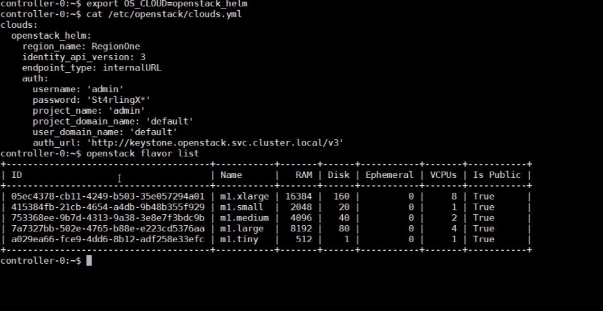
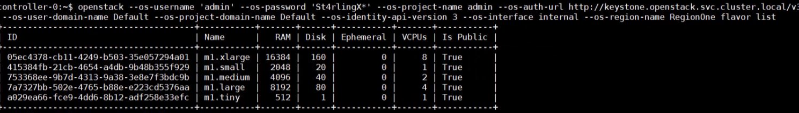

==========================
Access StarlingX OpenStack
==========================

Use local/remote CLIs, GUIs and/or REST APIs to access and manage StarlingX
OpenStack and hosted virtualized applications.

.. contents::
   :local:
   :depth: 1

------------------------------
Configure helm endpoint domain
------------------------------

Containerized OpenStack services in StarlingX are deployed behind an ingress
controller (nginx) that listens on either port 80 (HTTP) or port 443 (HTTPS).
The ingress controller routes packets to the specific OpenStack service, such as
the Cinder service, or the Neutron service, by parsing the FQDN in the packet.
For example, `neutron.openstack.svc.cluster.local` is for the Neutron service,
`cinder‐api.openstack.svc.cluster.local` is for the Cinder service.

This routing requires that access to OpenStack REST APIs must be via a FQDN
or by using a remote OpenStack CLI that uses the REST APIs. You cannot access
OpenStack REST APIs using an IP address.

FQDNs (such as `cinder‐api.openstack.svc.cluster.local`) must be in a DNS server
that is publicly accessible.

.. note::

   There is a way to wild‐card a set of FQDNs to the same IP address in a DNS
   server configuration so that you don’t need to update the DNS server every
   time an OpenStack service is added. Check your particular DNS server for
   details on how to wild-card a set of FQDNs.

In a “real” deployment, that is, not a lab scenario, you can not use the default
`openstack.svc.cluster.local` domain name externally. You must set a unique
domain name for your StarlingX system. StarlingX provides the
:command:`system service‐parameter-add` command to configure and set the
OpenStack domain name:

::

  system service-parameter-add openstack helm endpoint_domain=<domain_name>

`<domain_name>` should be a fully qualified domain name that you own, such that
you can configure the DNS Server that owns `<domain_name>` with the OpenStack
service names underneath the domain.

For example:
::

  system service-parameter-add openstack helm endpoint_domain=my-starlingx-domain.my-company.com
  system application-apply stx-openstack

This command updates the helm charts of all OpenStack services and restarts them.
For example it would change `cinder‐api.openstack.svc.cluster.local` to
`cinder‐api.my-starlingx-domain.my-company.com`, and so on for all OpenStack
services.

.. note::

   This command also changes the containerized OpenStack Horizon to listen on
   `horizon.my-starlingx-domain.my-company.com:80` instead of the initial
   `<oam‐floating‐ip>:31000`.

You must configure `{ ‘*.my-starlingx-domain.my-company.com’:  -->  oam‐floating‐ip‐address }`
in the external DNS server that owns `my-company.com`.

---------
Local CLI
---------

Access OpenStack using the local CLI with one of the following methods.

**Method 1**

You can use this method on either controller, active or standby.

#. Log in to the desired controller via the console or SSH with a
   sysadmin/<sysadmin-password>.

   **Do not** use ``source /etc/platform/openrc``.

#. Set the CLI context to the StarlingX OpenStack Cloud Application and set up
   OpenStack admin credentials:

   ::

    sudo su -
    mkdir -p /etc/openstack
    tee /etc/openstack/clouds.yaml << EOF
    clouds:
      openstack_helm:
        region_name: RegionOne
        identity_api_version: 3
        endpoint_type: internalURL
        auth:
          username: 'admin'
          password: '<sysadmin-password>'
          project_name: 'admin'
          project_domain_name: 'default'
          user_domain_name: 'default'
          auth_url: 'http://keystone.openstack.svc.cluster.local/v3'
    EOF
    exit

    export OS_CLOUD=openstack_helm

**Method 2**

Use this method to access StarlingX Kubernetes commands and StarlingX OpenStack
commands in the same shell. You can only use this method on the active
controller.

#.  Log in to the active controller via the console or SSH with a
    sysadmin/<sysadmin-password>.

#.  Set the CLI context to the StarlingX OpenStack Cloud Application and set up
    OpenStack admin credentials:

    ::

        sed '/export OS_AUTH_URL/c\export OS_AUTH_URL=http://keystone.openstack.svc.cluster.local/v3' /etc/platform/openrc > ~/openrc.os
        source ./openrc.os

    .. note::

        To switch between StarlingX Kubernetes/Platform credentials and StarlingX
        OpenStack credentials, use ``source /etc/platform/openrc`` or
        ``source ./openrc.os`` respectively.

**********************
OpenStack CLI commands
**********************

Access OpenStack CLI commands for the StarlingX OpenStack cloud application
using the :command:`openstack` command. For example:

::

        controller-0:~$ export OS_CLOUD=openstack_helm
        controller-0:~$ openstack flavor list
        controller-0:~$ openstack image list

.. note::

    If you are using Method 2 described above, use these commands:

    ::

        controller-0:~$ source ./openrc.os
        controller-0:~$ openstack flavor list
        controller-0:~$ openstack image list

The image below shows a typical successful run.

   *Figure 1: StarlingX OpenStack Flavorlist*

   *Figure 2: StarlingX OpenStack Commands*

----------
Remote CLI
----------

Documentation coming soon.

---
GUI
---

Access the StarlingX containerized OpenStack Horizon GUI in your browser at the
following address:

::

    http://<oam-floating-ip-address>:31000

Log in to the Containerized OpenStack Horizon GUI with an admin/<sysadmin-password>.

---------
REST APIs
---------

This section provides an overview of accessing REST APIs with examples of
`curl`-based REST API commands.

****************
Public endpoints
****************

Use the `Local CLI`_ to display OpenStack public REST API endpoints. For example:

::

  openstack endpoint list

The public endpoints will look like:

* `\http://keystone.openstack.svc.cluster.local:80/v3`
* `\http://nova.openstack.svc.cluster.local:80/v2.1/%(tenant_id)s`
* `\http://neutron.openstack.svc.cluster.local:80/`
* `etc.`

If you have set a unique domain name, then the public endpoints will look like:

* `\http://keystone.my-starlingx-domain.my-company.com:80/v3`
* `\http://nova.my-starlingx-domain.my-company.com:80/v2.1/%(tenant_id)s`
* `\http://neutron.my-starlingx-domain.my-company.com:80/`
* `etc.`

Documentation for the OpenStack REST APIs is available at
`OpenStack API Documentation <https://docs.openstack.org/api-quick-start/index.html>`_.

***********
Get a token
***********

The following command will request the Keystone token:

::

    curl -i   -H "Content-Type: application/json"   -d
    '{ "auth": {
        "identity": {
          "methods": ["password"],
          "password": {
            "user": {
              "name": "admin",
              "domain": { "id": "default" },
              "password": "St8rlingX*"
            }
          }
        },
        "scope": {
          "project": {
            "name": "admin",
            "domain": { "id": "default" }
          }
        }
      }
    }'   http://keystone.openstack.svc.cluster.local:80/v3/auth/tokens

The token will be returned in the "X-Subject-Token" header field of the response:

::

    HTTP/1.1 201 CREATED
    Date: Wed, 02 Oct 2019 18:27:38 GMT
    Content-Type: application/json
    Content-Length: 8128
    Connection: keep-alive
    X-Subject-Token: gAAAAABdlOwafP71DXZjbyEf4gsNYA8ftso910S-RdJhg0fnqWuMGyMUhYUUJSossuUIitrvu2VXYXDNPbnaGzFveOoXxYTPlM6Fgo1aCl6wW85zzuXqT6AsxoCn95OMFhj_HHeYNPTkcyjbuW-HH_rJfhuUXt85iytZ_YAQQUfSXM7N3zAk7Pg
    Vary: X-Auth-Token
    x-openstack-request-id: req-d1bbe060-32f0-4cf1-ba1d-7b38c56b79fb

    {"token": {"is_domain": false,

        ...

You can set an environment variable to hold the token value from the response.
For example:

::

  TOKEN=gAAAAABdlOwafP71DXZjbyEf4gsNYA8ftso910S

*****************
List Nova flavors
*****************

The following command will request a list of all Nova flavors:

::

    curl -i http://nova.openstack.svc.cluster.local:80/v2.1/flavors -X GET -H "Content-Type: application/json" -H "Accept: application/json" -H "X-Auth-Token:${TOKEN}" | tail -1 | python -m json.tool

The list will be returned in the response. For example:

::

     % Total    % Received % Xferd  Average Speed   Time    Time     Time  Current
                                     Dload  Upload   Total   Spent    Left  Speed
    100  2529  100  2529    0     0  24187      0 --:--:-- --:--:-- --:--:-- 24317
    {
        "flavors": [
            {
                "id": "04cfe4e5-0d8c-49b3-ba94-54371e13ddce",
                "links": [
                    {
                        "href": "http://nova.openstack.svc.cluster.local/v2.1/flavors/04cfe4e5-0d8c-49b3-ba94-54371e13ddce",
                        "rel": "self"
                    },
                    {
                        "href": "http://nova.openstack.svc.cluster.local/flavors/04cfe4e5-0d8c-49b3-ba94-54371e13ddce",
                        "rel": "bookmark"
                    }
                ],
                "name": "m1.tiny"
            },
            {
                "id": "14c725b1-1658-48ec-90e6-05048d269e89",
                "links": [
                    {
                        "href": "http://nova.openstack.svc.cluster.local/v2.1/flavors/14c725b1-1658-48ec-90e6-05048d269e89",
                        "rel": "self"
                    },
                    {
                        "href": "http://nova.openstack.svc.cluster.local/flavors/14c725b1-1658-48ec-90e6-05048d269e89",
                        "rel": "bookmark"
                    }
                ],
                "name": "medium.dpdk"
            },
            {

                ...

