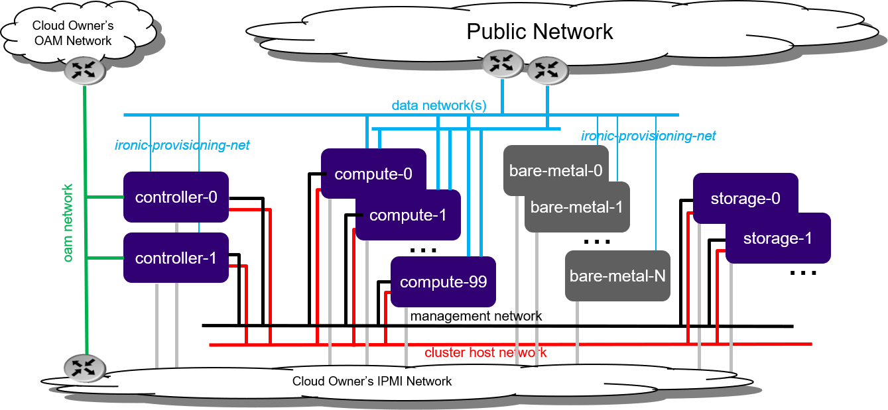

====================================
Bare metal Standard with Ironic R4.0
====================================

--------
Overview
--------

Ironic is an OpenStack project that provisions bare metal machines. For
information about the Ironic project, see
`Ironic Documentation <https://docs.openstack.org/ironic>`__.

End user applications can be deployed on bare metal servers (instead of
virtual machines) by configuring OpenStack Ironic and deploying a pool of 1 or
more bare metal servers.

.. note::

   If you are behind a corporate firewall or proxy, you need to set proxy
   settings. Refer to :doc:`/../../configuration/docker_proxy_config` for
   details.

   *Figure 1: Standard with Ironic deployment configuration*

Bare metal servers must be connected to:

* IPMI for OpenStack Ironic control
* ironic-provisioning-net tenant network via their untagged physical interface,
  which supports PXE booting

As part of configuring OpenStack Ironic in StarlingX:

* An ironic-provisioning-net tenant network must be identified as the boot
  network for bare metal nodes.
* An additional untagged physical interface must be configured on controller
  nodes and connected to the ironic-provisioning-net tenant network. The
  OpenStack Ironic tftpboot server will PXE boot the bare metal servers over
  this interface.

.. note::

   Bare metal servers are NOT:

   * Running any OpenStack / StarlingX software; they are running end user
     applications (for example, Glance Images).
   * To be connected to the internal management network.

------------
Installation
------------

StarlingX currently supports only a bare metal installation of Ironic with a
standard configuration, either:

* :doc:`controller_storage`

* :doc:`dedicated_storage`

This guide assumes that you have a standard deployment installed and configured
with 2x controllers and at least 1x compute-labeled worker node, with the
StarlingX OpenStack application (stx-openstack) applied.

.. toctree::
   :maxdepth: 1

   ironic_hardware
   ironic_install
