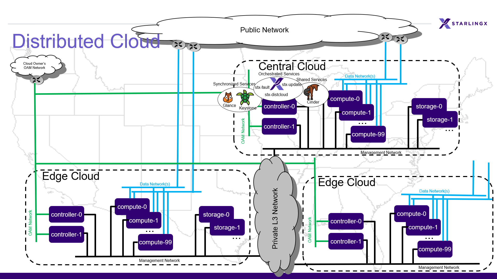

===================================
Distributed Cloud Installation R4.0
===================================

This section describes how to install and configure the StarlingX distributed
cloud deployment.

.. contents::
   :local:
   :depth: 1

--------
Overview
--------

Distributed cloud configuration supports an edge computing solution by
providing central management and orchestration for a geographically
distributed network of StarlingX Kubernetes edge systems/clusters.

The StarlingX distributed cloud implements the OpenStack Edge Computing
Groups's MVP `Edge Reference Architecture
<https://wiki.openstack.org/wiki/Edge_Computing_Group/Edge_Reference_Architectures>`_,
specifically the "Distributed Control Plane" scenario.

The StarlingX distributed cloud deployment is designed to meet the needs of
edge-based data centers with centralized orchestration and independent control
planes, and in which Network Function Cloudification (NFC) worker resources
are localized for maximum responsiveness. The architecture features:

- Centralized orchestration of edge cloud control planes.
- Full synchronized control planes at edge clouds (that is, Kubernetes cluster
  master and nodes), with greater benefits for local services, such as:

  - Reduced network latency.
  - Operational availability, even if northbound connectivity
    to the central cloud is lost.

The system supports a scalable number of StarlingX Kubernetes edge
systems/clusters, which are centrally managed and synchronized over L3
networks from a central cloud. Each edge system is also highly scalable, from
a single node StarlingX Kubernetes deployment to a full standard cloud
configuration with controller, worker and storage nodes.

------------------------------
Distributed cloud architecture
------------------------------

A distributed cloud system consists of a central cloud, and one or more
subclouds connected to the SystemController region central cloud over L3
networks, as shown in Figure 1.

- **Central cloud**

  The central cloud provides a *RegionOne* region for managing the physical
  platform of the central cloud and the *SystemController* region for managing
  and orchestrating over the subclouds.

  - **RegionOne**

    In the Horizon GUI, RegionOne is the name of the access mode, or region,
    used to manage the nodes in the central cloud.

  - **SystemController**

    In the Horizon GUI, SystemController is the name of the access mode, or
    region, used to manage the subclouds.

    You can use the SystemController to add subclouds, synchronize select
    configuration data across all subclouds and monitor subcloud operations
    and alarms. System software updates for the subclouds are also centrally
    managed and applied from the SystemController.

    DNS, NTP, and other select configuration settings are centrally managed
    at the SystemController and pushed to the subclouds in parallel to
    maintain synchronization across the distributed cloud.

- **Subclouds**

  The subclouds are StarlingX Kubernetes edge systems/clusters used to host
  containerized applications. Any type of StarlingX Kubernetes configuration,
  (including simplex, duplex, or standard with or without storage nodes), can
  be used for a subcloud. The two edge clouds shown in Figure 1 are subclouds.

  Alarms raised at the subclouds are sent to the SystemController for
  central reporting.

   *Figure 1: Distributed cloud deployment configuration*

--------------------
Network requirements
--------------------

Subclouds are connected to the SystemController through both the OAM and the
Management interfaces. Because each subcloud is on a separate L3 subnet, the
OAM, Management and PXE boot L2 networks are local to the subclouds. They are
not connected via L2 to the central cloud, they are only connected via L3
routing. The settings required to connect a subcloud to the SystemController
are specified when a subcloud is defined. A gateway router is required to
complete the L3 connections, which will provide IP routing between the
subcloud Management and OAM IP subnet and the SystemController Management and
OAM IP subnet, respectively. For more information, see the
`Install a Subcloud`_ section later in this guide.

---------------------------------------
Install and provision the central cloud
---------------------------------------

Installing the central cloud is similar to installing a standard
StarlingX Kubernetes system. The central cloud supports either an AIO-duplex
deployment configuration or a standard with dedicated storage nodes deployment
configuration.

To configure controller-0 as a distributed cloud central controller, you must
set certain system parameters during the initial bootstrapping of
controller-0. Set the system parameter *distributed_cloud_role* to
*systemcontroller* in the Ansible bootstrap override file. Also, set the
management network IP address range to exclude IP addresses reserved for
gateway routers providing routing to the subclouds' management subnets.

.. note:: Worker hosts and data networks are not used in the
          central cloud.

Procedure:

- Follow the StarlingX R4.0 installation procedures with the extra step noted below:

  - AIO-duplex:
    `Bare metal All-in-one Duplex Installation R4.0 <https://docs.starlingx.io/deploy_install_guides/r4_release/bare_metal/aio_duplex.html>`_

  - Standard with dedicated storage nodes:
    `Bare metal Standard with Dedicated Storage Installation R4.0 <https://docs.starlingx.io/deploy_install_guides/r4_release/bare_metal/dedicated_storage.html>`_

- For the step "Bootstrap system on controller-0", add the following
  parameters to the Ansible bootstrap override file.

  .. code:: yaml

     distributed_cloud_role: systemcontroller
     management_start_address: <X.Y.Z.2>
     management_end_address: <X.Y.Z.50>

------------------
Install a subcloud
------------------

At the subcloud location:

1. Physically install and cable all subcloud servers.
2. Physically install the top of rack switch and configure it for the
   required networks.
3. Physically install the gateway routers which will provide IP routing
   between the subcloud OAM and Management subnets and the SystemController
   OAM and management subnets.
4. On the server designated for controller-0, install the StarlingX
   Kubernetes software from USB or a PXE Boot server.

5. Establish an L3 connection to the SystemController by enabling the OAM
   interface (with OAM IP/subnet) on the subcloud controller using the
   ``config_management`` script.

   .. note:: This step should **not** use an interface that uses the MGMT
             IP/subnet because the MGMT IP subnet will get moved to the loopback
             address by the Ansible bootstrap playbook during installation.

   Be prepared to provide the following information:

   - Subcloud OAM interface name (for example, enp0s3).
   - Subcloud OAM interface address, in CIDR format (for example, 10.10.10.12/24).

     .. note:: This must match the *external_oam_floating_address* supplied in
               the subcloud's ansible bootstrap override file.

   - Subcloud gateway address on the OAM network
     (for example, 10.10.10.1). A default value is shown.
   - System Controller OAM subnet (for example, 10,10.10.0/24).

   .. note:: To exit without completing the script, use ``CTRL+C``. Allow a few minutes for
             the script to finish.

   .. code:: sh

        $ sudo config_management
        Enabling interfaces... DONE
        Waiting 120 seconds for LLDP neighbor discovery... Retrieving neighbor details... DONE
        Available interfaces:
        local interface     remote port
        ---------------     ----------
        enp0s3              08:00:27:c4:6c:7a
        enp0s8              08:00:27:86:7a:13
        enp0s9              unknown

        Enter management interface name: enp0s3
        Enter management address CIDR: 10.10.10.12/24
        Enter management gateway address [10.10.10.1]:
        Enter System Controller subnet: 10.10.10.0/24
        Disabling non-management interfaces... DONE
        Configuring management interface... DONE
        RTNETLINK answers: File exists
        Adding route to System Controller... DONE

At the SystemController:

1. Create a ``bootstrap-values.yml`` overrides file for the subcloud, for
   example:

   .. code:: yaml

      system_mode: duplex
      name: "subcloud1"
      description: "Ottawa Site"
      location: "YOW"
      management_subnet: 192.168.101.0/24
      management_start_address: 192.168.101.2
      management_end_address: 192.168.101.50
      management_gateway_address: 192.168.101.1
      external_oam_subnet: 10.10.10.0/24
      external_oam_gateway_address: 10.10.10.1
      external_oam_floating_address: 10.10.10.12
      systemcontroller_gateway_address: 192.168.204.101

2. Add the subcloud using the CLI command below:

   .. code:: sh

      dcmanager subcloud add --bootstrap-address <ip_address>
      --bootstrap-values <config-file>

   Where:

   - *<ip_address>* is the bootstrap_ip set earlier on the subcloud.
   - *<config_file>* is the Ansible override configuration file, ``bootstrap-values.yml``,
     created earlier in step 1.

   You will be prompted for the Linux password of the subcloud. This command
   will take 5- 10 minutes to complete. You can monitor the progress of the
   subcloud bootstrap through logs:

   .. code:: sh

      tail –f /var/log/dcmanager/<subcloud name>_bootstrap_<time stamp>.log

3. Confirm that the subcloud was deployed successfully:

   .. code:: sh

      dcmanager subcloud list

      +----+-----------+------------+--------------+---------------+---------+
      | id | name      | management | availability | deploy status | sync    |
      +----+-----------+------------+--------------+---------------+---------+
      | 1  | subcloud1 | unmanaged  | offline      | complete      | unknown |
      +----+-----------+------------+--------------+---------------+---------+

4. Continue provisioning the subcloud system as required using the StarlingX
   R4.0 Installation procedures and starting from the 'Configure controller-0'
   step.

   - For AIO-Simplex:
     `Bare metal All-in-one Simplex Installation R4.0 <https://docs.starlingx.io/deploy_install_guides/r4_release/bare_metal/aio_simplex.html>`_

   - For AIO-Duplex:
     `Bare metal All-in-one Duplex Installation R4.0 <https://docs.starlingx.io/deploy_install_guides/r4_release/bare_metal/aio_duplex.html>`_

   - For Standard with controller storage:
     `Bare metal Standard with Controller Storage Installation R4.0 <https://docs.starlingx.io/deploy_install_guides/r4_release/bare_metal/controller_storage.html>`_

   - For Standard with dedicated storage nodes:
     `Bare metal Standard with Dedicated Storage Installation R4.0 <https://docs.starlingx.io/deploy_install_guides/r4_release/bare_metal/dedicated_storage.html>`_

5. Add routes from the subcloud to the controller management network:

   .. code:: sh

      system host-route-add <host id> <mgmt.interface> \
                            <system controller mgmt.subnet> <prefix> <subcloud mgmt.gateway ip>

   For example:

   .. code:: sh

      system host-route-add 1 enp0s8 192.168.204.0 24 192.168.101.1

   Repeat this step for each host of the subcloud.
