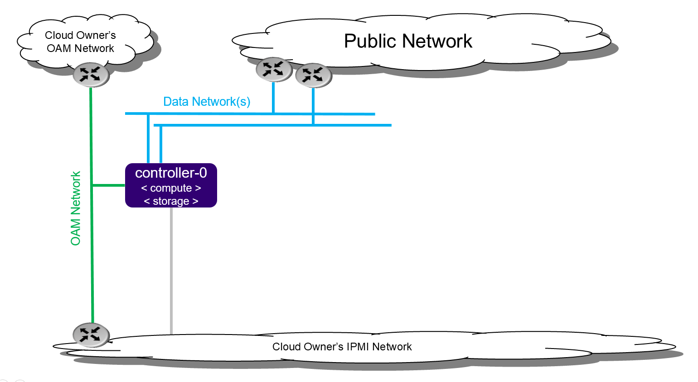

=======================
All-In-One Simplex R2.0
=======================

.. contents::
   :local:
   :depth: 1

------------
Introduction
------------

The All-In-One Simplex (AIO-SX) deployment option provides all three cloud
functions (controller, compute, and storage) on a single physical server.
With these cloud functions, multiple application types can be deployed and
consolidated onto a single physical server.
For example, with an All-In-One Simplex deployment you can:

- Consolidate legacy applications that must run standalone on a server by using
  multiple virtual machines on a single physical server.

- Consolidate legacy applications that run on different operating systems or
  different distributions of operating systems by using multiple virtual
  machines on a single physical server.

- Provide the storage backend solution using a single-node CEPH deployment.

Only a small amount of cloud processing and storage power is required with an
AIO-SX deployment.

   *All-In-One Simplex deployment configuration*

An AIO-SX deployment provides no protection against an overall server
hardware fault. Protection against overall server hardware fault is either
not required, or done at a higher level. Hardware component protection
could be enabled if, for example, an HW RAID or 2x Port LAG is used in the
deployment.

--------------------
Installation options
--------------------

StarlingX may be installed on bare metal or in a virtual environment:

-  **Bare metal**: Real deployments of StarlingX are supported only on
   physical servers.

-  **Virtual environment**: A virtual environment should only be used
   for evaluation or development purposes.

StarlingX installed in a virtual environment has a single installation
option:

- :doc:`Libvirt/QEMU <installation_libvirt_qemu>`

------------
Requirements
------------

**********
Bare metal
**********

Required Server:

-  Combined server (controller + compute): 1

^^^^^^^^^^^^^^^^^^^^^
Hardware requirements
^^^^^^^^^^^^^^^^^^^^^

The following subsections describe the recommended minimum requirements for
the workstation hosting the virtual machine(s) where StarlingX will be
deployed.

-  Minimum processor:

   -  Typical hardware form factor:

      - Dual-CPU Intel Xeon E5 26xx family (SandyBridge) 8 cores/socket

   -  Low cost / low power hardware form factor

      - Single-CPU Intel Xeon D-15xx family, 8 cores

-  Memory: 64 GB

-  BIOS:

   -  Hyper-Threading technology: Enabled

   -  Virtualization technology: Enabled

   -  VT for directed I/O: Enabled

   -  CPU power and performance policy: Performance

   -  CPU C state control: Disabled

   -  Plug & play BMC detection: Disabled

-  Primary disk:

   -  500 GB SDD or NVMe

-  Additional disks:

   -  Zero or more 500 GB disks (min. 10K RPM)

-  Network ports

   .. note:: AIO-SX configuration requires one or more data ports.
             This configuration does not require a management port.

   -  OAM: 10GE

   -  Data: n x 10GE

^^^^^^^^^^^^^^^^^^^^^^^^
NVMe drive as boot drive
^^^^^^^^^^^^^^^^^^^^^^^^

To use a Non-Volatile Memory Express (NVMe) drive as the boot drive for any of
your nodes, you must configure your host and adjust kernel parameters during
installation:

- Configure the host to be in UEFI mode.

- Edit the kernel boot parameter. After you are presented with the StarlingX
  ISO boot options and after you have selected the preferred installation option
  (e.g. Standard Configuration / All-in-One Controller Configuration), press the
  TAB key to edit the kernel boot parameters. Modify the **boot_device** and
  **rootfs_device** from the default **sda** so that it is the correct device
  name for the NVMe drive (e.g. "nvme0n1").

  ::

     vmlinuz rootwait console=tty0 inst.text inst.stage2=hd:LABEL=oe_iso_boot
     inst.ks=hd:LABEL=oe_iso_boot:/smallsystem_ks.cfg boot_device=nvme0n1
     rootfs_device=nvme0n1 biosdevname=0 usbcore.autosuspend=-1 inst.gpt
     security_profile=standard user_namespace.enable=1 initrd=initrd.img

*******************
Virtual environment
*******************

The recommended minimum requirements for the workstation, hosting the
virtual machine(s) where StarlingX will be deployed, include:

^^^^^^^^^^^^^^^^^^^^^
Hardware requirements
^^^^^^^^^^^^^^^^^^^^^

A workstation computer with:

-  Processor: x86_64 only supported architecture with BIOS enabled
   hardware virtualization extensions

-  Cores: 8 (4 with careful monitoring of cpu load)

-  Memory: At least 32GB RAM

-  Hard Disk: 500GB HDD

-  Network: Two network adapters with active Internet connection

^^^^^^^^^^^^^^^^^^^^^
Software requirements
^^^^^^^^^^^^^^^^^^^^^

A workstation computer with:

-  Operating System: Freshly installed Ubuntu 16.04 LTS 64-bit

-  Proxy settings configured (if applies)

-  Git

-  KVM/VirtManager

-  Libvirt library

-  QEMU full-system emulation binaries

-  tools project

-  StarlingX ISO image

--------------------------
Setting up the workstation
--------------------------

This section describes how to set up the workstation computer which will
host the virtual machine(s) where StarlingX will be deployed.

******************************
Updating your operating system
******************************

Before proceeding with the build, make sure your OS is up to date.
You will first need to update the local database list of available
packages:

::

   $ sudo apt-get update

*********************
Install tools project
*********************

Clone the tools project. Usually you will want to clone it under your
user's home directory.

::

   $ cd $HOME
   $ git clone https://opendev.org/starlingx/tools

****************************************
Installing requirements and dependencies
****************************************

Navigate to the tools installation libvirt directory:

::

   $ cd $HOME/tools/deployment/libvirt/

Install the required packages:

::

   $ bash install_packages.sh

******************
Disabling firewall
******************

Unload firewall and disable firewall on boot:

::

   $ sudo ufw disable
   Firewall stopped and disabled on system startup
   $ sudo ufw status
   Status: inactive

**************************
Prepare the virtual server
**************************

Run the libvirt qemu setup scripts. Set up virtualized OAM and
management networks:

::

   $ bash setup_network.sh

Buil XML for definition of virtual servers:

::

   $ bash setup_configuration.sh -c simplex -i <starlingx iso image>

The default XML server definition created by the previous script is:

- simplex-controller-0

*************************
Power up a virtual server
*************************

To power up the virtual server, run the following command:

::

    $ sudo virsh start <server-xml-name>

e.g.

::

    $ sudo virsh start simplex-controller-0

*******************************
Access a virtual server console
*******************************

The XML for virtual servers in the tools repo, deployment/libvirt,
provides both graphical and text consoles.
Access the graphical console in virt-manager by right-clicking on the
domain (the server) and selecting "Open".

Access the text console with the command "virsh console $DOMAIN",
where DOMAIN is the name of the server shown in virsh.

When booting the controller-0 for the first time, both the serial and
graphical consoles will present the initial configuration menu for the
cluster. You can select serial or graphical console for controller-0.
Only serial is used for other nodes, regardless of which option is
selected.

Before powering on a virtual server, open the graphic console to observe the
boot device selection and PXI boot progress. Run the "virsh console $DOMAIN"
command promptly after power on to see the initial boot sequence which
follows the boot device selection. You have a few seconds to do this.

-------------------------------------------
Getting or building the StarlingX ISO image
-------------------------------------------

The following subsection describe how to get or build the
StarlingX ISO image.

*********************
Building the Software
*********************

Follow the standard build process in the `StarlingX Build Guide
<https://docs.starlingx.io/contributor/build_guides/latest/index.html>`__.

Alternatively a prebuilt ISO can be used. All required packages are
provided by the `StarlingX CENGN
mirror <http://mirror.starlingx.cengn.ca/mirror/starlingx/>`__

**********
Bare metal
**********

Use a bootable USB flash drive containing the StarlingX ISO image to install
on bare metal.

*******************
Virtual environment
*******************

Copy the StarlingX ISO Image to the tools deployment libvirt project
directory:

::

   $ cp <starlingx iso image> $HOME/tools/deployment/libvirt/

-----------------------
Setting up controller-0
-----------------------

Installing controller-0 involves initializing a host with software
and then applying a bootstrap configuration from the command line.
The configured bootstrapped host becomes controller-0.

The general procedure is:

1. Have a USB device that contains a bootable StarlingX ISO.

2. Be sure that USB device is plugged into a bootable USB slot on the server that
   will be the Controller-0.

3. Power on the server.

4. Configure the controller by running the Ansible bootstrap playbook.

*************************
Initializing controller-0
*************************

This section describes how to initialize StarlingX in host controller-0.

.. note:: Except where noted, you must execute all the commands from a console on
          the host.

Follow this procedure to initialize the controller:

1. Be sure your USB device that has the StarlingX ISO is plugged into
   a bootable USB port on the host your are configuring as controller-0.

2. Power on the host.

3. Wait for the console to show the StarlingX ISO booting options:

   - **All-in-one Controller Configuration:**

     For this option, select "All-in-one Controller Configuration" for the
     the type of installation from the installer welcome screen.

   - **Graphical Console:**

     Select "Graphical Console" as the console to use during
     installation.

   - **Standard Security Boot Profile:**

     Select "Standard Security Boot Profile" as the Security Profile.

4. Monitor the initialization. When it completes, a reboot is initiated
   on the controller-0 host and briefly displays a GNU GRUB screen after
   which the reboot automatically continues into the StarlingX image.

5. Log into controller-0 as user "sysadmin" and use "sysadmin" as the password.
   The first time you log in as "sysadmin", you are required to change your
   password:

   ::

      Changing password for sysadmin.
      (current) UNIX Password: sysadmin

6. Enter a new password for the "sysadmin" account and confirm the change.
   Once you change the password, controller-0 is initialized with StarlingX
   and is ready for configuration.

************************
Configuring controller-0
************************

This section describes how to configure controller-0 for local
bootstrap by running the Ansible bootstrap playbook.

.. note::  - For ease of use in development and controlled test environments,
             you can provide passwords by specifying from the command line
             an override file that is an unencrypted text file.

           - The sysadmin password is used for SSH authentication.

           - In production environments, you should store sensitive
             information in the Ansible vault secret file and use
             SSH keys rather than passwords for authentication.

^^^^^^^^^^^^^^^^^^^^^^^^^^^^^^^^^^^^^^^^^^^^^
Location of the controller bootstrap playbook
^^^^^^^^^^^^^^^^^^^^^^^^^^^^^^^^^^^^^^^^^^^^^

All StarlingX playbooks are located under the directory
/usr/share/ansible/stx-ansible/playbooks.
Consequently, the controller bootstrap playbook is located
at: /usr/share/ansible/stx-ansible/playbooks/bootstrap/.

^^^^^^^^^^^^^^^^^^^^^^^^^^^^^^^^^^^
Default bootstrap playbook settings
^^^^^^^^^^^^^^^^^^^^^^^^^^^^^^^^^^^

The default inventory file, which resides in Ansible configuration directory
(i.e. /etc/ansible/hosts), contains one single host - the localhost.
You can override this file using a custom hosts file and the "-i option".
Doing so makes the file available for remote play through the Ansible
playbook.

The /usr/share/ansible/stx-ansible/playbooks/bootstrap/host_vars/default.yml
file specifies the default configuration parameters.
You can overwrite these parameters in two ways:

- Using either the --extra-vars or -e options at the command line.

- Using an override file.

Using the override file is the preferred option when multiple
parameters exist that need to be overwritten.

By default Ansible looks for and imports user override files
in the sysadmin home directory ($HOME).
If you want to place these files in a different location, you
must specify the location by using the -e option
(e.g. -e "override_files_dir=<custom-override-dir>").

The override file must conform to the following naming convention:
::

   <inventory_hostname>.yml

An example filename is localhost.yml.

^^^^^^^^^^^^^^
Password types
^^^^^^^^^^^^^^

For local bootstrap, two types of passwords exist:

- **ansible_become_pass**: a Sudo password to run tasks that require
  escalated privileges.
  Most bootstrap tasks must be run as root.
  Since the playbook is run by the sysadmin user,
  this is the sysadmin password.

- **admin_password**: A password used in when system commands, such as
  a Horizon login, are executed.

For remote bootstrap, if an automatic SSH login that uses an SSH key has not been set up between the Ansible control node and the target controller, another password is required:

- **ansible_ssh_pass**: The password used to log into the target host(s).

For all the passwords mentioned in this section, the defaults are
set to "St8rlingX*".

^^^^^^^^^^^^^^^^^^^^
Running the playbook
^^^^^^^^^^^^^^^^^^^^

To run the playbook, you need to first set up external connectivity.
This section describes how to set up external connectivity and
then provides two examples showing how to bootstrap controller-0 by
running the playbook.

~~~~~~~~~~~~~~~~~~~~~~~~~~~~~~~~
Setting up external connectivity
~~~~~~~~~~~~~~~~~~~~~~~~~~~~~~~~

Use these commands to set up external connectivity:

::

   export CONTROLLER0_OAM_CIDR=10.10.10.10/24
   export DEFAULT_OAM_GATEWAY=10.10.10.1
   sudo ip address add $CONTROLLER0_OAM_CIDR dev enp2s1
   sudo ip link set up dev enp2s1
   sudo ip route add default via $DEFAULT_OAM_GATEWAY dev enp2s1
   ping 8.8.8.8

~~~~~~~~~~~~~~~~~~~~~~
Bootstrap controller-0
~~~~~~~~~~~~~~~~~~~~~~

The following example runs the local playbook using all the defaults,
including passwords being "St8rlingX*":

::

   ansible-playbook /usr/share/ansible/stx-ansible/playbooks/bootstrap/bootstrap.yml

This next example runs the local playbook with some custom parameters
that include admin and sysadmin passwords:

1. Create a *localhost.yml* file under */home/sysadmin/* directory with
   the following content:

   ::

      external_oam_subnet: <custom-external-oam-subnet>
      external_oam_gateway_address: <custom-external-oam-gateway-address>
      external_oam_floating_address: <custom-external-oam-floating-ip>
      management_subnet: <custom-management-subnet>
      dns_servers:
        - <dns-server>
      admin_password: <custom-admin-password>
      ansible_become_pass: <custom-sysadmin-password>

   */home/sysadmin/localhost.yml* example:

   ::

      external_oam_subnet: 10.10.10.0/24
      external_oam_gateway_address: 10.10.10.1
      external_oam_floating_address: 10.10.10.3
      management_subnet: 192.168.204.0/24
      dns_servers:
        - 8.8.4.4
      admin_password: St8rlingX*
      ansible_become_pass: St8rlingX*

2. Play bootstrap playbook:

   ::

      ansible-playbook /usr/share/ansible/stx-ansible/playbooks/bootstrap/bootstrap.yml

This final example bootstraps controller-0 by running
the local playbook and using a custom sysadmin and admin password
specified in the command line:

::

   ansible-playbook /usr/share/ansible/stx-ansible/playbooks/bootstrap/bootstrap.yml -e "ansible_become_pass=<custom-sysadmin-password> admin_password=<custom-admin-password>"

.. note:: Ansible does not currently support specifying playbook
          search paths.
          Consequently, you must specify the full path to the bootstrap
          playbook in the command line unless you are already in the
          bootstrap playbook directory.
          In the near future, a command alias called "bootstrap-controller"
          will be provided for ease of use.

*************************
Provisioning the platform
*************************

The following subsections describe how to provision the
server being used as controller-0.
Provisioning makes many services available.

^^^^^^^^^^^^^^^^^^^^^^^^^^^^^^
Configure OAM for controller-0
^^^^^^^^^^^^^^^^^^^^^^^^^^^^^^

Use the following command to configure OAM for controller-0:

::

   source /etc/platform/openrc
   OAM_IF=enp0s3
   system host-if-modify controller-0 $OAM_IF -c platform
   system interface-network-assign controller-0 $OAM_IF oam

^^^^^^^^^^^^^^^^^^
Set the NTP server
^^^^^^^^^^^^^^^^^^

.. attention:: Baremetal hardware only. Skip this step in a virtual
               environment as it can cause Ceph's clock skew alarms.
               Moreover, clock of virtual instances is synchronized
               with the host clock so there is no need to configure
               NTP here.

Use the following command to configure the IP Addresses
of the remote Network Time Protocol (NTP) servers.
These servers are used for network time synchronization:

::

   source /etc/platform/openrc
   system ntp-modify ntpservers=0.pool.ntp.org,1.pool.ntp.org

^^^^^^^^^^^^^^^^^^^^^^^^^^^^^^^^^
Configure the host's vSwitch type
^^^^^^^^^^^^^^^^^^^^^^^^^^^^^^^^^

.. attention:: In a virtual environment, OVS-DPDK is NOT supported, only OVS
   is supported.

This section describes how to configure the Virtual Switch required for the
stx-openstack application, which allows network entities to connect to virtual
machines over a virtual network.

StarlingX has OVS (kernel-based) vSwitch configured as default:

- Running in a container; defined within the helm charts of stx-openstack
  manifest.
- Shares the core(s) assigned to the Platform.

If you require better performance, OVS-DPDK should be used:

- Running directly on the host (i.e. NOT containerized).
- Requires that at least 1 core be assigned/dedicated to the vSwitch
  function.

To deploy the default containerized OVS:

::

   system modify --vswitch_type none

I.e. do not run any vSwitch directly on the host, and use the containerized
OVS defined in the helm charts of stx-openstack manifest.

To deploy OVS-DPDK (OVS with the Data Plane Development Kit), which is
supported only on bare metal hardware, run the following command:

::

   system modify --vswitch_type ovs-dpdk
   system host-cpu-modify -f vswitch -p0 1 controller-0

Once vswitch_type is set to OVS-DPDK, any subsequent nodes that are created
will default to automatically assigning 1 vSwitch core for AIO-SX controllers
and 2 vSwitch cores for computes.

When using OVS-DPDK, virtual machines must be configured to use a flavor with
property: **hw:mem_page_size=large**.

.. important:: After controller-0 is unlocked, changing vswitch_type would
   require locking and unlocking all computes (and/or AIO-SX controllers)
   in order to apply the change.

^^^^^^^^^^^^^^^^^^^^^^^^^
Configure data interfaces
^^^^^^^^^^^^^^^^^^^^^^^^^

Part of provisioning controller-0 is to configure the
data interfaces. Use the following to configure data interfaces:

::

   DATA0IF=eth1000
   DATA1IF=eth1001
   export COMPUTE=controller-0
   PHYSNET0='physnet0'
   PHYSNET1='physnet1'
   SPL=/tmp/tmp-system-port-list
   SPIL=/tmp/tmp-system-host-if-list
   system host-port-list ${COMPUTE} --nowrap > ${SPL}
   system host-if-list -a ${COMPUTE} --nowrap > ${SPIL}
   DATA0PCIADDR=$(cat $SPL | grep $DATA0IF |awk '{print $8}')
   DATA1PCIADDR=$(cat $SPL | grep $DATA1IF |awk '{print $8}')
   DATA0PORTUUID=$(cat $SPL | grep ${DATA0PCIADDR} | awk '{print $2}')
   DATA1PORTUUID=$(cat $SPL | grep ${DATA1PCIADDR} | awk '{print $2}')
   DATA0PORTNAME=$(cat $SPL | grep ${DATA0PCIADDR} | awk '{print $4}')
   DATA1PORTNAME=$(cat  $SPL | grep ${DATA1PCIADDR} | awk '{print $4}')
   DATA0IFUUID=$(cat $SPIL | awk -v DATA0PORTNAME=$DATA0PORTNAME '($12 ~ DATA0PORTNAME) {print $2}')
   DATA1IFUUID=$(cat $SPIL | awk -v DATA1PORTNAME=$DATA1PORTNAME '($12 ~ DATA1PORTNAME) {print $2}')

   # Configure the datanetworks in StarlingX, prior to referencing it
   # in the 'system host-if-modify command'

   system datanetwork-add ${PHYSNET0} vlan
   system datanetwork-add ${PHYSNET1} vlan

   system host-if-modify -m 1500 -n data0 -c data ${COMPUTE} ${DATA0IFUUID}
   system host-if-modify -m 1500 -n data1 -c data ${COMPUTE} ${DATA1IFUUID}
   system interface-datanetwork-assign ${COMPUTE} ${DATA0IFUUID} ${PHYSNET0}
   system interface-datanetwork-assign ${COMPUTE} ${DATA1IFUUID} ${PHYSNET1}

^^^^^^^^^^^^^^^^^^^^^^^^^^^^^^^^^^^^^^^^^^^^^^^^^^^^^^^
Prepare the host for running the containerized services
^^^^^^^^^^^^^^^^^^^^^^^^^^^^^^^^^^^^^^^^^^^^^^^^^^^^^^^

To prepare the host for running the containerized services,
apply all the node labels for each controller and their compute
functions:

::

   system host-label-assign controller-0 openstack-control-plane=enabled
   system host-label-assign controller-0 openstack-compute-node=enabled
   system host-label-assign controller-0 openvswitch=enabled
   system host-label-assign controller-0 sriov=enabled

^^^^^^^^^^^^^^^^^^^^^^^^^^^^^^^^^^
Set up partitions for Controller-0
^^^^^^^^^^^^^^^^^^^^^^^^^^^^^^^^^^

You need to create partitions on the root disk and then
wait for them to become ready.

-  34 GB partition for nova-local (mandatory).

The following is an example:

::

   export COMPUTE=controller-0

   echo ">>> Getting root disk info"
   ROOT_DISK=$(system host-show ${COMPUTE} | grep rootfs | awk '{print $4}')
   ROOT_DISK_UUID=$(system host-disk-list ${COMPUTE} --nowrap | grep ${ROOT_DISK} | awk '{print $2}')
   echo "Root disk: $ROOT_DISK, UUID: $ROOT_DISK_UUID"

   echo ">>>> Configuring nova-local"
   NOVA_SIZE=34
   NOVA_PARTITION=$(system host-disk-partition-add -t lvm_phys_vol ${COMPUTE} ${ROOT_DISK_UUID} ${NOVA_SIZE})
   NOVA_PARTITION_UUID=$(echo ${NOVA_PARTITION} | grep -ow "| uuid | [a-z0-9\-]* |" | awk '{print $4}')
   system host-lvg-add ${COMPUTE} nova-local
   system host-pv-add ${COMPUTE} nova-local ${NOVA_PARTITION_UUID}
   sleep 2

   echo ">>> Wait for partition $NOVA_PARTITION_UUID to be ready."
   while true; do system host-disk-partition-list $COMPUTE --nowrap | grep $NOVA_PARTITION_UUID | grep Ready; if [ $? -eq 0 ]; then break; fi; sleep 1; done

^^^^^^^^^^^^^^^^^^^^^^^^^^^^^^^
Configure Ceph for Controller-0
^^^^^^^^^^^^^^^^^^^^^^^^^^^^^^^

Use the following to configure Ceph for Controller-0:

::

   echo ">>> Add OSDs to primary tier"

   system host-disk-list controller-0
   system host-disk-list controller-0 | awk '/\/dev\/sdb/{print $2}' | xargs -i system host-stor-add controller-0 {}
   system host-stor-list controller-0

^^^^^^^^^^^^^^^^^^^^^
Unlock the controller
^^^^^^^^^^^^^^^^^^^^^

You must unlock controller-0 so that you can use it to install
controller-1. Use the system host-unlock command:

::

   system host-unlock controller-0

^^^^^^^^^^^^^^^^^^^^^^^^^^^^^^^
Test for Ceph cluster operation
^^^^^^^^^^^^^^^^^^^^^^^^^^^^^^^

Now, test that the Ceph cluster is operational:

::

   ceph -s
       cluster 6cb8fd30-622a-4a15-a039-b9e945628133
        health HEALTH_OK
        monmap e1: 1 mons at {controller-0=127.168.204.3:6789/0}
               election epoch 4, quorum 0 controller-0
        osdmap e32: 1 osds: 1 up, 1 in
               flags sortbitwise,require_jewel_osds
         pgmap v35: 1728 pgs, 6 pools, 0 bytes data, 0 objects
               39180 kB used, 50112 MB / 50150 MB avail
                   1728 active+clean

-------------------------------------------------------------------------
Using the system CLI to bring up and take down the containerized services
-------------------------------------------------------------------------

This section describes how to bring up and take down the containerized services.

**********************************************
Generate the stx-openstack application tarball
**********************************************

Each build on the CENGN mirror generates the `stx-openstack application
tarballs <http://mirror.starlingx.cengn.ca/mirror/starlingx/master/centos/latest_green_build/outputs/helm-charts/>`__.

Alternatively, in a development environment, you can run the following command
to construct the application tarballs:

::

   $MY_REPO_ROOT_DIR/cgcs-root/build-tools/build-helm-charts.sh

- You can find the resulting tarballs under
  $MY_WORKSPACE/std/build-helm/stx.

- By default, the latest stable starlingx docker images are used in armada
  manifest. You can build the application tarball with different image
  versions by specifying the image record files/urls which contain the images
  you would like to use via option --image-record (The `starlingx image build
  records <http://mirror.starlingx.cengn.ca/mirror/starlingx/master/centos/>`
  can be found on the CENGN mirror).

- To construct a new name of stx-openstack tarball, specify a label with
  --label option. The name of the stx-openstack application tarball is
  **stx-openstack-<stx-openstack-helm rpm version>(-<label>).tgz**.

- If the build-helm-charts.sh command is unable to find the charts, run
  "build-pkgs" to build the chart rpms and then re-run the
  build-helm-charts.sh command.

********************************
Stage application for deployment
********************************

On controller-0, acquire Keystone administrative privileges:

::

   controller-0:~$ source /etc/platform/openrc

Transfer the stx-openstack application tarball onto your active controller.

Once the tarball is on the controller, use the system CLI to upload
the application tarball:

::

   system application-upload <stx-openstack application tarball>.tgz
   system application-list

The stx-openstack application tarball has a metadata.yaml file which contains
the app name and version. The app name and version will be extracted from the
metadata.yaml when uploading. For the application tarballs that do not have
app name and version included in metadata.yaml, they need to be specified via
--app-name and --app-version.

*****************
Bring up services
*****************

Use the system CLI to apply the application:

::

   system application-apply stx-openstack

You can monitor the progress by watching the system application-list:

::

   watch -n 5 system application-list

Alternatively, you can monitor progress by tailing the Armada execution log:

::

   sudo docker exec armada_service tail -f stx-openstack-apply.log

****************************
Update Ceph pool replication
****************************

With the application applied, the containerized openstack services are
now running.

In an AIO-SX environment, you must set Ceph pool replication for the new
pools created when the application was applied:

::

   ceph osd pool ls | xargs -i ceph osd pool set {} size 1

----------------------------
Verify the cluster endpoints
----------------------------

You can verify the cluster endpoints using the following
commands from a new shell as a root user, without sourcing
/etc/platform/openrc:

::

   mkdir -p /etc/openstack
   tee /etc/openstack/clouds.yaml << EOF
   clouds:
     openstack_helm:
       region_name: RegionOne
       identity_api_version: 3
       endpoint_type: internalURL
       auth:
         username: 'admin'
         password: 'Li69nux*'
         project_name: 'admin'
         project_domain_name: 'default'
         user_domain_name: 'default'
         auth_url: 'http://keystone.openstack.svc.cluster.local/v3'
   EOF

   export OS_CLOUD=openstack_helm
   openstack endpoint list

--------------------------------
Provider/tenant networking setup
--------------------------------

This section describes how to set up provider/tenant networking.

.. note:: The remaining networking steps are done using this root user.

*************************************************
Provider networking setup: network segment ranges
*************************************************

.. note:: The 'physical-network' name must match the name of the datanetwork
          configured in StarlingX through the 'system datanetwork-add'
          command.

Create the network segment ranges using the following commands:

::

   ADMINID=`openstack project list | grep admin | awk '{print $2}'`
   PHYSNET0='physnet0'
   PHYSNET1='physnet1'

   openstack network segment range create ${PHYSNET0}-a --network-type vlan --physical-network ${PHYSNET0}  --minimum 400 --maximum 499 --private --project ${ADMINID}

   openstack network segment range create  ${PHYSNET0}-b --network-type vlan  --physical-network ${PHYSNET0}  --minimum 10 --maximum 10 --shared

   openstack network segment range create ${PHYSNET1}-a --network-type vlan  --physical-network  ${PHYSNET1} --minimum 500 --maximum 599  --private --project ${ADMINID}

***********************
Tenant networking setup
***********************

Setup tenant networking using the following commands:

::

   ADMINID=`openstack project list | grep admin | awk '{print $2}'`
   PHYSNET0='physnet0'
   PHYSNET1='physnet1'
   PUBLICNET='public-net0'
   PRIVATENET='private-net0'
   INTERNALNET='internal-net0'
   EXTERNALNET='external-net0'
   PUBLICSUBNET='public-subnet0'
   PRIVATESUBNET='private-subnet0'
   INTERNALSUBNET='internal-subnet0'
   EXTERNALSUBNET='external-subnet0'
   PUBLICROUTER='public-router0'
   PRIVATEROUTER='private-router0'

   openstack network create --project ${ADMINID} --provider-network-type=vlan --provider-physical-network=${PHYSNET0} --provider-segment=10 --share --external ${EXTERNALNET}
   openstack network create --project ${ADMINID} --provider-network-type=vlan --provider-physical-network=${PHYSNET0} --provider-segment=400 ${PUBLICNET}
   openstack network create --project ${ADMINID} --provider-network-type=vlan --provider-physical-network=${PHYSNET1} --provider-segment=500 ${PRIVATENET}
   openstack network create --project ${ADMINID} ${INTERNALNET}

   PUBLICNETID=`openstack network list | grep ${PUBLICNET} | awk '{print $2}'`
   PRIVATENETID=`openstack network list | grep ${PRIVATENET} | awk '{print $2}'`
   INTERNALNETID=`openstack network list | grep ${INTERNALNET} | awk '{print $2}'`
   EXTERNALNETID=`openstack network list | grep ${EXTERNALNET} | awk '{print $2}'`

   openstack subnet create --project ${ADMINID} ${PUBLICSUBNET} --network ${PUBLICNET} --subnet-range 192.168.101.0/24
   openstack subnet create --project ${ADMINID} ${PRIVATESUBNET} --network ${PRIVATENET} --subnet-range 192.168.201.0/24
   openstack subnet create --project ${ADMINID} ${INTERNALSUBNET} --gateway none --network ${INTERNALNET} --subnet-range 10.1.1.0/24
   openstack subnet create --project ${ADMINID} ${EXTERNALSUBNET} --gateway 192.168.1.1 --no-dhcp --network ${EXTERNALNET} --subnet-range 192.168.51.0/24 --ip-version 4

   openstack router create ${PUBLICROUTER}
   openstack router create ${PRIVATEROUTER}

   PRIVATEROUTERID=`openstack router list | grep ${PRIVATEROUTER} | awk '{print $2}'`
   PUBLICROUTERID=`openstack router list | grep ${PUBLICROUTER} | awk '{print $2}'`

   openstack router set ${PUBLICROUTER} --external-gateway ${EXTERNALNETID} --disable-snat
   openstack router set ${PRIVATEROUTER} --external-gateway ${EXTERNALNETID} --disable-snat
   openstack router add subnet ${PUBLICROUTER} ${PUBLICSUBNET}
   openstack router add subnet ${PRIVATEROUTER} ${PRIVATESUBNET}

.. include:: uninstalling_deleting_openstack.rst
   :start-after: incl-uninstalling-deleting-openstack:
   :end-before: incl-uninstalling-deleting-openstack-end:

.. include:: horizon_access.rst
   :start-after: incl-horizon-access:
   :end-before: incl-horizon-access-end:

--------------------------------
Known issues and troubleshooting
--------------------------------

No known issues or troubleshooting procedures exist.

---------------------------------------
Deployment and installation terminology
---------------------------------------

Following are terms used when describing the AIO-SX deployment
and installation.

.. include:: deployment_terminology.rst
   :start-after: incl-simplex-deployment-terminology:
   :end-before: incl-simplex-deployment-terminology-end:

.. include:: deployment_terminology.rst
   :start-after: incl-standard-controller-deployment-terminology:
   :end-before: incl-standard-controller-deployment-terminology-end:

.. include:: deployment_terminology.rst
   :start-after: incl-common-deployment-terminology:
   :end-before: incl-common-deployment-terminology-end:
