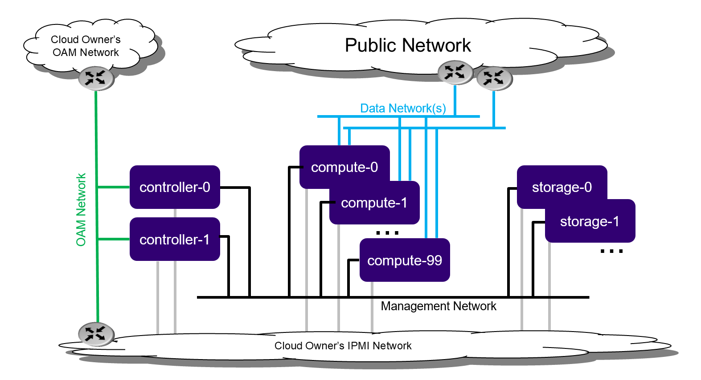

====================================
Standard with dedicated storage R2.0
====================================

.. contents::
   :local:
   :depth: 1

.. note :: The instructions to set up a StarlingX Cloud with Dedicated
           Storage with containerized openstack services in this guide
           are under development.
           For approved instructions, see the
           `StarlingX Cloud with Dedicated Storage wiki page <https://wiki.openstack.org/wiki/StarlingX/Containers/InstallationOnStandardStorage>`__.

------------
Introduction
------------

The StarlingX Cloud with dedicated storage configuration option
is a standard deployment option with independent controller,
compute, and storage Nodes.

----------------------
Deployment description
----------------------

This deployment option provides the maximum capacity for a single region
deployment.

.. note :: No growth path exists for a multi-region deployment option through
           the addition of a secondary region.

   *Dedicated storage deployment configuration*

A StarlingX Cloud with Dedicated Storage includes:

- A 2x node High Availability (HA) controller cluster with HA services
  that runs across the controller nodes in either active/active or
  active/standby mode.

- A pool of up to 100 compute nodes for hosting virtual machines and virtual
  networks.

- A two-to-9x node HA Ceph storage cluster for hosting virtual volumes, images, and
  object storage that supports a replication factor of two or three.

  Storage nodes deployed in replication groups of two or three.
  Replication of objects is done strictly within the replication group.

  Supports up to four groups of 2x storage nodes, or up to three groups of 3x storage
  nodes.

--------------------
Installation options
--------------------

You can install StarlingX in the following environments:

-  **Bare metal**: Real deployments of StarlingX are only supported on
   physical servers.

-  **Virtual environment**: You should only use this environment
   for evaluation or development purposes.

   .. note:: To install StarlingX into a virtual environment, use the following:
      :doc:`Libvirt/QEMU <installation_libvirt_qemu>`

------------
Requirements
------------

Following are the bare metal and virtual environment requirements
for this StarlingX configuration.

********************************
Bare metal hardware requirements
********************************

The recommended minimum requirements for the physical servers where
dedicated storage is deployed include:

-  Minimum processor:

   -  Dual-CPU Intel® Xeon® E5 26xx family (SandyBridge) 8 cores/socket

-  Memory:

   -  64 GB controller
   -  64 GB storage
   -  32 GB compute

-  BIOS:

   -  Hyper-Threading technology enabled
   -  Virtualization technology enabled
   -  VT for directed I/O enabled
   -  CPU power and performance policy set to performance
   -  CPU C state control disabled
   -  Plug & play BMC detection disabled

-  Primary disk:

   -  500 GB SDD or NVMe controller
   -  120 GB with a minimum of 10K RPM for computes and storage

-  Additional disks:

   -  One or more 500 GB disks with a minimum of 10K RPM for storage
      and computes

-  Network ports\*

   -  Management: 10GE controller, storage, and compute
   -  OAM: 10GE controller
   -  Data: n x 10GE compute

^^^^^^^^^^^^^^^^^^^^^^^^
NVMe drive as boot drive
^^^^^^^^^^^^^^^^^^^^^^^^

To use a Non-Volatile Memory Express (NVMe) drive as the boot drive for any of
your nodes, you must configure your host and adjust kernel parameters during
installation:

- Configure the host to be in UEFI mode.

- Edit the kernel boot parameter.
  After you are presented with the StarlingX ISO boot options and after
  you have selected the preferred installation option
  (e.g. Standard Configuration / All-in-One Controller Configuration), press the
  TAB key to edit the kernel boot parameters.
  Modify the **boot_device** and **rootfs_device** from the default **sda** so
  that it is the correct device name for the NVMe drive (e.g. "nvme0n1").

  ::

     vmlinuz rootwait console=tty0 inst.text inst.stage2=hd:LABEL=oe_iso_boot
     inst.ks=hd:LABEL=oe_iso_boot:/smallsystem_ks.cfg boot_device=nvme0n1
     rootfs_device=nvme0n1 biosdevname=0 usbcore.autosuspend=-1 inst.gpt
     security_profile=standard user_namespace.enable=1 initrd=initrd.img

*******************
Virtual environment
*******************

Following are the recommended minimum hardware and software
requirements for the workstation that hosts the virtual machine or
machines on which StarlingX is deployed:

^^^^^^^^^^^^^^^^^^^^^
Hardware requirements
^^^^^^^^^^^^^^^^^^^^^

A workstation computer with:

-  Processor: x86_64 only supported architecture with BIOS enabled
   hardware virtualization extensions

-  Cores: Eight.
   Alternatively, you can have four if the CPU load is carefully
   monitored.

-  Memory: Minimum 32 GB RAM

-  Hard Disk: 500 GB HDD

-  Network: Two network adapters with active Internet connection

^^^^^^^^^^^^^^^^^^^^^
Software requirements
^^^^^^^^^^^^^^^^^^^^^

A workstation computer with the following:

-  Operating System: Newly installed Ubuntu 16.04 LTS 64-bit

-  If applicable, configured proxy settings

-  Git

-  KVM/VirtManager

-  Libvirt library

-  QEMU full-system emulation binaries

-  the "tools" project

-  StarlingX ISO image

-----------------
Preparing servers
-----------------

The following sub-sections describe how to prepare bare metal servers
and virtual servers.

**********
Bare Metal
**********

For a bare metal server, the server should start powered-off
and have "wiped" disks such that the servers must boot from the
network or from a USB source.

*******************
Virtual environment
*******************

This section describes how to set up the servers and build the XML
definitions that hosts the virtual machine(s) where StarlingX will
be deployed.

^^^^^^^^^^^^^^^^^^^^^^^^^^^^^^
Updating your operating system
^^^^^^^^^^^^^^^^^^^^^^^^^^^^^^

Ensure your Linux distribution is current. You must first update
the local database list of available packages:

::

   $ sudo apt-get update

^^^^^^^^^^^^^^^^^^^^^^^^
Installing tools project
^^^^^^^^^^^^^^^^^^^^^^^^

Clone the tools project.
Typically, you clone this project while in your home directory:

::

   $ cd $HOME
   $ git clone https://opendev.org/starlingx/tools.git

^^^^^^^^^^^^^^^^^^^^^^^^^^^^^^^^^^^^^^^^
Installing requirements and dependencies
^^^^^^^^^^^^^^^^^^^^^^^^^^^^^^^^^^^^^^^^

Navigate to the tools installation libvirt directory:

::

   $ cd $HOME/tools/deployment/libvirt/

Install the required packages:

::

   $ bash install_packages.sh

^^^^^^^^^^^^^^^^^^
Disabling firewall
^^^^^^^^^^^^^^^^^^

Unload the firewall and disable it during boot:

::

   $ sudo ufw disable
   Firewall stopped and disabled on system startup
   $ sudo ufw status
   Status: inactive

^^^^^^^^^^^^^^^^^^^^^^^^^^
Prepare the virtual server
^^^^^^^^^^^^^^^^^^^^^^^^^^

1. Run the libvirt QEMU setup scripts to set up virtualized OAM and
   management networks:

   ::

      $ bash setup_network.sh

2. Build XML for definition of virtual servers:

   ::

      $ bash setup_configuration.sh -c dedicatedstorage -i <starlingx-iso-image>

   The previous script will start the dedicatedstorage-controller-0 domain and
   virtual server, as well as create the following default XML server
   definitions:

   - dedicatedstorage-controller-0
   - dedicatedstorage-controller-1
   - dedicatedstorage-compute-0
   - dedicatedstorage-compute-1
   - dedicatedstorage-storage-0
   - dedicatedstorage-storage-1

   Note that the script will automatically try to start the graphical (X-based)
   virtual manager. Errors will occur if a X Windows server is not available.

^^^^^^^^^^^^^^^^^^^^^^^^^
Power up a virtual server
^^^^^^^^^^^^^^^^^^^^^^^^^

To power up a virtual server, run the following command:

::

    $ sudo virsh start <server-xml-name>

Here is an example:

::

    $ sudo virsh start dedicatedstorage-controller-1

^^^^^^^^^^^^^^^^^^^^^^^^^^^^^^^
Access a virtual server console
^^^^^^^^^^^^^^^^^^^^^^^^^^^^^^^

The XML for virtual servers in the "tools" repository, deployment/libvirt,
provides both graphical and text consoles.

Consider the following when accessing a virtual server console:

-  Access the graphical console in virt-manager by right-clicking on the
   domain (i.e. the server) and selecting "Open".

-  Access the textual console using the command ``virsh console $DOMAIN``,
   where DOMAIN is the name of the server shown in virsh.

-  When booting controller-0 for the first time, both the serial and
   graphical consoles present the initial configuration menu for the
   cluster. You can select the serial or graphical console for controller-0.
   However, for the other nodes, you can only use the serial console
   regardless of the selected option.

-  Open the graphic console on all servers before powering them on to
   observe the boot device selection and PXE boot progress.
   Run the ``virsh console $DOMAIN`` command promptly after powering
   up to see the initial boot sequence that follows the boot device
   selection.
   Only a few seconds exist during which you can see the sequence.

-------------------------------
Getting the StarlingX ISO image
-------------------------------

Follow the instructions from the :doc:`/contributor/build_guides/latest/index`
to build a StarlingX ISO image.

Alternatively, you can use a pre-built ISO, which includes all required packages
provided by the
`StarlingX CENGN mirror <http://mirror.starlingx.cengn.ca/mirror/starlingx/>`__.

To get the bleading edge current StarlingX ISO, use the following command: 

::

  $ wget http://mirror.starlingx.cengn.ca/mirror/starlingx/master/centos/latest_build/outputs/iso/bootimage.iso

**********
Bare metal
**********

For bare metal, you need a bootable USB flash drive
that contains the StarlingX ISO image.

*******************
Virtual environment
*******************

For a virtual environment, use the following command to
copy the StarlingX ISO Image to the tools deployment libvirt project
directory:

::

   $ cp <starlingx-iso-image> $HOME/tools/deployment/libvirt/

--------------------------------
Installing the controller-0 host
--------------------------------

Installing controller-0 involves initializing a host with software
and then applying a bootstrap configuration from the command line.
The configured bootstrapped host becomes controller-0.

Following is the general procedure:

1. Have a USB device that contains a bootable StarlingX ISO.

2. Be sure that USB device is plugged into a bootable USB slot on the
   controller-0 server.

3. Power on the server.

4. Initialize the StarlingX services on the controller by running the Ansible
   bootstrap playbook.

***********************
Initialize controller-0
***********************

This section describes how to initialize StarlingX software on host controller-0.

.. note:: Except where noted, all commands must be executed from a console on
          the host.

Follow this procedure to initialize the controller:

1. Be sure your USB device that has the StarlingX ISO is plugged into
   a bootable USB port on the host your are configuring as controller-0.

2. Power on the host.

3. Wait for the console to show the StarlingX ISO installer options:

   .. note:: When first accessing the console for controller-0 it is easy to
             miss the first menu when you hit ENTER. If needed, use ESC to
             navigate back to previous menus.

   - **Standard Controller Configuration:**

     For this option, select "Standard Controller Configuration" for the
     the type of installation from the installer welcome screen.

   - **Graphical Console:**

     Select "Graphical Console" as the console to use during
     installation.

   - **Standard Security Boot Profile:**

     Select "Standard Security Boot Profile" as the Security Profile.

4. Monitor the initialization.
   When it completes, a reboot is initiated on the controller-0
   host and briefly displays a GNU GRUB screen after which the
   reboot automatically continues into the StarlingX image.

5. Log into controller-0 as user "sysadmin" and use "sysadmin" as the password.
   The first time you log in as "sysadmin", you are required to change your
   password:

   ::

      Changing password for sysadmin.
      (current) UNIX Password: sysadmin

6. Enter a new password for the "sysadmin" account and confirm the change.
   Once you change the password, controller-0 is initialized with StarlingX
   and is ready for configuration.

********************************
Bootstrap configure controller-0
********************************

This section describes how to bootstrap configure controller-0 by
running the Ansible bootstrap playbook.

.. note::  - For ease of use in development and controlled test environments,
             you can provide passwords by specifying from the command line
             an override file that is an unencrypted text file.

           - The sysadmin password is used for SSH authentication.

           - In production environments, you should store sensitive
             information in the Ansible vault secret file and use
             SSH keys rather than passwords for authentication.

^^^^^^^^^^^^^^^^^^^^^^^^^^^^^^^^^^^^^^^^^^^^^
Location of the controller bootstrap playbook
^^^^^^^^^^^^^^^^^^^^^^^^^^^^^^^^^^^^^^^^^^^^^

All StarlingX playbooks are located under the directory
/usr/share/ansible/stx-ansible/playbooks.
Consequently, the controller bootstrap playbook is located
at: /usr/share/ansible/stx-ansible/playbooks/bootstrap/.

^^^^^^^^^^^^^^^^^^^^^^^^^^^^^^^^^^^
Default bootstrap playbook settings
^^^^^^^^^^^^^^^^^^^^^^^^^^^^^^^^^^^

The default inventory file, which resides in Ansible configuration directory
(i.e. /etc/ansible/hosts), contains one single host - the localhost.
You can override this file using a custom hosts file and the "-i option".
Doing so makes the file available for remote play through the Ansible
playbook.

The /usr/share/ansible/stx-ansible/playbooks/bootstrap/host_vars/default.yml
file specifies the default configuration parameters.
You can overwrite these parameters in two ways:

- Using either the --extra-vars or -e options at the command line.

- Using an override file.

Using the override file is the preferred option when multiple
parameters exist that need to be overwritten.

By default Ansible looks for and imports user override files
in the sysadmin home directory ($HOME).
If you want to place these files in a different location, you
must specify the location by using the -e option
(e.g. -e "override_files_dir=<custom-override-dir>").

The override file must conform to the following naming convention:
::

   <inventory_hostname>.yml

An example filename is localhost.yml.

^^^^^^^^^^^^^^
Password types
^^^^^^^^^^^^^^

For local bootstrap, two types of passwords exist:

- **ansible_become_pass**: a Sudo password to run tasks that require
  escalated privileges.
  Most bootstrap tasks must be run as root.
  Because the playbook is run by sysadmin user, this is the sysadmin password.

- **admin_password**: A password used for system commands, such as
  a Horizon login, are executed.

Additionally, if an automatic SSH login that uses an SSH key has not been
set up between the Ansible control node and the target controller,
another password is required:

- **ansible_ssh_pass**: The password used to log into the target
  host or hosts.

For all the passwords mentioned in this section, the defaults are
set to "St8rlingX*".

^^^^^^^^^^^^^^^^
Run the playbook
^^^^^^^^^^^^^^^^

To run the playbook, you need to first set up external connectivity.
This section describes how to set up external connectivity and
then shows how to bootstrap controller-0 by running the playbook
using an override file.

~~~~~~~~~~~~~~~~~~~~~~~~~~~~
Set up external connectivity
~~~~~~~~~~~~~~~~~~~~~~~~~~~~

Use these commands to set up external connectivity.
Be sure substitute actual IP Addresses and interface names specific
to your deployment:

::

   export CONTROLLER0_OAM_CIDR=10.10.10.10/24
   export DEFAULT_OAM_GATEWAY=10.10.10.1
   sudo ip address add $CONTROLLER0_OAM_CIDR dev enp2s1
   sudo ip link set up dev enp2s1
   sudo ip route add default via $DEFAULT_OAM_GATEWAY dev enp2s1
   ping 8.8.8.8

~~~~~~~~~~~~~~~~~~~~~~
Bootstrap controller-0
~~~~~~~~~~~~~~~~~~~~~~

Following is an example that runs the local playbook using all the defaults,
including passwords being "St8rlingX*":

::

   ansible-playbook /usr/share/ansible/stx-ansible/playbooks/bootstrap/bootstrap.yml

This next example runs the local playbook using an override file that provides
custom parameters that include admin and sysadmin passwords. The override file
is named "localhost.yml" and is located under /home/sysadmin/ directory.

1. Create a *localhost.yml* file under */home/sysadmin/* directory with
   the following content:

   ::

      # Mandatory
      system_mode: duplex

      # Optional
      external_oam_subnet: <custom-external-oam-subnet>
      external_oam_gateway_address: <custom-external-oam-gateway-address>
      external_oam_floating_address: <custom-external-oam-floating-ip>
      external_oam_node_0_address: <custom-external-oam-node-0-address>
      external_oam_node_1_address: <custom-external-oam-node-1-address>
      management_subnet: <custom-management-subnet>
      dns_servers:
        - <dns-server>
      admin_password: <custom-admin-password>
      ansible_become_pass: <custom-sysadmin-password>

   */home/sysadmin/localhost.yml* example:

   ::

      # Mandatory
      system_mode: duplex

      # Optional
      external_oam_subnet: 10.10.10.0/24
      external_oam_gateway_address: 10.10.10.1
      external_oam_floating_address: 10.10.10.3
      external_oam_node_0_address: 10.10.10.4
      external_oam_node_1_address: 10.10.10.5
      management_subnet: 192.168.204.0/24
      dns_servers:
        - 8.8.4.4
      admin_password: St8rlingX*
      ansible_become_pass: St8rlingX*

2. Run the bootstrap playbook:

   ::

      ansible-playbook /usr/share/ansible/stx-ansible/playbooks/bootstrap/bootstrap.yml

This final example bootstraps controller-0 by running
the local playbook and using a custom sysadmin and admin password
specified in the command line:

::

   ansible-playbook /usr/share/ansible/stx-ansible/playbooks/bootstrap/bootstrap.yml -e "ansible_become_pass=<custom-sysadmin-password> admin_password=<custom-admin-password>"

.. note:: Ansible does not currently support specifying playbook
          search paths.
          Consequently, you must specify the full path to the bootstrap
          playbook in the command line unless you are already in the
          bootstrap playbook directory.
          In the near future, a command alias called "bootstrap-controller"
          will be provided for ease of use.

----------------------------------------
Provisioning controller-0 and the system
----------------------------------------

The following subsections describe how to provision the
server being used as controller-0.
Provisioning makes many services available.

On controller-0, acquire Keystone administrative privileges:

::

   controller-0:~$ source /etc/platform/openrc

*****************************************************************
Configure OAM, management, and cluster interface for controller-0
*****************************************************************

Use the following commands to configure OAM, Management, and Cluster Interface
for controller-0:

::

   OAM_IF=enp0s3
   MGMT_IF=enp0s8
   system host-if-modify controller-0 lo -c none
   IFNET_UUIDS=$(system interface-network-list controller-0 | awk '{if ($6=="lo") print $4;}')
   for UUID in $IFNET_UUIDS; do
       system interface-network-remove ${UUID}
   done
   system host-if-modify controller-0 $OAM_IF -c platform
   system interface-network-assign controller-0 $OAM_IF oam
   system host-if-modify controller-0 $MGMT_IF -c platform
   system interface-network-assign controller-0 $MGMT_IF mgmt
   system interface-network-assign controller-0 $MGMT_IF cluster-host

*********************
Set up the NTP server
*********************

.. attention:: Baremetal hardware only. Skip this step in a virtual
               environment as it can cause Ceph's clock skew alarms.
               Moreover, clock of virtual instances is synchronized
               with the host clock so there is no need to configure
               NTP here.

Use the following command to configure the IP Addresses
of the remote Network Time Protocol (NTP) servers.
These servers provide network time synchronization:

::

   source /etc/platform/openrc
   system ntp-modify ntpservers=0.pool.ntp.org,1.pool.ntp.org

*********************************
Configure the host's vSwitch type
*********************************

.. attention:: In a virtual environment, OVS-DPDK is NOT supported, only OVS
   is supported.

This section describes how to configure the Virtual Switch required for the
stx-openstack application, which allows network entities to connect to virtual
machines over a virtual network.

StarlingX has OVS (kernel-based) vSwitch configured as default:

- Running in a container; defined within the helm charts of stx-openstack
  manifest.
- Shares the core(s) assigned to the Platform.

If you require better performance, OVS-DPDK should be used:

- Running directly on the host (i.e. NOT containerized).
- Requires that at least 1 core be assigned/dedicated to the vSwitch
  function.

To deploy the default containerized OVS:

::

   system modify --vswitch_type none

I.e. do not run any vSwitch directly on the host, and use the containerized
OVS defined in the helm charts of stx-openstack manifest.

To deploy OVS-DPDK (OVS with the Data Plane Development Kit, which is
supported only on bare metal hardware, run the following command:

::

   system modify --vswitch_type ovs-dpdk
   system host-cpu-modify -f vswitch -p0 1 controller-0

Once vswitch_type is set to OVS-DPDK, any subsequent nodes created will
default to automatically assigning 1 vSwitch core for AIO Controllers and 2
vSwitch cores for Computes.

When using OVS-DPDK, Virtual Machines must be configured to use a flavor with
property: **hw:mem_page_size=large**.

.. important:: After controller-0 is unlocked, changing vswitch_type would
   require locking and unlocking all computes (and/or AIO Controllers) in
   order to apply the change.

*****************************************************************
Prepare the host for running the containerized OpenStack services
*****************************************************************

To prepare the host for running the containerized OpenStack services,
apply the node label for controller functions:

::

   system host-label-assign controller-0 openstack-control-plane=enabled

*********************
Unlock the controller
*********************

You must unlock controller-0 so that you can use it to install
controller-1.
Use the ``system host-unlock`` command:

::

   system host-unlock controller-0

*************************************
Verify the controller-0 configuration
*************************************

Follow these steps to verify the controller-0 configuration:

1. On controller-0, acquire Keystone administrative privileges:

   ::

      controller-0:~$ source /etc/platform/openrc

2. Verify that the StarlingX controller services are running:

   ::

      [sysadmin@controller-0 ~(keystone_admin)]$ system service-list
      +-----+-------------------------------+--------------+----------------+
      | id  | service_name                  | hostname     | state          |
      +-----+-------------------------------+--------------+----------------+
      ...
      | 1   | oam-ip                        | controller-0 | enabled-active |
      | 2   | management-ip                 | controller-0 | enabled-active |
      ...
      +-----+-------------------------------+--------------+----------------+

3. Verify that controller-0 is unlocked, enabled, and available:

   ::

      [sysadmin@controller-0 ~(keystone_admin)]$ system host-list
      +----+--------------+-------------+----------------+-------------+--------------+
      | id | hostname     | personality | administrative | operational | availability |
      +----+--------------+-------------+----------------+-------------+--------------+
      | 1  | controller-0 | controller  | unlocked       | enabled     | available    |
      +----+--------------+-------------+----------------+-------------+--------------+

---------------------------------------------------------
Installing controller-1, storage hosts, and compute hosts
---------------------------------------------------------

After initializing and configuring an active controller, you can add and
configure a backup controller, as well as storage and compute hosts.

For each host, use the steps described in the following sections.

**************
PXE boot hosts
**************

In order to allow controller-0 to discover each server as they are powered on,
power each server on and wait a couple minutes before powering on the next
server. This makes sure that controller-0 discovers the servers in the same
order as they were powered on. Verify that each server is discovered using the
command ``system host-list``.

Follow these steps to install each PXE boot host:

1. Power-on the host.
   The host should PXEboot from controller-0.

2. Press F-12 for network boot if the host does not PXEboot.

3. Once the host boots from PXE, the host should be
   visible when you check for it using the ``system host-list``
   command:

   ::

      [sysadmin@controller-0 ~(keystone_admin)]$ system host-list
      +----+--------------+-------------+----------------+-------------+--------------+
      | id | hostname     | personality | administrative | operational | availability |
      +----+--------------+-------------+----------------+-------------+--------------+
      | 1  | controller-0 | controller  | unlocked       | enabled     | available    |
      | 2  | None         | None        | locked         | disabled    | offline      |
      | 3  | None         | None        | locked         | disabled    | offline      |
      | 4  | None         | None        | locked         | disabled    | offline      |
      | 5  | None         | None        | locked         | disabled    | offline      |
      | 6  | None         | None        | locked         | disabled    | offline      |
      +----+--------------+-------------+----------------+-------------+--------------+

****************************
Configure host personalities
****************************

Configure the host personalities as follows:

::

   system host-update 2 personality=controller
   system host-update 3 personality=storage
   system host-update 4 personality=storage
   system host-update 5 personality=worker hostname=compute-0
   system host-update 6 personality=worker hostname=compute-1

At this point, hosts should start installing.

*************
Monitor hosts
*************

On controller-0, you can monitor the installation progress by periodically
running the ``system host-show`` command for the host.
Progress appears in the "install_state" field.

::

   [sysadmin@controller-0 ~(keystone_admin)]$ system host-show <host> | grep install
   | install_output      | text                                 |
   | install_state       | booting                              |
   | install_state_info  | None                                 |

Wait while the host is configured and rebooted.
Depending on hardware, a reboot can take up to 20 minutes.
When the reboot completes, the host is reported as locked, disabled,
and online.

*******************************
Wait for hosts to become online
*******************************

You can use the ``system host-list`` command to list the hosts
once the nodes have been installed, configured, and rebooted on
controller-0, you should see them become online and available:

::

   [sysadmin@controller-0 ~(keystone_admin)]$ system host-list
   +----+--------------+-------------+----------------+-------------+--------------+
   | id | hostname     | personality | administrative | operational | availability |
   +----+--------------+-------------+----------------+-------------+--------------+
   | 1  | controller-0 | controller  | unlocked       | enabled     | available    |
   | 2  | controller-1 | controller  | locked         | disabled    | online       |
   | 3  | compute-0    | compute     | locked         | disabled    | online       |
   | 4  | compute-1    | compute     | locked         | disabled    | online       |
   | 5  | storage-0    | storage     | locked         | disabled    | online       |
   | 6  | storage-1    | storage     | locked         | disabled    | online       |
   +----+--------------+-------------+----------------+-------------+--------------+

-----------------------------------------------------------
Preparing the remaining hosts to run containerized services
-----------------------------------------------------------

On the controller node, apply all the node labels for each controller
and compute function:

::

   system host-label-assign controller-1 openstack-control-plane=enabled
   for NODE in compute-0 compute-1; do
     system host-label-assign $NODE  openstack-compute-node=enabled
     system host-label-assign $NODE  openvswitch=enabled
     system host-label-assign $NODE  sriov=enabled
   done

--------------------
Setup remote storage
--------------------

.. important:: Only if you want to enable remote storage for the
               workers nodes.

Nova local storage will default to local image, but you can enable
remote storage for root/ephemeral/swap disks in standard storage
configurations by labeling the worker nodes.

::

   for NODE in compute-0 compute-1; do
     system host-label-assign $NODE remote-storage=enabled
   done

-------------------------
Provisioning controller-1
-------------------------

The following sub-sections describe how to provision controller-1.

******************************
Add interfaces on controller-1
******************************

Add the OAM interface and the Cluster-Host interface on controller-1:

::

   system host-if-modify -n oam0 -c platform controller-1 $(system host-if-list -a controller-1 | awk '/enp0s3/{print $2}')
   system interface-network-assign controller-1 oam0 oam
   system interface-network-assign controller-1 mgmt0 cluster-host

*******************
Unlock controller-1
*******************

Use the following procedure to unlock controller-1:

1. Unlock controller-1:

   ::

      [sysadmin@controller-0 ~(keystone_admin)]$ system host-unlock controller-1

2. Wait for controller-1 to reboot.
   Depending on hardware, it can take up to 10 minutes for
   the reboot to complete.

   .. note :: Controller-1 remains in a degraded state until
              data synchronization is complete.
              The length of time controller-1 remains in this state depends
              on the virtualization host's configuration (i.e. the number
              and configuration of physical disks used to host the nodes'
              virtual disks.
              Also, the management network is expected to have a link capacity
              of 10000.
              Link capacity of 1000 is not supported due to excessive data
              synchronization time.
              Use ``fm alarm-list`` to confirm status.

   ::

      [sysadmin@controller-0 ~(keystone_admin)]$ system host-list
      +----+--------------+-------------+----------------+-------------+--------------+
      | id | hostname     | personality | administrative | operational | availability |
      +----+--------------+-------------+----------------+-------------+--------------+
      | 1  | controller-0 | controller  | unlocked       | enabled     | available    |
      | 2  | controller-1 | controller  | unlocked       | enabled     | available    |
       ...

3. The Ceph cluster shows a quorum with controller-0 and controller-1:

   ::

      [root@controller-0 sysadmin(keystone_admin)]# ceph -s
          cluster 93f79bcb-526f-4396-84a4-a29c93614d09
           health HEALTH_ERR
                  128 pgs are stuck inactive for more than 300 seconds
                  128 pgs stuck inactive
                  128 pgs stuck unclean
                  no osds
           monmap e1: 2 mons at {controller-0=192.168.204.3:6789/0,controller-1=192.168.204.4:6789/0}
                  election epoch 6, quorum 0,1 controller-0,controller-1
           osdmap e2: 0 osds: 0 up, 0 in
                  flags sortbitwise,require_jewel_osds
            pgmap v3: 128 pgs, 2 pools, 0 bytes data, 0 objects
                  0 kB used, 0 kB / 0 kB avail
                       128 creating

------------------------------
Provisioning the storage hosts
------------------------------

Follow these steps to provision the storage hosts.

***********************************************
Add the cluster-host interface on storage hosts
***********************************************

1. Add the cluster-host interface on storage hosts:

::

   system interface-network-assign storage-0 $(system host-if-list -a storage-0 | awk '/mgmt0/{print $2}') cluster-host
   system interface-network-assign storage-1 $(system host-if-list -a storage-1 | awk '/mgmt0/{print $2}') cluster-host

*******************************
Add an OSD to the storage hosts
*******************************

2. Add an OSD to the storage hosts:

::

   system host-stor-add storage-0 $(system host-disk-list storage-0 | awk '/sdb/{print $2}')
   system host-stor-add storage-1 $(system host-disk-list storage-1 | awk '/sdb/{print $2}')

************************
Unlock the storage hosts
************************

3. Unlock the storage hosts:

::

   for STORAGE in storage-0 storage-1; do
      system host-unlock $STORAGE
   done

4. Test that the Ceph cluster is operational:

:: 

   [root@controller-0 sysadmin(keystone_admin)]# ceph -s
     cluster:
       id:     c09d1339-a0ad-469e-99f6-a994c0f49ab6
       health: HEALTH_OK

     services:
       mon: 3 daemons, quorum controller-0,controller-1,storage-0
       mgr: controller-0(active), standbys: controller-1
       osd: 2 osds: 2 up, 2 in

     data:
       pools:   0 pools, 0 pgs
       objects: 0  objects, 0 B
       usage:   214 MiB used, 398 GiB / 398 GiB avail
       pgs:

------------------------------
Provisioning the compute hosts
------------------------------

You must configure the cluster-host interfaces, data interface network
interfaces and create volume groups before you can unlock the compute
hosts.

***********************
cluster-host interfaces
***********************

Use the following to set up the cluster-host interfaces on the compute nodes
to manage the network:

::

   for COMPUTE in compute-0 compute-1; do
      system interface-network-assign $COMPUTE mgmt0 cluster-host
   done

*******************************************
Configure data interfaces for compute nodes
*******************************************

Use the following to configure data interfaces for compute nodes:

::

   DATA0IF=eth1000
   DATA1IF=eth1001
   PHYSNET0='physnet0'
   PHYSNET1='physnet1'
   SPL=/tmp/tmp-system-port-list
   SPIL=/tmp/tmp-system-host-if-list

   # configure the datanetworks in sysinv, prior to referencing it
   # in the ``system host-if-modify`` command'.
   system datanetwork-add ${PHYSNET0} vlan
   system datanetwork-add ${PHYSNET1} vlan

   for COMPUTE in compute-0 compute-1; do
     echo "Configuring interface for: $COMPUTE"
     set -ex
     system host-port-list ${COMPUTE} --nowrap > ${SPL}
     system host-if-list -a ${COMPUTE} --nowrap > ${SPIL}
     DATA0PCIADDR=$(cat $SPL | grep $DATA0IF |awk '{print $8}')
     DATA1PCIADDR=$(cat $SPL | grep $DATA1IF |awk '{print $8}')
     DATA0PORTUUID=$(cat $SPL | grep ${DATA0PCIADDR} | awk '{print $2}')
     DATA1PORTUUID=$(cat $SPL | grep ${DATA1PCIADDR} | awk '{print $2}')
     DATA0PORTNAME=$(cat $SPL | grep ${DATA0PCIADDR} | awk '{print $4}')
     DATA1PORTNAME=$(cat $SPL | grep ${DATA1PCIADDR} | awk '{print $4}')
     DATA0IFUUID=$(cat $SPIL | awk -v DATA0PORTNAME=$DATA0PORTNAME '($12 ~ DATA0PORTNAME) {print $2}')
     DATA1IFUUID=$(cat $SPIL | awk -v DATA1PORTNAME=$DATA1PORTNAME '($12 ~ DATA1PORTNAME) {print $2}')
     system host-if-modify -m 1500 -n data0 -c data ${COMPUTE} ${DATA0IFUUID}
     system host-if-modify -m 1500 -n data1 -c data ${COMPUTE} ${DATA1IFUUID}
     system interface-datanetwork-assign ${COMPUTE} ${DATA0IFUUID} ${PHYSNET0}
     system interface-datanetwork-assign ${COMPUTE} ${DATA1IFUUID} ${PHYSNET1}
     set +ex
   done

*************************************
Create the volume groups for computes
*************************************

Create 2 partitions on the root disk (/dev/sda).

- Assign /dev/sda6 (4GB) to the cgts-vg.
- Assign /dev/sda7 (28G) to nova-local.

Use the following to create the volume group for Nova:

::

   for COMPUTE in compute-0 compute-1; do
     ROOT_DISK=$(system host-show ${COMPUTE} | grep rootfs | awk '{print $4}')
     ROOT_DISK_UUID=$(system host-disk-list ${COMPUTE} --nowrap | grep ${ROOT_DISK} | awk '{print $2}')
     AVAIL_SIZE=$(system host-disk-list ${COMPUTE} | grep ${ROOT_DISK} | awk '{printf("%d",$12)}')
     CGTS_PARTITION_SIZE=4
     NOVA_PARTITION_SIZE=$(($AVAIL_SIZE - $CGTS_PARTITION_SIZE))
     CGTS_PARTITION=$(system host-disk-partition-add -t lvm_phys_vol ${COMPUTE} ${ROOT_DISK_UUID} ${CGTS_PARTITION_SIZE})
     CGTS_PARTITION_UUID=$(echo ${CGTS_PARTITION} | grep -ow "| uuid | [a-z0-9\-]* |" | awk '{print $4}')
     NOVA_PARTITION=$(system host-disk-partition-add -t lvm_phys_vol ${COMPUTE} ${ROOT_DISK_UUID} ${NOVA_PARTITION_SIZE})
     NOVA_PARTITION_UUID=$(echo ${NOVA_PARTITION} | grep -ow "| uuid | [a-z0-9\-]* |" | awk '{print $4}')
     system host-pv-add ${COMPUTE} cgts-vg  ${CGTS_PARTITION_UUID}
     system host-lvg-add ${COMPUTE} nova-local
     system host-pv-add ${COMPUTE} nova-local ${NOVA_PARTITION_UUID}
   done

************************
Unlock the compute hosts
************************

On controller-0, use the ``system host-unlock`` command to unlock the
computes:

::

   for COMPUTE in compute-0 compute-1; do
     system host-unlock $COMPUTE
   done

Wait for compute-N to reboot.
Depending on the hardware, the reboot can take up to 10 minutes
to complete.
Once compute-N reboots, its availability state becomes "in-test", which is
followed by "unlocked/enabled".

----------------------
Checking system health
----------------------

The following subsections describe system health checks.

********************
List StarlingX nodes
********************

On controller-0, use the ``system host-list`` command to view the nodes.
Eventually, all nodes are reported as unlocked, enabled, and available:

::

   [sysadmin@controller-0 ~(keystone_admin)]$ system host-list
   +----+--------------+-------------+----------------+-------------+--------------+
   | id | hostname     | personality | administrative | operational | availability |
   +----+--------------+-------------+----------------+-------------+--------------+
   | 1  | controller-0 | controller  | unlocked       | enabled     | available    |
   | 2  | controller-1 | controller  | unlocked       | enabled     | available    |
   | 3  | compute-0    | compute     | unlocked       | enabled     | available    |
   | 4  | compute-1    | compute     | unlocked       | enabled     | available    |
   | 5  | storage-0    | storage     | unlocked       | enabled     | available    |
   | 6  | storage-1    | storage     | unlocked       | enabled     | available    |
   +----+--------------+-------------+----------------+-------------+--------------+

***************************
Check StarlingX Ceph health
***************************

Use the following command to check the Ceph health:

::

   [sysadmin@controller-0 ~(keystone_admin)]$ ceph -s
       cluster e14ebfd6-5030-4592-91c3-7e6146b3c910
        health HEALTH_OK
        monmap e1: 3 mons at {controller-0=192.168.204.3:6789/0,controller-1=192.168.204.4:6789/0,storage-0=192.168.204.204:6789/0}
               election epoch 22, quorum 0,1,2 controller-0,controller-1,storage-0
        osdmap e84: 2 osds: 2 up, 2 in
               flags sortbitwise,require_jewel_osds
         pgmap v168: 1600 pgs, 5 pools, 0 bytes data, 0 objects
               87444 kB used, 197 GB / 197 GB avail
                   1600 active+clean
   controller-0:~$

******************************
Checking the system alarm list
******************************

When all nodes are unlocked, enabled, and available, you can
check ``fm alarm-list`` for issues.

Your StarlingX deployment is now up and running with 2x High Availability
(HA) controllers with Cinder storage, 1x compute, 3x storages and all
OpenStack services are up and running.

You can now proceed to use standard OpenStack APIs, use command-line
interfaces (CLIs), use Horizon to load Glance images, configure Nova
Flavors, configure Neutron networks, and launch Nova virtual machines.

---------------------------------------------------------------------------
Using sysinv to bring up and take down the containerized OpenStack services
---------------------------------------------------------------------------

The following sub-sections describe how to bring up and take
down the containerized OpenStack services.

**********************************************
Generate the stx-openstack application tarball
**********************************************

Each build on the CENGN mirror generates the `stx-openstack application
tarballs <http://mirror.starlingx.cengn.ca/mirror/starlingx/master/centos/latest_green_build/outputs/helm-charts/>`__.

Alternatively, in a development environment, you can run the following command
to construct the application tarballs:

::

   $MY_REPO_ROOT_DIR/cgcs-root/build-tools/build-helm-charts.sh

- You can find the resulting tarballs under
  $MY_WORKSPACE/std/build-helm/stx.

- By default, the latest stable starlingx docker images are used in armada
  manifest. You can build the application tarball with different image
  versions by specifying the image record files/urls which contain the images
  you would like to use via option --image-record (The `starlingx image build
  records <http://mirror.starlingx.cengn.ca/mirror/starlingx/master/centos/>`
  can be found on the CENGN mirror).

- To construct a new name of stx-openstack tarball, specify a label with
  --label option. The name of the stx-openstack application tarball is
  **stx-openstack-<stx-openstack-helm rpm version>(-<label>).tgz**.

- If the build-helm-charts.sh command is unable to find the charts, run
  "build-pkgs" to build the chart rpms and then re-run the build-helm-charts.sh
  command.

********************************
Stage application for deployment
********************************

Transfer the stx-openstack application tarball onto your active controller.

Once the tarball is on the controller, use the system CLI to upload
the application tarball:

::

   system application-upload <stx-openstack application tarball>.tgz
   system application-list

stx-openstack application tarball has a metadata.yaml file which contains the
app name and version. The app name and version will be extracted from the
metadata.yaml when uploading. For the application tarballs that do not have
app name and version included in metadata.yaml, they need to be specified via
--app-name and --app-version.

*****************
Bring up services
*****************

Use the system CLI to apply the application:

::

   system application-apply stx-openstack

You can monitor the progress by watching the system application-list:

::

   watch -n 5 system application-list

Alternatively, you can monitor progress by "tailing" the Armada execution log:

::

   sudo docker exec armada_service tail -f stx-openstack-apply.log

-------------------------------
Verifying the cluster endpoints
-------------------------------

You can verify the cluster endpoints using the following
commands from a new shell as a root user:

::

   mkdir -p /etc/openstack
   tee /etc/openstack/clouds.yaml << EOF
   clouds:
     openstack_helm:
       region_name: RegionOne
       identity_api_version: 3
       endpoint_type: internalURL
       auth:
         username: 'admin'
         password: 'Li69nux*'
         project_name: 'admin'
         project_domain_name: 'default'
         user_domain_name: 'default'
         auth_url: 'http://keystone.openstack.svc.cluster.local/v3'
   EOF

   export OS_CLOUD=openstack_helm
   openstack endpoint list

-------------------------------------
Setting up provider/tenant networking
-------------------------------------

The following sub-sections describe how to set up
provider/tenant networking.

*********************************
Create the network segment ranges
*********************************

Use the following to create the network segment ranges:

.. note :: The "physical-network" name must match name of
           the datanetwork configured in sysinv through the
           ``system datanetwork-add`` command as shown in the
           `Configure data interfaces for compute nodes <./index.html#configure-data-interfaces-for-compute nodes>`__
           section.

::

   ADMINID=`openstack project list | grep admin | awk '{print $2}'`
   PHYSNET0='physnet0'
   PHYSNET1='physnet1'

   openstack network segment range create ${PHYSNET0}-a --network-type vlan --physical-network ${PHYSNET0}  --minimum 400 --maximum 499 --private --project ${ADMINID}

   openstack network segment range create  ${PHYSNET0}-b --network-type vlan  --physical-network ${PHYSNET0}  --minimum 10 --maximum 10 --shared

   openstack network segment range create ${PHYSNET1}-a --network-type vlan  --physical-network  ${PHYSNET1} --minimum 500 --maximum 599  --private --project ${ADMINID}

************************
Set up tenant networking
************************

Set up tenant networking as follows.
Make adaptations based on lab config:

.. note:: The remaining networking steps are done using this root user.

::

   ADMINID=`openstack project list | grep admin | awk '{print $2}'`
   PHYSNET0='physnet0'
   PHYSNET1='physnet1'
   PUBLICNET='public-net0'
   PRIVATENET='private-net0'
   INTERNALNET='internal-net0'
   EXTERNALNET='external-net0'
   PUBLICSUBNET='public-subnet0'
   PRIVATESUBNET='private-subnet0'
   INTERNALSUBNET='internal-subnet0'
   EXTERNALSUBNET='external-subnet0'
   PUBLICROUTER='public-router0'
   PRIVATEROUTER='private-router0'

   openstack network create --project ${ADMINID} --provider-network-type=vlan --provider-physical-network=${PHYSNET0} --provider-segment=10 --share --external ${EXTERNALNET}
   openstack network create --project ${ADMINID} --provider-network-type=vlan --provider-physical-network=${PHYSNET0} --provider-segment=400 ${PUBLICNET}
   openstack network create --project ${ADMINID} --provider-network-type=vlan --provider-physical-network=${PHYSNET1} --provider-segment=500 ${PRIVATENET}
   openstack network create --project ${ADMINID} ${INTERNALNET}

   PUBLICNETID=`openstack network list | grep ${PUBLICNET} | awk '{print $2}'`
   PRIVATENETID=`openstack network list | grep ${PRIVATENET} | awk '{print $2}'`
   INTERNALNETID=`openstack network list | grep ${INTERNALNET} | awk '{print $2}'`
   EXTERNALNETID=`openstack network list | grep ${EXTERNALNET} | awk '{print $2}'`

   openstack subnet create --project ${ADMINID} ${PUBLICSUBNET} --network ${PUBLICNET} --subnet-range 192.168.101.0/24
   openstack subnet create --project ${ADMINID} ${PRIVATESUBNET} --network ${PRIVATENET} --subnet-range 192.168.201.0/24
   openstack subnet create --project ${ADMINID} ${INTERNALSUBNET} --gateway none --network ${INTERNALNET} --subnet-range 10.1.1.0/24
   openstack subnet create --project ${ADMINID} ${EXTERNALSUBNET} --gateway 192.168.1.1 --no-dhcp --network ${EXTERNALNET} --subnet-range 192.168.51.0/24 --ip-version 4
   openstack router create ${PUBLICROUTER}
   openstack router create ${PRIVATEROUTER}

   PRIVATEROUTERID=`openstack router list | grep ${PRIVATEROUTER} | awk '{print $2}'`
   PUBLICROUTERID=`openstack router list | grep ${PUBLICROUTER} | awk '{print $2}'`

   openstack router set ${PUBLICROUTER} --external-gateway ${EXTERNALNETID} --disable-snat
   openstack router set ${PRIVATEROUTER} --external-gateway ${EXTERNALNETID} --disable-snat
   openstack router add subnet ${PUBLICROUTER} ${PUBLICSUBNET}
   openstack router add subnet ${PRIVATEROUTER} ${PRIVATESUBNET}

.. include:: uninstalling_deleting_openstack.rst
   :start-after: incl-uninstalling-deleting-openstack:
   :end-before: incl-uninstalling-deleting-openstack-end:

.. include:: horizon_access.rst
   :start-after: incl-horizon-access:
   :end-before: incl-horizon-access-end:

--------------------------------
Known Issues and Troubleshooting
--------------------------------

No known issues or troubleshooting procedures exist.

----------------------
Deployment terminology
----------------------

Following are terms used when describing the StarlingX Cloud with
Controller Storage configuration option.

.. include:: deployment_terminology.rst
   :start-after: incl-standard-controller-deployment-terminology:
   :end-before: incl-standard-controller-deployment-terminology-end:

.. include:: deployment_terminology.rst
   :start-after: incl-common-deployment-terminology:
   :end-before: incl-common-deployment-terminology-end:
