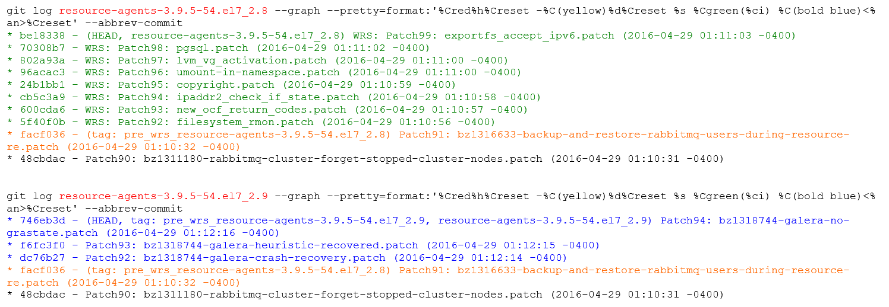

===================
Packaging Reference
===================

This guide contains information about creating StarlingX packages.

.. contents::
   :local:
   :depth: 1

---------------
Tips and tricks
---------------

Here are some things to consider when creating packages:

*   Make sure you have the correct BuildRequires dependencies listed. Mock will
    ensure that these packages are installed in the build environment before
    trying to build the package in question. Be aware that CentOS often uses
    ``-devel`` for developer packages (which typically include headers and the
    ``.so`` shared library link) whereas StarlingX generally uses ``-dev``. For
    BuildRequires, you can use the following:

    *   Instead of ``virtual/x86_64-wrs-linux-gcc``,  you can use ``gcc``.
    *   Instead of ``glib-2.0``, use ``glib2-devel``.
    *   Instead of ``sqlite3``, use ``sqlite-devel``.
    *   You can comment out or delete ``virtual/libc`` and
        ``virtual/x86_64-wrs-linux-compilerlibs``.

*   Typically, you do not need to manually add dependencies due to shared
    libraries to either Requires or Provides in the spec file. RPM will
    usually add them automatically.

*   When your package creates a shared library, make sure to install it with 755
    (or other suitably executable) permissions. The automatic dependency
    handling only runs if the library file is actually executable.

*   It can be useful to refer to a bitbake-generated spec file, especially for
    STX-specific packages. Generally the ``build`` and ``install`` phases are
    missing from the bitbake-generated spec file and you must add them.

*   Make sure all necessary files are listed, because the build_srpm phase will
    only include source files listed in your spec file. In a simple case, this
    can be just the following line: ``Source: %{name}-%{version}.tar.gz``

------------------------------------
STX authored package with a makefile
------------------------------------

This section uses ``fm-common`` as a sample package to convert.

#.  Locate the root directory for the package.

    ::

        cd wr-cgcs/layers/cgcs/middleware/fault/recipes-common/fm-common

#.  Create a directory template in the same location as your current bitbake
    recipe. The presence of a ``centos`` directory will identify packages to be
    compiled for STX on CentOS.

    ::

        mkdir -p centos
        mkdir -p centos/files

#.  The makefile requires an ``install`` build target. However, bitbake will try
    to use ``install`` if it is introduced when it wasn't previously present, so
    we'll use ``install_non_bb`` instead.

    The makefile takes the following parameters: ``DEST_DIR``, ``BIN_DIR``,
    ``LIB_DIR``, ``INC_DIR``, ``MAJOR``, ``MINOR``.

    The basic strategy is to construct the directory tree using
    ``install -m 755 -d some_dir``, then copy files using
    ``install -m 755 from_file some_dir/to_file``

    For versioned libraries, you must create non- or lesser-versioned symlinks,
    for example:

    ::

        ln -s my_lib.so.1.0 some_dir/my_lib.so.1

    Typically, you do not need the ``.so`` installed on the target (it's
    generally only needed for building against). If you do, then it would be
    linked as ``ln -s my_lib.so.1.0 some_dir/my_lib.so`` and would usually be
    part of a ``-dev`` package. Don't forget tabs!!!

::

    vi sources/Makefile
    install_non_bb:
            install -m 755 -d $(DEST_DIR)$(BIN_DIR)
            install -m 755 -d $(DEST_DIR)$(LIB_DIR)
            install -m 755 -d $(DEST_DIR)$(INC_DIR)
            install -m 755 fmClientCli $(DEST_DIR)$(BIN_DIR)
            install -m 644 fmDbAPI.h $(DEST_DIR)$(INC_DIR)
            install -m 644 fmAPI.h $(DEST_DIR)$(INC_DIR)
            install -m 644 fmThread.h $(DEST_DIR)$(INC_DIR)
            install -m 644 fmAlarm.h $(DEST_DIR)$(INC_DIR)
            install -m 644 $(LIBFMCOMMON_SO).$(MAJOR).$(MINOR) $(DEST_DIR)$(LIB_DIR)
            ln -s $(LIBFMCOMMON_SO).$(MAJOR).$(MINOR) $(DEST_DIR)$(LIB_DIR)/$(LIBFMCOMMON_SO).$(MAJOR)
            ln -s $(LIBFMCOMMON_SO).$(MAJOR).$(MINOR) $(DEST_DIR)$(LIB_DIR)/$(LIBFMCOMMON_SO)

***********************
Create an RPM spec file
***********************

Put the RPM spec file under the ``centos`` directory. This is the rpm version
of a bitbake recipe.

::

    vi centos/.spec

RPM spec files support macros and variable. Reference the macro with the
``%{macro_name}`` syntax. Many macros are already defined to help you, such as,
``%{version}`` refers to the ``Version:`` entry in the description section. You
can also define your own macros, for example ``%define local_dir /usr/local``
creates the macro ``local_dir``. Fill in the following sections:

::

    # A short description of the packaged software
    summary:

    # Defines what the package will actually be called
    Name:

    # Should be set to the version of the software being packaged
    Version:

    # A number that is used to represent the number of times the software, at the present version, has been packaged
    Release:

    # Give a list of the source files found in the $BUILD_DIR/SOURCES subdirectory
    # If git managed, usually just one, a tarball that we will create via build script e.g. Source0: %{name}-%{version}.tar.gz
    # Alternatively name the tarball that is brought in via COPY_LIST from $STX_BASE/downloads directory.
    # Many source files can be specified... list any additional files in $BUILD_DIR/SOURCES (likely placed there via COPY_LIST)
    Source0: %{name}-%{version}.tar.gz
    Source1: %{name}.conf
    Source2: %(name}.init

    # List of build requirements
    BuildRequires:

    # List of runtime requirements
    Requires:

    # Describe the package
    %description

    # Describes how to unpack the compressed packages (the setup macro will do it for you)
    %prep
    %setup

    # invoke 'make'
    %build

    # invoke 'make install'
    %install

    # Perhaps call 'make clean' or other cleanup scripts
    %clean

    # List of files to include in the rpm
    %files

    # Apply these permission/ownership overrides and the files that follow
    %defattr(-,root,root,-)

    # Send this file to the standard path for documentation
    %doc some_file

    # Create a directory when the rpm is installed
    %dir some_directory

    # Install this file on this path
    %some_file_path

One spec file can create multiple related rpm files. One common usage is to
place the ``*.so`` file (but not the ``*.so.*`` files) for a shared library and
its ``.h`` interface files in a ``-dev`` or ``-devel`` package. The Bitbake
naming convention is ``-dev``, while CentOS uses ``-devel``. Most of the
StarlingX packages use the ``-dev`` naming convention.

You can create additional packages with ``%package -n package_name``, or
``%package suffix`` which creates a package named ``first_package_name-suffix``.

Following ``%package``, add a unique ``Summary:``, and override any values from the
first package. These additional packages also require a ``%description, %files``
sections, and may require ``%prep, %setup, %build, %install, %clean`` sections. All
these extra sections use the same ``-n package_name`` or ``suffix`` arguments to
define which package they apply to. Refer to the example below, which uses
``fm-common-dev``.

::

    %package -n fm-common-dev Summary: STX Platform Fault Management
    Common Package - Development files Group: devel Requires: fm-common =
    %{version}-%{release} ... %description -n fm-common-dev ... %files -n
    fm-common-dev ...

::

    vi centos/fm-common.spec
    %define local_dir /usr/local
    %define local_bindir %{local_dir}/bin

    Summary: STX Platform Fault Management Common Package
    Name: fm-common
    Version: 1.0
    Release: r26.0
    License: Apache-2.0
    Group: base
    URL: unknown
    Source0: %{name}-%{version}.tar.gz
    BuildRequires: util-linux
    BuildRequires: postgresql-devel
    BuildRequires: libuuid-devel
    Requires: postgresql

    %package -n fm-common-dev
    Summary: STX Platform Fault Management Common Package - Development files
    Group: devel
    Requires: fm-common = %{version}-%{release}

    %description
    STX platform Fault Management Client Library that provides APIs for
    applications to raise/clear/update active alarms.

    %description -n fm-common-dev
    STX platform Fault Management Client Library that provides APIs for
    applications to raise/clear/update active alarms.  This package contains
    symbolic links, header files, and related items necessary for software
    development.

    %prep
    %setup
    %build
    VER=%{version}
    MAJOR=`echo $VER | awk -F . '{print $1}'`
    MINOR=`echo $VER | awk -F . '{print $2}'`
    make  MAJOR=$MAJOR MINOR=$MINOR %{?_smp_mflags}

    %install
    rm -rf $RPM_BUILD_ROOT
    VER=%{version}
    MAJOR=`echo $VER | awk -F . '{print $1}'`
    MINOR=`echo $VER | awk -F . '{print $2}'`
    make DEST_DIR=$RPM_BUILD_ROOT BIN_DIR=%{local_bindir} LIB_DIR=%{_libdir} INC_DIR=%{_includedir} MAJOR=$MAJOR MINOR=$MINOR install_non_bb

    %clean
    rm -rf $RPM_BUILD_ROOT

    %files
    %defattr(-,root,root,-)
    %doc LICENSE
    %dir %{local_dir}
    %dir %{local_bindir}
    %{local_bindir}/*

    %files -n fm-common-dev
    %defattr(-,root,root,-)
    %{_includedir}/*
    %{_libdir}/*

************************
Set up srpm build script
************************

This section describes two options: you can choose to use the default srpm build
script or create your own srpm build script.

#.  Use the default srpm build script, and just provide a few data definitions,
    in bash format.

    ::

        vi centos/build_srpm.data
        Variables you can define. All paths are relative to PKG_BASE (see below) unless prefixed by another environment variable, eg. STX_BASE
        SRC_DIR=my_src_dir
        # Tar everything found in this subdirectory. Define this if source need to be collected into a tarball in $BUILD_DIR/SOURCES.
        # Tar file name and version are derived from your .spec file and/or PKG-INFO file.  Alternatively you may define TAR_NAME and VERSION in your 'build_srpm.data' file

        COPY_LIST="$STX_BASE/downloads/my_tar.tar.gz  my_extra_files_dir  my_script_dir/my_script"
         # A Space separated list of paths to copy.  In the build directory they will by copied into the $BUILD_DIR/SOURCES directory alongside any tarball you may have created via SRC_DIR.

        EXCLUDE_LIST_FROM_TAR=my_omit_dir  my_script_dir/my_omit_script"
        # Omit these paths under SRC_DIR from the tar

        TAR_NAME=nova
        VERSION=1.1
        # The name and version of the package.  Assuming SRC_DIR is specified, a tarball with the name "$TAR_NAME-$VERSION.tar.gz" will be created from from the contents of $SRC_DIR.
        # NOTE: These values are pulled automatically from your .spec ("%global service" or "Name:" and "Version:") or PKG-INFO ("Name:" and "Version:").  You can override the automatic valuation by supplying your own values.

        COPY_LIST_TO_TAR=my_extra_files_dir  my_script_dir/my_script"
         # A Space separated list of paths to copy.  These are added to the tarball itself.  Try to avoid using this... we prefer that tarballs of 3rd party origin remain unaltered.

        TIS_BASE_SRCREV=9af04d8480da4359f766e59c45ac23f199b138b0
        # Last git commit prior to start of TC content

        TIS_PATCH_VER=GITREVCOUNT+3
        # Version is passed into .spec file as rpmmacro to modify package release string.
        # Can contain 'GITREVCOUNT', the count of commits since TIS_BASE_SRCREV

        BUILD_IS_BIG=6
        # An estimate of the disk requirements in GB.  This package won't build on a tmpfs based build environment small than this value.
        # If a build fails on a tmpfs based node due to disk space exhaustion, then at minimum this value must be greater than the tpmfs size
        # as seen in the "MOCKCHAIN_RESOURCE_ALLOCATION=0:10:10:5" log.

        BUILD_IS_SLOW5
        # An estimate of the build time on disk in minutes.
        # A larger value will tell the build system to schedule this job sooner
        # rather than later, to maximize parallelism.

#.  Create your own srpm build script. The goal of the script is to use the
    rpmbuild tool to create one or more ``.src.rpm`` files in the ``$BUILD_DIR/SRPMS``
    directory. The directory itself will be created by rpmbuild.

    ::

        vi centos/build_srpm

    A sample build script might look like this:

    ::

        source "$SRC_BASE/build-tools/spec-utils"

        SRC_DIR=$STX_BASE/git/libvirt

        if [ -f PKG-INFO ]: then
           VERSION=$(grep '^Version:' PKG-INFO | awk -F ': ' '{print $2}' | sed -e 's/^[[:space:]]*//')
           TAR_NAME=$(grep '^Name:' PKG-INFO | awk -F ': ' '{print $2}' | sed -e 's/^[[:space:]]*//')
        else
           SPEC_PATH=$(ls $BUILD_DIR/SPECS/*.spec)
           VERSION=$(spec_evaluate '%{version}' "$SPEC_PATH" 2>> /dev/null)
           NAME=$(spec_evaluate '%{name} "$SPEC_PATH" 2>> /dev/null)
        fi

        BUILD_DIR="$RPMBUILD_BASE"
        EXTRA_FILES="libvirt-1.2.12/libvirt.logrotate "
        EXTRA_FILES+="libvirt-1.2.12/libvirt.lxc "
        EXTRA_FILES+="libvirt-1.2.12/libvirt.qemu "
        EXTRA_FILES+="libvirt-1.2.12/libvirt.uml "

        mkdir -p $BUILD_DIR/SRPMS

        TAR="$TAR_NAME-$VERSION.tar.gz"
        TAR_PATH="$BUILD_DIR/SOURCES/$TAR"

        TAR_NEEDED=0
        if [ -f $TAR_PATH ]; then
           n=`find . -cnewer $TAR_PATH -and ! -path './.git*' \
                                       -and ! -path './build/*' \
                                       -and ! -path './.pc/*' \
                                       -and ! -path './patches/*' \
                                       -and ! -path './$DISTRO/*' \
                                       -and ! -path './pbr-*.egg/*' \
                                       | wc -l`
           if [ $n -gt 0 ]; then
               TAR_NEEDED=1
           fi
        else
           TAR_NEEDED=1
        fi

        if [ $TAR_NEEDED -gt 0 ]; then
           tar czvf $TAR_PATH $EXTRA_FILES \
                              -C $(dirname $SRC_DIR) $(basename $SRC_DIR) \
                              --exclude '.git/' \
                              --exclude '.git*' \
                              --transform "s,^libvirt-1.2.12,extra," \
                              --transform "s,^$(basename $SRC_DIR),$TAR_NAME-$VERSION,"
        fi

        for SPEC in `ls $BUILD_DIR/SPECS`; do
           SPEC_PATH="$BUILD_DIR/SPECS/$SPEC"
           RELEASE=$(grep '^Release:' $SPEC_PATH | awk -F ': ' '{print $2}' | sed -e 's/^[[:space:]]*//')
           NAME=`echo $SPEC | sed 's/.spec$//'`
           SRPM="$NAME-$VERSION-$RELEASE.src.rpm"
           SRPM_PATH="$BUILD_DIR/SRPMS/$SRPM"

           BUILD_NEEDED=0
           if [ -f $SRPM_PATH ]; then
               n=`find . -cnewer $SRPM_PATH | wc -l`
               if [ $n -gt 0 ]; then
                   BUILD_NEEDED=1
               fi
           else
               BUILD_NEEDED=1
           fi

           if [ $BUILD_NEEDED -gt 0 ]; then
               rpmbuild -bs $SPEC_PATH --define="%_topdir $BUILD_DIR"
           fi
        done

The idea is to tar up any source from git into a tarball into
``$BUILD_DIR/SOURCES`` and/or copy tarballs from a downloads directory. Copy any
supporting files into ``$BUILD_DIR/SOURCES`` also. Finally, use rpmbuild to
create a ``.src.rpm``. DO NOT try to compile the binary ``.rpm``.

***************************
Details for build-srpm.data
***************************

This section describes the contents of the ``build-srpm.data`` file, which
customizes the setup when you build :abbr:`SRPM (Source RPM)` files.

**Pre-defined path variables**

You may use any of the following:

::

    SRC_BASE      # Usually the same as $MY_REPO

    STX_BASE      # $MY_REPO/stx

    PKG_BASE      # Base dir for the package. Listed in centos_pkg_dir.
                  # Directory in which CentOS directory is found.

    PATCHES_BASE  # Directory where source patches for the package can be found, typically: $PKG_BASE/$DISTRO/patches

    FILE_BASE     # Directory where supplemental files for the package can be found, typically: $PKG_BASE/$DISTRO/files
                  # Files that can be copied into $BUILD_DIR/SOURCES prior to assembling the .src.rpm

    CGCS_BASE     # same as $STX_BASE, being phased out in favour of PKG_BASE
                  # May be removed in a future release, do not use.

**User-defined variables**

You may define any of the following variables:

::

    SRC_DIR=my_src_dir
    # Tar everything found in this subdirectory. Define this if source need to be collected into a tarball in $BUILD_DIR/SOURCES.
    # Tar file name and version are derived from your .spec file and/or PKG-INFO file. Alternatively you may define TAR_NAME and VERSION in your 'build_srpm.data' file

    COPY_LIST="$STX_BASE/downloads/my_tar.tar.gz my_extra_files_dir my_script_dir/my_script"
    # A Space separated list of paths to copy. In the build directory they will by copied into the $BUILD_DIR/SOURCES directory alongside any tarball you may have created via SRC_DIR.

    EXCLUDE_LIST_FROM_TAR=my_omit_dir my_script_dir/my_omit_script"
    # Omit these paths under SRC_DIR from the tar

    TAR_NAME=nova
    VERSION=1.1
    # The name and version of the package. Assuming SRC_DIR is specified, a tarball with the name "$TAR_NAME-$VERSION.tar.gz" will be created from from the contents of $SRC_DIR.
    # NOTE: These values are pulled automatically from your .spec ("%global service" or "Name:" and "Version:") or PKG-INFO ("Name:" and "Version:"). You can override the automatic valuation by supplying your own values.

    COPY_LIST_TO_TAR=my_extra_files_dir my_script_dir/my_script"
    # A Space separated list of paths to copy. These are added to the tarball itself. Try to avoid using this... we prefer that tarballs of 3rd party origin remain unaltered.

    BUILD_IS_BIG=6
    # An estimate of the disk requirements in GB. This package won't build on a tmpfs based build environment small than this value.
    # If a build fails on a tmpfs based node due to disk space exhaustion, then at minimum this value must be greater than the tpmfs size
    # as seen in the "MOCKCHAIN_RESOURCE_ALLOCATION=0:10:10:5" log.

    BUILD_IS_SLOW=5
    # An estimate of the build time on disk in minutes.
    # A larger value will tell the build system to schedule this job sooner rather than later, to maximize parallelism.

    TIS_PATCH_VER=<expression>
                             # An integer, or one of the supported
                             # variables listed below, or the sum of
                             # variables and integers.
                             # e.g.
                             # TIS_PATCH_VER=PKG_GITREVCOUNT+SRC_GITREVCOUNT+5

           PKG_GITREVCOUNT # Count git revisions relative to PKG_BASE.
                             # Optionally only count from PKG_BASE_SRCREV

           SRC_GITREVCOUNT # Count git revisions relative to SRC_DIR.
                             # Optionally only count from SRC_BASE_SRCREV

           GITREVCOUNT # Deprecated, please use SRC_GITREVCOUNT instead.
                             # Count git revisions relative to SRC_DIR.
                             # Optionally only count from TIS_BASE_SRCREV

           OTHER_GITREVCOUNT # count git revisions from all sources excluding
                             # PKG_BASE and SRC_DIR
                             # Optionally only count from
                             # BASE_SRCREV_FOR_PATH[<path>]

    PKG_BASE_SRCREV=<sha> # Limit PKG_GITREVCOUNT revision count to
                                # commits since <sha>

    SRC_BASE_SRCREV=<sha> # Limit SRC_GITREVCOUNT revision count to
                                # commits since <sha>

    TIS_BASE_SRCREV=<sha> # Deprecated, please use SRC_BASE_SRCREV
                                # instead
                                # Limit GITREVCOUNT revision count to commits
                                # since <sha>

    BASE_SRCREV_FOR_PATH[<path>]=[<sha>|OTHER_PKG_BASE_SRCREV]
                                # Limit OTHER_GITREVCOUNT revision count for
                                # commits under <path> to commits since <sha>.
                                # If <path> is the PKG_BASE of another package
                                # (not the current package) then the keyword
                                # 'OTHER_PKG_BASE_SRCREV' can be used to extract
                                # the 'PKG_BASE_SRCREV' value of the other
                                # package.
                                #
                                # The <path> can reference variables like
                                # $STX_BASE and $GIT_BASE.

    OPT_DEP_LIST=<path-list> # Add a space separated list of paths that
                                  # don't contribute to the content of a src.rpm
                                  # but do contribute to triggering a rebuild,
                                  # and possibly modifying the TIS_PATCH_VER via
                                  # use of OTHER_GITREVCOUNT.

    OPT_DEP_LIST_FOR_BUILD_TYPE[<build-type>]=<path-list>
                                  # For a specific build type only, add a space
                                  # separated list of paths that don't
                                  # contribute to the content of src.rpm,
                                  # but do contribute to triggering a
                                  # rebuild, and possibly modifying the
                                  # TIS_PATCH_VER via use of OTHER_GITREVCOUNT.

*************************************
Add your package to package list file
*************************************

The file name is ``centos_pkg_dirs``. There is a separate package list file for
each git repo. When adding your package, use the relative path from the root of
the git to the desired ``PKG_BASE``.

Using ``package libvirt`` as an example:

*   Spec file:  ``$MY_REPO/stx/integ/virt/libvirt/centos/libvirt.spec``

*   ``PKG_BASE``:  ``%BLUE%$MY_REPO/stx%ENDCOLOR%/%RED%integ/virt/libvirt%ENDCOLOR%``

*   Root of its git tree:  ``$MY_REPO/stx``

*   ``centos_pkg_dirs`` file:  ``%BLUE%$MY_REPO/stx%ENDCOLOR%/centos_pkg_dirs``

The new entry needs to be:  ``%RED%integ/virt/libvirt%ENDCOLOR%
echo "virt/libvirt" >> "$MY_REPO/stx/integ/centos_pkg_dirs"``

******************
Build your package
******************

Complete instructions can be found in the
:ref:`Create StarlingX packages section of the Build Guide <create_stx_pkgs>`.

::

    build-rpms fm-common

*******************
Commit your changes
*******************

::

    git add centos/files/*
    git add centos/fm-common.spec
    git add centos/build_srpm*

    # If you added PKG-INFO
    git add PKG-INFO

    git add sources/Makefile
    git commit

--------------------------
Package without a makefile
--------------------------

In this case, the process is generally similar to the above instructions, but
the ``%build`` section has alternative commands or may be omitted altogether.
The install phase is done directly in the RPM spec file.

For example, the ``collector`` package has no makefile. Its spec file is at
``stx/utilities/tools/collector/centos/collector.spec``. There is no "build"
phase, because the files are scripts. However, the files must be unpacked and
installed into the appropriate locations. The relevant bits look like this:

::

    Source0: %{name}-%{version}.tar.gz

    %prep
    %setup

    %install
    mkdir -p %{buildroot}

    install -d 755 -d %{buildroot}%{_sysconfdir}/collect.d
    install -d 755 -d %{buildroot}%{_sysconfdir}/collect
    install -d 755 -d %{buildroot}/usr/local/sbin
    install -d 755 -d %{buildroot}/usr/local/bin
    install -d 755 -d %{buildroot}%{_sbindir}

    install -m 755 collect %{buildroot}/usr/local/sbin/collect
    install -m 755 collect_host %{buildroot}/usr/local/sbin/collect_host
    install -m 755 collect_date %{buildroot}/usr/local/sbin/collect_date
    install -m 755 collect_utils %{buildroot}/usr/local/sbin/collect_utils
    install -m 755 collect_parms %{buildroot}/usr/local/sbin/collect_parms
    install -m 755 collect_mask_passwords %{buildroot}/usr/local/sbin/collect_mask_passwords
    install -m 755 expect_done %{buildroot}/usr/local/sbin/expect_done

    install -m 755 collect_sysinv.sh %{buildroot}%{_sysconfdir}/collect.d/collect_sysinv
    install -m 755 collect_psqldb.sh %{buildroot}%{_sysconfdir}/collect.d/collect_psqldb
    install -m 755 collect_openstack.sh %{buildroot}%{_sysconfdir}/collect.d/collect_openstack
    install -m 755 collect_networking.sh %{buildroot}%{_sysconfdir}/collect.d/collect_networking
    install -m 755 collect_ceph.sh %{buildroot}%{_sysconfdir}/collect.d/collect_ceph
    install -m 755 collect_sm.sh %{buildroot}%{_sysconfdir}/collect.d/collect_sm
    install -m 755 collect_tc.sh %{buildroot}%{_sysconfdir}/collect.d/collect_tc
    install -m 755 collect_nfv_vim.sh %{buildroot}%{_sysconfdir}/collect.d/collect_nfv_vim
    install -m 755 collect_ovs.sh %{buildroot}%{_sysconfdir}/collect.d/collect_ovs
    install -m 755 collect_patching.sh %{buildroot}%{_sysconfdir}/collect.d/collect_patching
    install -m 755 collect_coredump.sh %{buildroot}%{_sysconfdir}/collect.d/collect_coredump
    install -m 755 collect_crash.sh %{buildroot}%{_sysconfdir}/collect.d/collect_crash
    install -m 755 collect_ima.sh %{buildroot}%{_sysconfdir}/collect.d/collect_ima
    install -m 755 collect_fm.sh %{buildroot}%{_sysconfdir}/collect.d/collect_fm
    install -m 755 collect_containerization.sh %{buildroot}%{_sysconfdir}/collect.d/collect_containerization
    install -m 755 collect_dc.sh %{buildroot}%{_sysconfdir}/collect.d/collect_dc

    install -m 755 etc.exclude %{buildroot}%{_sysconfdir}/collect/etc.exclude
    install -m 755 run.exclude %{buildroot}%{_sysconfdir}/collect/run.exclude

    ln -sf /usr/local/sbin/collect %{buildroot}/usr/local/bin/collect
    ln -sf /usr/local/sbin/collect %{buildroot}%{_sbindir}/collect

Either the ``setup`` or ``autosetup`` macro can be used to unpack the Source0
tarball in ``%{_builddir}``. Next, a number of files are explicitly installed
into ``%{buildroot}``. Most of these come from the unpacked tarball. One file
comes from the original source directory, since it wasn't moved over to
``%{_builddir}`` in the prep phase. All the other sections in the spec file are
treated the same way as the above package.

-----------------------------
OpenStack and Python packages
-----------------------------

These packages are similar to the above as far as requirements, dependencies,
etc. The build phase is a bit different since there is no compilation step
involved.

::

    Source0:          %{name}-%{version}.tar.gz

    %prep
    %setup -q

    %build
    %{__python2} setup.py build

    %install
    %{__python2} setup.py install -O1 --skip-build --root %{buildroot}

    mkdir -p %{buildroot}%{_sysconfdir}/bash_completion.d
    install -pm 644 tools/nova.bash_completion \
        %{buildroot}%{_sysconfdir}/bash_completion.d/nova

In this case, the ``setup`` macro unpacks the Source0 tarball in the prep
phase. Next the ``setup.py`` that is part of the Python package handles
the actual process of building and installing the Python code. During the
install phase, a separate file is installed which isn't handled by the Python
installer.

.. _centos_pkg:

------------------------------------
CentOS package with appended patches
------------------------------------

This example uses the ``parted`` package from CentOS and appends a few
patches of our own.

#.  Assuming this package has never been modified by StarlingX previously, find
    a home for the package. This example uses
    ``$MY_REPO/stx/integ/filesystem/parted``.

    ::

        MY_GIT_ROOT=$MY_REPO/stx/integ
        MY_PKG_ROOT=$MY_GIT_ROOT/filesystem/parted
        mkdir -p $MY_PKG_ROOT
        cd $MY_PKG_ROOT

        # You must also add the new package directory to your local centos_pkg_dirs file if not already present
        echo filesystem/parted >> $MY_GIT_ROOT/centos_pkg_dirs

#.  Create a directory skeleton. The ``patches`` directory contains patches
    applied to the tarball inside the ``src.rpm``. The ``meta_patches``
    directory contains patches applied to the rpmbuild directory of the
    ``.src.rpm`` and are used to modify the ``SPECS/*.spec`` file, or
    the ``SOURCES/*`` files.

    ::

        mkdir -p centos/meta_patches
        mkdir -p centos/patches
        touch centos/meta_patches/PATCH_ORDER
        echo TIS_PATCH_VER=1 > centos/build_srpm.data

#.  Tell ``build-srpms`` where to find the ``src.rpm`` in the ``srpm_path``
    file. Two locations are supported for source RPMS: the
    ``$MY_REPO/cgcs-centos-repo`` directory is for source RPMS provided by
    CentOS. Tell the build system to search for a source RPM using
    the ``mirror:`` prefix when you specify the path to the source RPM.

    ::

        find -L $MY_REPO/cgcs-centos-repo/  -name 'parted*.src.rpm'
        /localdisk/<username>/designer/test/cgcs-root/cgcs-centos-repo/Source/parted-3.1-23.el7.src.rpm

        echo "mirror:Source/parted-3.1-23.el7.src.rpm" > centos/srpm_path

    The other location supported by ``build-srpms`` is the downloads subgit of
    your layers (found in ``$MY_REPO/stx/downloads`` for CGCS, for example).
    This should be used for packages that CentOS does not provide. In this case,
    place the source RPM you downloaded in the directory, and use the ``repo:``
    prefix when creating your ``srpm_path`` file. The base path for ``repo:``
    is ``$MY_REPO``, so specify paths from that point.

    ::

        cp ~/Downloads/somepackage-1.2-3.src.rpm $MY_REPO/stx/downloads
        echo "repo:stx/downloads/somepackage-1.2-3.src.rpm" > centos/srpm_path

#.  (Optional) Set up a git environment to create your patch. The SRPM will be
    extracted, then the source tarball will be extracted and patched.

    ::

        # clean any prior edit environment that might exist
        #
        build-srpms --edit --clean parted

        #
        # Create a working edit environment
        #
        build-srpms --edit parted
        ...
        ===== 'parted' has been extracted to for editing. =====
        ===== Metadata can be found at: /localdisk/loadbuild/<username>/test/std/srpm_work/parted/rpmbuild
        ===== Source code can be found at: /localdisk/loadbuild/<username>/test/std/srpm_work/parted/gits/parted.spec/parted-3.1

        #
        # Create you patch
        #
        cd  $MY_WORKSPACE/std/srpm_work/parted/gits/parted.spec/parted-3.1

        edit

        # create a patch
        git add
        git commit -m 'foo bar'
        git format-patch -n HEAD^
           0001-foo-bar.patch

        # Copy it to the repo... probabbly best to drop the missleading 0001 prefix
        mv 0001-foo-bar.patch $MY_PKG_ROOT/centos/patches/foo-bar.patch

        # undo the commit, if patch failed testing and needs more work
        git reset --soft HEAD~

        #
        # Now create a meta_patch to add your patch to the spec file
        #
        cd $MY_WORKSPACE/std/srpm_work/parted/rpmbuild

        # modify Release to include tis patch version, add our patch to the end of the patch list
        vi SPECS/parted.spec
           ....
           Release: 23.el7%{?_tis_dist}.%{tis_patch_ver}
           ....
           Patch34: 0034-tests-Use-wait_for_dev_to_-functions.patch

           # WRS
           Patch35: syscalls.patch
           Patch36: foo-bar.patch
           ...
           # if the %prep/%setup section does not use 'git am %{patches}' which automatically applies all patches,
           # then it should contain a list of %patch macros (one per patch) and you will have to append your patch to the end of the list.
           # %patch macros are basically just invocations of the 'patch' command to apply your patches.  e.g. like this
           %patch35 -p1
           %patch36 -p1

        git add SPECS/parted.spec

        # Optionally edit and add files in SOURCES/
        git commit -m 'meta foo bar'
        git format-patch -n HEAD^
           0001-meta-foo-bar.patch

        # Copy it to the repo... probabbly best to drop the missleading 0001 prefix
        mv 0001-meta-foo-bar.patch $MY_PKG_ROOT/centos/meta_patches/meta-foo-bar.patch

        # undo the commit, if patch failed testing and needs more work
        git reset --soft HEAD~

        #
        # Finally add the meta patch to the patch order file... so that the patches vs the spec file apply in the correct order
        #
        echo meta-foo-bar.patch >> $MY_PKG_ROOT/centos/meta_patches/PATCH_ORDER

#.  (Optional) Create a ``build_srpm.data`` file and add a ``COPY_LIST`` which
    identifies additional files to copy into SOURCES before finalizing the srpm.

    ::

        vi  $MY_PKG_ROOT/centos/build_srpm.data
        COPY_LIST="files/resizepart.sh"

    .. note::

            The order is SRPM extracted first, then copy ``centos/patches/*``
            into SOURCES, then apply meta patches, then copy anything named in
            ``COPY_LIST`` into SOURCES. ``COPY_LIST`` items are not available
            for meta patching. Just edit them directly.

#.  Build the final ``src.rpm`` with your new changes inserted.

    ::

        build-srpms --clean parted
        build-srpms parted

#.  Build the rpm.

    ::

        build-rpms --clean parted
        build-rpms parted
        Verify contents of rpm:
        build-rpms --no-descendants parted
        cd $MY_WORKSPACE/rpmbuild
        mkdir TMP; cd TMP
        rpm2cpio parted-3.1-23.el7.tis.1.x86_64.rpm | cpio -ivmd

#.  Test. If it fails, go back to step 4.

#.  Commit.

    ::

        cd $MY_PKG_ROOT
        git add meta_patches/PATCH_ORDER  meta_patches/meta-foo-bar.patch  patches/foo-bar.patch
        # add these as required
        git add centos/srpm_path
        git add centos/build_srpm.data
        git commit -F
        ... rebase/push...

#.  Discard the working directory and its temporary gits created in step 4.

    ::

        build-srpms --clean --edit parted

-------------------------------------------------
Up-version a CentOS package with appended patches
-------------------------------------------------

Suppose you have a patched srpm ``resource-agents-3.9.5-54.el7_2.8.src.rpm`` and
you want to migrate to a newer srpm, for example,
``resource-agents-3.9.5-54.el7_2.8.src.rpm``.

First question: How do I know if there is a newer version available? If the
local CentOS mirror has been updated, you can scan it for new srpms that have
local WRS patches using:

::

    find_patched_srpms_needing_upgrade
       /localdisk/designer/<username>/test/cgcs-root/stx/recipes-cgl/cluster-resource-agents/centos/srpm_path: resource-agents-3.9.5-54.el7_2.8.src.rpm ==> resource-agents-3.9.5-54.el7_2.9.src.rpm

This tells you that there are patches for
``resource-agents-3.9.5-54.el7_2.8.src.rpm``, but a newer version is available
(``resource-agents-3.9.5-54.el7_2.9.src.rpm``). You should probably migrate the
patches to the new ``resource-agents-3.9.5-54.el7_2.9.src.rpm``. No output
means no migrations are required at this time.

#.  Check out the old version with our patches.

    ::

        build-srpms resource-agents --edit --clean
        build-srpms resource-agents --edit

#.  Point the ``srpm_path`` at the new source rpm.

    ::

        vi $MY_REPO/cgcs-root/stx/recipes-cgl/cluster-resource-agents/centos/srpm_path
          mirror:CentOS/vault.centos.org/7.2.1511/updates/Source/SPackages/resource-agents-3.9.5-54.el7_2.9.src.rpm

#.  Check out the new version without our patches.

    ::

        build-srpms resource-agents --edit --no-meta-patch
        ...
        ===== 'resource-agents' has been extracted for editing. =====
        ===== Metedata can be found at: /localdisk/loadbuild/<username>/test/std/srpm_work/resource-agents/rpmbuild
        ===== Source code can be found at: /localdisk/loadbuild/<username>/teststd//srpm_work/resource-agents/gits/resource-agents.spec/ClusterLabs-resource-agents-5434e96

#.  You now have two directories, each a git tree with two branches, one based
    on the old srpm, one on the new srpm.

    ::

        cd $MY_WORKSPACE/std/srpm_work/resource-agents/rpmbuild

        git branch --all
          master
          resource-agents-3.9.5-54.el7_2.8
        * resource-agents-3.9.5-54.el7_2.9

        cd $MY_WORKSPACE/std/srpm_work/resource-agents/gits/resource-agents.spec/ClusterLabs-resource-agents-5434e96
        git branch --all
          master
          resource-agents-3.9.5-54.el7_2.8
        * resource-agents-3.9.5-54.el7_2.9

#.  Show the commit histories of the two branches to identify the work to do.

    ::

        cd $MY_WORKSPACE/std/srpm_work/resource-agents/gits/resource-agents.spec/ClusterLabs-resource-agents-5434e96

        git log resource-agents-3.9.5-54.el7_2.8 --graph --pretty=format:'%Cred%h%Creset -%C(yellow)%d%Creset %s %Cgreen(%ci) %C(bold blue)<%an>%Creset' --abbrev-commit
        * be18338 - (HEAD, resource-agents-3.9.5-54.el7_2.8) WRS: Patch99: exportfs_accept_ipv6.patch (2016-04-29 01:11:03 -0400)
        * 70308b7 - WRS: Patch98: pgsql.patch (2016-04-29 01:11:02 -0400)
        * 802a93a - WRS: Patch97: lvm_vg_activation.patch (2016-04-29 01:11:00 -0400)
        * 96acac3 - WRS: Patch96: umount-in-namespace.patch (2016-04-29 01:11:00 -0400)
        * 24b1bb1 - WRS: Patch95: copyright.patch (2016-04-29 01:10:59 -0400)
        * cb5c3a9 - WRS: Patch94: ipaddr2_check_if_state.patch (2016-04-29 01:10:58 -0400)
        * 600cda6 - WRS: Patch93: new_ocf_return_codes.patch (2016-04-29 01:10:57 -0400)
        * 5f40f0b - WRS: Patch92: filesystem_rmon.patch (2016-04-29 01:10:56 -0400)
        * facf036 - (tag: pre_wrs_resource-agents-3.9.5-54.el7_2.8) Patch91: bz1316633-backup-and-restore-rabbitmq-users-during-resource-re.patch (2016-04-29 01:10:32 -0400)
        * 48cbdac - Patch90: bz1311180-rabbitmq-cluster-forget-stopped-cluster-nodes.patch (2016-04-29 01:10:31 -0400)

        git log resource-agents-3.9.5-54.el7_2.9 --graph --pretty=format:'%Cred%h%Creset -%C(yellow)%d%Creset %s %Cgreen(%ci) %C(bold blue)<%an>%Creset' --abbrev-commit
        * 746eb3d - (HEAD, tag: pre_wrs_resource-agents-3.9.5-54.el7_2.9, resource-agents-3.9.5-54.el7_2.9) Patch94: bz1318744-galera-no-grastate.patch (2016-04-29 01:12:16 -0400)
        * f6fc3f0 - Patch93: bz1318744-galera-heuristic-recovered.patch (2016-04-29 01:12:15 -0400)
        * dc76b27 - Patch92: bz1318744-galera-crash-recovery.patch (2016-04-29 01:12:14 -0400)
        * facf036 - (tag: pre_wrs_resource-agents-3.9.5-54.el7_2.8) Patch91: bz1316633-backup-and-restore-rabbitmq-users-during-resource-re.patch (2016-04-29 01:10:32 -0400)
        * 48cbdac - Patch90: bz1311180-rabbitmq-cluster-forget-stopped-cluster-nodes.patch (2016-04-29 01:10:31 -0400)

    The image below shows the color-coded results of the comparison.

    *   The patches in green with ``WRS:`` in the patch name must be
        ported.

    *   The commit in orange noted with ``tag:`` was the last common commit.

    *   The patches in blue are new patches from upstream that may interfere with
        our patches.

   *Figure 1: Patch comparison*

--------------------------------
Package providing an init script
--------------------------------

The packages/recipes that provide an init script (found under ``/etc/init.d/``
and corresponding ``/etc/rc.d/``) must be converted to systemd services.
Within STX there are two kinds of services:

*   Services that must be started on boot.

*   Services that are monitored by pmond (and automatically restarted in case of
    failure). In this case, we don't want systemd to restart a process in case
    of failure.

The general idea about converting those services is to still keep the script
file installed under ``/etc/init.d/`` in the short term and wrap it in a
systemd service. This is needed so that service dependencies can be evaluated by
systemd and start them in the right sequence on boot. Re-using the same init
script at the moment is more convenient for supporting the same code base for
wrlinux and CentOS packaging (no need to support multiple version of the same
script).

Given an example init script ``/etc/init.d/helloworld``, create a corresponding
``helloworld.service`` file:

::

    [Unit]
    Description=Helloworld service

    # Configures requirement dependencies on other services. If this service gets activated, the
    # services listed here will be activated as well. If one of the other services gets deactivated or
    # its activation fails, this service will be deactivated.
    Requires=

    # A weaker version of Requires. Services listed in this option will be started if the configuring
    # unit is. However, if the listed services fail to start, this has no impact on the current service.
    Wants=

    # The next two directives are important for specifying the services dependancies. This will indicate
    # to systemd in which order services should be started. This does not imply a dependency
    # relationship ('Requires' or 'Wants') and must be used in conjunction with one of the above
    # directives if this is desired.

    # The services listed in this directive will be started before starting the current service.
    After=syslog.target network.target

    # The services listed in this directive will not be started until the current service is marked as
    # started if they are activated at the same time.
    Before=

    [Service]
    # Usual types are 'oneshot', 'simple' and 'forking'.
    # oneshot: The process is not a daemon running in the background. Systemd will wait that the process
    #          exit before continuing.
    # simple: Systemd will fork the process.
    # forking: The process will call fork().  It is recommended to use 'PIDfile' in this case so that
    #          systemd can identify the process.
    Type=oneshot

    # Commands with their arguments that are executed when this service is started
    ExecStart=/etc/init.d/helloworld start

    # Additional commands that are executed before command in ExecStart
    ExecStartPre=

    # Additional commands that are executed after command in ExecStart
    ExecStartPost=

    # Commands to execute to stop the service
    ExecStop=/etc/init.d/helloworld stop

    # Additional commands that are executed after the service is stopped
    ExecStopPost=

    # Commands to execute to trigger a configuration reload in the service
    ExecReload=

    # Only useful when 'Type' is 'forking'.  PID file is important if the process is monitored by pmond.
    PIDFile=/var/run/helloworld.pid

    # Configures whether the service shall be restarted when the service process exits.
    # Should be 'always' is systemd should monitor the process.
    # Should be 'no' (default) if process is monitored by pmond.
    Restart=

    [Install]
    # This enables to service to be started on boot. It is equivalent of init runlevel (see below for equivalence).  This
    # means that the current service will be started when the listed unit is started.  All the other services that are
    # also dependent on this target will also get started, the order will depends on the 'After' and 'Before' options
    # specified above.
    WantedBy=multi-user.target

Once the systemd service file is defined, it needs to be packaged in the rpm.
The ``helloworld.service`` file must be installed in the ``/etc/systemd/system/``
directory (recommended for STX services) by the rpm spec. It's important to set
file permissions to 664. The systemd services must be enabled on install
and disabled on uninstalled. This is achieved by using the systemd command
systemctl enable (and disable). However, it is recommended to use the macros
already defined by rpm. For example:

::

    %install
    install -d -m 755 %{buildroot}/etc/systemd/system/
    install -p -D -m 664 helloworld.service %{buildroot}/etc/systemd/system/helloworld.service

    # Enable the service and start it.
    %post
    %systemd_post helloworld.service

    # Disable the service and stop it.
    %preun
    %systemd_preun helloworld.service

    # Try to restart the service.  Usefull on upgrades.
    %postun
    %systemd_postun_with_restart helloworld.service

Systemd searches these directories for services (in order of precedence, the
first item has higher precedence than the one following):

*   ``/etc/systemd/system/`` Recommended and reserved location for system
    administrator customized services
*   ``/run/systemd/system/`` Mainly used by CentOS. Don't pollute this
    directory.
*   ``/usr/lib/systemd/system/``

CentOS is distributed with a number of predefined targets that are more or less
similar to the standard set of runlevels. Use the following comparison table for
specifying your WantedBy target.

*   runlevel0.target -> poweroff.target
*   runlevel1.target -> rescue.target
*   runlevel2.target -> multi-user.target
*   runlevel3.target -> multi-user.target
*   runlevel4.target -> multi-user.target
*   runlevel5.target -> graphical.target
*   runlevel6.target -> reboot.target

Convert to systemd service (without intermediate init script):

*   The exact PID file name that is used by pmond can be found by looking on an
    installed system under ``/etc/pmon.d/``. Look for ``pidfile=`` in the
    corresponding pmond configuration file for the service.

*   Some of the init scripts are using start-stop-daemon to manage processes.
    The start-stop-package has been ported to CentOS (it is not supported by
    CentOS). Make sure the init script is providing the right ``--pidfile``
    argument that matches the pmond service configuration. A process that is
    started by start-stop-daemon with the ``--daemon`` or ``-d`` options
    indicates that the processes will be forked, in which case the systemd
    service Type should be forking. Else if the script or process doesn't fork,
    the Type should be simple which will tell systemd to fork it.

*   Hints for defining service startup order (Before and After):

    *   Systemd determines when a service should start using the ``After=``
        and ``Before=`` values found in the ``[Unit]`` section of the ``service``
        file. These values take a space-separated list of other services or
        *targets*, where a target is effectively a collection of services. For
        example, the log management service has the following values:

        ::

            [Unit]
            Description=StarlingX Log Management
            After=network.target syslog-ng.service iscsid.service sw-patch.service
            Before=config.service pmon.service

        In this example, the log management service can't start until software
        is patched, and a network, a disk and the syslog-ng service are all up
        and running.

    *   The init script might contain some specific information about the order.
        Look for Required-Start and Required-Stop in it.

Troubleshooting (at runtime):

*   Enable a service: ``systemctl enable``
*   Disable a service: ``systemctl disable``
*   Start a service: ``systemctl start``
*   Stop a service: ``systemctl stop``
*   Get service status: ``systemctl status``
*   Get list of running units ordered by time to init: ``systemd-analyze blame``
*   Show systemd logging: ``journalctl /usr/lib/systemd/systemd``
*   Show logging of a specific service: ``journalctl _SYSTEMD_UNIT=``

--------------------------------
After you've converted a package
--------------------------------

Each repo has a ``centos_iso_image.inc`` file, which contains the list of
packages to be included in the installation iso relevant to the repo. The
``build-iso`` step merges the individual ``centos_iso_image.inc`` files to
generate the complete list.

