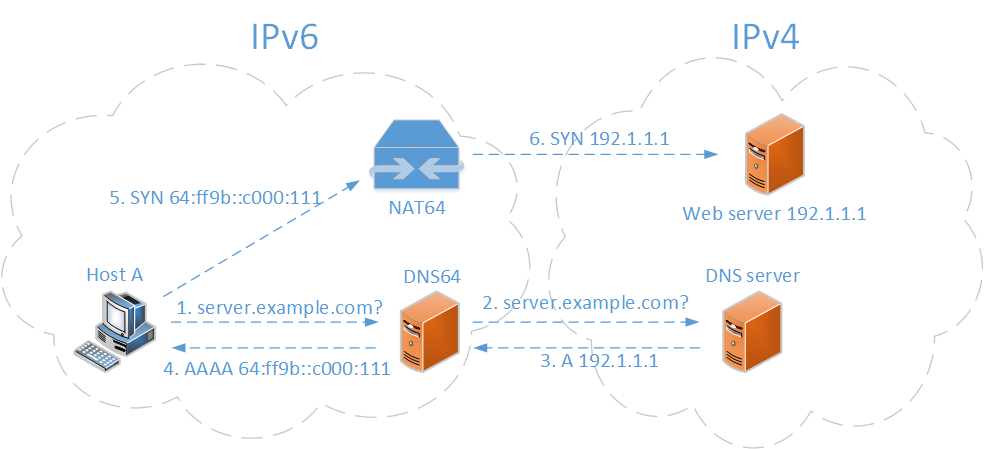
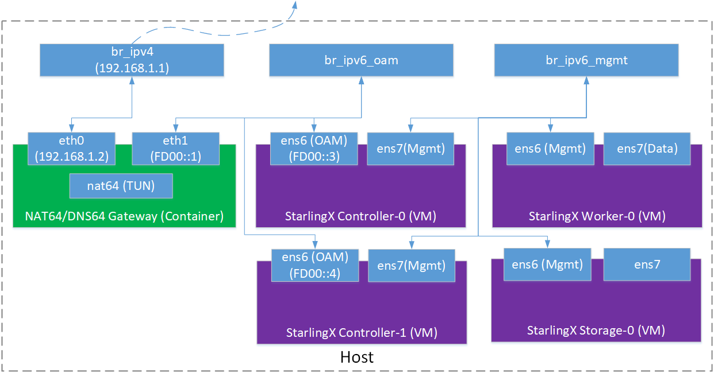

=========================
StarlingX IPv6 Deployment
=========================

.. contents::
   :local:
   :depth: 2

----------
Background
----------

StarlingX cluster networking supports both IPv4 and IPv6 (dual stack is not
supported). The current `StarlingX Installation Guide
<https://docs.starlingx.io/deploy_install_guides/index.html>`_ is only
applicable to IPv4 deployment.

StarlingX releases before release 2.0 contain all required packages in the ISO
image, so a network connection to the public network is not required during
installing, bootstrapping, and provisioning.

Beginning with the StarlingX 2.0 release, a native bare metal Kubernetes cluster
with OpenStack runs within containers on top of the cluster, instead of the
host platform. Docker images (for both platform application and OpenStack) are
installed on external image registries and expected to be pulled during the
bootstrapping and provisioning.

Pulling Docker images from external image registries is not difficult for
StarlingX IPv4 deployment. However, it can be a big challenge for StarlingX
IPv6 deployment because IPv6 is not well supported by current
public/corporate networks. A solution is required to allow StarlingX nodes in
the IPv6 domain to be able to access registry servers in the IPv4 domain.

There are several solutions for this requirement, IPv6 capable proxy,
NAT64/DNS64 gateway, local registry with IPv6 support, etc. In this document,
we'd like to share our practice in NAT64/DNS64 gateway based StarlingX IPv6
deployment.

-----------------
NAT64/DNS64 Brief
-----------------

NAT64 is an IPv6 transition mechanism that facilitates communication between
IPv6 and IPv4 hosts by using a form of network address translation (NAT). NAT64
gateway is a translator between IPv4 and IPv6 protocols. NAT64 was standardized
in `RFC 6052 <https://tools.ietf.org/html/rfc6052>`_,
`RFC 6145 <https://tools.ietf.org/html/rfc6145>`_, and
`RFC 6146 <https://tools.ietf.org/html/rfc6146>`_.

DNS64 describes a DNS server that when asked for a domain's AAAA records, but
only finds A records, synthesizes the AAAA records from the A records. DNS64
was standardized in `RFC 6147 <https://tools.ietf.org/html/rfc6147>`_.

The figure below demonstrates how an IPv6 host access an IPv4 web server with
the assistance of an NAT64/DNS64 gateway. The access is transparent to the IPv6
host. It doesn't even know the web server is in an IPv4 domain.

     *Figure 1: NAT64 and DNS64*

#. Host A sends a DNS request to the DNS64 server for the IPv6 address of the
   web server.
#. The DNS64 server forwards the DNS request to the DNS server in IPv4 domain.
#. The DNS server sends the web server's IPv4 address back to the DNS64 server.
#. The DNS64 server synthesizes an IPv6 address by combining the IPv4 address
   and a pre-defined IPv6 prefix and sends the synthesized IPv6 address to host
   A.
#. Host A uses the IPv6 address to access the web server through the NAT64
   server.
#. The NAT64 server knows how the IPv6 address was synthesized. It can
   translate the IPv6 packets from host A to IPv4 packets by replacing the IPv6
   address with the real IPv4 address of the web server, and making other
   necessary modifications. After the translation, the NAT64 server sends
   the packets to the web server. When it gets the response from the web
   server, the NAT64 server will translate the IPv4 packets back to IPv6 packets
   before sending them to host A.

-------------------------------------------
NAT64/DNS64 based StarlingX IPv6 deployment
-------------------------------------------

For a generic StarlingX IPv4 deployment, refer to the
`StarlingX Installation Guide <https://docs.starlingx.io/deploy_install_guides/index.html>`_.

In this guide, all the operations are based on a virtual deployment (all
StarlingX nodes are VMs), to introduce how to use a NAT64/DNS64 server to make
a StarlingX IPv6 deployment.

The diagram below demonstrates the infrastructure of the experimental setup. For
simplicity, the NAT64/DNS64 servers are combined together and the gateway is
running in a container.

     *Figure 2: NAT64/DNS64 based StarlingX IPv6 Deployment*

* There are three bridge devices in the picture, `br_ipv4`, `br_ipv6_oam` and
  `br_ipv6_mgmt`. `br_ipv4` is for the IPv4 domain connection. It is connected
  to the outside of the host via the host NIC. `br_ip6_oam` is for the StarlingX
  OAM network. `br_ipv6_mgmt` is for the StarlingX management network. The two
  bridges are not connected to the outside.
* The green block is the NAT64/DNS64 gateway running in a container. The
  container has two NICs: `eth0` is connected to the IPv4 domain and `eth1` is
  connected to the IPv6 domain.
* The purple blocks are VMs for StarlingX nodes. `Controller-0&1` are connected
  to both the `br_ipv6_oam` and `br_ipv6_mgmt` bridges. Worker nodes and storage
  nodes are connected to the `br_ipv6_mgmt` bridge.
* The example uses the IP addresses 192.168.1.0/24 for the IPv4 domain and
  FD00::0/96 for the IPv6 domain.

***********************************
How to set up a NAT64/DNS64 gateway
***********************************

There are many implementations of NAT64 available.
`TAYGA <http://www.litech.org/tayga>`_ is an out-of-kernel stateless NAT64
implementation for Linux. It uses the
`TUN <https://www.kernel.org/doc/Documentation/networking/tuntap.txt>`_ driver
to exchange IPv4 and IPv6 packets with the kernel. `TAYGA` is easy to use and
configure, which is why it was chosen in this example.

For the same reason, `BIND <https://www.isc.org/bind>`_ was chosen as the DNS64
solution in this setup. It is a very flexible, full-featured DNS system.
DNS64 support is added from BIND 9.8.0.

~~~~~~~~~~~~~~~~~~~~~~~
Build the gateway image
~~~~~~~~~~~~~~~~~~~~~~~

Below is the dockerfile to build the container image. The base image
is Ubuntu 18.04. `TAYGA` and `BIND` are both installed via ``apt-get``.
``run.sh`` is a script to make necessary configurations and start the
two services. `named.conf.options` is `BIND`'s configuration file.

::

  # Version 0.5
  FROM ubuntu:18.04
  RUN apt-get update
  RUN apt-get install tayga bind9 bind9utils bind9-doc -y
  RUN apt-get install iproute2 iptables dnsutils vim iputils-ping -y

  WORKDIR /opt
  ADD run.sh /opt/run.sh
  ADD named.conf.options /etc/bind/named.conf.options

The script ``run.sh`` does a couple of things:

#. Get the IP addresses of the two interfaces
#. Dynamically create a configuration file for `TAYGA`
#. Make necessary configurations (IP address, routing rules and iptables) and
   start `TAYGA` service
#. Modify `BIND` configuration file and start `BIND` service

Please note that in this script:

#. An IPv6 address prefix as **fd00:ffff** is specified.
   That means an IPv4 address `x.x.x.x` will be mapped to an IPv6 address
   **fd00:ffff::x.x.x.x**.
#. `192.168.255.0/24` is an IPv4 address pool used by `TAYGA` inside the
   container.

Here's the content of ``run.sh``:

::

    #! /bin/bash
    # variables
    prefix=${1:-fd00:ffff}
    gw_ipv4=${2:-192.168.1.1}
    echo "$prefix, $gw_ipv4"

    # get container ip
    ext_if=eth0
    int_if=eth1
    ext_ip=`ifconfig ${ext_if}  | grep 'inet ' | cut -d' ' -f10`
    int_ip=`ifconfig eth1  | grep 'inet6 ' | grep -v "fe80" | cut -d' ' -f10`

    #############
    # start nat64
    #############
    cat << EOF | tee tayga.conf
    tun-device nat64
    ipv4-addr 192.168.255.1
    prefix $prefix::/96
    dynamic-pool 192.168.255.0/24
    data-dir /var/db/tayga
    EOF

    mkdir -p /var/db/tayga
    # create TUN device
    tayga --mktun
    ip link set nat64 up
    # IP and routing settings
    ip addr add $int_ip dev nat64
    ip addr add $ext_ip dev nat64
    ip route add 192.168.255.0/24 dev nat64
    ip route add $prefix::/96 dev nat64
    ip route del default
    ip route add default via $gw_ipv4
    # set up NAT44
    iptables -t nat -A POSTROUTING -o $ext_if -j MASQUERADE -s 192.168.255.0/24
    tayga -c tayga.conf

    #############
    # start dns64
    #############
    sed -i "s#dns64 xxxx:ffff::/96 {#dns64 $prefix::/96 {#g" /etc/bind/named.conf.options
    service bind9 start

    echo "start services done!"

In named.conf.options, the option ``dns64`` is configured as below. Please note
that ``dnssec-validation`` must be set to ``no``. ``127.0.0.11`` is configured
in the option ``forwarders``. The value of the IP depends on the resolver
configured for the container. Docker internally uses libnetwork to configure and
enable the embedded DNS resolver. Libnetwork binds the resolver to the
container's loopback interface, so that DNS queries at ``127.0.0.11`` can be
routed (via iptables) to the ``backend DNS resolver`` in the Docker Engine.
That's why ``127.0.0.11`` is configured here. The DNS64 server will forward DNS
queries to ``127.0.0.11``.

::

      options {
              directory "/var/cache/bind";
              forwarders {
                      127.0.0.11;
              };
              forward only;

              dnssec-validation no;

              auth-nxdomain no;    # conform to RFC1035
              listen-on-v6 { any; };
              dns64 xxxx:ffff::/96 {
                      clients { any; };
                      recursive-only yes;
                      break-dnssec yes;
                      exclude { any; };
              };
      };

~~~~~~~~~~~~~~~~~~~~~~~~~~~
Start the gateway container
~~~~~~~~~~~~~~~~~~~~~~~~~~~

Before starting the gateway container, the two bridges, `br_ipv4` and
`br_ipv6_oam`, should be created. Use the ``docker network`` command to create
these two bridges instead of the ``brctl`` command. In addition creating a
bridge device, ``docker network`` will assign a specific subnet to the bridge
and add the necessary iptables rules to make sure the bridge can access the
outside of the host.

`br_ipv6_mgmt` is used to connect the management network of StarlingX nodes.
This setup is covered in the `Starling Installation Guide
<https://docs.starlingx.io/deploy_install_guides/index.html>`_.

The IPv4 and IPv6 addresses used by the gateway container shown in Figure 2 are
all specified in the following script.

Running a container with two NICs is a little tricky. ``docker run`` doesn't
support attaching a container to two networks. Here's the solution:

#. Use ``docker create`` and ``docker start`` to create and start a container
   first.
#. Use ``docker network`` to connect the container to the second network.

Here's an example of the script to start the gateway container:

::

      #! /bin/bash

      IMAGE_NAME=nat64_dns64_gw
      TAG=1.0
      FULL_IMAGE_NAME="$IMAGE_NAME:$TAG"
      CONTAINER_NAME="nat64_dns64_gw"

      ipv6_br_name=br_ipv6_oam
      prefix=fd00
      ipv6_prefix=$prefix:ffff
      ipv6_subnet=$prefix::/96
      ipv6_br_ip=$prefix::ff
      ipv6_srv_ip=$prefix::1

      ipv4_br_name=br_ipv4
      ipv4_subnet=192.168.1.0/24
      ipv4_br_ip=192.168.1.1
      ipv4_srv_ip=192.168.1.2

      # create networks
      v6net=$(docker network ls | grep $ipv6_nw_name)
      if [ -z "$v6net" ]; then
              echo "create network $ipv6_nw_name"
              docker network create --driver=bridge -o \
                      "com.docker.network.bridge.name=$ipv6_br_name" \
                      --subnet $ipv6_subnet --gateway=$ipv6_br_ip --ipv6 \
                      $ipv6_nw_name
      fi
      v4net=$(docker network ls | grep $ipv4_nw_name)
      if [ -z "$v4net" ]; then
              echo "create network $ipv4_nw_name"
              docker network create --driver=bridge \
                    -o "com.docker.network.bridge.name=$ipv4_br_name" \
                    -o "com.docker.network.bridge.enable_ip_masquerade=true" \
                    --subnet $ipv4_subnet \
                    --gateway=$ipv4_br_ip \
                    $ipv4_nw_name
      fi

      # run your container
      echo "start container $CONTAINER_NAME"
      docker create -it --net $ipv4_nw_name \
              --ip $ipv4_srv_ip \
              --name $CONTAINER_NAME
              --cap-add=NET_ADMIN \
              --device=/dev/net/tun
              --sysctl net.ipv6.conf.all.disable_ipv6=0 \
              --sysctl net.ipv4.ip_forward=1 \
              --sysctl net.ipv6.conf.all.forwarding=1 \
              $FULL_IMAGE_NAME /bin/bash
      docker start $CONTAINER_NAME
      docker network connect $ipv6_nw_name --ip6 $ipv6_srv_ip $CONTAINER_NAME
      docker exec -d $CONTAINER_NAME /opt/run.sh $ipv6_prefix $ipv4_br_ip

************************************************************
How to bootstrap and provision StarlingX for IPv6 deployment
************************************************************

Once the NAT64/DNS64 gateway is ready, it's time to start installing StarlingX
by following the `StarlingX Installation Guide
<https://docs.starlingx.io/deploy_install_guides/index.html>`_.

~~~~~~~~~~~~~~~~~~~
Bootstrap StarlingX
~~~~~~~~~~~~~~~~~~~

At the first boot-up of `controller-0`, the gateway and routing rules need to be
configured before bootstrapping.

In this example, ens6 is the interface of the OAM network, f00::1 is the IP
address of the NAT64/DNS64 gateway, and fd00:ffff::/96 is the synthesized
IPv6 address:

::

      sudo ip addr add fd00::3/96 dev ens6
      sudo ip -6 route add fd00:ffff::/96 via fd00::1
      sudo ip -6 route add default dev ens6

For a StarlingX simplex case, a `localhost.yml` like the example below is needed
to bootstrap `controller-0`.

::

      ---
      system_mode: simplex

      admin_username: admin
      admin_password: <sysadmin-password>
      ansible_become_pass: <sysadmin-password>

      external_oam_subnet: fd00::/96
      external_oam_gateway_address: fd00::1
      external_oam_floating_address: fd00::3

      dns_servers:
        - fd00::1

      management_subnet: fd01::/96
      management_multicast_subnet: ff08::1:1:0/124
      cluster_host_subnet: fd02::/96
      cluster_pod_subnet: fd03::/96
      cluster_service_subnet: fd04::/112

For a StarlingX duplex or multi-node case, the sample `localhost.yml` is as
shown below:

::

      ---
      system_mode: duplex

      admin_username: admin
      admin_password: <sysadmin-password>
      ansible_become_pass: <sysadmin-password>

      management_subnet: fd01::/96
      management_start_address: fd01::2
      management_end_address: fd01::50

      external_oam_subnet: fd00::/96
      external_oam_gateway_address: fd00::1
      external_oam_floating_address: fd00::2
      external_oam_node_0_address: fd00::3
      external_oam_node_1_address: fd00::4

      dns_servers:
        - fd00::1

      management_multicast_subnet: ff08::1:1:0/124
      cluster_host_subnet: fd02::/96
      cluster_pod_subnet: fd03::/96
      cluster_service_subnet: fd04::/112

~~~~~~~~~~~~~~~~~~~
Provision StarlingX
~~~~~~~~~~~~~~~~~~~

For duplex or multi-node cases, additional configurations are required because
in the StarlingX system, the pxeboot network and management network share the
same link. In the current support for IPv6, the management interface needed to
be isolated as a VLAN interface, and an untagged pxeboot network must be
configured. Otherwise, `controller-1` fails to get IPv6 address on the first
boot-up.

The following shows the commands to create VLAN interface for the management
network during the provision stage of `controller-0`.

With these commands, a logic interface called `mgmt_vlan` with VLAN id 100 on
the port `ens7` is created, and management and cluster networks are assigned to
this interface. Pxeboot network is assigned to the interface `ens7` (untagged).
(No need to do this again on `controller-1`, StarlingX will take care of the
VLAN interface creation for `controller-1`.)

::

      $ system host-if-add controller-0 mgmt_vlan vlan ens7 -V 100
      $ system host-if-modify controller-0 ens7 -c platform
      $ system host-if-modify controller-0 mgmt_vlan -c platform
      $ system interface-network-assign controller-0 mgmt_vlan mgmt
      $ system interface-network-assign controller-0 mgmt_vlan cluster-host
      $ system interface-network-assign controller-0 ens7 pxeboot

Once these configurations are done, unlock `controller-0`. After that,
there are no other special operations required for IPv6 deployment, just
follow the generic StarlingX installation process.

Some useful log information during the deployment is provided here for
reference.

* System version

  ::

        [sysadmin@controller-0 ~(keystone_admin)]$ system show
        +----------------------+--------------------------------------+
        | Property             | Value                                |
        +----------------------+--------------------------------------+
        | contact              | None                                 |
        | created_at           | 2020-03-20T09:21:08.889223+00:00     |
        | description          | None                                 |
        | https_enabled        | False                                |
        | location             | None                                 |
        | name                 | f6e37368-80aa-4ce4-a205-115a321b9858 |
        | region_name          | RegionOne                            |
        | sdn_enabled          | False                                |
        | security_feature     | spectre_meltdown_v1                  |
        | service_project_name | services                             |
        | software_version     | nn.nn                                |
        | system_mode          | duplex                               |
        | system_type          | All-in-one                           |
        | timezone             | UTC                                  |
        | updated_at           | 2020-03-20T09:22:58.865137+00:00     |
        | uuid                 | 985077eb-03e5-425d-8b09-3d11b938ba58 |
        | vswitch_type         | none                                 |
        +----------------------+--------------------------------------+

* Controller-0 network list

  ::

        [sysadmin@controller-0 ~(keystone_admin)]$ system network-list
        +----+--------------------------------------+-----------------+-----------------+---------+--------------------------------------+
        | id | uuid                                 | name            | type            | dynamic | pool_uuid                            |
        +----+--------------------------------------+-----------------+-----------------+---------+--------------------------------------+
        | 5  | 0c1d74ed-1ffb-4a03-949b-a45a4575912b | cluster-host    | cluster-host    | True    | d835802c-1dcb-4b08-a0a1-5e688e8c45b9 |
        | 2  | 3fd3b624-abc6-4b8a-843d-93cde783e3e4 | pxeboot         | pxeboot         | True    | 9f30964b-393c-4556-b368-a9f7f9278fd2 |
        | 1  | 4d6733f0-f3f7-4285-8625-5f7ffb0a207f | mgmt            | mgmt            | True    | 19785b30-349f-49e5-81ea-55f62d530d7a |
        | 6  | 73d25d3a-59e3-467c-8479-280da8952b58 | cluster-pod     | cluster-pod     | False   | 5eacf77d-5dfa-4ed6-9170-c0d106c0a4b9 |
        | 4  | ae5b50fb-43f2-4401-ac27-a9bb008b97e5 | multicast       | multicast       | False   | e2b67d50-8bf8-4a99-b7f7-f1b74e101c3c |
        | 3  | ceca83ec-b442-45f0-b32b-0cdfbc11a74a | oam             | oam             | False   | 0b30c5aa-427c-4133-a09b-7cc91240e8e4 |
        | 7  | fdeb383d-588a-4454-87c5-4a3bcff77374 | cluster-service | cluster-service | False   | 84432e6d-81b0-4b97-aacf-f4a47f1235bd |
        +----+--------------------------------------+-----------------+-----------------+---------+--------------------------------------+

* System address pool

  ::

        [sysadmin@controller-0 ~(keystone_admin)]$ system addrpool-list
        +--------------------------------------+------------------------+---------------+--------+--------+-----------------------------------+------------------+---------------------+---------------------+-----------------+
        | uuid                                 | name                   | network       | prefix | order  | ranges                            | floating_address | controller0_address | controller1_address | gateway_address |
        +--------------------------------------+------------------------+---------------+--------+--------+-----------------------------------+------------------+---------------------+---------------------+-----------------+
        | d835802c-1dcb-4b08-a0a1-5e688e8c45b9 | cluster-host-subnet    | fd02::        | 96     | random | ['fd02::1-fd02::ffff:fffe']       | fd02::1          | fd02::2             | fd02::3             | None            |
        | 5eacf77d-5dfa-4ed6-9170-c0d106c0a4b9 | cluster-pod-subnet     | fd03::        | 96     | random | ['fd03::1-fd03::ffff:fffe']       | None             | None                | None                | None            |
        | 84432e6d-81b0-4b97-aacf-f4a47f1235bd | cluster-service-subnet | fd04::        | 112    | random | ['fd04::1-fd04::fffe']            | None             | None                | None                | None            |
        | 19785b30-349f-49e5-81ea-55f62d530d7a | management             | fd01::        | 96     | random | ['fd01::2-fd01::50']              | fd01::2          | fd01::3             | fd01::4             | None            |
        | e2b67d50-8bf8-4a99-b7f7-f1b74e101c3c | multicast-subnet       | ff08::1:1:0   | 124    | random | ['ff08::1:1:1-ff08::1:1:e']       | None             | None                | None                | None            |
        | 0b30c5aa-427c-4133-a09b-7cc91240e8e4 | oam                    | fd00::        | 96     | random | ['fd00::1-fd00::ffff:fffe']       | fd00::2          | fd00::3             | fd00::4             | fd00::1         |
        | 9f30964b-393c-4556-b368-a9f7f9278fd2 | pxeboot                | 169.254.202.0 | 24     | random | ['169.254.202.1-169.254.202.254'] | 169.254.202.1    | 169.254.202.2       | 169.254.202.3       | None            |
        +--------------------------------------+------------------------+---------------+--------+--------+-----------------------------------+------------------+---------------------+---------------------+-----------------+

* Controller-0 interface list

  ::

        [sysadmin@controller-0 ~(keystone_admin)]$ system host-if-list controller-0
        +--------------------------------------+--------+----------+----------+------+--------------+----------+---------+---------------------------+
        | uuid                                 | name   | class    | type     | vlan | ports        | uses i/f | used by | attributes                |
        |                                      |        |          |          | id   |              |          | i/f     |                           |
        +--------------------------------------+--------+----------+----------+------+--------------+----------+---------+---------------------------+
        | 411ea0bf-a096-42e6-8681-26e6f29314eb | ens7   | platform | ethernet | None | [u'ens7']    | []       | [u'mgmt | MTU=1500                  |
        |                                      |        |          |          |      |              |          | _vlan'] |                           |
        |                                      |        |          |          |      |              |          |         |                           |
        | 81aaac13-2c2f-4b3e-9ddc-d51114d36767 | data0  | data     | ethernet | None | [u'eth1000'] | []       | []      | MTU=1500,accelerated=True |
        | a0d93129-0ed4-435a-906e-6b135f6f066a | ens6   | platform | ethernet | None | [u'ens6']    | []       | []      | MTU=1500                  |
        | d5d88e96-04c6-4981-aa84-07d64a4eae5c | mgmt_v | platform | vlan     | 100  | []           | [u'ens7' | []      | MTU=1500                  |
        |                                      | lan    |          |          |      |              | ]        |         |                           |
        |                                      |        |          |          |      |              |          |         |                           |
        | d933d630-f24e-4e69-b4a1-0c840a3dbbc7 | data1  | data     | ethernet | None | [u'eth1001'] | []       | []      | MTU=1500,accelerated=True |
        +--------------------------------------+--------+----------+----------+------+--------------+----------+---------+---------------------------+

* Controller-1 interface list

  ::

        [sysadmin@controller-0 ~(keystone_admin)]$ system host-if-list controller-1
        +--------------------------------------+----------+----------+----------+------+--------------+--------------+-----------+----------------------+
        | uuid                                 | name     | class    | type     | vlan | ports        | uses i/f     | used by   | attributes           |
        |                                      |          |          |          | id   |              |              | i/f       |                      |
        +--------------------------------------+----------+----------+----------+------+--------------+--------------+-----------+----------------------+
        | 6c082ca1-634c-4475-a9cc-dcb15eaa9a52 | pxeboot0 | platform | ethernet | None | [u'ens7']    | []           | [u'mgmt0' | MTU=1500             |
        |                                      |          |          |          |      |              |              | ]         |                      |
        |                                      |          |          |          |      |              |              |           |                      |
        | bf743d9f-c1f5-497e-8199-4b59b67dd7de | data0    | data     | ethernet | None | [u'eth1000'] | []           | []        | MTU=1500,accelerated |
        |                                      |          |          |          |      |              |              |           | =True                |
        |                                      |          |          |          |      |              |              |           |                      |
        | eb6ef259-64a1-4141-9514-f8767f51ba2a | oam0     | platform | ethernet | None | [u'ens6']    | []           | []        | MTU=1500             |
        | ed34b240-8df3-4661-a1bf-4a536c8f1d9a | mgmt0    | platform | vlan     | 100  | []           | [u'pxeboot0' | []        | MTU=1500             |
        |                                      |          |          |          |      |              | ]            |           |                      |
        |                                      |          |          |          |      |              |              |           |                      |
        | f07cb373-377c-46de-a9e0-f05fee927236 | data1    | data     | ethernet | None | [u'eth1001'] | []           | []        | MTU=1500,accelerated |
        |                                      |          |          |          |      |              |              |           | =True                |
        |                                      |          |          |          |      |              |              |           |                      |
        +--------------------------------------+----------+----------+----------+------+--------------+--------------+-----------+----------------------+

* Controller-0 interface and assigned network

  ::

        [sysadmin@controller-0 ~(keystone_admin)]$ system interface-network-list controller-0
        +--------------+--------------------------------------+-----------+--------------+
        | hostname     | uuid                                 | ifname    | network_name |
        +--------------+--------------------------------------+-----------+--------------+
        | controller-0 | 231f0e32-e726-405a-b09a-7b51c62eb047 | mgmt_vlan | cluster-host |
        | controller-0 | 52f578fd-ace6-4644-998f-24ad9b413ad8 | ens6      | oam          |
        | controller-0 | 5dce2586-0df1-4299-a764-b62252a70832 | mgmt_vlan | mgmt         |
        | controller-0 | a94d2767-582b-4b45-bf38-0faea10cc016 | ens7      | pxeboot      |
        +--------------+--------------------------------------+-----------+--------------+

* Controller-1 interface and assigned network

  ::

        [sysadmin@controller-0 ~(keystone_admin)]$ system interface-network-list controller-1
        +--------------+--------------------------------------+----------+--------------+
        | hostname     | uuid                                 | ifname   | network_name |
        +--------------+--------------------------------------+----------+--------------+
        | controller-1 | 079030b3-89a2-45ba-8977-a0d19060fa31 | mgmt0    | cluster-host |
        | controller-1 | 74df5f28-ad34-451a-af0d-f4c7622038b3 | mgmt0    | mgmt         |
        | controller-1 | 84e0d42e-5c04-40c9-b6a7-afcd08ea78b5 | pxeboot0 | pxeboot      |
        | controller-1 | 94d9a5ee-7fed-4b08-a41b-7b03ec71f447 | oam0     | oam          |
        +--------------+--------------------------------------+----------+--------------+

Some useful commands are listed here for reference.

::

      # dns lookup for IPv6 address
      nslookup –query=AAAA <domain name>

      # ping IPv6 address
      ping6 <IPv6 address>

      # trace IPv6 path
      tracepath6 -n <IPv6 address>

      # show IPv6 routing table
      ip -6 route show

      # show IPv6 iptables in nat table
      ip6tables -t nat -L

      # copy localhost.yml to controller-0
      scp -6 localhost.yml sysadmin@\[fd00::3\]:~/

      # ssh controller-0
      ssh sysadmin@fd00::3

-------
Summary
-------

In this document, we introduced a method to make a StarlingX IPv6 deployment
based on a NAT64/DNS64 gateway. Though only virtual deployment was discussed
here, the same method is also applicable to physical deployment. Physical
switches used for the management network should be configured to support VLAN.
