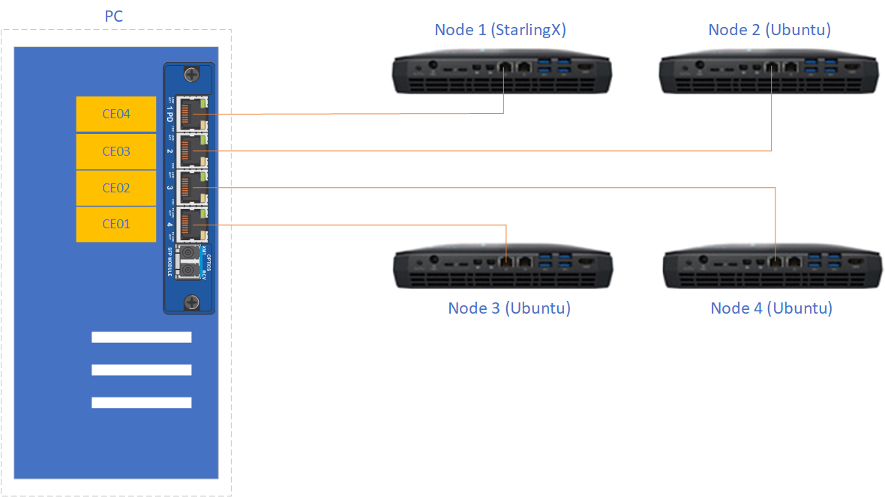
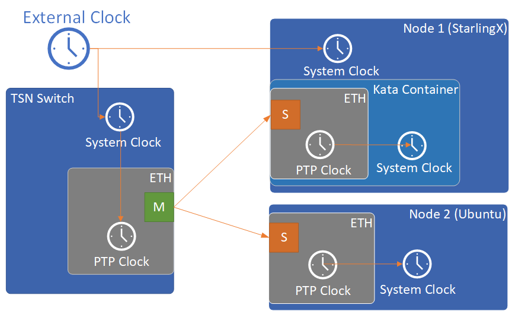
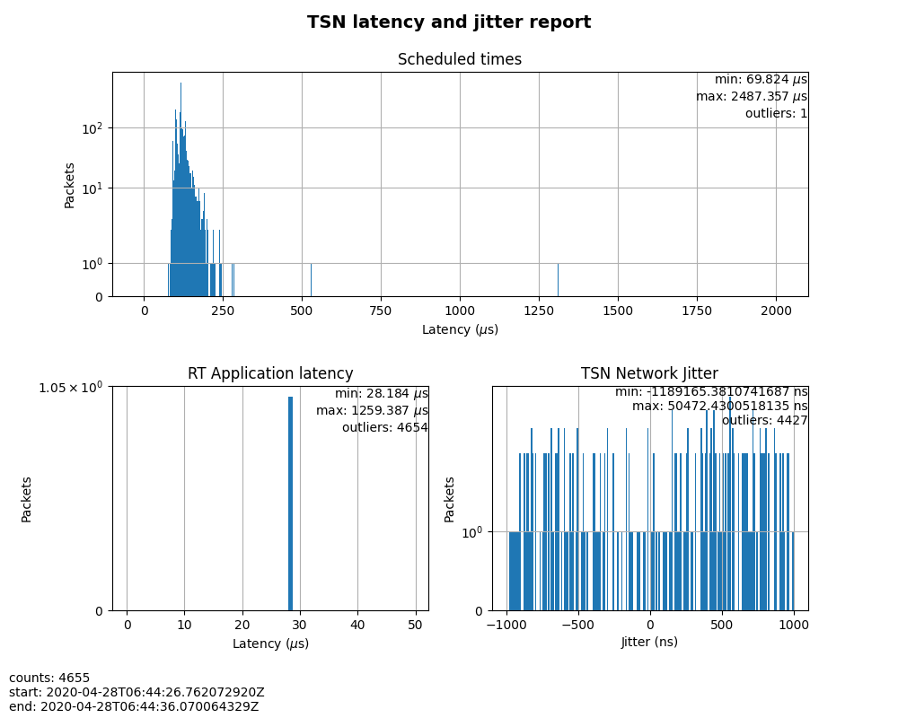
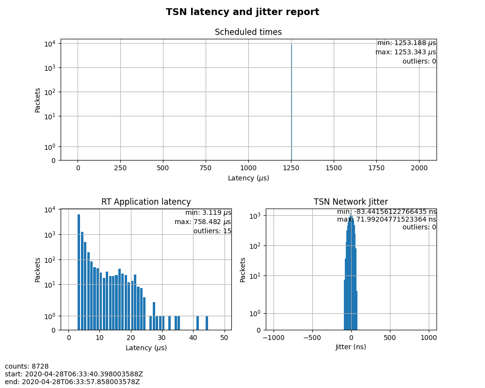
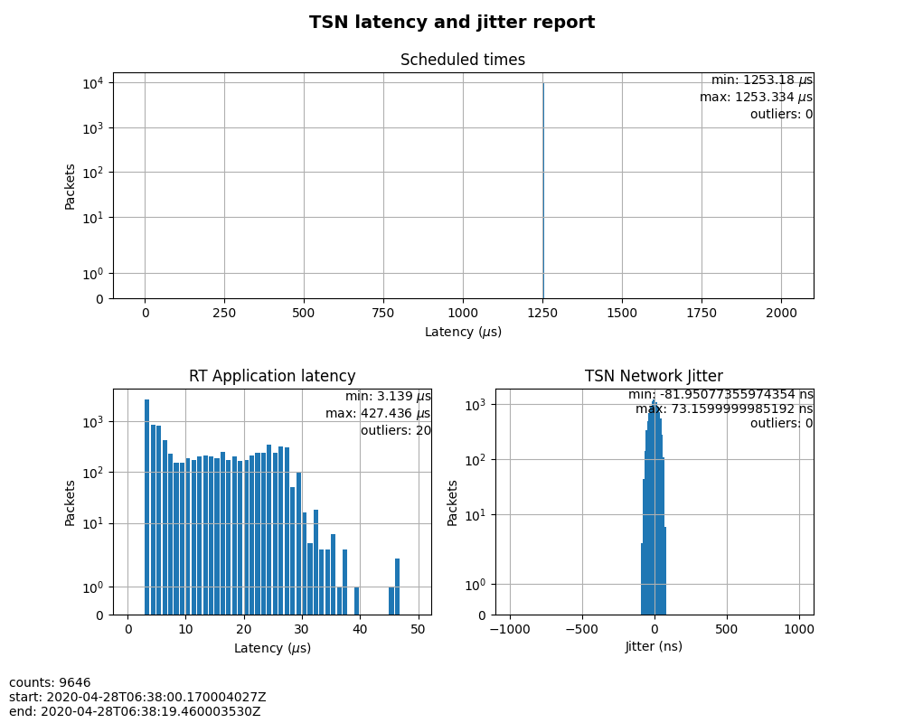

=============================
Enable TSN in Kata Containers
=============================

.. contents::
   :local:
   :depth: 2

----------
Background
----------

`Time Sensitive Networking (TSN) <https://1.ieee802.org/tsn/>`_ is a set of
standards developed by the IEEE 802.1 Working Group (WG) with the aim of
guaranteeing determinism in delivering time-sensitive traffic with low and
bounded latency, while allowing non-time-sensitive traffic to be carried through
the same network.

As a cloud infrastructure software stack for the edge,
:abbr:`TSN (Time Sensitive Networking)` is a very important feature for
StarlingX as the deterministic low latency is required by edge applications in
industrial IOT, video delivery and other ultra-low latency use cases.
Furthermore, because StarlingX is a cloud-native platform, TSN support in
containers naturally becomes a requirement for StarlingX.

A challenge is that some TSN features are only available on Linux kernel
version 4.19 or higher. StarlingX is built on top of CentOS. The StarlingX 3.0
release (currently available) is based on CentOS 7, which provides a Linux 3.10
kernel with some backported patches. (The StarlingX team plans to
upgrade to CentOS 8 in a future release.)

Generic containers share the same kernel as the host. However, a Kata Container
has its own kernel, which does not depend on the kernel of the host.
Fortunately, StarlingX already supports Kata Containers on the master branch,
and it will become an officially supported feature in the StarlingX 4.0 release.
Therefore, TSN support in containers on StarlingX begins with Kata Containers.

`Kata Containers <https://katacontainers.io/>`_ is an open source project to
build a secure container runtime with lightweight virtual machines that feel
and perform like containers, but provide stronger workload isolation using
hardware virtualization technology as a second layer of defense.

---------------------------------------------------------
Build a Linux kernel with TSN support for Kata Containers
---------------------------------------------------------

As of writing this article, the latest Kata release is Kata 1.11.0. This
release includes a Linux 5.4.32 kernel image with Kata patches. Though the
kernel version is high enough, TSN features are not fully enabled in the kernel
build, so you must build a customized kernel image. The following steps describe
how to build a customized kernel image for Kata.

#. Get the ``packaging`` repository of Kata Containers:

   ::

     git clone https://github.com/kata-containers/packaging.git

#. Prepare the build environment by executing this command in the directory
   ``packaging/kernel``:

   ::

     ./build-kernel.sh -v 5.4.32 -f -d setup

#. Prepare a kernel configuration file, ``stx.conf``, with TSN-related options
   enabled as shown below. Put it in the directory
   ``~/go/src/github.com/kata-containers/packaging/kernel/configs/fragments/x86_64``:

   ::

     # qdisc for tsn
     CONFIG_NET_SCH_TAPRIO=y
     CONFIG_NET_SCH_ETF=y
     # I210 adapter driver
     CONFIG_IGB=y
     # ptp
     CONFIG_NET_PTP_CLASSIFY=y
     CONFIG_NETWORK_PHY_TIMESTAMPING=y
     CONFIG_PTP_1588_CLOCK=y
     # vlan
     CONFIG_VLAN_8021Q=y

#. Re-run the setup command to update ``stx.conf`` to the desired configuration:

   ::

     ./build-kernel.sh -v 5.4.32 -f -d setup

#. Build the kernel image:

   ::

     ./build-kernel.sh -v 5.4.32 -f -d build

#. Install the built kernel images to the destination directory:

   ::

     sudo ./build-kernel.sh -v 5.4.32 -f -d install

When these commands are done, two built kernel images, ``vmlinux.container``
and ``vmlinuz.container``, will be available in the directory
``/usr/share/kata-containers``. Save the two files for later use.

--------------------------------------
Build a container image with TSN stack
--------------------------------------

Certain packages are required to build the TSN stack. For example,
`LinuxPTP <http://linuxptp.sourceforge.net/>`_ is an implementation of the
`Precision Time Protocol (PTP) <https://en.wikipedia.org/wiki/Precision_Time_Protocol>`_
according to IEEE standard 1588 for Linux.

The example below shows the dockerfile used to build the container image.
``Ubuntu 20.04`` was chosen as the base image for packages with newer versions.
``python3-dateutil``, ``python3-numpy``, and ``python3-matplotlib`` were
installed for performance testing. The built container image was named
``kata_tsn_image``.

::

  From ubuntu:20.04
  RUN apt-get update
  RUN apt-get install -y iproute2 net-tools pciutils ethtool \
      linuxptp vlan libjansson4 python3-dateutil python3-numpy \
      python3-matplotlib

----------------------------------
Set up an experimental TSN network
----------------------------------

The experimental TSN network shown in `Figure 1` was used to verify the TSN
functionality in Kata Containers. The network was composed of a switch with
TSN capability and four hosts.

    *Figure 1: Experimental TSN network*

#. The TSN switch used a generic PC with a TSN switch card
   `PCIe-0400-TSN <https://www.kontron.com/products/systems/tsn-switches/
   network-interfaces-tsn/pcie-0400-tsn-network-interface-card.html>`_ inserted.
   Please refer to the
   `PCIe-0400-TSN User Guide
   <https://www.kontron.com/downloads/manuals/
   userguide_pcie-0400-tsn_v0.13.pdf?product=151637>`_
   for detailed configuration options.

#. Check the Kontron documentation about the kernel drivers that are provided.
   The TSN switch has to run the recommended OS (the OS for which there are Kontron drivers).
   The TSN switch must run a RT kernel too. The Kontron card has drivers for kernel 4.9.11
   as of ``kontron-tsn-starter-kit-r6`` driver package.

#. After installing the required OS that matches the version of the drivers for the Kontron card
   you must install the packages recommended in the Kontron manual. After properly installing
   the drivers for the Kontron card there should be 7 new Ethernet interfaces.
   These network interfaces have to be configured to use ``network`` and not ``NetworkManager``.
   Use the configuration files listed below. Besides the 7 interfaces belonging to the Kontron card,
   the main network interface should also be configured (listed here as ``eth0``).

   ::

     sudo systemctl stop NetworkManager
     sudo systemctl disable NetworkManager
     sudo systemctl enable network
     # Add the following network scripts
     # /etc/sysconfig/network-scripts/ifcfg-deipce0
     DEVICE=deipce0
     TYPE=bridge
     ONBOOT=yes
     BOOTPROTO=none
     ZONE=trusted
     IPV6INT="no"
     NM_CONTROLLED="no"
     # /etc/sysconfig/network-scripts/ifcfg-eth0
     DEVICE=eth0
     TYPE=Ethernet
     ONBOOT=yes
     BOOTPROTO=none
     ZONE=trusted
     IPV6INT="no"
     NM_CONTROLLED="no"
     # /etc/sysconfig/network-scripts/ifcfg-SE01
     DEVICE=SE01
     TYPE=Ethernet
     ONBOOT=yes
     BOOTPROTO=none
     ZONE=trusted
     IPV6INT="no"
     NM_CONTROLLED="no"# /etc/sysconfig/network-scripts/ifcfg-CE01
     # /etc/sysconfig/network-scripts/ifcfg-CE02
     # /etc/sysconfig/network-scripts/ifcfg-CE03
     # /etc/sysconfig/network-scripts/ifcfg-CE04
     # /etc/sysconfig/network-scripts/ifcfg-IE01
     # take CE01 as an example, other ports are similar
     # you need to add 4 more configs for ifcfg-CE02, ifcfg-CE03, ifcfg-CE04 and ifcfg-IE01
     DEVICE=CE01
     TYPE=Ethernet
     BRIDGE=deipce0
     ONBOOT=yes
     BOOTPROTO=none
     ZONE=trusted
     IPV6INT="no"
     NM_CONTROLLED="no"

#. The hosts are four
   `Intel Hades Canyon NUC <https://simplynuc.com/hades-canyon/>`_
   which were equipped with two NICs each. One of the two NICs is the
   `Intel Ethernet Controller I210 series <https://ark.intel.com/content/www/us/en/ark/products/series/64399/intel-ethernet-controller-i210-series.html>`_
   which has TSN support.

   * ``Node 1`` used the latest StarlingX built from the master branch which
     supports Kata containers. ``Node 1`` was used as the data sender in the
     tests in this guide. When installing StarlingX it is recommended that ovs-dpdk is not enabled.
     Current Kata container (version 1.11.0) may have conflict with the vfio device created by dpdk.

   * ``Node 2``, ``Node 3``, and ``Node 4`` were all installed with
     Ubuntu 18.04. ``Node 2`` additionally installed ``LinuxPTP`` which was
     used as the data receiver. ``Node 3`` and ``Node 4`` were used to
     send/receive best-effort traffic to stress the TSN network.

-----------------------------------
Enable and verify TSN functionality
-----------------------------------

Preparation is complete and you can enable and verify the TSN functionality in
Kata Containers. The whole process can be summarized in three steps:

#. Perform time synchronization across the whole TSN network.

#. Launch a Kata Container with a physical NIC passed in.

#. Make necessary configuration changes to the Kata Container and the TSN switch
   to enable TSN functionality. After that, run tests to verify the TSN
   functionality.

***********************************************************
Step 1. Perform time synchronization across the TSN network
***********************************************************

Two programs from the ``LinuxPTP`` project, ``ptp4l`` and ``phc2sys``,
were used to do time synchronization on the TSN network.

    *Figure 2: Time synchronization topology*

#. Configure NTP servers on the TSN switch and on ``Node 1 (StarlingX)``
   to synchronize their system clocks with the external clock.
   A usable ``NTP server`` is a server that you can access on the network you are in.
   Failure to setup a reachable NTP server can result in failure of testing TSN capability.

#. Launch ``phc2sys`` on the TSN switch to synchronize its PTP clock from its
   system clock.

   ::

     # ptp1 is the ptp clock of the TSN interface. We could get this index
     # by "ethtool -T <tsn_interface>".
     sudo phc2sys -c /dev/ptp1 -s CLOCK_REALTIME -w -O 0 &

   Use ``syslog`` whenever you want to check the status of ``phc2sys`` or ``ptp4l``.

#. Launch ``ptp4l`` on both the TSN switch and ``Node 2 (Ubuntu)`` to
   synchronize their PTP clocks. The TSN switch's PTP clock was set as the
   primary clock by default.

   ::

     # For TSN switch
     sudo ptp4l -f /etc/ptp4l-switch.cfg &

     # For Ubuntu node
     sudo ptp4l -f /etc/ptp4l-node.cfg &

   The content of ptp4l-switch.cfg is shown below.
   ::

     # "gmCapable" is "1" for switch node, and "0" for all other nodes.
     [global]
     gmCapable               1
     priority1               128
     priority2               128
     logAnnounceInterval     1
     logSyncInterval         -3
     syncReceiptTimeout      3
     neighborPropDelayThresh 800
     min_neighbor_prop_delay -20000000
     assume_two_step         1
     path_trace_enabled      1
     follow_up_info          1

     # Generic MAC to broadcast L2 PTP to many NICs (ie. diff MACs)
     ptp_dst_mac             01:1B:19:00:00:00
     network_transport       L2
     delay_mechanism         P2P

     # Additional Config Parameters
     tx_timestamp_timeout    100
     summary_interval        0

     [CE01]
     transportSpecific 0x1

     [CE02]
     transportSpecific 0x1

     [CE03]
     transportSpecific 0x1

     [CE04]
     transportSpecific 0x1

   The content of ptp4l-node.cfg is shown below.
   ::

     # enp5s0 is the tsn interface in the node. Please update it if per your environment.
     [global]
     gmCapable               0
     priority1               128
     priority2               128
     logAnnounceInterval     1
     logSyncInterval         -3
     syncReceiptTimeout      3
     neighborPropDelayThresh 800
     min_neighbor_prop_delay -20000000
     assume_two_step         1
     path_trace_enabled      1
     follow_up_info          0

     # Generic MAC to broadcast L2 PTP to many NICs (ie. diff MACs)
     ptp_dst_mac             01:1B:19:00:00:00
     network_transport       L2
     delay_mechanism         P2P

     # Additional Config Parameters
     tx_timestamp_timeout    100
     summary_interval        0

     [enp5s0]
     transportSpecific 0x1

#. Launch ``phc2sys`` on ``Node 2 (Ubuntu)`` to synchronize its system clock
   from its PTP clock.

   ::

     # enp5s0 is the tsn interface in the node.
     sudo phc2sys -s enp5s0 -c CLOCK_REALTIME -w -O 0 &

Time synchronization on the Kata Container is done later in this process.

You do not need to set up time synchronization on ``Node 3`` and ``Node 4``
since they were used to send/receive best-effort traffic in the experiment.

The ``Ubuntu node`` and the ``StarlingX container`` must be configured to have vlan interfaces.
Before setting up anything else, you must run the commands below on the ``Ubuntu node``
(the ``StarlingX container`` is configured later on in ``Case 2``):

::

   # INTERFACE is the name of the I210 network card (the TSN network card)
   INTERFACE=enp5s0
   ip link add link $INTERFACE name ${INTERFACE}.3 type vlan id 3
   ifconfig $INTERFACE up
   ip link set ${INTERFACE}.3 up

*************************************************************
Step 2. Launch a Kata Container with a physical NIC passed in
*************************************************************

Before creating a Kata Container, copy the two kernel images ``vmlinux.container``
and ``vmlinuz.container`` to the directory
``/usr/share/kata-containers/`` of ``Node 1 (StarlingX)``.

The Intel Ethernet Controller I210 on the host must be passed into a Kata
Container by completing the following steps. More details can be found at
`How To Pass a Physical NIC Into a Kata Container
<https://github.com/kata-containers/documentation/pull/619/files>`_.

#.  Configure the Kata Container:

    ::

       # Find the PCI address of the I210 NIC. Here the PCI address is
       # "0000:05:00.0" and the ID is "8086:157b" which are used in the
       # following steps.
       lspci -nn -D | grep Ethernet
       0000:00:1f.6 Ethernet controller [0200]: Intel Corporation Ethernet Connection (2) I219-LM [8086:15b7] (rev 31)
       0000:05:00.0 Ethernet controller [0200]: Intel Corporation I210 Gigabit Network Connection [8086:157b] (rev 03)

       export BDF="0000:05:00.0"

       readlink -e /sys/bus/pci/devices/$BDF/iommu_group
       /sys/kernel/iommu_groups/16

       echo $BDF | sudo tee /sys/bus/pci/devices/$BDF/driver/unbind

       sudo modprobe vfio-pci

       echo 8086 157b | sudo tee /sys/bus/pci/drivers/vfio-pci/new_id

       echo $BDF | sudo tee --append /sys/bus/pci/drivers/vfio-pci/bind

       ls -l /dev/vfio
       total 0
       crw------- 1 root root  241,  0 May 18 15:38 16
       crw-rw-rw- 1 root root  10, 196 May 18 15:37 vfio
       # There should be only one vfio device there, the device that has been passed through.

       # Edit the /usr/share/defaults/kata-containers/configuration.toml file to
       # set `hotplug_vfio_on_root_bus` to true.

#.  Configure Docker to support Kata Container:

    ::

       sudo mkdir -p /etc/systemd/system/docker.service.d/
       cat <<EOF | sudo tee /etc/systemd/system/docker.service.d/kata-containers.conf
       [Service]
       ExecStart=
       ExecStart=/usr/bin/dockerd -D --add-runtime kata-runtime=/usr/bin/kata-runtime
       EOF
       sudo systemctl daemon-reload
       sudo systemctl restart docker

#.  Create a Kata Container with the Intel Ethernet Controller I210 passed in.
    In this example, the name of the container image was ``kata_tsn_image``.

    ::

      # 2 cpus are needed. 1 dedicated for send or receive data.
      sudo docker run -it -d --runtime=kata-runtime --cpus 2 --rm --device \
            /dev/vfio/16 -v /dev:/dev --cap-add SYS_NICE --cap-add SYS_TIME --cap-add NET_ADMIN \
            --name tsn kata_tsn_image /bin/bash

    When completed, the I210 NIC should be shown in the created container with the name ``eth1``.

***************************************
Step 3. Config and test TSN performance
***************************************

The sample application
`sample-app-taprio
<https://github.com/intel/iotg_tsn_ref_sw/tree/apollolake-i/sample-app-taprio>`_
was used in the test. Minor changes were made on the code to format the
output to adapt to the two tools (``nl-calc`` and ``nl-report``) provided by
the
`netlatency <https://github.com/kontron/netlatency>`_ project and plot the result.

Three test cases were defined in the experiment. For all three test cases,
``sample-app-taprio`` was running in the Kata Container as the data sender and
running on ``Node 2`` as the data receiver. Common configurations for
``sample-app-taprio`` are listed here.

.. csv-table:: Table 1: Configuration of sample-app-taprio
   :header: "Option", "Value"

   "Cycle Time", "2ms"
   "Packet Number", "1 packet/cycle"
   "VLAN ID", "3"
   "VLAN Priority code point", "6"
   "SO_PRIORITY", "6"

During the test, three performance indicators were measured.

.. csv-table:: Table 2: Performance indicators
   :header: "Indicator", "Meaning"

   "Scheduled times", "Time from the beginning of a cycle to when the NIC receives the packet"
   "RT application latency", "Time from the beginning of a cycle to when the send function is called"
   "TSN Network jitter", "Jitter of scheduled times"

* Case 1:  TSN not enabled.

  ``sample-app-taprio`` sent a packet at the beginning of each cycle.

  Before ``sample-app-taprio`` was executed, time synchronization was performed
  on the Kata Container.

::

  # Launch PTP programs, ptp4l and phc2sys, to synchronize the PTP clock and
  # the system clock.
  ptp4l -f /etc/ptp4l.cfg -m &
  phc2sys -s eth1 -c CLOCK_REALTIME -w -O 0 -m &

  # The content of ptp4l.cfg is shown below.
  [global]
  gmCapable               0
  priority1               128
  priority2               128
  logAnnounceInterval     1
  logSyncInterval         -3
  syncReceiptTimeout      3
  neighborPropDelayThresh 800
  min_neighbor_prop_delay -20000000
  assume_two_step         1
  path_trace_enabled      1
  follow_up_info          0
  ptp_dst_mac             01:1B:19:00:00:00
  network_transport       L2
  delay_mechanism         P2P
  tx_timestamp_timeout    100
  summary_interval        0

  [eth1]
  transportSpecific 0x1

    *Figure 3: Case 1 performance report*

As shown in `Figure 3`, the ``RT application latency`` indicator ranged from
28.184us to 1259.387us, due to the following reasons:

#. Standard kernels instead of real-time kernels were used for both StarlingX
   platform and the Kata Container. (Kata Containers supports the standard
   kernel.)

#. ``sample-app-taprio`` was running on the Kata Container instead of the
   host.

Since TSN features were not enabled, there were no controls on
``Scheduled times``, and its behavior depended on the ``RT application latency``
indicator and the behavior of the whole network. As shown in
the figure, it ranged from 69.824us to 2487.357us, and the measured jitter
reached 1ms.

* Case 2:  Enable two qdiscs on the Kata Container.

  `TAPRIO <http://man7.org/linux/man-pages/man8/tc-taprio.8.html>`_ and
  `ETF <http://man7.org/linux/man-pages/man8/tc-etf.8.html>`_ were used.
  ``sample-app-taprio`` had additional configuration settings as shown
  in *Table 3*. Considering the large variance of ``RT application latency`` in
  Case 1, the transmitting time was set at 1250us.

.. csv-table:: Table 3: Case 2 configuration
   :header: "Option", "Value"

   "Transmit Window", "[1200us, 1300us]"
   "Offset in Window", "50us"

Make necessary configuration changes on the Kata Container before executing
``sample-app-taprio``.

::

  # Change the number of multi-purpose channels
  ethtool -L eth1 combined 4

  # Delete existing qdiscs
  tc qdisc del dev eth1 root

  # Enable taprio qdisc, SO_PRIORITY 6 was mapped to traffic class 1.
  tc -d qdisc replace dev eth1 parent root handle 100 taprio num_tc 4 \
        map 3 3 3 3 3 3 1 3 3 3 3 3 3 3 3 3 \
        queues 1@0 1@1 1@2 1@3 \
        base-time 1588076872000000000 \
        sched-entry S 01 200000 \
        sched-entry S 02 100000 \
        sched-entry S 04 100000 \
        sched-entry S 08 100000 \
        sched-entry S 01 200000 \
        sched-entry S 02 100000 \
        sched-entry S 04 100000 \
        sched-entry S 08 100000 \
        clockid CLOCK_TAI

  # Enable etf qdisc on queue 1 which corresponds to traffic class 1
  tc qdisc replace dev eth1 parent 100:2 etf clockid CLOCK_TAI \
        delta 5000000 offload

  # Create vlan interface and set egress map.
  ip link add link eth1 name eth1.3 type vlan id 3
  vconfig set_egress_map eth1.3 6 6
  ifconfig eth1 up
  ip link set eth1.3 up

  # Launch PTP programs, ptp4l and phc2sys, to synchronize the PTP clock and
  # the system clock.
  ptp4l -f /etc/ptp4l.cfg -m &
  phc2sys -s eth1 -c CLOCK_REALTIME -w -O 0 -m &

    *Figure 4: Case 2 performance report*

In this test, ``RT Application latency`` showed similar results
to Case 1. This was expected, since there were no optimizations made.
``Scheduled times`` was well controlled (ranged from 1253.188us to
1253.343us), which indicates the TSN feature was functional. The measured
``TSN Network jitter`` also proves TSN was functional.

* Case 3: Stress test.

  This scenario used the Case 2 settings and enabled
  `802.1qbv <http://www.ieee802.org/1/pages/802.1bv.html>`_ support on the TSN
  switch. Also, ``iperf3`` was used on ``Node 3`` and ``Node 4`` for massive
  best-effort traffic to stress the overall network communication.

::

  # iperf3 -c 192.168.1.2 -b 0 -u -l 1448 -t 86400
  Connecting to host 192.168.1.2, port 5201
  [  5] local 192.168.1.3 port 43752 connected to 192.168.1.2 port 5201
  [ ID] Interval           Transfer     Bitrate         Total Datagrams
  [  5]   0.00-1.00   sec   114 MBytes   956 Mbits/sec  82570
  [  5]   1.00-2.00   sec   114 MBytes   956 Mbits/sec  82550
  [  5]   2.00-3.00   sec   114 MBytes   957 Mbits/sec  82580
  [  5]   3.00-4.00   sec   114 MBytes   956 Mbits/sec  82560
  [  5]   4.00-5.00   sec   114 MBytes   956 Mbits/sec  82560
  [  5]   5.00-6.00   sec   114 MBytes   956 Mbits/sec  82560
  [  5]   6.00-7.00   sec   114 MBytes   957 Mbits/sec  82570
  [  5]   7.00-8.00   sec   114 MBytes   956 Mbits/sec  82560

::

  # iperf3 -s
  -----------------------------------------------------------
  Server listening on 5201
  -----------------------------------------------------------
  Accepted connection from 192.168.1.3, port 48494
  [  5] local 192.168.1.2 port 5201 connected to 192.168.1.3 port 50593
  [ ID] Interval           Transfer     Bitrate         Jitter    Lost/Total Datagrams
  [  5]   0.00-1.00   sec  42.1 MBytes   353 Mbits/sec  0.055 ms  48060/78512 (61%)
  [  5]   1.00-2.00   sec  44.2 MBytes   371 Mbits/sec  0.066 ms  50532/82531 (61%)
  [  5]   2.00-3.00   sec  44.2 MBytes   371 Mbits/sec  0.063 ms  50593/82592 (61%)
  [  5]   3.00-4.00   sec  44.2 MBytes   371 Mbits/sec  0.059 ms  50534/82534 (61%)
  [  5]   4.00-5.00   sec  44.2 MBytes   371 Mbits/sec  0.060 ms  50619/82619 (61%)
  [  5]   5.00-6.00   sec  44.2 MBytes   371 Mbits/sec  0.062 ms  50506/82504 (61%)
  [  5]   6.00-7.00   sec  44.2 MBytes   371 Mbits/sec  0.059 ms  50563/82563 (61%)

    *Figure 5: Case 3 performance report*

The results were very similar to Case 2. The test demonstrated that even when
a large amount of best-effort traffic was sent to the TSN network, the
time-sensitive packets sent from ``sample-app-taprio`` were not impacted. The
determinism was still guaranteed.

-------
Summary
-------

In this guide, we introduced how to enable TSN support in Kata Containers on the
StarlingX platform. The experimental results demonstrated the capability of TSN
in Kata Containers. Currently, the cycle time (2ms) is not low enough for some
critical use cases. In the future, optimizations could be made to achieve
better performance, such as replacing the standard kernel with a real-time
kernel.
