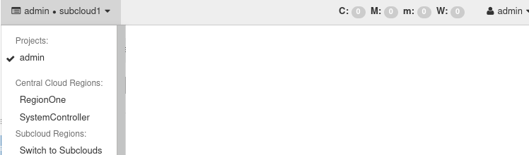

.. yqf1558616874924
.. _regionone-and-systemcontroller-modes:

====================================
RegionOne and SystemController Modes
====================================

You can operate the Central Cloud in **RegionOne** mode for local
configuration, or **SystemController** mode for |prod-dc| management.

To change the mode, select it in the Horizon Web interface top panel.

