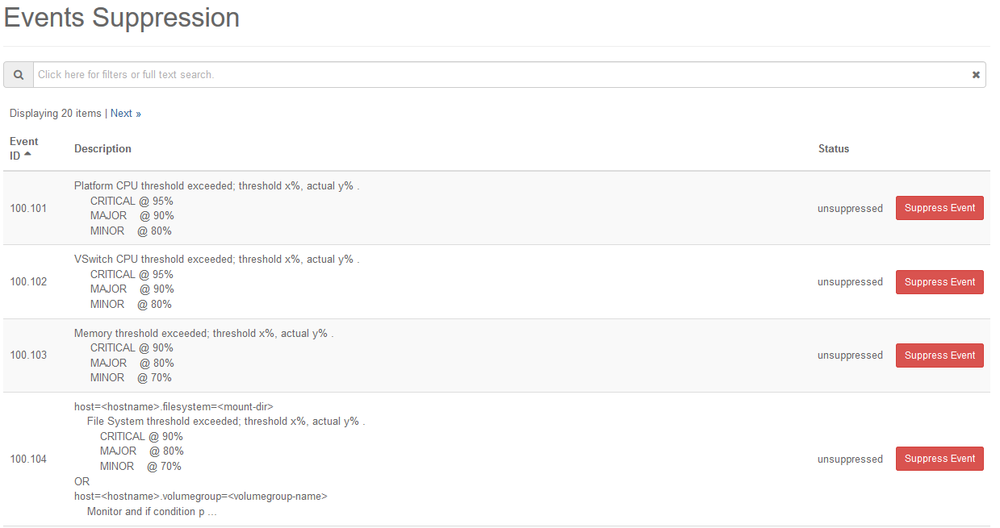

.. pmt1552680681730
.. _events-suppression-overview:

===========================
Events Suppression Overview
===========================

All alarms are unsuppressed by default. A suppressed alarm is excluded from the
Active Alarm and Events displays by setting the **Suppression Status** filter,
on the Horizon Web interface, the CLI, or REST APIs, and will not be included
in the Active Alarm Counts.

.. warning::
    Suppressing an alarm will result in the system NOT notifying the operator
    of this particular fault.

The Events Suppression page, available from **Admin** \> **Fault Management**
\> **Events Suppression** in the left-hand pane, provides the suppression
status of each event type and functionality for suppressing or unsuppressing
each event type.

As shown below, the Events Suppression page lists each event type by ID, and
provides a description of the event and a current status indicator. Each event
can be suppressed using the **Suppress Event** button.

You can sort events by clicking the **Event ID**, **Description**, and
**Status** column headers. You can also use these as filtering criteria
from the **Search** field.

