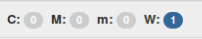

.. wtg1552680748451
.. _the-global-alarm-banner:

=======================
The Global Alarm Banner
=======================

The |prod| Horizon Web interface provides an active alarm counts banner in the
page header of all screens.

The global alarm banner provides a high-level indicator of faults on the system,
that is always visible, regardless of what page you are on in the GUI. The
banner provides a color-coded snapshot of current active alarm counts for each
alarm severity.

.. note::
    Suppressed alarms are not shown. For more about suppressed alarms, see
    :ref:`Events Suppression Overview <events-suppression-overview>`.

Clicking on the alarm banner opens the Fault Management page, where more
detailed information about the alarms is provided.

