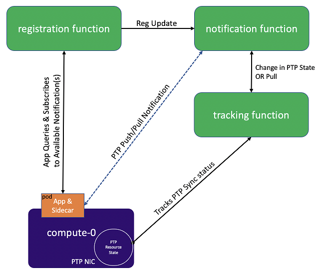

.. nko1614009294405
.. _ptp-notifications-overview:

==========================
PTP Notifications Overview
==========================

|prod-long| supports applications that rely on |PTP| for synchronization. These
applications are able to receive |PTP| status notifications from
|prod-long| hosting the application.

|prod-long| provides a Sidecar, which runs with the hosted application in the
same pod and communicates with the application via a REST API.

|prod-long| supports the following features:

.. _ptp-notifications-overview-ul-ggf-x1f-t4b:

-   Provides the capability to enable application\(s\) subscribe to |PTP| status
    notifications and pull for the |PTP| state on demand.

-   Uses a REST API to communicate |PTP| notifications to the application.

-   Enables operators to install the **ptp-notification-armada-app**, Sidecar
    container, and the application supporting the REST API. For more information,
    see, `https://docs.starlingx.io/api-ref/ptp-notification-armada-app/index.html
    <https://docs.starlingx.io/api-ref/ptp-notification-armada-app/index.html>`__.

-   Supports the **ptp4l** module and |PTP| port that is configured in
    Subordinate mode \(Secondary mode\).

-   The |PTP| notification Sidecar container can be configured with a Liveness
    Probe, if required. See, :ref:`Liveness Probe <liveness-probe>` for more
    information.

-   The |PTP| status notifications are derived based on the following conditions:

.. _ptp-notifications-overview-simpletable-n1r-dcf-t4b:

.. table::
    :widths: auto

    +---------------------+---------------------------------------------------+--------------------------------------------------------------------------------------------------------------------------------------------------------+
    | Clock Status        | Status                                            | Description                                                                                                                                            |
    +=====================+===================================================+========================================================================================================================================================+
    | Freerun             | Clock is out of sync state                        | -   If portState is not "SECONDARY" or ClockClass value is NOT "6, 7 or 135" or timeTraceable flag is FALSE.                                           |
    |                     |                                                   |                                                                                                                                                        |
    |                     |                                                   | -   If holdover time exceeds its provided value.                                                                                                       |
    |                     |                                                   |                                                                                                                                                        |
    |                     |                                                   | -   If PMC, ptp4l.conf, ptp4l or phc2sys are not accessible.                                                                                           |
    +---------------------+---------------------------------------------------+--------------------------------------------------------------------------------------------------------------------------------------------------------+
    | Locked              | Clock is in sync state                            | If portState is "SECONDARY" and ClockClass value is "6, 7 or 135" and timeTraceable flag is TRUE and PMC, ptp4l.conf, ptp4l or phc2sys are accessible. |
    +---------------------+---------------------------------------------------+--------------------------------------------------------------------------------------------------------------------------------------------------------+
    | Holdover            | Clock is in holdover state                        | If the state is transitioned from "Locked" to "Freerun" AND phc2sys is accessible, and holdover time does not expire.                                  |
    +---------------------+---------------------------------------------------+--------------------------------------------------------------------------------------------------------------------------------------------------------+

**Integrated Containerized Applications**

.. _ptp-notifications-overview-ul-rn5-5w2-t4b:

-   Applications that rely on |PTP| for synchronization have the ability to
    retrieve the relevant data that indicates the status of the PHC clock related
    to the worker node that the application is running on.

-   Once an application subscribes to |PTP| notifications it receives the initial
    data that shows the PHC synchronization state, and receives notifications when
    there is a state change to the sync status and/or per request for notification
    \(pull\).

The figure below describes the subscription framework for |PTP| notifications.

**Liveness Probe**

.. _liveness-probe:

The |PTP| notification Sidecar container can be configured with a Liveness
probe, if required. You can edit the Sidecar values in the deployment
manifest to include these parameters.

.. note::
    Port and timeout values can be configured to meet user preferences.

.. code-block:: none

    cat <<EOF >
    items:
    spec:
      template:
        spec:
          containers:
            livenessProbe:
              exec:
                command:
                - timeout
                - "2"
                - curl
                - http://127.0.0.1:8080/health
              failureThreshold: 3
              periodSeconds: 3
              successThreshold: 1
              timeoutSeconds: 3
    EOF

