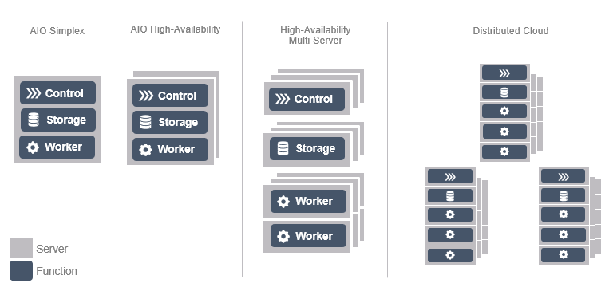

.. pdk1580703255776
.. _deploy_config_overview:

==================================
Deployment Configurations Overview
==================================

|prod-os| supports a variety of physical deployment options.

It can scale very small with its |AIO| server solutions combining controller,
compute, and storage functions all on a single low-power / low-cost server.
|prod-os| can be deployed in both a single server |AIO|-Simplex solution as
well as an HA two server |AIO|-Duplex solution. The standard solution consists
of a two node HA Controller cluster, up to 9x node HA Storage Cluster and a
pool of up to 100 compute nodes. Finally, |prod-os| supports a
geographically-distributed multi-cloud solution for addressing cloud
requirements from the data center to the edge, with value-add cross-cloud
orchestration capabilities. In |prod|'s |prod-dc| deployment configuration,
|prod-os| is only supported on subclouds; there is no cross-subcloud
orchestration provided for |prod-os| on subclouds.

