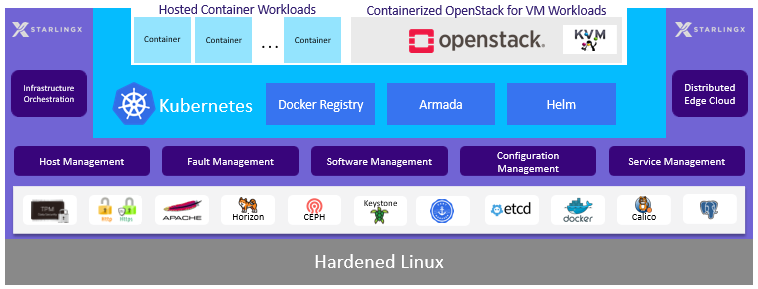

.. hos1565619043403
.. _functional_overview:

===================
Functional Overview
===================

|prod| includes a rich functionality set from open source projects.

The high-level functional diagram of |prod| is shown in the diagram below:

Where:

.. _functional_overview-ul-izt-blh-s3b:

**Hardened Linux**
    A CentOS Linux Kernel and OS, tuned for performance and maintained with
    security |CVE| patches.

**Variety of open-source software supporting StarlingX and/or Kubernetes**
    This includes packages such as Apache, Ceph, PostgreSql, Etcd, |IPMI|,
    etc., as well as some services from OpenStack such as the OpenStack
    Horizon Web interface, Keystone and Barbican.

**StarlingX**
    Hardware and software infrastructure management.

    -   Manages installation, maintenance and fault monitoring of dedicated
        bare metal servers running the |org| solution.

    -   Manages the configuration of hardware and software services running
        on the host servers.

    -   Provides the cluster management for services running on the HA
        master/control nodes cluster, as well critical software monitoring and
        recovery of services running on all nodes within the cluster.

    -   Monitoring and reporting of faults and logs of both hardware and
        software services.

    -   Support for managing software updates to all layers of software in
        the solution; this includes kernel, operating system, open-source
        packages, StarlingX and Kubernetes.

**Kubernetes**
    -   Kubernetes Container Orchestration Engine

    -   Native Docker Runtime

    -   Calico Container Networking

    -   Accelerated Container Networking with multus and |SRIOV| |CNIs|

    -   Persistent Volume Claims backed by Ceph

    -   Local Docker Registry

    -   Helm / Tiller – Kubernetes Package Manager, and

    -   Armada \(Airship\)

**OpenStack**
    -   Keystone - Identity management

    -   Nova - compute management

    -   Neutron - network management

    -   Glance - image management

    -   Cinder - block storage

    -   OpenStack Horizon - dashboard

    ..  -   Telemetry \(OPTIONAL\)

            -   Panko - Event storage

            -   Gnocchi - Time series database

            -   Aodh - alarming

    -   Heat - Orchestration

