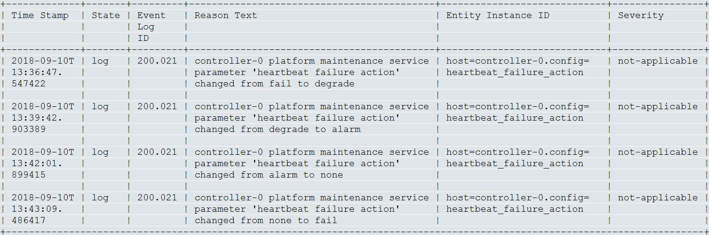

.. wnk1553797882762
.. _configuring-heartbeat-failure-action:

==================================
Configure Heartbeat Failure Action
==================================

You can configure **heartbeat\_failure\_action** while performing network
related maintenance activities that may interrupt inter-host communications.

You can configure service parameters to change the heartbeat failure behavior
from **fail,** **degrade**, **alarm**, or **none** actions, for example,
while replacing a networking cable.

The default action is **fail**, that is, **fail** and **auto-recover** hosts
immediately in the event of a persistent loss of maintenance heartbeat.

.. rubric:: |proc|

.. _configuring-heartbeat-failure-action-steps-q3z-twf-gfb:

#.  To view the current settings, use the system
    :command:`service-parameter-list` command.

    For example:

    .. code-block:: none

        ~(keystone_admin)$ system service-parameter-list --service platform
        +---------+----------+---------------+-----------------------------+-------+
        | uuid    | service  | section       | name                        | value |
        +---------+----------+---------------+-----------------------------+-------+
        | 6d60... | platform | maintenance   | worker _boot_timeout        | 720   |
        | bd04... | platform | maintenance   | controller_boot_timeout     | 1200  |
        | c3a9... | platform | maintenance   | heartbeat_degrade_threshold | 6     |
        | 9089... | platform | maintenance   | heartbeat_failure_action    | fail  |
        | 8df8... | platform | maintenance   | heartbeat_failure_threshold | 10    |
        | 16b5... | platform | maintenance   | heartbeat_period            | 100   |
        | 4712... | platform | maintenance   | mnfa_threshold              | 2     |
        | 4ba7... | platform | maintenance   | mnfa_timeout                | 0     |
        +---------+----------+---------------+-----------------------------+-------+

#.  Use the :command:`system service-parameter-modify` command to specify the
    new heartbeat setting. Changing this action to an invalid value results
    in the following semantic check error. For example:

    .. code-block:: none

        ~(keystone_admin)$ system service-parameter-modify <platform maintenance heartbeat_failure_action>=ignore Action must be one of 'fail', 'degrade', 'alarm' or 'none'

    The following service parameters control the
    **heartbeat\_failure\_action** and accepts one of the four possible
    actions.

    **fail**
        The host is failed and gracefully recovered. The current
        network-specific alarms continue to be raised/cleared.

    **degrade**
        The host is degraded while it is failing a heartbeat. The current
        network-specific alarms continue to be raised/cleared. The heartbeat
        degrade reason and the alarms are cleared when the heartbeat
        responses resume.

    **alarm**
        The only indication of a heartbeat failure is raised by an alarm.
        The same set of alarms as **fail** or **degrade**, are raised. When
        an alarm is raised, no degrade, or failure, or reboot/reset occurs.

    **none**
        The heartbeat is disabled. No multicast heartbeat message is sent and
        all existing heartbeat alarms are cleared. The heartbeat is by passed
        as part of the enable sequence.

    .. code-block:: none

        ~(keystone_admin)$ system service-parameter-modify <platform maintenance heartbeat_failure_action>=degrade
        +-------------+--------------------------------------+
        | Property    | Value                                |
        +-------------+--------------------------------------+
        | uuid        | 90896606-7ed4-43a5-9d96-59ea657184e6 |
        | service     | platform                             |
        | section     | maintenance                          |
        | name        | heartbeat_failure_action             |
        | value       | degrade                              |
        | personality | None                                 |
        | resource    | None                                 |
        +-------------+--------------------------------------+

#.  Apply the service parameter change.

    .. code-block:: none

        ~(keystone_admin)$ system service-parameter-apply platform
        Applying platform service parameters

.. rubric:: |result|

Customer logs are created. The customer can change from one action to any
other action at any time and the log reflects the from <action> to <action>
change in the log text. For example,

The heartbeat alarms, such as Management Network can be viewed. For example:

.. code-block:: none

    +-------+--------------------------------+---------------+----------+-------------+
    | Alarm | Reason Text                    | Entity ID     | Severity | Time Stamp  |
    | ID    |                                |               |          |             |
    +-------+--------------------------------+---------------+----------+-------------+
    | 200.  | compute-1 experienced a        | host=         | critical | 2019-06-13T |
    | 005   | persistent critical            | compute-2.=   |          | 14:31:13.   |
    |       | management network             | network.      |          | 464590      |
    |       | communication failure          | Management    |          |             |
    +-------+--------------------------------+---------------+----------+-------------+

.. note::
    In the event of a single host heartbeat failure, maintenance will attempt
    to reboot, and if unreachable, will also attempt to reset the host in order
    to expedite failed host recovery (if |LAG| Network is provisioned\).

.. warning::
    To maintain a system with High Fault Detection and Availability the
    **heartbeat\_failure\_action** should always be reverted back to **fail**
    once network maintenance activities are completed. This action applies to
    all hosts and if a heartbeat failure occurs while any action other than
    **fail** is selected, maintenance will not take action to recover the
    host by rebooting or resetting it. To change this action in order to
    implement a network maintenance action, select the **degrade** or
    **alarm** action. Contact Customer Support, if you want to select the
    **none** action as a last resort, and if the other actions do not meet
    the needs of the maintenance activity being performed.

.. warning::
    Maintenance heartbeat is a Primary Fault Detection method of a Carrier
    Grade HA system. Selecting the **none** action disables the maintenance
    heartbeat, and exposes the system to undetectable host failures,
    therefore, reduces the overall reliability of the system.

.. rubric:: |postreq|

Always revert the **heartbeat\_failure\_action** to **fail** once network
maintenance activities are complete.
