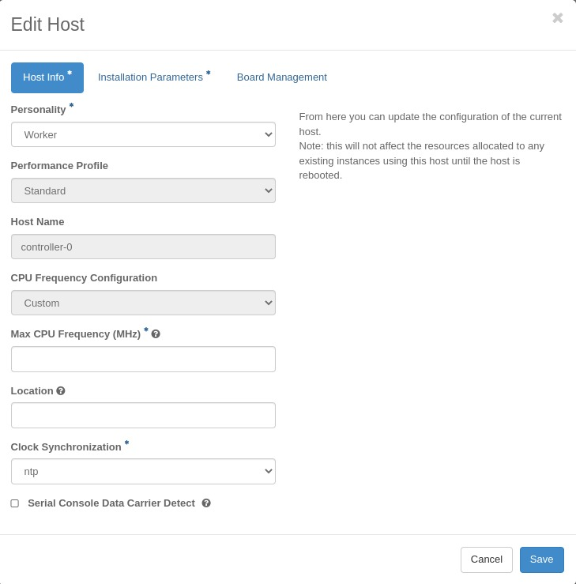
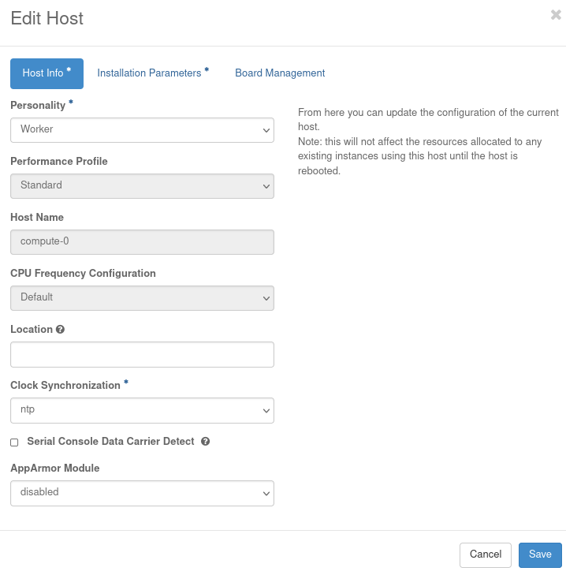

.. _host-cpu-mhz-parameters-configuration-d9ccf907ede0:

=====================================
Host CPU MHz Parameters Configuration
=====================================

Some hosts support setting a maximum frequency for their CPU cores (application
cores and platform cores) and the support for this configuration can be verified
by looking at the ``is_max_cpu_configurable`` capability with the system
:command:`host-show <host>` command, that can assume two values:
**configurable** or **not-configurable**. You may need to configure a maximum scaled
frequency to avoid variability due to power and thermal issues when configured
for maximum performance. For these hosts, the following parameters control
the maximum frequency of their CPU cores:

-   ``cpu_max_freq_min_percentage`` defines a system-wide minimum percentage of the maximum
    frequency allowed to be configured for CPUs. By default this parameter is set
    to 80, meaning  that you can reduce the frequency only to a maximum of 80%
    of the ``max_cpu_mhz_allowed``. There is no need to apply the platform service
    parameters after changing it.

    ..  Note::
         Run the Linux command :command:`sudo cpupower info` on the host, to
         determine if the host has support for this configuration.

    .. code-block:: none

        ~(keystone_admin)] $ system service-parameter-modify platform config cpu_max_freq_min_percentage=<value-between-60-100>

    .. note::
        This parameter can be set between 60% and 100%.

-   Configure ``max_cpu_mhz_configured`` to specify a maximum frequency for a
    particular host's CPU cores.

    .. code-block:: none

        ~(keystone_admin)] $ system host-update <worker> max_cpu_mhz_configured=<frequency-in-MHz>

-   To restore a host's CPU cores' ``max_cpu_mhz_configured`` value to it's
    default value, the ``max_cpu_mhz_allowed`` label can be passed to the
    :command:`host-update` command.

    .. code-block:: none

        ~(keystone_admin)] $ system host-update <worker> max_cpu_mhz_configured=max_cpu_mhz_allowed

----------------------------------
Configure Parameters using the GUI
----------------------------------

The **Host CPU MHz** parameters configuration can also be made using the GUI.

In **Host Inventory** > **Edit Host** modal, there is a **CPU Frequency Configuration**
dropbox field to configure the Max CPU Frequency of the host.

If **CPU Frequency Configuration** is set to **Default**, then the hosts'
``max_cpu_mhz_allowed`` value is used as the Max CPU Frequency of the host.

If **CPU Frequency Configuration** is set to **Custom**, then a **Max CPU Frequency (MHz)**
field appears, allowing you to explicitly configure the Max CPU Frequency of the
host. Note that the configured value can NOT be less than the value allowed by
the service parameter ``cpu_max_freq_min_percentage``.

