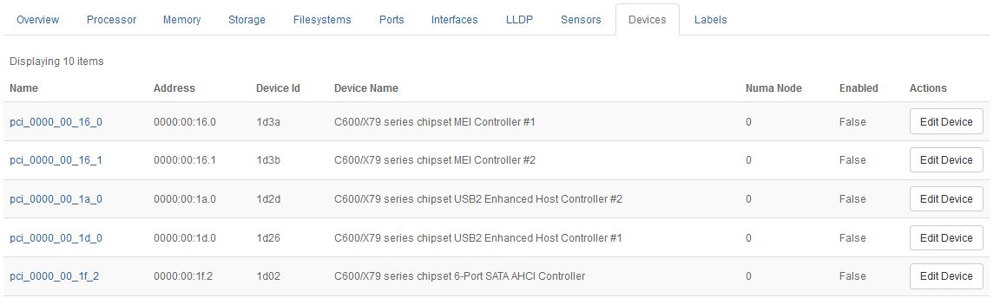

.. eqh1552674728862
.. _devices-tab:

===========
Devices Tab
===========

The **Devices** tab on the Host Detail page presents details for
non-|NIC| |PCI| devices that you can make
available for use with applications such as containers.

All non-|NIC| |PCI| devices that can be exposed
to a guest application are listed. They are automatically detected by the
system, and cannot be manually added or deleted.

.. note::
    |PCI| passthrough and |SRIOV| Ethernet interfaces are listed separately.

The following information is presented:

**Name**
    The name of the device, as identified by the system inventory.

**Address**
    The |PCI| address of the device.

**Device Id**
    The ID of the device, assigned by the vendor.

**Device Name**
    The name of the device, as identified by the host's Linux kernel.

**NUMA Node**
    The |NUMA| node of the device.

**Enabled**
    Whether exposure to applications is enabled for the device.

.. xbookref For a list of devices supported by |prod|, refer to the :ref:`|rn-doc|
    <release-notes-overview>`.
