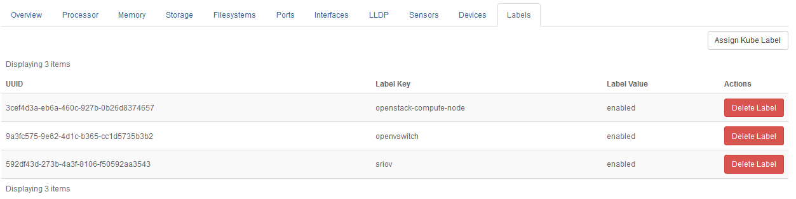

.. zso1557256651811
.. _labels-tab:

==========
Labels Tab
==========

The **Labels** tab on the Host Detail page allows you to configure and
review the labels attached to a host.

The Labels tab displays the list of Kubernetes labels and their values
assigned to the current host.

Use the **Assign Kube Label** button to select additional host labels.
