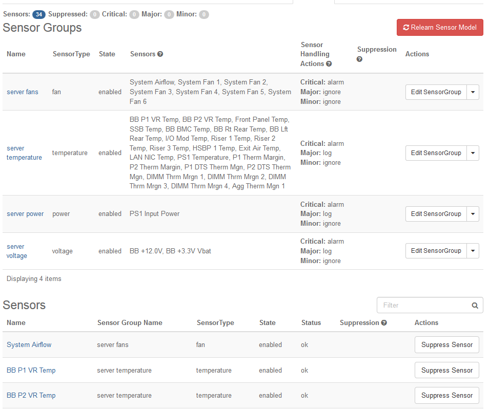

.. wne1552674705494
.. _sensors-tab:

===========
Sensors Tab
===========

The **Sensors** tab on the Host Detail page presents details for sensors used
to monitor host hardware health.

This tab lists the available |BMC| sensors and
shows their status. It also lists sensor groups that have been defined for
the sensors.

.. _sensors-tab-section-N1006C-N10029-N10001:

-------------
Sensor Groups
-------------

Sensors that perform the same type of monitoring are collected into sensor
groups. You can configure audit intervals and alarm actions for each group.
The configured values apply to all sensors in the group.
For more information, see :ref:`Adjust Sensor Actions and Audit Intervals
<adjusting-sensor-actions-and-audit-intervals>`.

The available sensor groups and their membership are based on the sensor
model of the installed |BMC|. The sensor model is learned by |prod| when the
|BMC| is initially provisioned, and can be relearned if necessary \(for
example, if the model changes due to a |BMC| firmware upgrade\). For more
information, see :ref:`Relearn Sensor Models
<relearning-sensor-models>`.

Typical sensor groups can include:

**server fans**
    Sensors that monitor the speed and health of CPU cooling fans.

**power supply fans**
    Sensors that monitor the speed and health of power supply cooling fans.

**server voltage**
    Sensors that monitor DC voltage levels supplied to components.

**server temperature**
    Sensors that monitor component or ambient temperatures.

**server power**
    Sensors that monitor the operational status of power supplies.

.. _sensors-tab-section-N100AE-N10024-N10001:

------
Status
------

Each of the individual sensors in the Sensors list can report the following
status conditions:

.. _sensors-tab-ul-uzg-q5t-4t:

-   **OK**

-   **Minor**

-   **Major**

-   **Critical**

The status of each sensor is audited periodically to refresh the system
monitoring data. You can configure the refresh period, or audit interval,
for sensor groups.

.. _sensors-tab-section-N10105-N10024-N10001:

-------
Actions
-------

You can configure different actions for each status level using sensor
groups. The configured action applies to all sensors in the sensor group.
The following actions are supported:

**alarm**
    This generates a |prod| alarm with a severity level corresponding to the
    sensor status level.

.. xbooklink  For more information about |prod| alarms,
    see |fault-doc|: `Fault Management <fault-management-overview>`.

    For the status levels **Major** and **Critical**, it also sets the
    Availability State of the host to **Degraded**. For more about
    availability states, see :ref:`Hosts Tab <hosts-tab>`.

**ignore**
    The status is reported in the Sensors list, but no action is taken.

**power cycle**
    .. note::
        On a |prod| Simplex system, this function is not available.

    This action applies to critical faults only.

    If this action is selected for a group that has a sensor reporting a
    critical fault, then the Hardware Monitor Service sends a **power cycle**
    notification to the Maintenance Service for action handling. While the
    fault remains, the Maintenance Service powers-down the host, waits for a
    five minute cool down period, and then powers it up. When it comes
    online, it waits for another five minute recovery period. If a critical
    fault still exists, then the cycle is repeated, up to three times. If
    the fault goes away, the host recovers in its current admin state. An
    extra reboot may be required if this fault is detected while the host is
    unlocked. If after three tries the fault still remains, then the server
    is powered down and left that way, requiring manual action to recover.

    If the server was locked, its state shows as
    **locked-disabled-power-off** and requires a **power-on** action followed
    by an **unlock** action to enable the server. If the server was unlocked,
    its state shows as **unlocked-disabled-power-off** and requires a
    **lock** and then a **power-on** to manually power the server back on.
    When the server's availability status shows **online**, it can be
    **unlocked** to enable again.

**reset**
    .. note::
        On a |prod| Simplex system, this function is not available.

    This action applies to critical faults only.

    If this action is selected for a group that has a sensor reporting a
    critical fault, then the Hardware Monitor Service sends a reset
    notification to the Maintenance Service for action handling. If the
    server is locked, then the Maintenance Service forces a reset of the
    server. If the server is unlocked, then the Maintenance Service fails the
    server and runs the full enable finite state machine \(FSM\) in an
    attempt to recover it to the **ENABLED** state. In both cases, there is
    a 10 minute wait period before another reset/enable is issued if the
    Hardware Monitor Service continues to report the fault. This hold-off
    period gives the host time to boot and re-enable. If the fault persists,
    so does this behavior. If the fault goes away, then the host recovers in
    its current admin state.

**log**
    When the log action is selected for any severity level, the Hardware
    Monitor Service generates a severity-specific customer log instead of an
    alarm. Configuration change logs are also generated for action, audit
    interval, and sensor suppression state changes.

You can suppress the configured action for individual sensors or groups of
sensors. Suppressed sensors are still audited, and their status is reported
in the Sensors list. For more information,
see :ref:`Suppress Sensor Actions <suppressing-sensor-actions>`.
