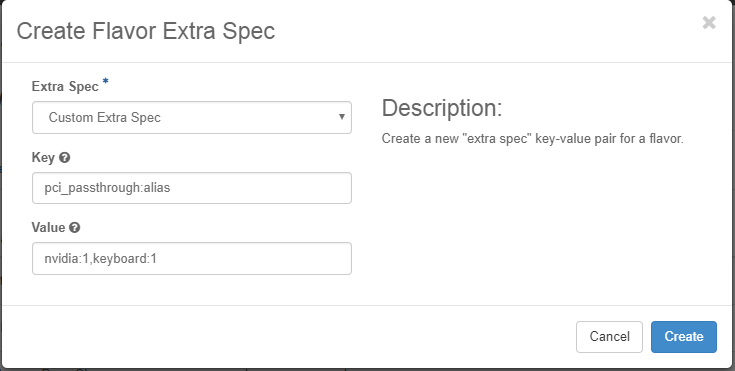

.. vib1596720522530
.. _configuring-a-flavor-to-use-a-generic-pci-device:

==============================================
Configure a Flavor to Use a Generic PCI Device
==============================================

To provide |VM| access to a generic |PCI| passthrough device, you must use a flavor
with an extra specification identifying the device |PCI| alias.

The Nova scheduler attempts to schedule the |VM| on a host containing the device.
If no suitable compute node is available, the error **No valid host was found**
is reported. If a suitable compute node is available, then the scheduler
attempts to instantiate the |VM| in a |NUMA| node with direct access to the
device, subject to the **PCI NUMA Affinity** extra specification.

.. caution::

    When this extra spec is used, an eligible host |NUMA| node is required for
    each virtual |NUMA| node in the instance. If this requirement cannot be met,
    the instantiation fails.

You can use the |os-prod-hor| interface or the |CLI| to add a |PCI| alias
extra specification. From the |os-prod-hor| interface, use the **Custom
Extra Spec** selection in the **Create Flavor Extra Spec** drop-down menu. For
the **Key**, use **pci\_passthrough:alias**.

.. note::

    To edit the |PCI| alias for a QuickAssist-|SRIOV| device, you can use the
    Update Flavor Metadata dialog box accessible from the Flavors page. This
    supports editing for a QuickAssist-|SRIOV| |PCI| alias only. It cannot be
    used to edit the |PCI| Alias for GPU devices or multiple devices.

    To access the Update Flavor Metadata dialog box, go to the Flavors page,
    open the **Edit Flavor** drop-down menu, and then select **Update
    Metadata**.

.. rubric:: |prereq|

To be available for use by |VMs|, the device must be exposed, and it must also
have a PCI alias. To expose a device, see :ref:`Exposing a Generic PCI Device
Using the CLI <exposing-a-generic-pci-device-using-the-cli>` or :ref:`Expose
a Generic PCI Device for Use by VMs
<expose-a-generic-pci-device-for-use-by-vms>`. To assign a PCI alias, see
:ref:`Configuring a PCI Alias in Nova <configuring-a-pci-alias-in-nova>`

.. rubric:: |proc|

-   Use the :command:`openstack flavor set` command to add the extra spec.

    .. code-block:: none

        ~(keystone_admin)$ openstack flavor set flavor_name --property "pci_passthrough:alias"="pci_alias[:number_of_devices]"

    where

    **<flavor\_name>**
        is the name of the flavor

    **<pci\_alias>**
        is the PCI alias of the device

        .. note::

            The parameter pci\_passthrough:alias is used for both |PCI|
            passthrough devices and |SRIOV| devices.

        Depending on the device type, the following default |PCI| alias options
        are available:

        **qat-vf**
            Exposes an Intel AV-ICE02 VPN Acceleration Card for |SRIOV| access.
            For more information, see :ref:`SR-IOV Encryption Acceleration
            <sr-iov-encryption-acceleration>`.

            The following device specific options are available for qat-vf:

            qat-dh895xcc-vf

            qat-c62x-vf

            .. note::

                Due to driver limitations, |PCI| passthrough access for the Intel
                AV-ICE02 VPN Acceleration Card \(qat-pf option\) is not
                supported.

        **gpu**
            Exposes a graphical processing unit \(gpu\) with the |PCI|-SIG
            defined class code for 'Display Controller' \(0x03\).

            .. note::

                On a system with multiple cards that use the same default |PCI|
                alias, you must assign and use a unique |PCI| alias for each one.

    **<number\_of\_devices>**
        is the number of |SRIOV| or |PCI| passthrough devices to expose to the VM

    For example, to make two QuickAssist |SRIOV| devices available to a guest:

    .. code-block:: none

        ~(keystone_admin)$ openstack flavor set <flavor_name> --property "pci_passthrough:alias"="qat-dh895xcc-vf:2"

    To make a GPU device available to a guest:

    .. code-block:: none

        ~(keystone_admin)$ openstack flavor set flavor_name --property "pci_passthrough:alias"="gpu:1"

    To make a GPU device from a specific vendor available to a guest:

    .. code-block:: none

        ~(keystone_admin)$ openstack flavor set flavor_name --property "pci_passthrough:alias"="nvidia-tesla-p40:1"

    To make multiple |PCI| devices available, use the following command:

    .. code-block:: none

        ~(keystone_admin)$ openstack flavor set flavor_name --property "pci_passthrough:alias"="gpu:1, qat-c62x-vf:2"

