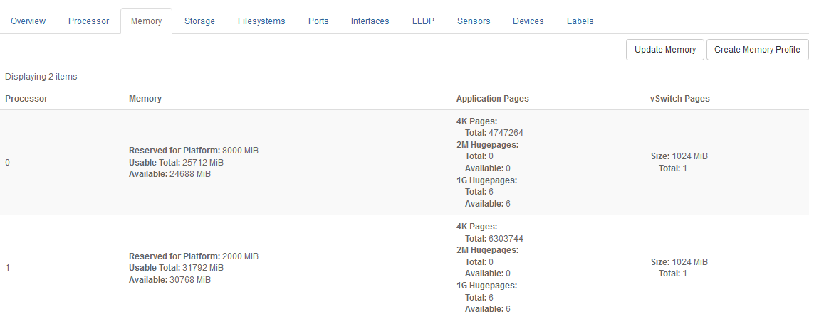

.. iuq1552674499189
.. _memory-tab:

==========
Memory Tab
==========

The **Memory** tab on the Host Detail page displays host memory details.

The information is presented in three columns, as follows:

**Memory**
    Overall memory on the host.

    For a controller node it displays the total and available memory figures.

    For a worker node, as in the example above, it displays the amount of
    memory reserved for the platform \(system software\), and the usable
    total available for use by applications. The usable total includes memory
    reserved for vSwitch huge pages.

**Application Pages**
    This column is relevant on worker nodes only.

    It displays the size of the pages, and the total and available page
    figures. If changes to the huge page allocations are requested for a
    locked host, they are shown as **Pending**.

**vSwitch Pages**
    This column is relevant on OpenStack compute-labeled worker nodes only.

    The size of the huge pages, and the total and available huge page figures.

    .. note::
        vSwitch Huge Pages are not allocated if vswitch\_type is set
        to **None**.

For more about host memory allocations,
see :ref:`About Host Memory Provisioning <about-host-memory-provisioning>`.