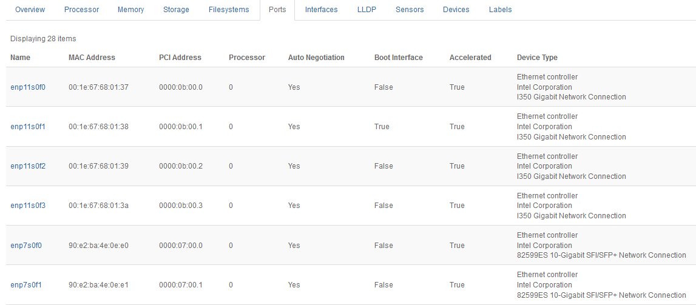

.. qhc1552674530859
.. _ports-tab:

=========
Ports Tab
=========

The **Ports** tab on the Host Detail page presents information about the
physical ports on a host.

Currently none of the port attributes is configurable; they are all read
directly from the hardware. Port information is presented in several
columns, as follows:

**Name**
    The name of the physical port, as identified by the host's Linux kernel.

**MAC Address**
    The port's unique |MAC| address.

**PCI Address**
    The port's unique address on the |PCI| bus. Together with the |MAC|
    address, this field can be used to uniquely identify a port on the host's
    hardware platform.

**Processor**
    The processor node that the port's I/O controller is connected to.

**Auto Negotiation**
    The status of the Ethernet auto-negotiation flag. Currently,
    auto-negotiation is always enabled.

**Boot Interface**
    The boot flag, whether or not |PXE| booting is enabled.

**Device Type**
    Hardware information about the port type, manufacturer, and model.
