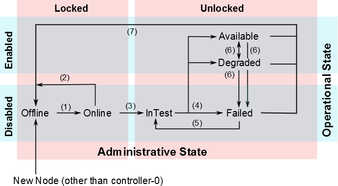

.. aze1553797641568
.. _the-life-cycle-of-a-host:

========================
The Life Cycle of a Host
========================

Each host goes through a series of state transitions as it is brought online,
tested, and deployed. The set of possible state transitions comprises the
life cycle of a host.

   `The Life Cycle of a Host`

The host states in |prod| are based on the *ITU X.731 State Management Function
Specification for Open Systems*.

As shown in the diagram above, there are two possible administrative states
for a host \(**Locked** and **Unlocked**\) and two operational states
\(**Disabled** and **Enabled**\). Within this functional matrix, the host can
be in several availability states. All of these states are reported in the
host inventory \(see :ref:`Hosts Tab <hosts-tab>`.\)

A new host is reported as **Offline** when it is first added to the host
inventory. As an exception, the first controller, **controller-0**, is
automatically set to **Available**.

For a host added to the host inventory, the following transitions are
possible. They are numbered in the text and accompanying figure for
reference.

#. **Offline to Online**

   This transition takes place when a host establishes maintenance
   connectivity with the controller over the management network \(for
   example, after it is powered up and initialized with |prod| software\)

   If the controller fails to establish maintenance and inventory
   connectivity within a boot timeout interval, the node is moved to
   the **Failed** state. You can adjust the boot timeout interval to allow
   for hardware with longer or shorter boot times. For more information,
   see :ref:`Adjust the Boot Timeout Interval
   <adjusting-the-boot-timeout-interval>`.

#. **Online to Offline**

   This transition takes place when maintenance connectivity over the
   management network is lost, for example due to the host rebooting or
   powering down. This transition also takes place immediately after a host
   is unlocked, as the unlock process initiates a reboot to apply any
   outstanding configuration changes.

#. **Offline to Online and In-Test**

   This transition takes place when an unlocked host attempts to transition
   into an **Available** state. The host enters a transient **InTest**
   state, in which a set of hardware and software tests is executed to
   ensure the integrity of the host, and services for the host are enabled

#. **InTest to Available, Degraded, or Failed**

   Depending on the outcome of the **InTest** state, the host goes into
   the **Available**, **Degraded**, or **Failed** state.

#. **Failed to InTest**

   This is a value-added maintenance transition that the high-availability
   framework executes automatically to recover failed hosts.

#. **Available to/from Degraded, Available to Failed, and Degraded to Failed**

   These transitions can occur at any time due to changes in the operational
   state or faults on unlocked hosts. A transition from **Available** to
   **Degraded** triggers the migration of active instances to another worker
   node.

   The |prod| maintenance system monitors the health of all nodes in the
   cloud, updates the node state based on this monitoring, and reports state
   changes to upper layers for impact analysis and recovery. Monitored
   indicators include host heartbeats over all network interfaces, platform
   resource usage \(CPU, memory and disk\), and platform critical processes,
   as well as |BMC| hardware sensors if enabled.

   Some of the maintenance monitoring parameters are configurable. For
   information about configuring host heartbeat monitoring, see
   :ref:`Adjust the Host Heartbeat Interval and Heartbeat Response Thresholds
   <adjusting-the-host-heartbeat-interval-and-heartbeat-response-thresholds>`.
   For information about configuring sensor monitoring, see :ref:`Adjust Sensor
   Actions and Audit Intervals <adjusting-sensor-actions-and-audit-intervals>`.

#. **Available, Degraded, or Failed, to Offline**

   These are maintenance transitions that take place automatically to
   reflect the operational state of a host. The transition triggers the
   recovery of a container to another worker node. These transitions
   apply where a container is an application container, or when running
   the |prod-os| OpenStack application, a container.

.. seealso::
    :ref:`Host Status and Alarms During System Configuration Changes
    <host-status-and-alarms-during-system-configuration-changes>`
