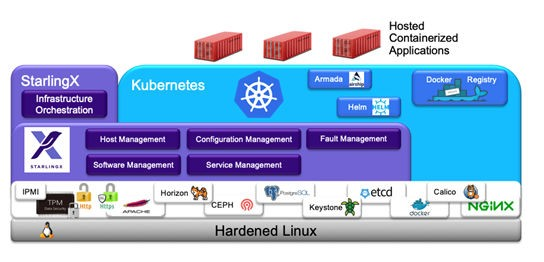

========================
Kubernetes Cluster Guide
========================

StarlingX provides a fully-managed, fully-integrated, ready-to-deploy cloud
native platform for the deployment and management of containerized workloads.

This section gives an overview of the Kubernetes cluster in StarlingX and
describes how to interface with the cluster.

.. contents::
   :local:
   :depth: 1

---------------------------
Kubernetes cluster overview
---------------------------

StarlingX Kubernetes is a private cloud software project that deploys a
Kubernetes cluster on dedicated physical servers. With a range of deployment
configurations, it can be deployed from the data center to the edge of the
network. This provides a single solution to deploy your containerized
applications, regardless of where they are located. Its ability to scale both
large and small makes StarlingX Kubernetes ideal for edge deployments.

StarlingX Kubernetes provides a fully-managed solution that includes both Day-1
and Day-2 operations with respect to managing a cloud native platform:

* Installation

* Configuration management

* Operational and fault management of all components of the solution

  * Physical servers
  * Operating system and kernel
  * StarlingX software
  * Kubernetes software
  * Supporting open-source software such as Ceph, Apache, and Postgres.

* Log and performance metrics are collected and reported for both hardware and
  software components.

* Security is addressed across a variety of attack surfaces that includes TLS
  support, user authentication/authorization, and network firewalls on all
  external interfaces, with support for technologies such as UEFI Secure Boot,
  signed software updates.

All of the above solutions are fully-integrated and ready-to-deploy with default
configurations that optimize performance and scalability.

All services have been validated together as an integrated system.

The high-level functional overview of StarlingX Kubernetes is shown in the figure
below:

StarlingX Kubernetes includes:

Hardened Linux
	A CentOS Linux Kernel and OS, tuned for performance and maintained with
	security CVE patches.

Variety of open-source software supporting StarlingX and/or Kubernetes
	Includes packages such as Apache, Ceph, PostgreSql, Etcd, and |IPMI|, as
	well as some services from OpenStack such as Horizon, Keystone, and Barbican.

StarlingX
	Hardware and software infrastructure management. Includes:

	* Host Management: Manages installation, maintenance and fault monitoring of
	  dedicated bare metal servers running the StarlingX solution.
	* Configuration Management: Manages the configuration of hardware and
	  software services running on the host servers.
	* Service Management: Provides the cluster management for services running
	  on the HA control nodes cluster, as well critical software monitoring and
	  recovery of services running on all nodes within the cluster.
	* Fault Management: Monitoring and reporting of faults and logs for both
	  hardware and software services.
	* Software Management: Support for managing software updates to all layers
	  of software in the solution; this includes kernel, operating system,
	  open-source packages, StarlingX, and Kubernetes.

Kubernetes
	Includes:

	* Kubernetes Container Orchestration Engine
	* Native Docker Runtime
	* Calico Container Networking
	* Persistent Volume Claims backed by Ceph
	* Local Docker Registry
	* Helm/Tiller – Kubernetes Package Manager
	* Armada (Airship)

----------------------------
Kubernetes cluster interface
----------------------------

Interfacing with the StarlingX Kubernetes cluster can be done through Kubernetes
APIs, kubectl, Helm, or the StarlingX application package manager.

See the
`Kubernetes APIs <https://kubernetes.io/docs/reference/kubernetes-api/api-index/>`_
for more information.

*******
kubectl
*******

`kubectl` is available both locally on the controllers/masters or can be
installed independently on a remote server for interfacing with the StarlingX
Kubernetes cluster and managing both cluster resources and namespace-specific
resources.  Locally on controllers/masters, admin-level authentication credentials
for kubectl can be setup by logging in as sysadmin and running
:command:`source /etc/platform/openrc`.

Remotely, authentication for kubectl uses Kubernetes service account tokens.

See the
`Kubernetes kubectl documentation <https://kubernetes.io/docs/reference/kubectl/overview/>`_
for more information.

****
Helm
****

StarlingX Kubernetes also supports Helm with Tiller, the Kubernetes package
manager that can be used to manage the life cycle of applications within the
Kubernetes cluster.

Helm packages are defined by Helm charts with container information sufficient
for managing a Kubernetes application. You can configure, install, and upgrade
your Kubernetes applications using Helm charts. Helm charts are defined with a
default set of values that describe the behavior of the service installed within
the Kubernetes cluster.

At system installation, the official curated Helm chart repository is added to
the local Helm repository list. In addition, a number of local repositories
(containing optional StarlingX packages) are created and added to the Helm
repository list.

See the `Helm charts repo <https://github.com/helm/charts>`_ and
`Helm documentation <https://helm.sh/docs>`_ for more information.

*************************************
StarlingX application package manager
*************************************

Use the StarlingX :command:`system application-*` commands to manage
containerized application deployment from the commandline.

StarlingX application management provides a wrapper around
`Airship Armada <https:// opendev.org/airship/armada.git>`_ and
`Kubernetes Helm <https://github.com/helm/helm>`_ for managing containerized
applications. Armada is a tool for managing multiple Helm charts with
dependencies by centralizing all configurations in a single Armada YAML
definition and providing life-cycle hooks for all Helm releases.

A StarlingX application package is a compressed tarball containing a ``metadata.yaml``
file, a ``manifest.yaml`` Armada manifest file, and a charts directory containing
Helm charts and a ``checksum.md5`` file. The ``metadata.yaml`` file contains the
application name, version, and optional Helm repository and disabled charts
information.

StarlingX application package management provides a set of system CLI commands
for managing the life cycle of an application, which includes managing overrides
to the Helm charts within the application.

Use the following commands with the StarlingX application manager:

``application-list``
	List all applications.

``application-show``
	Show application details such as name, status, and progress.

``application-upload``
	Upload a new application package. This command loads the application’s Armada
	manifest and Helm charts into an internal database and automatically applies
	system overrides for well-known Helm charts, allowing the Helm chart to be
	applied optimally to the current cluster configuration.

``helm-override-list``
	List system Helm charts and the namespaces with Helm chart overrides for each
	Helm chart.

``helm-override-show``
	Show a Helm chart's overrides for a particular namespace. This command displays system-overrides, user-overrides, and the combined system and user overrides.

``helm-override-update``
	Update Helm chart user-overrides for a particular namespace.

``helm-chart-attribute-modify``
	Enable or disable the installation of a particular Helm chart within an
	application manifest.

``helm-override-delete``
	Delete a Helm chart’s user-overrides for a particular namespace.

``application-apply``
	Apply or reapply the application manifest and Helm charts. This command
	installs or updates the existing installation of the application based on its
	Armada manifest, Helm charts, and Helm charts’ combined system and user overrides.

``application-abort``
	Abort the current application operation.

``application-update``
	Update the deployed application to a different version.

``application-remove``
	Uninstall an application.

``application-delete``
	Remove the uninstalled application’s definition from the system, including
	manifest and Helm charts and Helm chart overrides.
