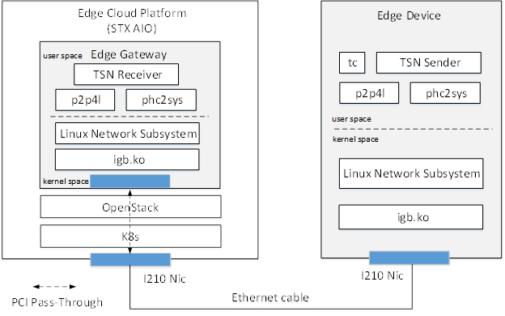
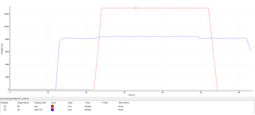
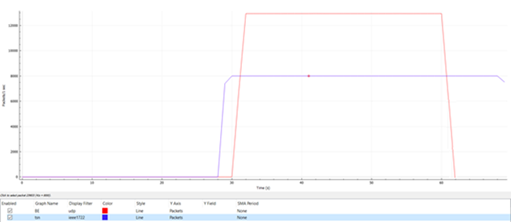
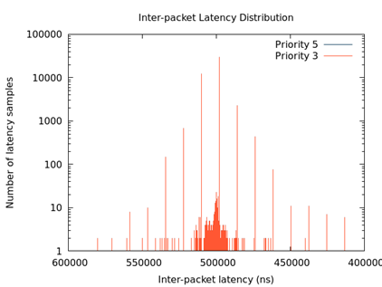
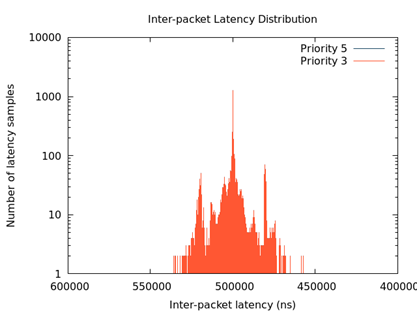
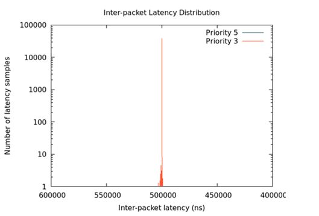

=========================
Time Sensitive Networking
=========================

This guide describes how to deploy and run Time Sensitive Networking (TSN)
applications on StarlingX virtual machines.

.. contents::
   :local:
   :depth: 1

-------------
Introduction
-------------

Embedded sectors such as automotive, industrial, professional audio/video
networking, as well as blockchain and high frequency trading have emphasized the
need for real-time networks. Common LAN models are based on Internet protocols
and the IEEE 802 architecture, where operations are best-effort which is not
suitable for edge computing use cases that require high/known/deterministic
availability.

Time Sensitive Networking (TSN) is a set of evolving standards developed by the
IEEE 802.1 Working Group to cover a group of vendor-neutral and IEEE standards
with the aim of guaranteeing determinism in delivering time-sensitive traffic
with low and bounded latency within an infinitesimal packet loss over the
network, while allowing non time-sensitive traffic to be carried through the
same network. It is also a key technology that targets the previously listed
edge computing segments.

StarlingX (STX) is a complete cloud infrastructure software stack for the edge
that provides running workloads on both virtual machine and container
environments.

This guide shows how to deploy and run a TSN application on a STX virtual
machine. It includes TSN reference applications which are taken from
`TSN Reference Software for Linux`_ with a focus on 2 key use cases:

#. IEEE 802.1Qav or Credit Based Shaper (CBS)

   Ensure bounded transmission latency for time sensitive, loss-sensitive,
   real-time data stream in some critical user scenarios. For instance, when
   time sensitive traffic and best-effort traffic are transmitted together, users
   require the bandwidth and latency of time-sensitive traffic is protected in
   the midst of overloaded traffic on the same network, that is, ensure that the
   time-sensitive traffic has a constant transmission rate and latency.

#. IEEE 802.1Qbv or Time Aware Shaper (TAS)

   Create a protected transmission window for scheduled traffic, which requires
   low and bounded transmission latency. Scheduled traffic is the term used in
   IEEE 802.1Qbv to refer to periodic traffic such as industrial automation
   control frames. This type of traffic is short in frame length and requires
   immediate transmission when its schedule starts.

-------------
Requirements
-------------

The TSN reference application has been verified on the following environments:

+------------+---------------------------------------------------------------+
| Hardware   | - Edge cloud platform: meet STX requirements                  |
|            | - Edge device: Intel Core® Processor                          |
|            | - Intel® Ethernet Controller I210                             |
+------------+---------------------------------------------------------------+
| Software   | - Linux Kernel 4.19.04 +                                      |
+------------+---------------------------------------------------------------+

----------------------
Demo environment setup
----------------------

The following diagram shows the setup for the demo:

   *Figure 1: Time Sensitive Networking demo setup*

The demo uses the hardware and software components listed below:

* **Edge cloud platform:** built based on STX All-In-One (AIO) which provides
  IaaS infrastructure for edge cloud environment.

* **Edge device:** edge side device to generate TSN data for processing.

* **Intel® Ethernet Controller I210:** installed on both the edge cloud platform
  node and edge device and connected by CAT-5E Ethernet cable. ``Igb.ko`` is the
  corresponding Linux kernel driver which has been included in Linux.

* **Edge gateway:** a virtual machine created by STX. Acts as gateway to collect
  TSN data, perform edge computing, and send to data center. The I210 adapter
  is exposed to the edge gateway from the host node through OpenStack Nova's PCI
  pass-through support.

* **p2p4l and phc2sys:** utilities from the LinuxPTP project to support time
  synchronization over PTP.

* **tc:** utility/command used to configure Traffic Control in the Linux kernel.

* **TSN Sender/Receiver:** TSN reference application from
  `TSN Reference Software for Linux`_ to send/receive TSN data for processing.

------------------------------
Deploy TSN applications on STX
------------------------------

*******************
Edge cloud platform
*******************

#. Install STX environment: follow the instructions from the
   :doc:`Installation Guides </deploy_install_guides/index>` to install one
   STX environment (for example STX AIO).

#. Prepare a :abbr:`VM (Virtual Machine)` image. Create image ``tsn_ubuntu_19_04.img``
   based on Ubuntu 19.04 with the required binaries shown below.

   .. code:: sh

      # linuxPTP
      git clone https://git.code.sf.net/p/linuxptp/code linuxptp-code
      cd linuxptp-code
      make
      make install
      # iproute2
      apt install bison flex elfutils -y
      git clone http://git.kernel.org/pub/scm/network/iproute2/iproute2.git
      cd iproute2
      make
      make install

#. Upload image to OpenStack Glance and enable PCI passthrough in  the ``flavor``
   property.

   .. code:: sh

      # upload image
      openstack image create --container-format bare --disk-format qcow2 --file
      tsn_ubuntu_19_04.img --public tsn-ubuntu-19-04
      # add pci-passthrough property to flavor (for example m1.medium), "h210-1" is the
      alias name of the PCI device configured in nova.config
      openstack flavor set m1.medium --property pci_passthrough:alias=h210-1:1

#. Configure OpenStack Nova to allow for PCI passthrough. Create the
   ``nova-tsn-pt.yaml`` file to allow PCI passthrough for the i210 adapter (for
   example device id: 8086:1533).

   .. code:: sh

      conf:
      nova:
       pci:
         alias:
             type: multistring
             values:
             - '{"vendor_id": "8086", "product_id": "1533","device_type":
             "type-PCI","name": "h210-1"}'
         passthrough_whitelist:
             type: multistring
             values:
             - '{"class_id": "8086", "product_id":"1533"}'
      overrides:
        nova_compute:
          hosts:
          - conf:
              nova:
               DEFAULT:
                 my_ip: {host_ip}
                 shared_pcpu_map: '""'
                 vcpu_pin_set: '"2-5"'
               libvirt:
                 images_type: default
                 live_migration_inbound_addr: {host_ip}
               pci:
                 passthrough_whitelist:
                   type: multistring
                   values:
                   - '{"class_id": "8086", "product_id": "1533"}'
               vnc:
                 vncserver_listen: 0.0.0.0
                 vncserver_proxyclient_address: {host_ip}
            name: {controller_name}

   .. note::

     Other configurations, such as ``libvirt`` and ``vnc``, are also required,
     due to the override mechanism of openstack-helm for lists (for example hosts)
     which replaces all contents of the list instead of replacing a single
     configuration item for each list element.

#. Enable Nova PCI passthrough configuration in STX.

   .. code:: sh

      # set pci-passthrough config
      system helm-override-update  stx-openstack nova openstack --values
      nova-tsn-pt.yaml
      system application-apply stx-openstack

#. Create VM instance.

   .. code:: sh

      openstack server create --image tsn-ubuntu-19-04 --network ${network_uuid}
      --flavor m1.medium tsn

#. Install the TSN reference application and other test applications. Follow the
   instructions in `TSN Reference Software for Linux`_ to compile and install
   the following applications in the VM instances:

   * ``iperf3``: running in server mode to receive best-effort traffic.

   * ``simple_listener``: TSN test application which receives IEEE1722 class A
     traffic. Used to test the IEEE 802.1Qav or Credit Based Shaper use case.

   * ``sample-app-taprio``: TSN test application which receives traffic and
     measures Tx latency. Used to test the IEEE 802.1Qbv or Time Aware Shaper use
     case.

***********
Edge device
***********

#. Install Ubuntu 19.04 and the required libraries.

   .. code:: sh

      # linuxPTP
      git clone https://git.code.sf.net/p/linuxptp/code linuxptp-code
      cd linuxptp-code
      make
      make install
      # iproute2
      apt install bison flex elfutils -y
      git clone http://git.kernel.org/pub/scm/network/iproute2/iproute2.git
      cd iproute2
      make
      make install

#. Install TSN reference applications and other test applications. Follow the
   instructions in `TSN Reference Software for Linux`_ to compile and install the
   following applications on the device:

   * ``iperf3``: running in server mode to receive best-effort traffic.

   * ``simple_talker-cmsg``: TSN test application which sends IEEE1722 class A
     traffic. Used to test the IEEE 802.1Qav or Credit Based Shaper use case.

   * ``sample-app-taprio``: TSN test application which sends scheduled traffic.
     Used to test the IEEE 802.1Qbv or Time Aware Shaper use case.

------------------------------
Credit Based Shaper (CBS) demo
------------------------------

This demo focuses on the use of IEEE 802.1Qav or Credit Based Shaper (CBS) and
the LaunchTime feature of Intel® Ethernet Controller I210 to ensure bounded
and low latency for time-sensitive streams. It includes 2 scenarios:

#. CBS and LaunchTime disabled
#. CBS and LaunchTime enabled

In the demo

* ``ptp4l`` daemons run on both the edge gateway and edge device to sync
  the PTP clock based on IEEE 802.1AS Generalized Precision Time Protocol (gPTP),
  with the edge gateway serving as primary clock and the edge device serving
  as secondary clock.

* ``phc2sys`` daemons run on both devices to synchronize the system clock with
  the PTP clock.

* The ``simple_talker-cmsg`` application runs on the edge device as the
  source of 8000 packet/s SR Class A audio frames in IEEE 1722 format.

* The ``simple_listener`` application runs on edge gateway to receive
  time-sensitive traffic.

* ``iperf3`` runs on both devices to transfer best-effort traffic to stress
  system communication.

* The ``tc`` utility is used to set up CBS and etf (for LaunchTime feature) qdisc
  capabilities.

***************************************
Scenario 1: CBS and LaunchTime disabled
***************************************

   *Figure 2: Traffic with CBS and LaunchTime disabled*

In this scenario, both best-effort traffic (blue line) and time-sensitive (IEEE
1722 audio frames) traffic (red line) into the same transmit queue, the traffic
transmission of time-sensitive traffic has unbounded transmission latency and
the transmission rate varies greatly (for example 7900~8100 packets/s). Without
CBS or LaunchTime enabled, the network sees a burst of IEEE 1722 audio frames as
driven by the ``simple_talker-cmsg`` application.

**************************************
Scenario 2: CBS and LaunchTime enabled
**************************************

This scenario shows CBS and LaunchTime enabled (``mqprio`` with ``etf qdisc`` and
per-packet TX time)

Enable CBS with the commands:

.. code:: sh

     tc qdisc replace dev [iface]  \
            parent root handle 100 mqprio num_tc 3 \
            map 2 2 1 0 2 2 2 2 2 2 2 2 2 2 2 2 \
            queues 1@0 1@1 2@2 hw 0
     tc qdisc replace dev [iface] \
            parent 100:1 cbs \
            idleslope  7808 \
            sendslope  -992192 \
            hicredit 12 \
            locredit  -97  \
            offload 1

Enable LaunchTime with the commands:

.. code:: sh

     tc qdisc replace dev [iface] \
          parent 200:1 \
          etf delta \
          clockid CLOCK_TAI \
          offload 1

   *Figure 3: Traffic with CBS and LaunchTime enabled*

In this case, after enabling CBS and LaunchTime features, different transmit
queues are used to separate best-effort and time-sensitive traffic. The CBS
capability ensures time-sensitive traffic is bounded to the sawing-effect of
credit-based shaping in the case of a heavily loaded transmission path. The
LaunchTime capability ensures time-deterministic transmission by setting the
per-packet TX descriptor LaunchTime field. As result, the traffic transmission
of a SR Class A audio stream has constant transmission latency and the
transmission rate is a constant 8000 packets/second, independent of when
interfering best-effort traffic enters the system.

----------------------------
Time Aware Shaper (TAS) demo
----------------------------

This demo focuses on the use of |IEEE| 802.1Qbv or Time Aware Shaper (TAS) and
the LaunchTime feature of Intel® Ethernet Controller I210 to ensure much more
bounded and low latency for period control applications. It includes 3 scenarios:

#. TAS and LaunchTime disabled
#. TAS enabled
#. TAS and LaunchTime enabled

In the demo

* ``ptp4l`` daemons run on both the edge gateway and edge device to sync the
  PTP clock based on |IEEE| 802.1AS Generalized Precision Time Protocol (gPTP),
  with the edge gateway serving as primary clock and the edge device serving
  as secondary clock.

* ``phc2sys`` daemons run on both devices to synchronize the system clock with
  the PTP clock.

* The ``sample-app-taprio`` application runs on both devices to transfer
  scheduled traffic.

* ``iperf3`` runs on both devices to transfer best-effort traffic to stress
  system communication.

* The ``tc`` utility is used to set up ``mqprio``, ``taprio``, and ``etf`` (for
  LaunchTime feature) ``qdisc`` capabilities.

***************************************
Scenario 1: TAS and LaunchTime disabled
***************************************

This scenario shows TAS and LaunchTime disabled (use ``mqprio qdisc`` only).

Create mqprio with the command:

.. code:: sh

     tc qdisc add dev [iface]  parent root mqprio num_tc 4 \
            map 3 3 3 0 3 1 3 2 3 3 3 3 3 3 3 3 \
            queues 1@0 1@1 1@2 1@3 \
            hw 0

   *Figure 4: Inter-packet latency with TAS and LaunchTime disabled*

In this case, the distribution of the inter-packet latency for both scheduled
traffic (VLAN priority = 5 and 3) has a high sample count at 500 µs, which is
the inter-packet cycle time used in this demo. High sample counts observed
outside of the chosen inter-packet cycle time indicate poor precision in hitting
the expected 500 µs inter-packet cycle time.

***********************
Scenario 2: TAS enabled
***********************

This scenario shows TAS enabled (use ``taprio qdisc`` only).

Enable TAS with the command:

.. code:: sh

     tc -d qdisc replace dev [iface] parent root handle 100 taprio num_tc 4 \
            map 3 3 3 1 3 0 3 2 3 3 3 3 3 3 3 3 \
            queues 1@0 1@1 1@2 1@3 \
            base-time 1559471513000000000 \
            sched-entry S 08 100000 \
            sched-entry S 01 100000 \
            sched-entry S 02 100000 \
            sched-entry S 04 200000 \
            sched-entry S 08 100000 \
            sched-entry S 01 100000 \
            sched-entry S 02 100000 \
            sched-entry S 04 200000 \
            clockid CLOCK_TAI

   *Figure 5: Inter-packet latency with TAS enabled*

In this case, most of the samples happen at and close to 500 µs. The sample
count quickly drops to a single digit value when it is further away from the
500 µs inter-packet cycle time. Compared to scenario 1, a majority of the
scheduled traffic is received at close to 500 µs, which shows that ``taprio qdisc``
helps traffic shape the transmission of scheduled traffic in the time
domain.

**************************************
Scenario 3: TAS and LaunchTime enabled
**************************************

This scenario shows TAS and LaunchTime enabled (``taprio`` with ``etf qdisc`` and
per-packet TX time).

Enable LaunchTime with the command:

.. code:: sh

     tc qdisc replace dev [iface] parent [parent] 1 etf \
            clockid CLOCK_TAI \
            delta [DELTA_nsec] \
            offload

   *Figure 6: Inter-packet latency with TAS and LaunchTime enabled*

In this case, the inter-packet latency distribution for both scheduled
traffic is greatly reduced compared to previous cases. This result is
consistent with the fact that LaunchTime technology ensures scheduled
traffic is pre-fetched ahead of time from system memory into the Ethernet
MAC controller for transmission at the defined time. The transmission gating
effect of ``taprio qdisc`` provides a protected transmission window for
scheduled traffic from interfering with best-effort traffic. As a result,
combining these two technologies ensures that Ethernet frames for scheduled
traffic are sent out in a protected transmission window at accurate times.

.. _TSN Reference Software for Linux: https://github.com/intel/iotg_tsn_ref_sw
