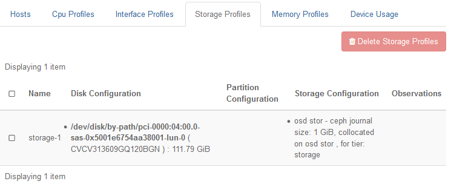

.. frt1552675083821
.. _storage-profiles:

================
Storage Profiles
================

A storage profile is a named configuration for a list of storage resources
on a storage node or worker node.

Storage profiles for storage nodes are created using the **Create Storage
Profile** button on the storage node Host Detail page.

Storage profiles for worker nodes are created using the **Create Storage
Profile** button on the worker node Host Detail page.

Storage profiles are shown on the **Storage Profiles** tab on the Host
Inventory page. They can be created only after the host has been unlocked
for the first time.

Each storage resource consists of the following elements:

**Name**
    This is the name given to the profile when it is created.

**Disk Configuration**
    A Linux block storage device \(/dev/disk/by-path/..., identifying a
    hard drive by physical location.

**Storage Configuration**
    This field provides details on the storage type. The details differ
    depending on the intended type of node for the profile.

Profiles for storage nodes indicate the type of storage backend, such
as **osd**, and potentially journal stor in the case of a storage node.

Profiles for worker nodes, and for controller/worker nodes in |prod-os|
Simplex or Duplex systems, provide details for the **nova-local**
volume group used for instance local storage as well as the Physical
volume and any Physical Volume Partitions that have been configured.
CoW Image is the default setting. Concurrent disk operations is now
configured as a helm chart override for containerized OpenStack.

.. _storage-profiles-d87e22:

.. note::
    Storage profiles for worker-based or |prod-os| ephemeral storage \(that
    is, storage profiles containing volume group and physical volume
    information\) can be applied in two scenarios:

    -   on initial installation where a nova-local volume group has not
        been previously provisioned

    -   on a previously provisioned host where the nova-local volume group
        has been marked for removal

    On a previously provisioned host, delete the nova-local volume group prior to applying the profile.

The example Storage Profiles screen below lists a storage profile for
image-backed **nova-local** storage, suitable for worker hosts.

To delete storage profiles, select the check boxes next to the profile
names, and then click **Delete Storage Profiles**. This does not affect
hosts where the profiles have already been applied.
