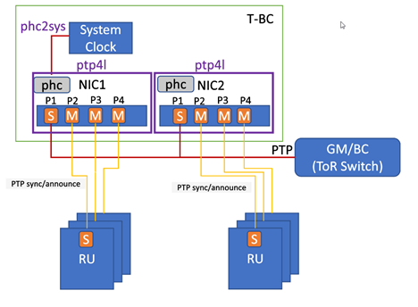
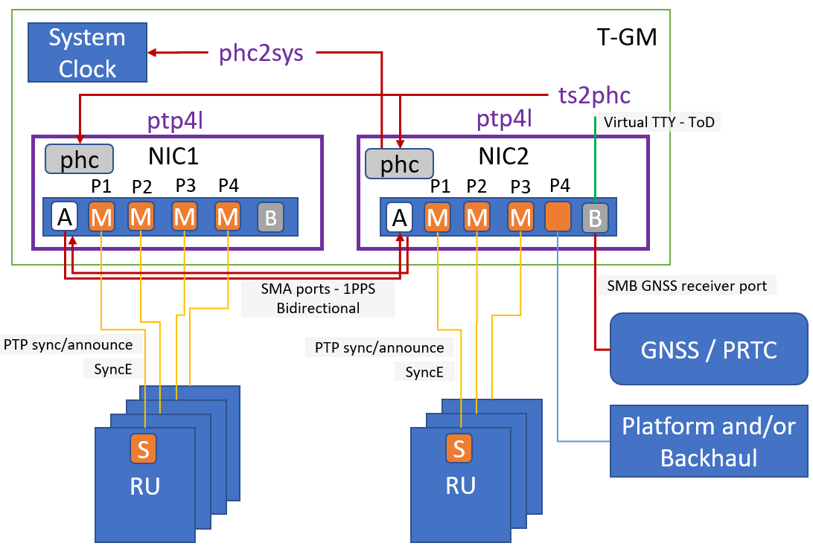

.. _ptp-instance-examples-517dce312f56:

===================================
Example PTP Instance Configurations
===================================

.. contents:: |minitoc|
    :local:
    :depth: 2

The following sections provide example configuration steps for two |PTP|
configurations supported by |prod|.

* The first is a Border Clock setup where an external |PTP| GM is providing
  a time source for the system. Only ptp4l and phc2sys are used for this
  configuration.

* The second shows how to setup a GM node when a time source is available
  via a locally connected GNSS signal. The ``ptp4l``, ``phc2sys``,
  ``ts2phc`` and clock instance types are used for this configuration.

Simple PTP configuration - T-BC
===============================

Using the topology shown, the following examples provide
configurations for each service type:

    *T-BC configuration*

ptp4l
-----

#. Create the instance.

   .. code-block::

      ~(keystone_admin)]$ system ptp-instance-add ptp-inst1 ptp4l

#. Create a |PTP| inteface for the instance.

   .. code-block::

      ~(keystone_admin)]$ system ptp-interface-add ptp-iface1 ptp-inst1

#. Assign host interfaces to the |PTP| interface.

   .. code-block::

      ~(keystone_admin)]$ system host-if-ptp-assign controller-0 if0 ptp-iface1
      ~(keystone_admin)]$ system host-if-ptp-assign controller-0 if1 ptp-iface1
      ~(keystone_admin)]$ system host-if-ptp-assign controller-0 if2 ptp-iface1
      ~(keystone_admin)]$ system host-if-ptp-assign controller-0 if3 ptp-iface1

   .. note::

      The ``if0-if3`` field should be a name listed by the :command:`system
      host-if-list <hostname> -a` command.

#. Additionally, assign ports for the second NIC.

   .. code-block::

      ~(keystone_admin)]$ system host-if-ptp-assign controller-0 if4 ptp-iface1
      ~(keystone_admin)]$ system host-if-ptp-assign controller-0 if5 ptp-iface1
      ~(keystone_admin)]$ system host-if-ptp-assign controller-0 if6 ptp-iface1
      ~(keystone_admin)]$ system host-if-ptp-assign controller-0 if7 ptp-iface1

   .. note::

      The ``if0-if3`` field should be a name listed by the :command:`system
      host-if-list <hostname> -a` command.

#. Add a parameter to the instance (e.g. domainNumber=24). Additional
   parameters can be added for other functionality.

   .. code-block::

      ~(keystone_admin)]$ system ptp-instance-parameter-add ptp-inst1 domainNumber=24

#. Assign the |PTP| instance to controller-0.

   .. code-block::

      ~(keystone_admin)]$ system host-ptp-instance-assign controller-0 ptp-inst1

#. Apply the configuration.

   .. code-block::

      ~(keystone_admin)]$ system ptp-instance-apply

phc2sys
-------

#. Create the instance.

   .. code-block::

      ~(keystone_admin)]$ system ptp-instance-add phc-inst1 phc2sys

#. Create a |PTP| interface for the instance.

   .. code-block::

      ~(keystone_admin)]$ system ptp-interface-add phc-iface1 phc-inst1

#. Assign host interface(s) to the |PTP| interface.

   .. code-block::

      ~(keystone_admin)]$ system host-if-ptp-assign controller-0 if0 phc-iface1
      ~(keystone_admin)]$ system host-if-ptp-assign controller-0 if1 phc-iface1
      ~(keystone_admin)]$ system host-if-ptp-assign controller-0 if2 phc-iface1
      ~(keystone_admin)]$ system host-if-ptp-assign controller-0 if3 phc-iface1

   .. note::

      The ``if0-if3`` field should be a name listed by the :command:`system
      host-if-list <hostname> -a` command.

#. Assign host interfaces from the second NIC.

   .. code-block::

      ~(keystone_admin)]$ system host-if-ptp-assign controller-0 if4 phc-iface1
      ~(keystone_admin)]$ system host-if-ptp-assign controller-0 if5 phc-iface1
      ~(keystone_admin)]$ system host-if-ptp-assign controller-0 if6 phc-iface1
      ~(keystone_admin)]$ system host-if-ptp-assign controller-0 if7 phc-iface1

   .. note::

      The ``if0-if3`` field should be a name listed by the :command:`system
      host-if-list <hostname> -a` command.

#. Add the required ``uds_address`` and ``domainNumber`` parameters to the
   instance.

   .. code-block::

      ~(keystone_admin)]$ system ptp-instance-parameter-add phc-inst1 uds_address=/var/run/ptp4l-ptp-inst1
      ~(keystone_admin)]$ system ptp-instance-parameter-add phc-inst1 domainNumber=24

   .. note::

       The path assigned to ``uds_address`` must use the name of the ``ptp4l``
       instance that ``phc2sys`` is tracking.

#. Assign the instance to controller-0.

   .. code-block::

      ~(keystone_admin)]$ system host-ptp-instance-assign controller-0 phc-inst1

#. Apply the configuration.

   .. code-block::

      ~(keystone_admin)]$ system ptp-instance-apply

Alternate PTP configuration - T-GM
==================================

Using the topology shown, the following examples provide configurations for each service type.

    *Dual NIC Deployment with GNSS*

ts2phc
------

.. rubric:: |proc|

#. Create an instance.

   .. code-block::

      ~(keystone_admin)]$ system ptp-instance-add ts1 ts2phc

#. Create the interface and assign to ports.

   .. code-block::

      ~(keystone_admin)]$ system ptp-interface-add tsint1 ts1

      # This is the port/PHC that we want to sync to GNSS time stamps, could be multiple PHCs if required
      ~(keystone_admin)]$ system host-if-ptp-assign controller-0 oam0 tsint1

      # Assign a port on the second nic as well
      ~(keystone_admin)]$ system host-if-ptp-assign controller-0 data0 tsint1

      This value is the path to the GNSS serial port that is connected, will vary system to system
      ~(keystone_admin)]$ system ptp-instance-parameter-add ts1 ts2phc.nmea_serialport=/dev/ttyGNSS_BBDD_0

#. Assign the instance to a host.

   .. code-block::

      ~(keystone_admin)]$ system host-ptp-instance-assign controller-0 ts1

#. Apply the configuration.

   .. code-block::

      ~(keystone_admin)]$ system ptp-instance-apply

phc2sys
-------

.. rubric:: |proc|

#. Add the instance.

   .. code-block::

      ~(keystone_admin)]$ system ptp-instance-add phc-inst1 phc2sys

#. Use the interface name that is being synced with ``ts2phc`` above.

   For example, if oam0 is on ens1f0, use ens1f0 below.

   .. code-block::

      ~(keystone_admin)]$ system ptp-instance-parameter-add phc-inst1 cmdline_opts='-s <port_name> -O -37'

#. Assign the instance to a host.

   .. code-block::

      ~(keystone_admin)]$ system host-ptp-instance-assign controller-0 phc-inst1

#. Apply the configuration.

   .. code-block::

      ~(keystone_admin)]$ system ptp-instance-apply

ptp4l
-----

.. note::

   You must create a second instance for the second NIC and repeat this
   process.

.. rubric:: |proc|

#. Create instance.

   .. code-block::

      ~(keystone_admin)]$ system ptp-instance-add ptp-inst1 ptp4l

#. Create an interface for the instance.

   .. code-block::

      ~(keystone_admin)]$ system ptp-interface-add ptp-iface1 ptp-inst1

#. Assign ports to the interface.

   .. code-block::

      ~(keystone_admin)]$ system host-if-ptp-assign controller-0 if0 ptp-iface1
      ~(keystone_admin)]$ system host-if-ptp-assign controller-0 if1 ptp-iface1
      ~(keystone_admin)]$ system host-if-ptp-assign controller-0 if2 ptp-iface1
      ~(keystone_admin)]$ system host-if-ptp-assign controller-0 if3 ptp-iface1

#. Add parameters to the instance.

   .. code-block::

      ~(keystone_admin)]$ system ptp-instance-parameter-add ptp-inst1 domainNumber=24

#. Assign the |PTP| instance to controller-0.

   .. code-block::

      ~(keystone_admin)]$ system host-ptp-instance-assign controller-0 ptp-inst1

#. Apply the configuration.

   .. code-block::

      ~(keystone_admin)]$ system ptp-instance-apply

clock
-----

.. note::

   These parameters are used to enable the UFL/SMA ports, recovered clock
   syncE, and so-on. Refer to the user's guide for the Westport Channel NIC for
   additional details on how to operate these cards.

The following |PTP| parameters can be applied to the interface of a clock
instance:

*  sma1 input/output
*  sma2 input/output
*  u.fl1 output
*  u.fl2 input
*  synce_rclka enabled
*  synce_rclkb enabled

.. rubric:: |proc|

#. Create the instance.

   .. code-block::

      ~(keystone_admin)]$ system ptp-instance-add cl1 clock

#. Create a |PTP| interface and assign host interfaces to it.

   .. code-block::

      ~(keystone_admin)]$ system ptp-insterface-add clint1 cl1
      ~(keystone_admin)]$ system host-if-ptp-assign controller-0 oam0 clint1

   The parameters are ultimately applied to the whole NIC, so adding multiple
   interface from the same NIC will override each other. The exception is the
   ``synce_rclk`` params, which are specific to the individual port.

#. Add interface parameters.

   .. code-block::

      ~(keystone_admin)]$ system ptp-interface-parameter-add clint1 sma1=output synce_rclka=enabled

#. Assign the instance to a host.

   .. code-block::

      ~(keystone_admin)]$ system host-ptp-instance-assign controller-0 cl1

#. Create a second clock interface to take input on the sma1 port in order to
   pass GNSS data to the second NIC.

#. Create a |PTP| interface and assign host interfaces to it.

   .. code-block::

      ~(keystone_admin)]$ system ptp-insterface-add clint2 cl1
      ~(keystone_admin)]$ system host-if-ptp-assign controller-0 data0 clint2

#. Add interface parameters.

   .. code-block::

      ~(keystone_admin)]$ system ptp-interface-parameter-add clint1 sma1=input synce_rclka=enabled

#. Apply the configuration.

   .. code-block::

      ~(keystone_admin)]$ system ptp-instance-apply
